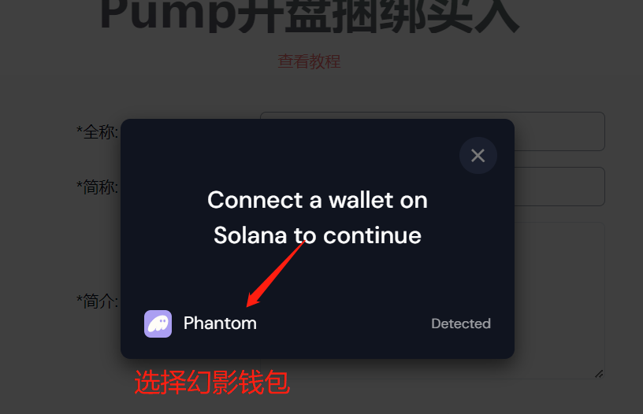
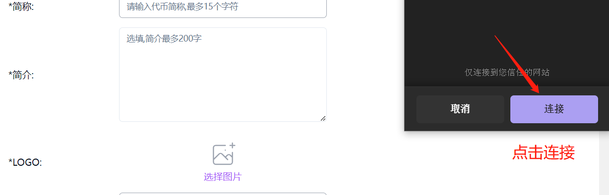
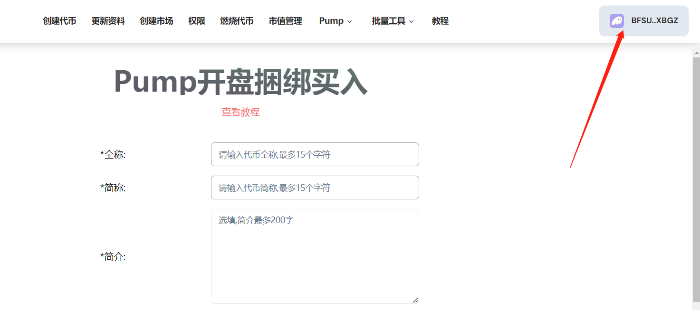
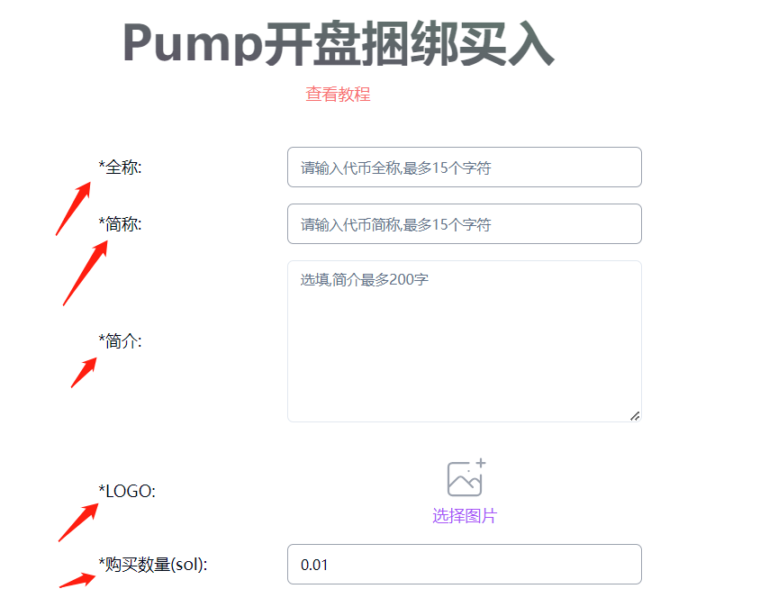
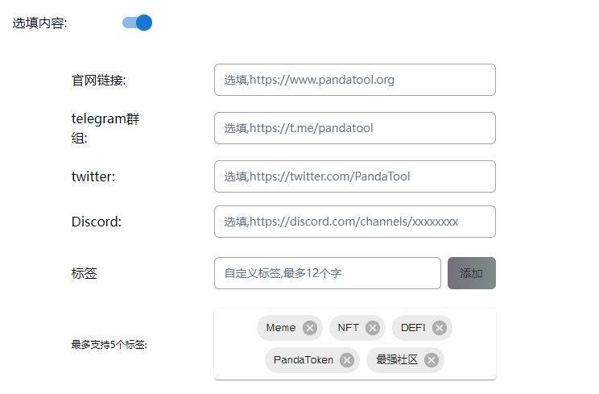
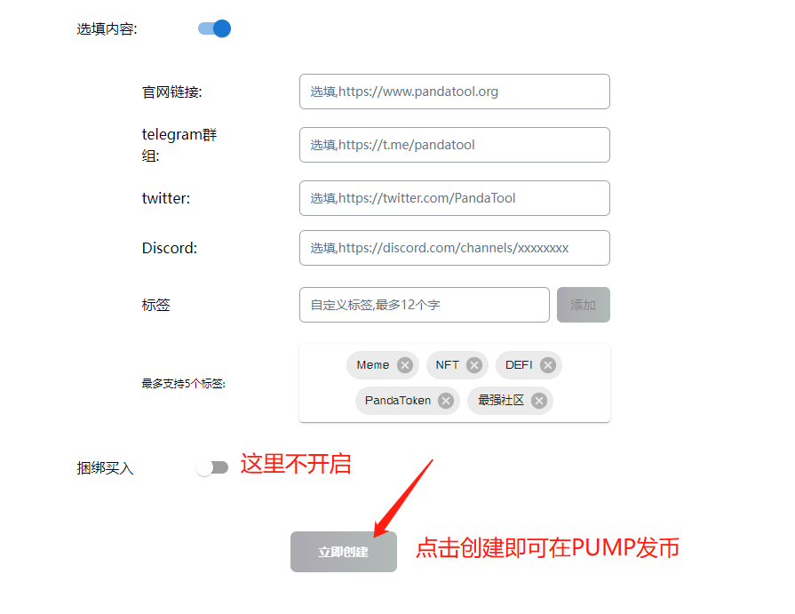
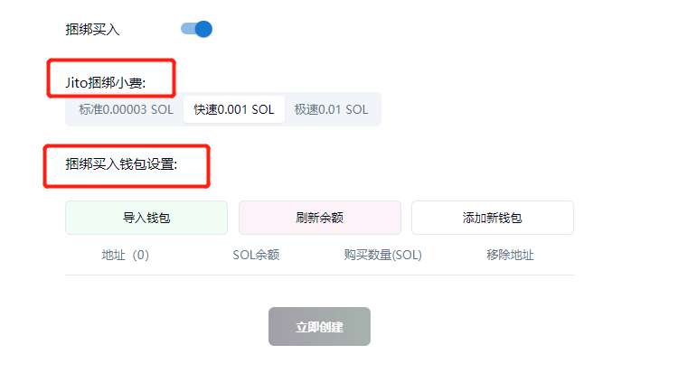
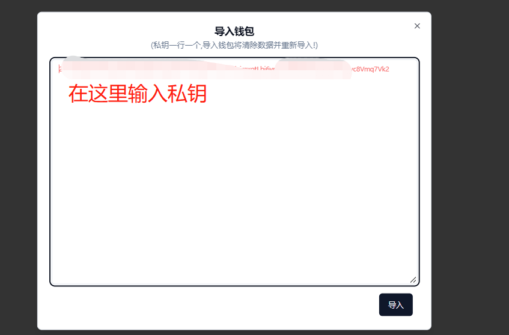
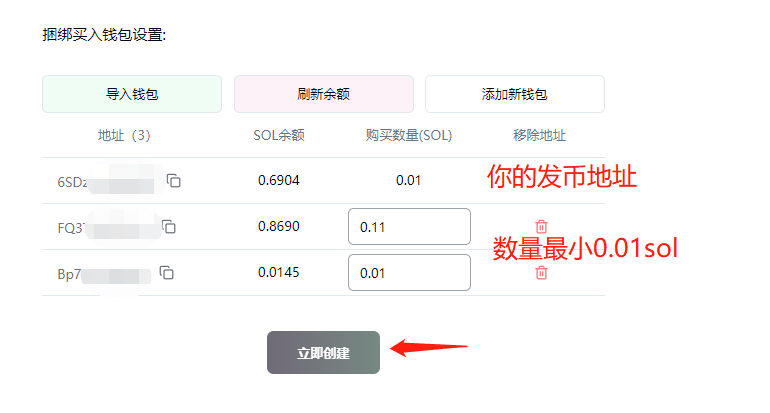

# PUMP发币与捆绑买入教程

pump.fun是Solana链上的一个MEME币发行平台，是近半年来Solana链最成功、最流行、最赚钱的应用。为了方便大家在PUMP上开盘并提前买入，我们上线了PUMP一键发币工具与捆绑买入工具，可以让大家在PUMP发币之后第一时间买入，从而避免被机器人套利。

* **一键发币：**方便大家在PUMP的发币操作
* **开盘买入：**发币的同时即可买入，避免机器人套利
* **多地址：**最多支持16个地址(连同发币地址一共17个)同时买入，可以分散持仓

## 前提条件

* 发币之前，务必使用安装好幻影钱包插件，安装教程➔ [https://help.pandatool.org/sol/phantom](https://help.pandatool.org/sol/phantom)
* 捆绑买入每个地址建议最少准备0.1个sol，不然就太少了容易失败
* 请打开翻墙软件（VPN/加速器），以防止网络错误
* 手机发币也使用Phantom钱包或欧易web3钱包，不要用TP钱包，TP不能传logo

## PUMP发币教程

### 1、连接幻影钱包Phantom（老手忽略） 

首先，我们打开PUMP发币链接：[https://solana.pandatool.org/createpump](https://solana.pandatool.org/createpump)，点击右上角“选择钱包”

<figure><figcaption></figcaption></figure>

之后会跳出钱包选择页面，点击Phantom，即可链接钱包

<figure><figcaption></figcaption></figure>

此时钱包插件会弹出连接按钮，点击连接（如果之前连接过，则无需此操作）

<figure><figcaption></figcaption></figure>

连接成功后，网站右上角会出现你的钱包地址，此时就可以进行操作了

<figure><figcaption></figcaption></figure>

### 2、必填代币参数 

事实上，PUMP的发币与Sol发币的流程没有区别，就是按照要求填写一些参数，只是少了代币数量（固定10亿）、精度（固定9）等

<figure><figcaption></figcaption></figure>

* **全称：**代币全称，支持中文、英文和中英混合
* **简称：**代币简称，支持中文、英文和中英混合
* **简介：**代币基本信息介绍，最多200字
* **Logo：**代币图标，支持jpg、png格式，最大100k
* **购买数量：**发币地址（dev）需要花多少sol购买代币，与发币同步执行，默认为0


<mark style="color:blue;">**数量：**</mark><mark style="color:blue;">默认为1000000000，无法修改</mark>

<mark style="color:blue;">**精度：**</mark><mark style="color:blue;">默认为9，无法修改</mark>


### 3、选填代币参数 

可根据需要填写一些链接参数，该内容可填可不填，且发币完成后不可修改

<figure><figcaption></figcaption></figure>

* **官网链接：**您的代币官网
* **Telegram：**您的代币电报群组链接
* **Twitter：**您的推特链接
* **Discord：**您的DC群链接
* **标签：**给代币打标签，最多5个，最少0个

至此，如果您没有其他的需求，就可以点击“立即创建”了。然后等待10秒左右，钱包确认，这个币就可以发出来，在PUMP上线交易了。

平台的发币费用是0.05sol，算上gas、jito等费用，最多钱包里有0.1sol就可以。

<figure><figcaption></figcaption></figure>

如果您还有捆绑买入的需求，我们再进行下一步

## PUMP捆绑买入教程

### 什么是捆绑买入？

大家都知道，PUMP上有很多狙击机器人，在你刚开盘时就以低价格买入大量代币，并在代币价格上涨时抛售获利出局。尽管PUMP支持发币地址可以买入一笔，但一个地址总归太少了。为了解决这个问题，我们上线了开盘并买入的捆绑功能。

简单来说，当你在PUMP发币的时候，可以同步捆绑其他的地址，然后在发币的一瞬间，允许这些捆绑的地址立即买入代币。由于引入了Jito功能，可以确保这些地址的买入时间要远远早于机器人，就避免了被机器人套利的可能性。

目前平台最多支持**16个地址**捆绑买入，每个地址捆绑收费0.05sol，费用为全网最低

### 怎么捆绑买入？

我们将捆绑买入的按钮点开之后，会看到这样一个页面

<figure><figcaption></figcaption></figure>

* **Jito捆绑小费：**Jito是Solana区块链上面的一个协议，核心功能之一就是交易捆绑，就是把多笔交易打包成一笔完成。这个小费，就是给Jito让他帮你完成捆绑交易的贿赂费。
* **捆绑买入设置：**通过私钥将打算捆绑买入的钱包地址导入，并设定好购买金额

我们点击导入钱包，然后输入钱包私钥（私钥一行一个）

<figure><figcaption></figcaption></figure>

之后我们就能看到自己的钱包内sol，然后填入要购买的sol数量。


<mark style="color:blue;">注意：捆绑买入数量最小为</mark><mark style="color:blue;">**0.01sol**</mark><mark style="color:blue;">，如果低于这个数字，可能会导致发币失败</mark>


<figure><figcaption></figcaption></figure>

在所有信息确认无误后，点击立即创建按钮，等待**差不多10s**，会弹出钱包让你确认。

<figure><figcaption></figcaption></figure>

钱包确认后，代币就会在PUMP上架交易了，整个捆绑开盘的流程就算是完成了。

## PUMP开盘疑问解答

**1、最多捆绑16个地址，包不包括发币地址？**

* **答：**不包括，连同发币地址，最多可支持17个地址在开盘时买入代币

**2、为什么点击`立即创建`后没有反应？**

* **答：**PUMP发币需要等待数据上链，大概等10秒钟，就会弹出钱包确认

**3、PUMP发币的数量是多少？精度是多少？**

* **答：**所有在PUMP发的币，数量都是`10亿`，精度都是`9`

**4、PUMP发币后，还能修改代币资料吗？**

* **答：**PUMP发的币是没有任何权限的，不能`增发`、拉黑以及`修改`代币资料

**5、在PandaTool平台进行PUMP发币与捆绑交易，是怎么`收费`的？**

* **答：**PUMP发币费用是0.05sol，捆绑买入每个地址收费是0.05sol

**6、为什么我发的币，合约后缀不是pump？**

* **答：**PUMP发的币数量日渐增多，导致后缀为pump的合约地址计算愈加困难。如果电脑算力不够，发出来的代币合约地址的后缀可能就不是pump了，而是ump或者pum，这就是算力不够导致的

**7、PUMP发币不需要加池子吗？**

* **答：**不需要的，用户买入后会自动形成一个联合曲线流动性，不需要手动添加

**8、PUMP发币满足什么条件才能上Raydium？**

* **答：**当PUMP联合曲线资金池达到85个sol时，PUMP将帮助代币在Raydium V2上创建一个流动性，并将LP销毁

**9、PUMP代币开盘初始价格是多少?**

* **答：**PUMP开盘初始价格默认是0.00000003sol

如果您还有其他任何问题，都可以进入Telegram电报群找志愿者解答： [https://t.me/pandatool](https://t.me/pandatool)
