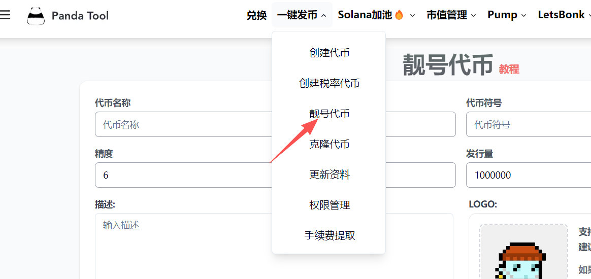
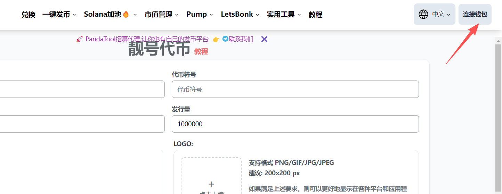
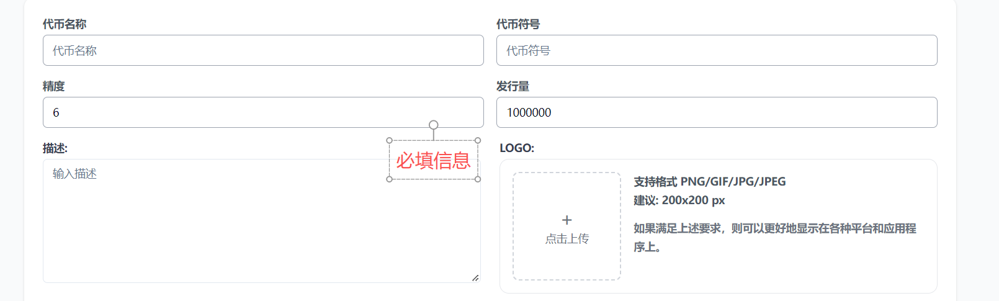
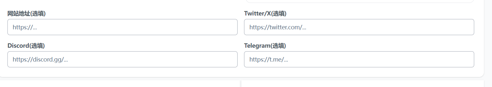
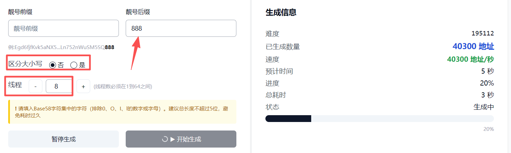
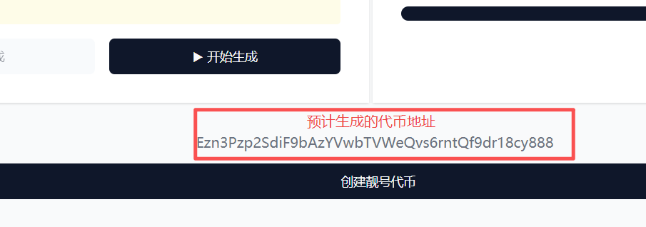

# Solana创建靓号代币教程

## **什么是Solana靓号代币？**

每个代币都有一个代币合约地址，这个大家都很清楚。在区块链世界中（尤其是Solana），“靓号地址”指的是通过大量计算，人为生成的、开头或结尾包含特定字符的合约地址。

* **普通地址示例**： `HW83VGL5RSfQTTYR7A2J3CKP3yfVYKyRYQSN7wB4S1P7` (看起来是随机的)
* **靓号地址示例**：
  * **短地址**：字符数量少，这本身在Solana上就是一种“靓号”，因为更短的地址意味着更多的计算和运气。例如以 `1111`, `AAAA`, `4sR1` 等开头的地址。
  * **有意义的单词**：地址中包含可读的单词或模式，例如包含 `Meme`, `Pump`, `Bonk` 等。
  * **规律性字符**：例如 `CCCCtoCars...SSSS`，开头和结尾有呼应。

<figure><figcaption></figcaption></figure>

## **如何创建Solana靓号代币？**

和创建普通代币类似，创建靓号代币同样需要填写代币信息，只是需要额外通过工具去生成一个靓号。接下来，我将通过一个具体的教程让大家学会该如何创建。以下是创建流程：

**步骤1：**&#x6253;开工具并连接钱包

**步骤2：**&#x586B;写代币参数

**步骤3：**&#x8F93;入靓号条件

**步骤4：**&#x70B9;击创建并钱包确认

**步骤5：**&#x7B49;待成功

接下来是创建的详细教程

### **1、打开PandaTool并连接钱包**

首先，我们需要链接打开创建页面：[https://solana.pandatool.org/createVanityToken](https://solana.pandatool.org/createVanityToken)  或者直接从菜单栏进入

<figure><figcaption></figcaption></figure>

之后，我们点击右上角连接钱包（如果您使用的是手机，请直接在钱包App内打开发币工具的链接）

<figure><figcaption></figcaption></figure>

钱包连接成功后，我们进入到下一步。

### **2、填写代币信息**

接下来，我们需要填写代币的信息。代币信息分为：必填和选填两个部分

<figure><figcaption></figcaption></figure>

**必填部分**

* **代币名称：**&#x652F;持英文、中文以及中英混合，最多**30个**字符（不支持USDT、USDC等不合法名称）
* **代币符号：**&#x652F;持英文、中文以及中英混合，最多**10个**字符（不支持USDT、USDC等不合法名称）
* **精度：**&#x9ED8;认填9，精度与你能填写的最大供应量有关。
* **发行量：**&#x5F53;精度为9时，供应量最大不能超过100亿。当精度为8时，不能超过1000亿，以此类推
* **logo：**&#x56FE;片小于1000k，尺寸建议200x200像素（正方形）

<figure><figcaption></figcaption></figure>

**选填部分**

* **网站地址：**&#x60A8;的代币官网网址，如：[https://pandatool.org/](https://pandatool.org/)
* **Twitter链接：**&#x60A8;的代币官推链接，如：[https://twitter.com/PandaTool](https://twitter.com/PandaTool)
* **Discord链接：**&#x60A8;的代币讨论组，如：[https://discord.orca.so/](https://discord.orca.so/)
* **Telegram群组：**&#x60A8;的代币TG群组，如：[https://t.me/pandatool](https://t.me/pandatool)

### **3、输入靓号并生成**

然后，我们需要输入要生成的靓号条件：

#### **前缀与后缀**

* 创建的靓号合约地址，主要体现在地址的`前缀`和`后缀`两个地址。一般会采用连号，或者特殊的尾号来彰显，如尾号是pump、bonk的地址，或者前缀为8888的地址等等。

#### **是否区分大小写** 

如果您填写的后缀是字母的话，要确定是否区分大小写。如您输入的是**pump**，那么：

* **区分大小写：**&#x5219;只生成尾号为**pump**的钱包地址
* **不区分大小写：**&#x5219;会生成尾号为Pump、PUMp、pUMp等钱包地址
* 很显然，不区分大小写，会更容易生成

#### **选择线程数** 

所谓的“线程”（thread），就是指并行执行密钥对生成和前缀匹配任务的独立执行单元。

* 单线程环境下一次只能尝试生成并校验一个公钥，对CPU 利用率低，速度慢；
* 多线程可以让程序在**多核 CPU** 上并行工作，大幅提高每秒尝试次数，缩短搜索时间。

需要注意的是，选择的**线程数越大**，生成靓号的速度就会越快，但同样的，**电脑就会越卡**。

例如我填写的靓号信息如下：

<figure><figcaption></figcaption></figure>

#### **生成靓号** 

确定好靓号信息后，我们点击开始生成，等待一会，靓号即可完成，可以看到有一个代币合约地址。（靓号生成的速度与难度有关，靓号难度越大，生成的越慢）

<figure><figcaption></figcaption></figure>

### **4、创建靓号代币**

当我们的代币信息填写完成，代币靓号已经创建之后，我们即可点击“创建靓号代币”按钮

<figure><figcaption></figcaption></figure>

之后会弹出钱包确认，等待几秒钟后，代币即可创建完成。


如果出现提示“创建失败!”，可能有三种原因：

**1、网络卡顿：**&#x4E3B;要是没有VPN导致的，请先确保网络顺畅

**2、钱包没解锁：**&#x50;hantom钱包每隔一段时间就会上锁，需提前解锁

**3、钱包内SOL余额不够：**&#x5982;果您已经确认了钱包，那应该是钱包内SOL余额不够导致的


## **靓号代币疑问解答**

**1、创建靓号钱包代币如何收费？**

* **答：**&#x521B;建靓号代币会收取0.15SOL的费用，建议钱包内SOL数额要大于0.17SOL

**2、为什么靓号生成时间这么久？**

* **答：**&#x9753;号生成的时间与自己设备的运行速度、靓号难度等都有关系。

**3、大小写是什么意思？**

* 答：如果您想生成一个尾号是Pump的代币。那么可以选择全大写，即：PUMP。也可以选择全小写，即：pump。不管是全大写还是全小写，都是区分了大小写。如果不区分，那么生成的很可能是：pumP，PUmp，pUMp等等。从难度上来说，不区分难度小于区分。

当然，如果您在生成靓号代币时还有什么其他问题，可以加入PandaTool的志愿者群询问：[https://t.me/pandatool](https://t.me/pandatool)
