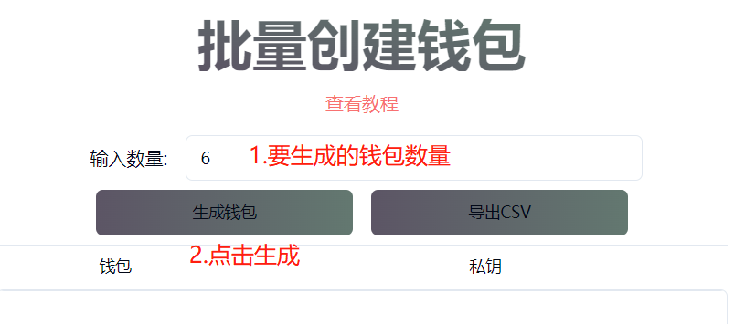
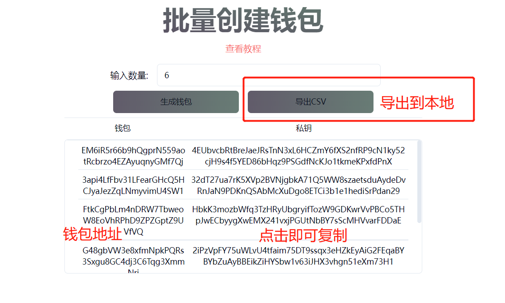
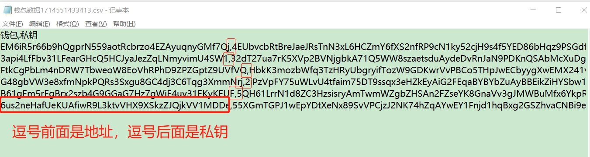

# Solana批量生成钱包地址

手动批量生成多个Solana钱包是非常耗费时间的，尤其是备份助记词和输入助记词的过程。&#x20;

为此，PandaTool开发了批量生成Sol钱包的工具，只需输入你想要生成的钱包数量，即可轻松获得钱包地址、私钥等信息，并且这一过程是本地实现，因此保证了敏感信息的安全性。

<figure><figcaption></figcaption></figure>

## Sol批量生成钱包教程

首先，我们打开创建工具的页面：[https://solana.pandatool.org/createwallet](https://solana.pandatool.org/createwallet)输入框内填入要生成的前地址数量，点击生成钱包，即可完成操作

<figure><figcaption></figcaption></figure>

此时，在下方的位置会出现钱包的地址与私钥，将其复制下来即可（点击就能复制）

<figure><figcaption>
点击就能复制
</figcaption></figure>

此外，PandaTool批量生成Solana钱包工具也支持钱包信息一键导出（CSV文件），对于多钱包多地址管理十分便捷。

当我们下载了csv文件之后，打开方式选择txt记事本

<figure><figcaption></figcaption></figure>

<figure><figcaption></figcaption></figure>

## 疑问解答

#### 1、该工具需要收费吗？

* **答：**批量生成钱包地址属于公益性质，不收取费用

#### 2、如何保证安全性？

* **答：**钱包创建之前，请断开网络，以确保数据不会传输到网上。生成的钱包地址仅作为临时钱包使用，用完即丢，不要存入核心资产就行

如有不明白或者不清楚的地方，请加入官方电报群：[@PandaTool](https://t.me/PandaTool)
