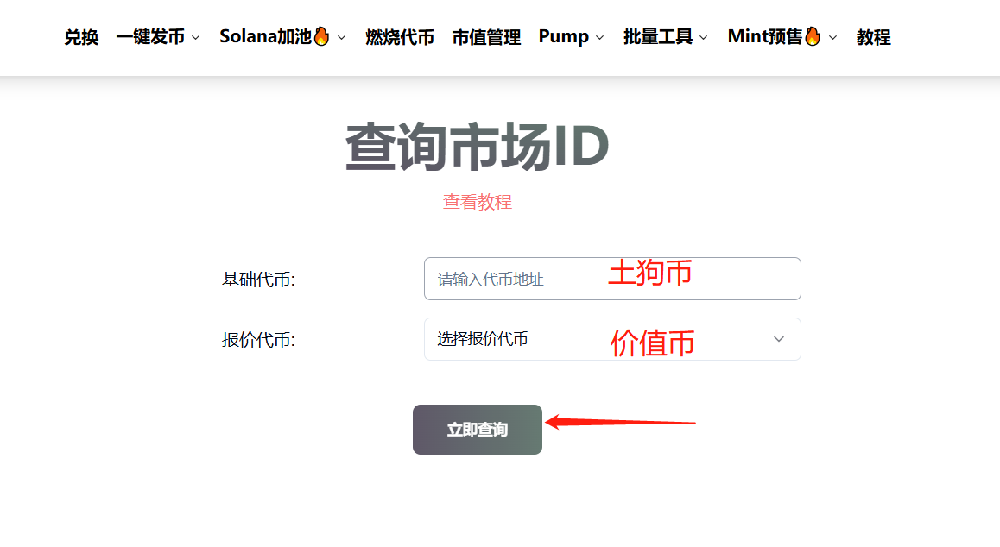
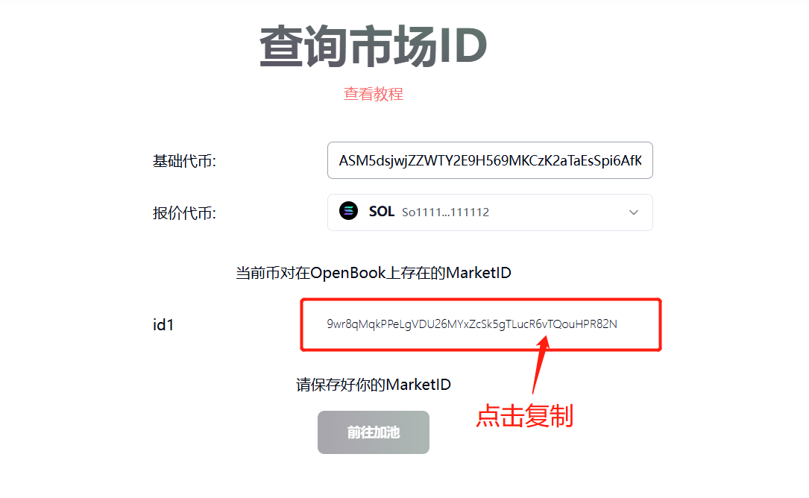

# OpenBook Market ID查询教程

OpenBook Market ID，我们一般称之为OpenBook 市场ID，是Solana生态里一个开源的、无需许可的公共基础设施，用于促进Solana生态的交易撮合。

考虑到用户对于市场ID的需求，PandaTool此前已经开发了OpenBook Market ID[低成本创建工具](https://help.pandatool.org/sol/market)。不过很多人创建了ID后，还没来得及保存就关闭了页面，以至于后面不好寻找。

现在这个教程，就是教大家如何通过PandaTool的工具来查询市场ID。

### OpenBook市场ID查询教程

首先，我们打开PandaTool市场ID查询页面：[https://solana.pandatool.org/findmarket](https://solana.pandatool.org/findmarket) ，按照要求分别输入代币的合约地址，并选择相对应的底池代币

* **基础代币：**&#x60A8;发行的土狗币
* **报价代币：**&#x53;ol、USDT等价值币

<figure><figcaption></figcaption></figure>

选择好之后，点击查询，等待几秒钟，就会出现您的ID，复制即可

<figure><figcaption></figcaption></figure>

### 工具使用疑问

**1、查询市场ID要收费吗？**

* **答：**&#x8FD9;个是纯公益性质的工具，不收取费用

**2、其他平台生成的ID也能查询吗？**

* **答：**&#x662F;的。不管你是在我PandaTool生成的ID，还是在其他平台创建的市场ID，都可以通过我们的工具查询，非常方便快捷。

**3、id1是什么意思？**

* 答：有些代币存在多个市场ID，我们的工具都能查出来。为了方便区分，故而将其进行了编号。如果您只创建了1个市场ID，那就是默认id1。如果有多个ID，就按照id1、id2、id3的方式延续下去

有任何与市场ID有关的问题，可以在电报群联系志愿者咨询：[https://t.me/pandatool](https://t.me/pandatool)
