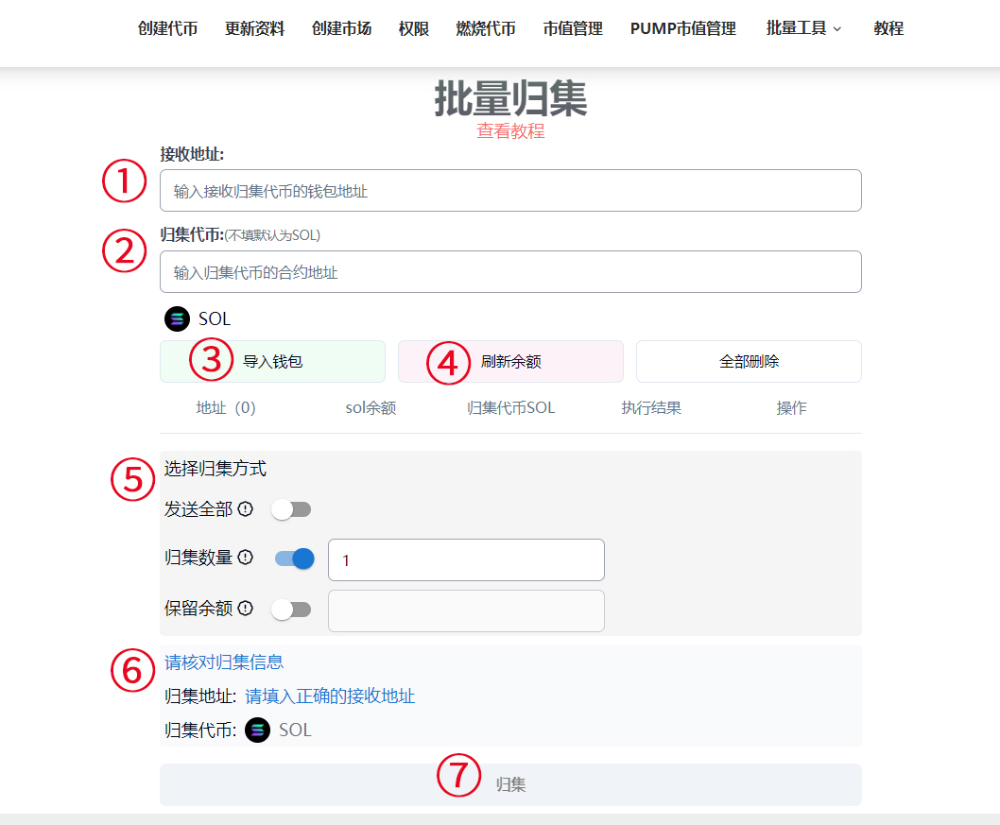
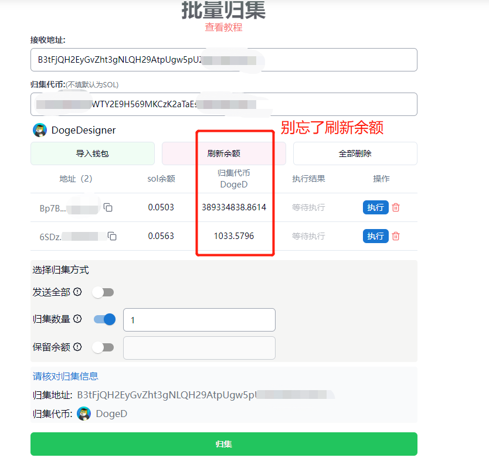
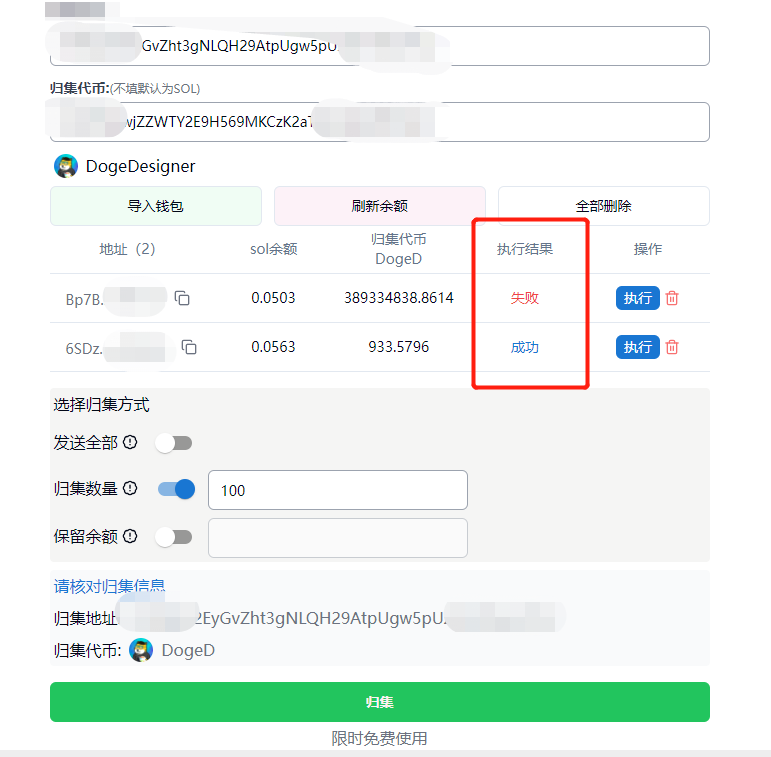

# Solana批量归集教程

批量归集，顾名思义就是将多个钱包地址里面的代币(和sol)集中转账到一个地址，方便大家对钱包进行管理，也就是我们常说的**多对一**。归集之后的主接收钱包继续使用，其他钱包就放弃了。对于一些需要多地址交易和控盘的用户，以及撸毛用户来说，这个功能还是相当有用的。

接下来，我将通过这个教程让大家学会使用在Solana链上进行钱包批量归集

## Solana批量归集教程

### 1、填写信息并导入钱包

首先，我们打开Solana批量归集的官网：[https://solana.pandatool.org/gather](https://solana.pandatool.org/gather) ，按照下图顺序和要求，填写并配置相关信息，同时导入要`归集`的钱包

<figure><figcaption></figcaption></figure>

* **接收地址：**接收归集代币的指定钱包地址
* **归集代币：**要归集的代币合约地址，如果不填就默认是sol
* **导入钱包：**导入要归集的钱包`私钥`
* **刷新余额：**刷新钱包内代币余额

### 2、选择归集方式

* **发送全部：**将钱包内某个`指定代币`全部归集到指定的钱包地址
* **归集数量：**可以自定义要归集的代币数量，如果部分钱包数量不足，将跳过
* **保留余额：**在钱包内保留固定余额的代币，其余的归集出去。如果余额不够，将跳过

### 3、核对信息并归集

当我们将所有信息填写完成后，大概可以得到下图所示的样子

<figure><figcaption></figcaption></figure>

确认归集的地址和代币无误后，点击归集，等待几秒钟，就会出现归集结果，如下图所示

<figure><figcaption></figcaption></figure>

不管执行结果是成功还是失败，都会给你展示出来。如果遇到失败的情况，可以点击地址栏的`执行`按钮，再次执行归集

<figure><figcaption></figcaption></figure>

## Solana归集疑问解答

**1、为什么归集会失败？**

* 如果接收地址没有该代币的话，第一个归集地址可能会失败，此时点击**执行**即可
* 如果要转账的地址内的sol余额不足，也有可能会失败
* 如果solana区块链刚好卡住了，也会导致部分钱包失败

**2、归集需要收费吗？**

* PandaTool的归集产品，除了**gas**以外，每个地址会象征性收取0.0001sol的费用，以观察归集成功率

**3、为什么归集后没有返回结果？**

* 可能是链卡住了，耐心等待几秒钟，就会有结果返回的

有任何关于批量归集的的问题，可以在电报群联系志愿者：[https://t.me/pandatool](https://t.me/pandatool)
