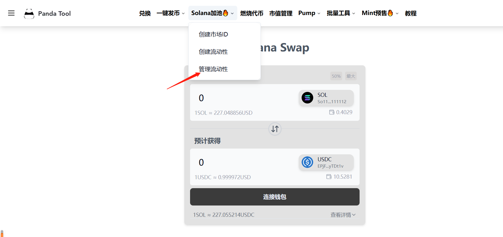
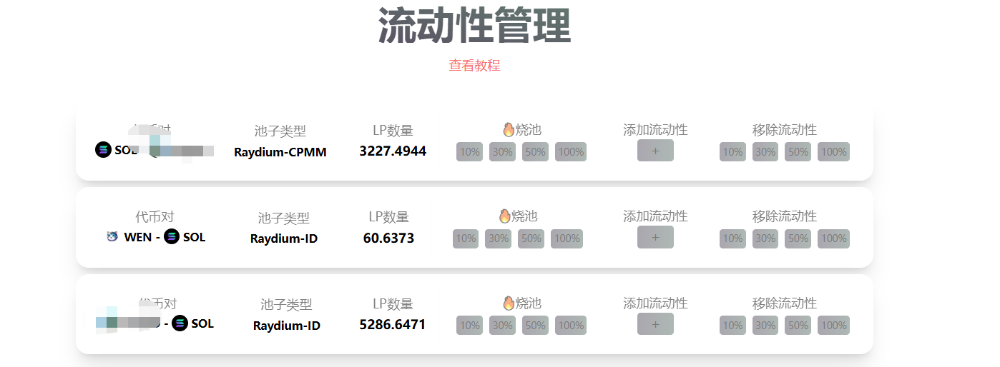
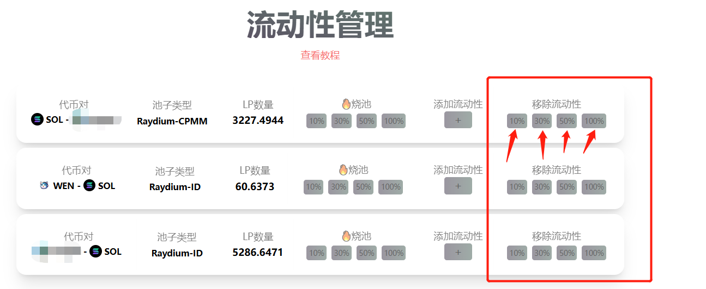
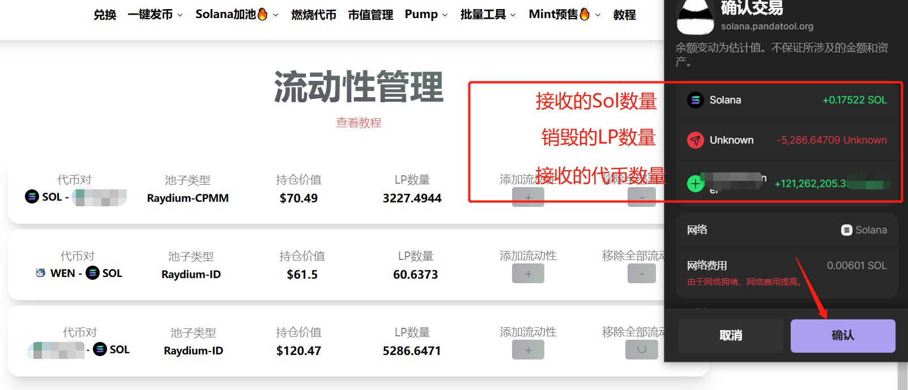
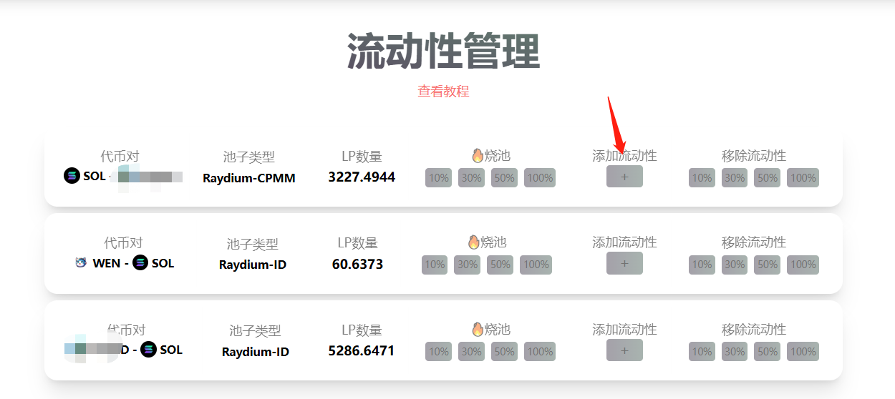
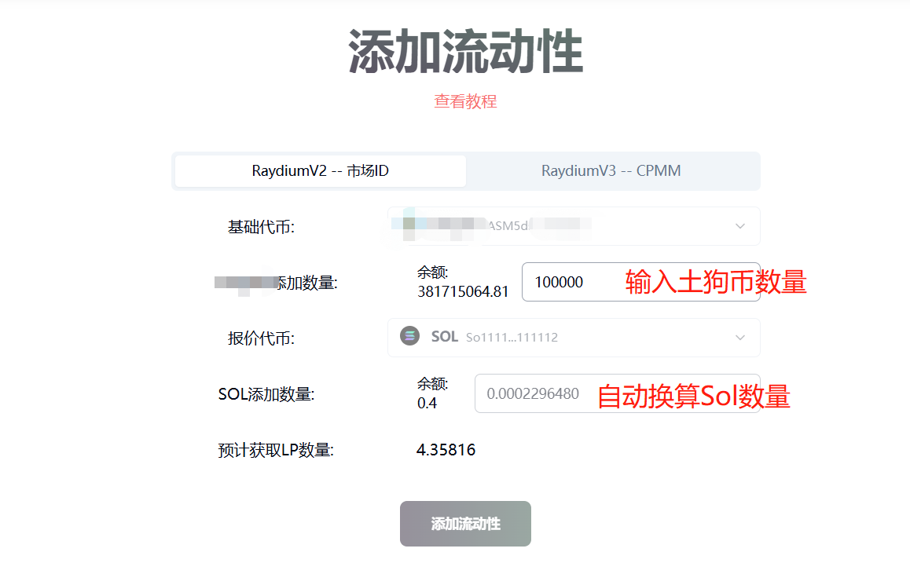
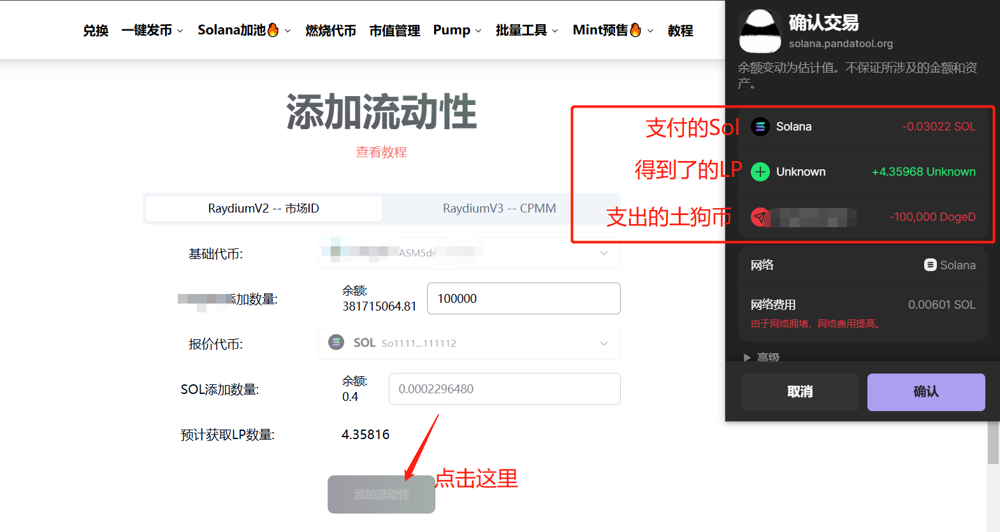

# Solana添加/移除流动性教程

如果您已经创建了一个流动性资金池，接下来可以有两个操作：增加池子和撤出池子。

* **增加池子**：继续添加流动性，让池子越来越大
* **撤出池子：**&#x79FB;除流动性，使交易无法继续进行

本质上来说，添加和撤出都是在已经有了流动性的基础上对其进行管理，所以我们也可以统一称之为：管理流动性。

不管您之前是在Raydium创建的流动性，还是通过PandaTool加的池子，都可以通过我们的流动性管理工具，进一步完成增加或撤出池子的操作，具体教程如下

### 1、打开PandaTool并连接钱包

我们首先需要找到管理流动性的页面，大家可以在官网的→[Solana加池](https://solana.pandatool.org/createpool)的菜单栏下面找到[管理流动性](https://solana.pandatool.org/managepool)按钮

<figure><figcaption></figcaption></figure>

或者直接通过链接进入：[https://solana.pandatool.org/managepool](https://solana.pandatool.org/managepool) ，找到入口后，第一步是连接钱包

<figure><figcaption></figcaption></figure>

成功链接钱包后，就会自动查询到当前钱包的流动性情况，如下图

<figure><figcaption></figcaption></figure>

这个时候你就可以选择添加流动性，或移除全部流动性。

### 2、移除流动性

所谓移除流动性，也就是撤池子。我们只需要点击按钮，即可将全部的流动性一键移除，非常方便

<figure><figcaption></figcaption></figure>

之后会弹出钱包让您确认，可以通过钱包的代币数量变化来了解撤池信息

<figure><figcaption></figcaption></figure>

### 3、添加流动性

如果您在创建流动性资金池后觉得池子比较小，还想继续增大池子，就可以通过添加流动性来完成。我们在相应的流动性那里，点击“添加流动性”

<figure><figcaption></figcaption></figure>

之后会跳转到一个页面，等待几秒钟后，会出现一个参数填写页面，您需要填入要增加的代币数量，会自动计算出Lp的数量和所需要的Sol数量

<figure><figcaption></figcaption></figure>


注意：所需的So数量是根据代币当前价格实时计算的。如果您加的是USDT的池子，那么这里需要的就是USDT的数量


确定好数量之后，我们点击添加流动性按钮，此时会跳出钱包进行确认。钱包确认后，即可完成加池操作

<figure><figcaption></figcaption></figure>

至此，整个关于增加池子和撤出池子的教程就算是结束了。和创建流动性相比，增加或者撤出池子的流程还是比较简单的。

如何您还有其他问题，都可以进入Telegram电报群找志愿者解答： [https://t.me/pandatool](https://t.me/pandatool)
