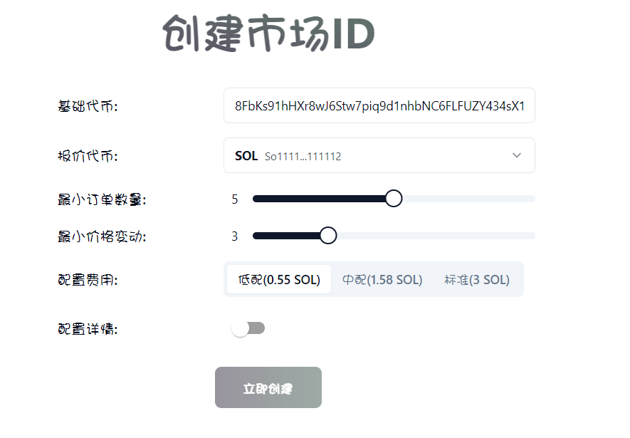
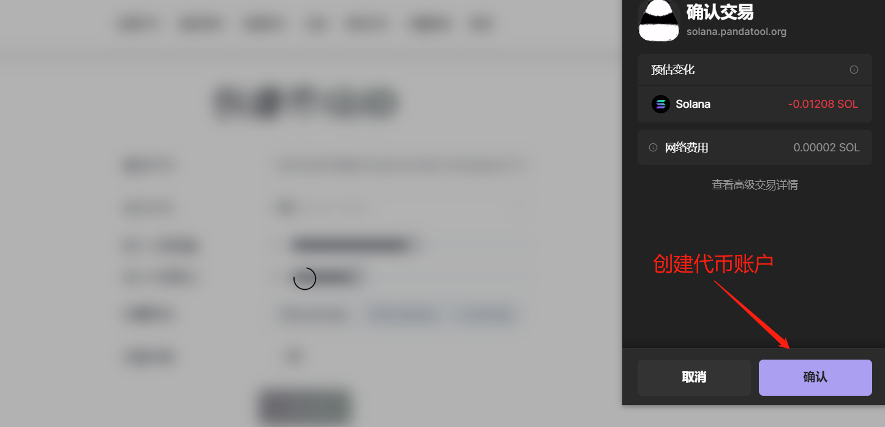
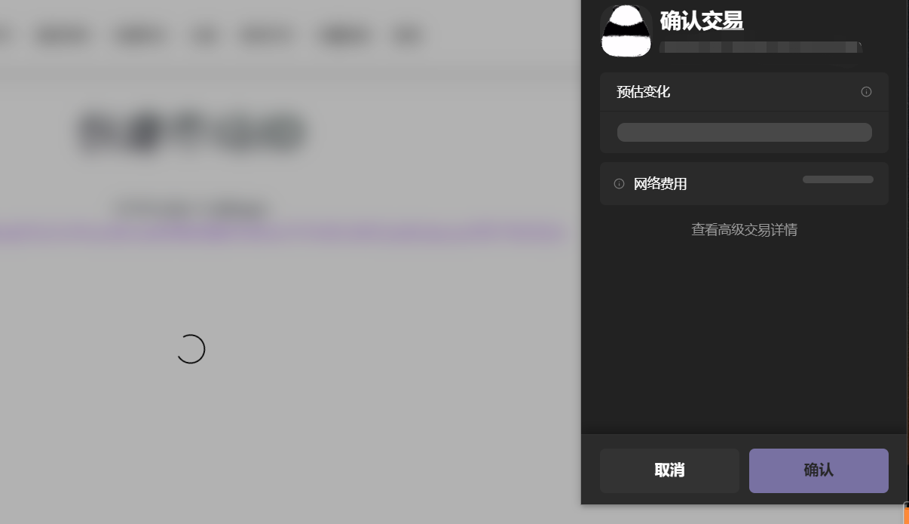
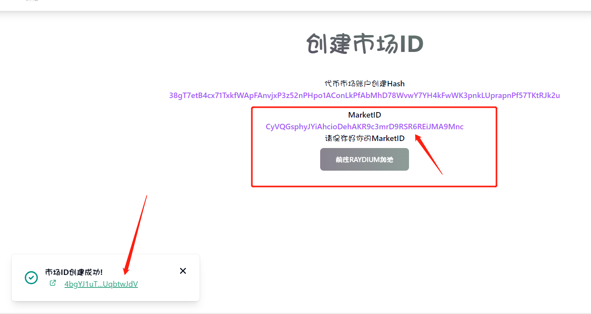

# OpenBook市场ID低成本创建教程

如果你要在Raydium上创建一个流动性资金池，必须先有一个OpenBook Market ID才可以。这个市场ID通常会在Raydium页面进行创建，但是创建成本高达3\~4个Sol，对于很多人来说，这是很难接受的。

基于这个需求，PandaTool开发出了低成本创建市场ID的工具，成本最低只需要0.55Sol左右。

## 什么是OpenBook？

OpenBook 是Solana生态里一个开源的、无需许可的公共基础设施，其中央限价订单簿连接了 Solana DeFi 中许多最大的协议（包括Raydium、Orca、JUP等），提供了一个统一的流动性层，可以在整个生态系统中匹配买家和卖家，从而以光速实现链上价格发现与撮合交易。

简单来说，这是一个给各大交易所提供流动性的协议。不同的swap接入OpenBook之后，就可以共享流动性，从而以更合适的价格和更低的摩擦成本来完成交易。

## 为什么需要一个ID？

Openbook Market ID是一个独特的ID，允许您的代币在defi平台上进行交易。通过这个ID，各大交易平台可以识别到你的流动性，所以一个ID只能用来对应一个交易对（如USDT/SOL）。更换交易对或者重新创建池子，就需要重新申请一个ID。如果你需要在Raydium创建AMM流动性资金池，ID是必须要有的前置条件。

既然如此，为什么Orca不需要ID就能创建流动性？因为目前Orca使用的是类似于Uniswap V3的方式，可以允许你在没有ID的情况下加池子。但是这种池子有个缺陷，就是价格波动不宜过大。当你连续买几笔之后，就无法再买了。必须要有人卖几笔，你才能继续买入。因此，Solana链上的交易机器人基本上都无法在Orca交易。此外，类似的还有Raydium CLMM池子，也可以不需要ID，但依然有类似的问题。

为了你的代币可以正常交易而不出什么大的问题，仍然建议你申请一个OpenBook 市场ID并在Raydium创建一个AMM池子。

## ID成本为什么有高有低？

PandaTool提供ID创建渠道，大致分为3个档位：**0.55Sol、1.58Sol、3Sol**。

OpenBook 市场ID的价格，取决于多种参数，包括事件队列长度、请求队列长度、Orderbook队列长度等。你可以不需要理解这些词汇，但需要知道的是：**ID创建价格越高，你的代币交易就丝滑，越不容易出问题。**

当你通过Raydium创建ID时，它会自动帮助你设置最佳的条件参数。但是通过PandaTool的工具进行ID创建，我们会给予你多种参数选择，以便你可以降低自己的ID创建费用。

这些参数影响，可能集中在：多笔交易同时发生时可能产生的拥堵问题、代币价格波动较大时造成的滑点异常等等，这些因素就会导致一些用户在交易时出现失败的情况。

但总的来看，市值低于500,000 美元的代币，应该没什么问题。如果你希望自己的项目可以长期发展，我们鼓励你选择最好的ID配置。

## 如何创建OpenBook 市场ID？

接下来，我教大家以低成本的方式创建一个廉价的市场ID。

### 1.链接钱包

首先，我们打开PandaTool的ID创建工具页面[https://solana.pandatool.org/market](https://solana.pandatool.org/market)，右上角点击连接钱包（如果已经连接，则忽略此步骤）

<figure><figcaption>
选择钱包
</figcaption></figure>

<figure><figcaption>
选择Phantom
</figcaption></figure>

<figure><figcaption>
连接钱包
</figcaption></figure>

### 2.填写ID参数

这个步骤相对比较复杂，同时也比较重要，建议大家仔细阅读

<figure><figcaption></figcaption></figure>

* **基础代币：**填写你发行的代币合约
* **报价代币：**交易对代币，如USDT、SOL等
* **最小订单数量：**订单簿中的`最小订单数量精度`。假如填2，那最小交易量就是0.01。假如填4，最小交易量就是0.0001。以此类推，这个事实上是精度小数位。
* **最小价格变动：**最小价格显示/变动的`小数位数`。假如填3，代币价格以3位小数显示，如11.123。假如填5，最小代币价格以5位小数显示，如11.12345。
* **配置费用：**低配（适合一般土狗币）、中配（适合成长型代币）、标配（适合优质价值币）
* **配置详情：**属于高级选项，新手不要打开此操作，以防出现不可预知的问题

这些参数的填写，大部分应该都没问题，最有可能出现问题的在最小订单数和最小价格变动上。大家在Raydium创建ID的时候应该也遇到了一些卡顿，其中一部分原因就是这个参数填写错误造成的：

* 最小订单数量**不能大于**基础代币的小数位数，即：如果你的币精度是5，这里只能填1\~5，注意自己的代币精度
* 最小价格变动**不能大于**报价代币的小数位数，即：Sol的精度是9，你可以填1\~9。但是USDC的精度是6，你就只能填1\~6，注意报价代币的精度
* <mark style="background-color:red;">**“最小订单数量”+“最小价格变动”不能大于报价代币的小数位数：**</mark>即，两个数字相加最大不能超过9。

假设，你将代币A与USDC进行配对。代币A的精度是5，USDC是报价代小数精度为6。 那么， 此时最小订单数量不能大于9，最小价格变动不能大于6。“最小订单数量”+“最小价格变动”也不能大于6（报价代币的小数位数）。 因此，您可以将最小订单量和价格跳动设置为3和2（总计5，小于6）。但是，不能是4和4，因为总和超过了6。

以下是我填写的参数案例：

<figure><figcaption></figcaption></figure>

因为我的代币精度是7，所以我的最小订单数量可以填5。同时我寻找的报价代币Sol，它的精度是9，那我只要两个数相加不超过9就行了。同时我这个币只是用来进行测试的，没有长期发展的计划，所以选择低配的版本就可以。大家如果真正想搞一个优质项目，还是选择标配版合适。

### 3.创建ID

所有参数填写完成后，就可以进行ID创建了。创建ID需要钱包确认两次，第一次是创建代币账户，第二次是创建ID。大家点击第一步之后，记得不要关闭页面。

此时我们点击“立即创建”，会弹出钱包进行确认：

<figure><figcaption></figcaption></figure>

确认完成后，会有个提示告诉你代币账户创建成功，大概是这样的：

<figure><figcaption></figcaption></figure>

注意，此时市场ID还并未创建。紧接着钱包会弹出第二次，让你点击确认：

<figure><figcaption></figcaption></figure>

此时确认后，等待几秒钟，ID就会创建成功，你会看到这样的提示：

<figure><figcaption></figcaption></figure>

此时就说明，整个ID创建工作已经完成，将ID复制下来，就可以去Raydium加池子了。

如果你没有保存ID，可以在钱包内找到自己的支付哈希，然后在浏览器里搜索哈希，在哈希详情里就能看到自己的ID

<figure><figcaption></figcaption></figure>

### 4.配置详情

仅适合老手配置，新手不建议操作，详情说明即将更新

有任何创建ID的问题，可以在电报群联系志愿者：https://t.me/pandatool
