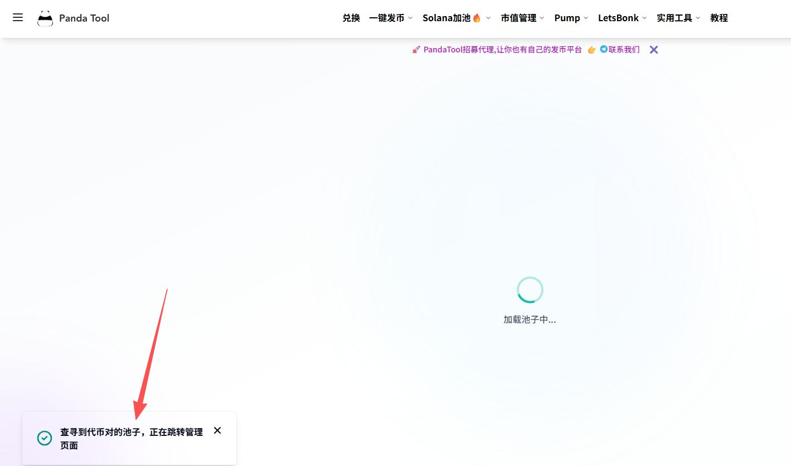

# Meteora DLMM稳定池创建教程

传统意义上，如果我们要让一个Solana代币的价格保持稳定，可以创建Raydium CLMM稳定池。关于这种类型的资金池，PandaTool有详细的创建教程与工具

* Raydium CLMM稳定池创建工具：[https://solana.pandatool.org/createpool](https://solana.pandatool.org/createpool)      &#x20;
* Raydium CLMM稳定池创建教程：[https://help.pandatool.org/sol/clmm](https://help.pandatool.org/sol/clmm)

不过，近期PandaTool更新了新的稳定币池创建工具：Meteora DLMM资金池。Meteora是Solana区块链上三大知名的DEX之一，虽然诞生的比Raydium晚，但是凭借技术创新在Solana迅速发展，成为最大的DEX之一。其创新的DLMM资金池类型，可以帮助项目方实现代币价格稳定的同时，获取交易收入。


注意：DLMM稳定池可能不被欧易Web3钱包支持，用户可以跳转到第三方DAPP交易，如Meteora、Jupiter等


### 创建DLMM稳定池的步骤 

1.打开PandaTool流动性创建页面

2.确定两种代币，并创建池子

3.进一步创建仓位

4.钱包确认并支出费用和代币

5.进行代币交易

6.管理流动性（增加/移除） 

### 创建Meteora DLMM稳定池的详细教程 

#### 1、打开PandanTool并连接钱包 

第一步，我们需要打开PandaTool的DLMM流动性创建工具：[https://solana.pandatool.org/meteora](https://solana.pandatool.org/meteora) ，或者从菜单栏打开，也能进入

<figure><figcaption></figcaption></figure>

之后在右上角连接钱包，此时会跳出Phantom钱包进行连接，点击之后会自动识别Phantom钱包插件，并在右上角出现你的钱包地址，这就说明钱包连接成功了

<figure><figcaption></figcaption></figure>

#### 2、选择代币并创建资金池 

钱包连接成功后，PandaTool会自动查询您钱包内的代币，并让您选择要创建流动性的代币：

* **基础代币：**&#x5C31;是您创建发行的代币（注意：<mark style="color:$warning;">**不支持税率代币**</mark>）
* **报价代币：**&#x55;SDT、USDC、SOL等主流代币

当我们选择好两种代币之后，系统会自动查询，确定该代币之前是否创建过流动性

<figure><figcaption></figcaption></figure>

查询完成后，接下来是输入交易价格。假设我输入的价格是1，我选择的基础代币名称是PandaTool、报价代币是USDT，这就意味着，在我创建好流动性资金池后，我的代币PandaTool的价格将以USDT作为基准，即1PandaTool=1USDT。假设我填0.1，那么就意味着1PandaTool=0.1USDT，以此类推


该价格是永久交易价格，以后不敢交易多少次、交易多少数量，价格都不会变。而且一旦创建后不可修改，价格永久稳定。


填写好交易价格后，我们点击创建按钮

<figure><figcaption></figcaption></figure>

此时会弹出钱包进行确认，点击确认即可完成创建

<figure><figcaption></figcaption></figure>


注意，如果钱包有提示：`此交易在模拟过程中已被撤销`，则说明创建会失败，因为Meteora DLMM不支持带有税率的Token2022代币，只支持无税Token2022



到这一步，你的资金池就算是创建完成了。此时你一定会疑惑：我还没往资金池里放代币呢，怎么就完成了呢？别着急，放代币的问题，我们在下一步完成。

#### 3、创建流动性仓位 

正如我们刚才所说，虽然池子里面创建成功，但是此时池子里依然是没有代币的。我们需要为资金池创建一个流动性仓位，这样才算是真正意义上的完成。因为没有流动性，就意味着无法交易。

如何创建呢？首先，我们还是要在这个页面。选择好代币后，系统会自动查询是否有资金池。**等待几秒钟**，如果查询到有，就会跳转到仓位页面

<figure><figcaption></figcaption></figure>

跳转之后，您就可以看到代币流动性的操作管理页面

### 创建DLMM稳定池疑问解答 

**1、资金池创建成功后，为什么还不能交易**

* **答：**&#x8D44;金池创建只是第一步，还需要创建流动性仓位。因为，需要进入流动性管理，添加流动性才可以。

**2、资金池和流动性仓位都创建成功后，可以在哪里交易？**

* 答：首先，在PandaTool的Meteora流动性管理页面，支持代币交易。您还可以去Meteora、Jupiter等平台进行交易

**3、交易时可以保证价格百分百稳定吗？**

* 答：完全可以。通常来说，不管交易多少数量的代币，价格幅度范围不会超过千分之一。假设您设置的交易价格为1USDT，那么实际交易的价格会在0.99\~1.0001之间浮动

**4、为什么我创建失败了？**

* 答：Meteora不支持带有税率的代币，如果您是带有转账税率的Token2022的代币，则创建会失败

如果您对创建Meteora DLMM资金池还有其他的问题，可以加入我们的Telegram交流群：[https://t.me/pandatool](https://t.me/pandatool)
