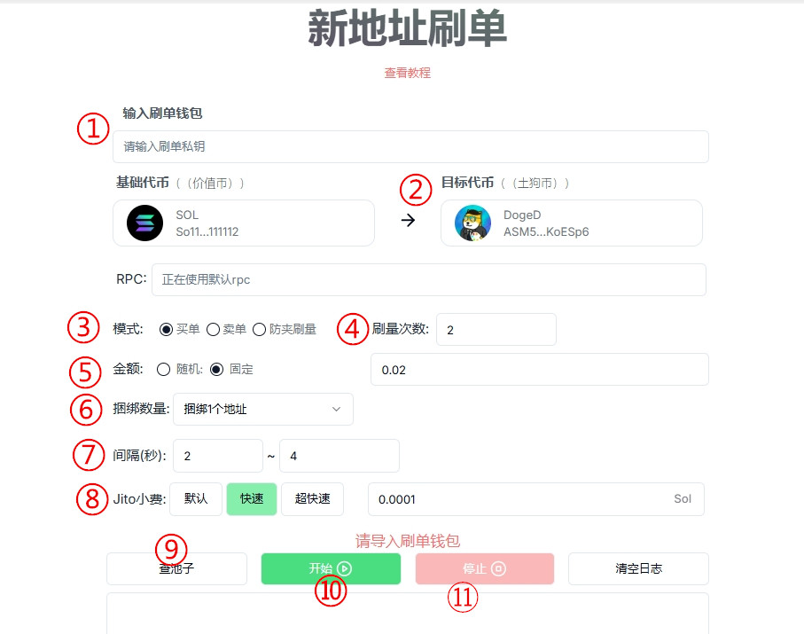

# Solana新地址买入工具教程

## 一、工具概念解读

### 1.什么是新地址买入工具？

该工具是PandaTool开发的新型交易工具，通过生成大量新的地址买入并转入主地址，从而让项目方获得大量的筹码。在GMGN、Ave等平台上，不会提示有老鼠仓。

### 2.新地址买入工具的运行逻辑是怎样的？

该工具目前支持买单、卖单以及刷单三个逻辑

* **买单：**&#x7CFB;统自动生成大量新的地址。然后主钱包自动将Sol转入这些新地址，这些地址买入代币后，转回给主钱包地址。
* **卖单：**&#x7CFB;统自动生成大量新的地址。主钱包自动将代币转入到这些新地址，这些地址卖出代币并换得Sol后自动转回到主钱包地址。
* **刷单：**&#x7CFB;统自动生成大量新的地址。然后主钱包自动将Sol转入这些新地址，这些地址买入代币后再卖出代币，完成一次刷单流程。多余的Sol会自动转回主钱包。

### 3.新地址买入工具的优势是什么？

* 无老鼠仓：不管是GMGN还是Ave，都不会检测到老鼠仓，都是新地址在买
* 增加交易：这些地址在大量买入卖出的过程中，会增加代币的交易量与活跃度
* 方便控盘：项目方在收集筹码或者出售筹码的时候，通过新地址中转会更加方便


注意事项

1、该工具仅支持Raydium AMM资金池（即Pump外盘），暂不支持Pump内盘以及CPMM的池子

2、开始之前，需点击查池子。有了价格后才能开始

3、每个地址每笔交易收取0.00011sol的手续费


## 二、工具使用教程

该工具的使用教程其实和市值管理机器人没有太多的差别，当我们理解了原理之后就会发现非常简单。接下来，PandaTool将详细给你们说明一下工具的使用流程

打开新地址买入工具：[https://solana.pandatool.org/zh/newbuy](https://solana.pandatool.org/zh/newbuy)，然后再按照如下流程操作

<figure><figcaption></figcaption></figure>

**① 输入刷单钱包私钥：**&#x5EFA;议用一个临时钱包

**②目标代币：**&#x8F93;入合约地址，选择你要操盘/控制的代币

**③ 操作模式**

* 买单：新地址买入代币
* 砸盘：新地址卖出代币
* 防夹刷量：1次=买卖各一笔，同一个哈希完成，防止夹子攻击

**④刷量次数：**&#x9700;要完成的交易次数，需要交易多少次，就填多少

**⑤金额：**&#x53EF;以选择固定金额，和随机金额两种

* 买单模式：金额是Sol的数量
* 卖单模式：金额是代币的数量

**⑥ 捆绑数量：**&#x4E00;笔交易中捆绑多少个地址，最多捆绑4个地址

**⑦时间间隔：**&#x6BCF;笔买单或者卖单之间的执行间隔时间，以秒为单位

**⑧ Jito小费：给Jito验证者的小费，可以帮助你快速打包交易，提高成功率**

* 默认：0.000001sol
* 快速：0.00005sol
* **超快速：**&#x30;.0001sol（如果是防夹刷量，推荐用这个）
* 其他：可以自己自定义Jito费

**⑨查池子：**&#x67E5;询池子地址和代币价格

**⑩开始：**&#x70B9;击开始运行（！！**开始之前务必查池子**）

**⑪停止：**&#x70B9;击停止运行

## 三、疑问解答 

**1、平台会拿到你的私钥吗？**

* 答：绝对不可能，你的私钥不会存储在平台上，所有操作都是基于前端执行的，请放心使用。如果你比较担心，可以使用新的钱包操作

**2、新地址刷单是收费的吗？**

* 答：每个地址每笔交易我们会收取0.00011sol的手续费。如果一笔交易捆绑4个地址，那么每笔交易就收取0.00044sol的手续费。不管是买单、卖单还是刷单，都是这个金额

**3、防夹刷量的逻辑是什么？**

* 答：机器人会按照您设定的金额买入一笔，然后在同一笔哈希中卖出一笔。将买入和卖出放在一个哈希里进行打包确认，从而防止夹子机器人套利

**4、这个工具支不支持Pump呢？**

* 答：目前只能支持Raydium Amm资金池，暂不支持Pump

**5、为什么点击开始没有反应？**

* 答：需要先点击查池子，有了池子后和价格后，才点击开始

**6、为什么查不到我的池子？**

* 答：目前机器人不支持Token2022的代币，该类型的代币可能无法查到池子

如有不明白或者不清楚的地方，请加入官方电报群：[https://t.me/PandaTool](https://t.me/PandaTool)
