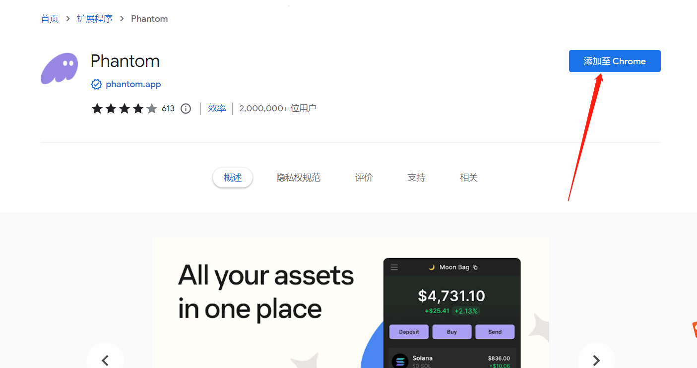
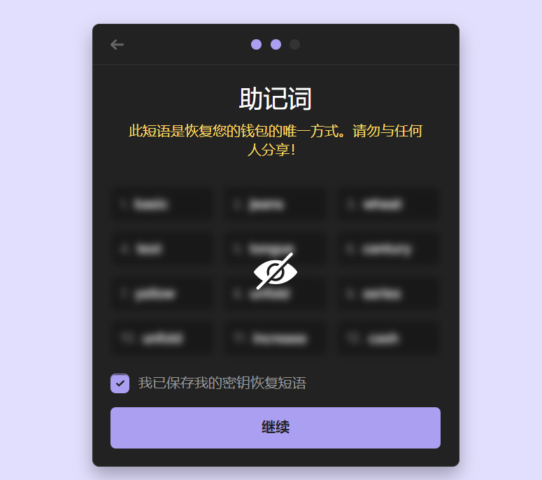
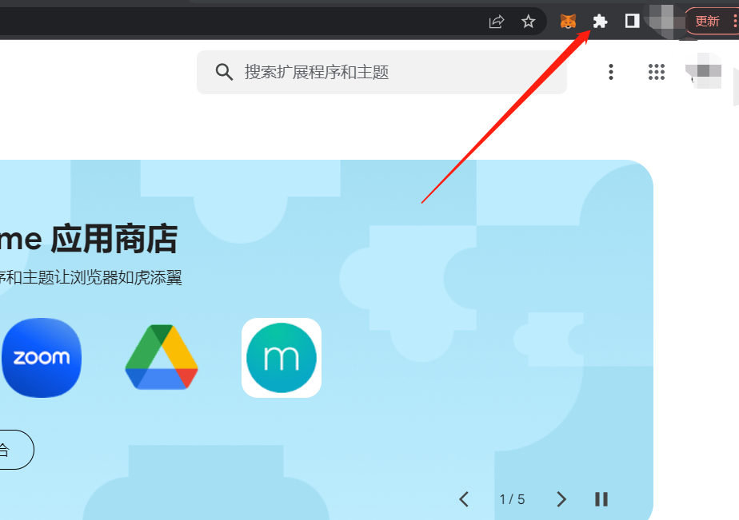
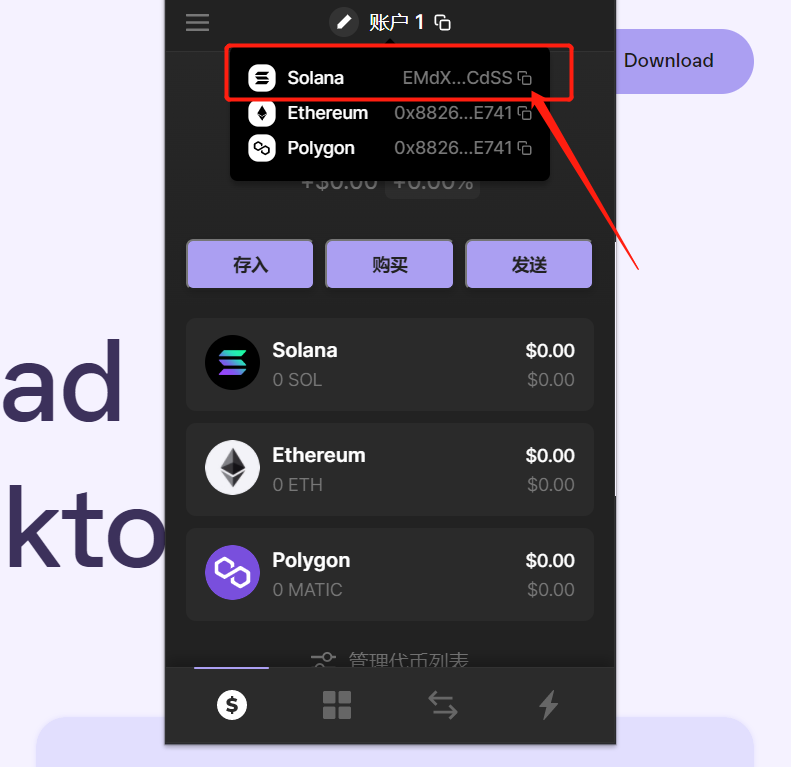

# 幻影钱包Phantom安装教程

Phantom中文称之为“幻影钱包”或“幽灵钱包”，是一个浏览器插件，可以让我们在 Solana 区块链上存储、发送、接收、质押和交易代币。

目前，Phantom已成为用户参与Solana区块链时的首选钱包。如果你想使用PandaTool工具发行代币，就必须先安装Phantom钱包，下面给大家介绍一下安装教程：

1. 首先打开 Phantom 钱包官网：https://phantom.app/，点击“Download For Chrome”。

<figure><figcaption></figcaption></figure>

2. 如下图所示，点击“添加至Chrome”

<figure><figcaption></figcaption></figure>

3. 然后会弹出提示“添加扩展程序”，点击添加

<figure><figcaption></figcaption></figure>

4. 添加之后，会让你进行选择：如果你还没有sol钱包，就可以立即创建一个新钱包。如果你在TP等其他平台已经创建了钱包，就可以通过私钥/助记词导入钱包，这里我们选择创建钱包：

<figure><figcaption></figcaption></figure>

5. 之后需要创建一个钱包密码，这里和小狐狸一样

<figure><figcaption></figcaption></figure>

6. 保存你的钱包助记词，确保周围没有摄像头或者其他人

<figure><figcaption></figcaption></figure>

7. 至此，Phantom钱包就算注册安装完成了。你可以通过浏览器右上角的插件图标，找到你的钱包

<figure><figcaption></figcaption></figure>

<figure><figcaption></figcaption></figure>

8. 钱包创建完成后，我们复制SOL地址，再从交易所提SOL代币到这个地址，就能开始发币或者交易了

<figure><figcaption></figcaption></figure>

注意事项

1. 安装钱包必须在翻墙状态下，没有VPN的话，不建议大家操作
2. Phantom钱包不仅支持Sol链，也支持以太坊、马蹄链，所以创建钱包之后会有3个地址。大家提币或者转账，一定要选择复制Solana地址，不要选错了

