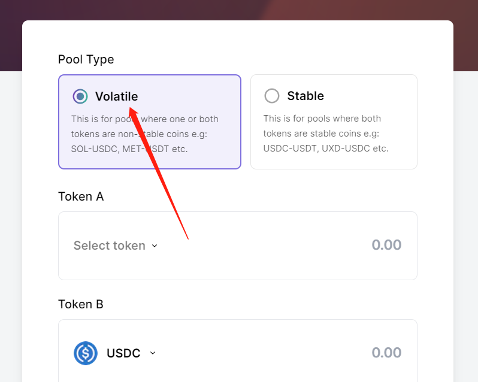
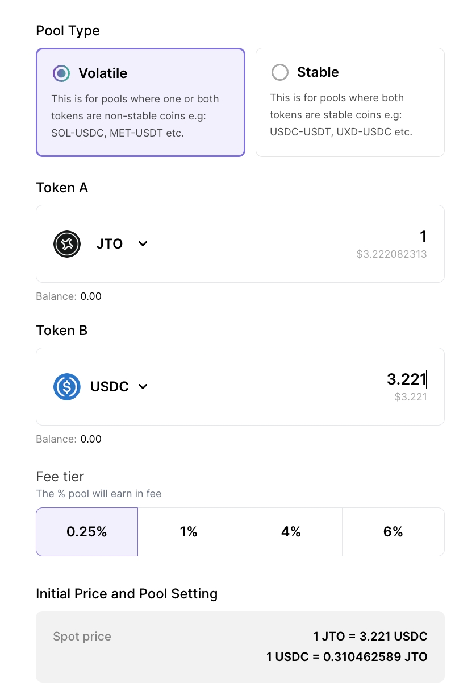

# Meteora加池子/撤池子教程

Meteora是Solana 上提供Defi收益基础设施的协议，他们提供了高资本效率的流动性资金池，和Jupiter同属于一个团队开发的项目。通过该平台创建流动性资金池后，有机会可以在JUP上交易

下面来告诉大家创建资金池的流程：

### 1、找到官网

打开Meteora的官网：[https://app.meteora.ag/](https://app.meteora.ag/)中间的位置找到“Create Pool”，点击之后开始创建资金池

<figure><figcaption></figcaption></figure>

### 2、选择资金池类型

打开之后，会让你首选选择资金池类型。Volatile 就是正常的代币池，默认都选这个。Stable 是稳定币资金池，如果你不是稳定币，不要选

<figure><figcaption></figcaption></figure>

### 3、选择代币对

确定好池子类型后，就开始选择代币对。

<figure><figcaption></figcaption></figure>

Token A就是你发行的代币（通过合约地址进行搜索）

Token B就是底池代币，如Sol、USDC等等

### 4、提供流动性

选择代币后，您可以开始输入每个代币的初始金额，以确定代币价格。需要注意的是，流动性必须**大于500美元（**500USDC或等值Sol**）**，才有可能在Jupiter上出现。注意，是有可能。具体是否可以在JUP上交易，可以详细查看这个JUP的上币要求文档：[https://station.jup.ag/docs/get-your-token-onto-jup](https://station.jup.ag/docs/get-your-token-onto-jup)

<figure><figcaption></figcaption></figure>

### 5、确定并加池

在输入代币，确定代币数量之后，通过钱包确认创建流动性即可。流动性资金池创建完成后，会自动跳转到你的代币资金池页面，可以在这个页面兑换交易代币，或者增加/撤出流动性，如下图所示

<figure><figcaption></figcaption></figure>

* Deposit：增加流动性
* Withdraw：移除流动性
* Swap：交易

如果您不知道如何交易，或者有一些问题，可以联系：[https://t.me/pandatool](https://t.me/pandatool)
