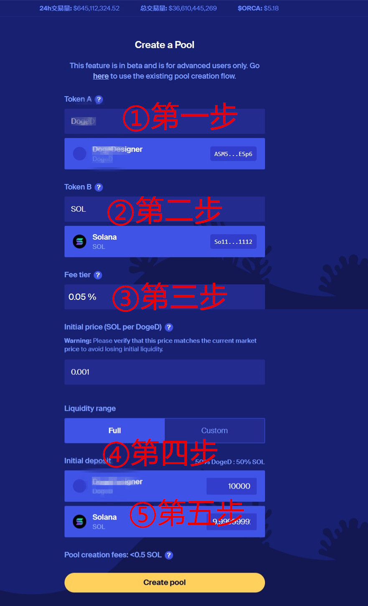
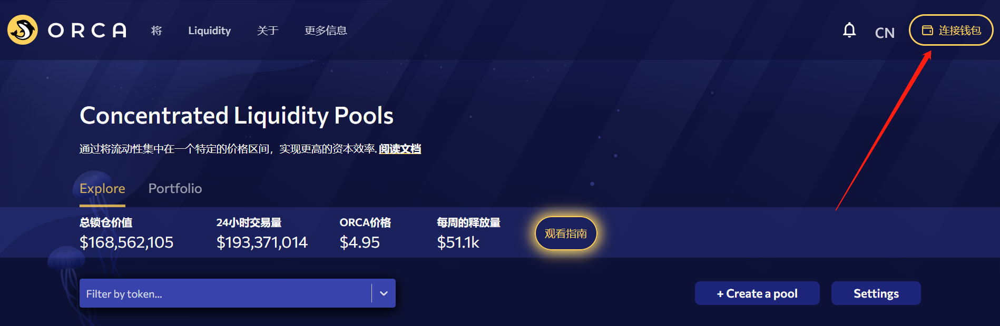

# Orca加池子/撤池子教程

Orca是Sol链上较为知名的去中心化交易所之一，和Raydium相比，在Orca上创建流动性所需要的费用极低（通常少于0.5sol），而且大家习惯在Orca上创建USDC的池子，因为USDC池子比SOL池子的无偿损失会更低，不用担心Sol价格波动带来的风险。

Orca做池子有几个注意事项

* 一般的交易机器人和查币机器人，可能无法抓取Orca的流动性，也就是说不能用机器人交易
* 欧易Web3钱包对Orca的流动性抓取也有延迟，内置的swap可能短时间内不支持
* orca创建的池子获得的LP是一张NFT，销毁起来比较麻烦

下面教大家通过Orca创建流动性资金池：

打开网页：[https://www.orca.so/create-pool](https://www.orca.so/create-pool)，填写相应的代币信息：

<figure><figcaption></figcaption></figure>

* **Token A：**就是你发行的代币，输入合约地址找到你的币
* **Token B：**底池代币，例如USDT、SOL、USDC等
* **Fee tier：**就是费率/滑点，我的建议是填2%，填对的太小不利于交易
* **Initial price：**初始价格，假设你是做代币+sol的池子，那么这个价格就是一个币值多少sol的意思
* **Liquidity range：**流动性范围，指的是你代币价格的范围，目前有FULL和CUSTOM两个选择。如果你不懂什么意思，直接选择FULL这个就行，即：全范围，和薄饼V2是一样的。如果选择CUSTOM，就是V3的概念了，这里不建议使用。

所有的信息填写完成之后，下一步就是输入相应的代币数量。最终填写完成的如下：

<figure><figcaption></figcaption></figure>

确定价格无误之后，点击“Create Pool（创建池子）”，然后会跳出钱包，点击确认，即可完成资金池的创建。

**池子做好之后，应该如何查看？**

我们打开页面：[https://v1.orca.so/liquidity](https://v1.orca.so/liquidity) ，重新连接钱包（如果已经连接，则不需要）

<figure><figcaption></figcaption></figure>

然后点击Portfolio，等待几秒钟，就能看到自己的池子

<figure><figcaption></figcaption></figure>

<figure><figcaption></figcaption></figure>

如果你想撤池子，可以点击你的交易对，选择**提取**流动性（如果想继续加池子，就选择**存入**）

<figure><figcaption></figcaption></figure>

之后，按照页面需要，选择撤出的流动性比例，再点击**Withdraw，**钱包确认并支付gas即可

<figure><figcaption></figcaption></figure>

_注意：加了池子后，交易页面是：www.orca.co，不是www.v1.orca.co_

以上就是关于ORCA加池/撤池的相关教程了，有任何问题，记得进入官方电报群联系志愿者解答：[https://t.me/pandatool](https://t.me/pandatool)&#x20;
