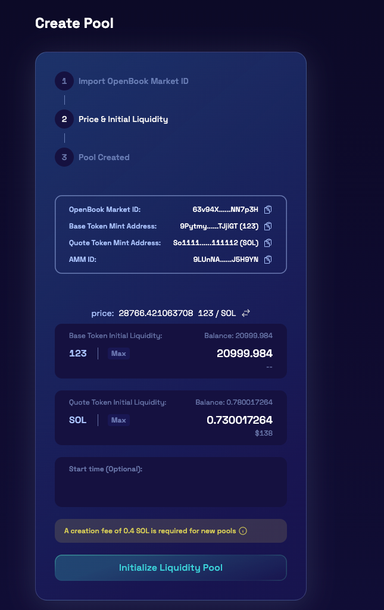

# Raydium V2加池子教程

Raydium是SOL链上比较大的去中心化交易所，任何人都可以在上面创建流动性资金池。一旦创建了池子，它就可以立即在Raydium交换界面上交易。

* 注意：Raydium做池子前，需放弃拉黑（冻结）权限，不然会创建失败。放弃权限请在此处操作→[https://solana.pandatool.org/control](https://solana.pandatool.org/control)

以下是Raydium做池子的教程：

## 1、获取OpenBook市场ID

* 在此链接处创建OpenBook市场ID：[https://solana.pandatool.org/market](https://solana.pandatool.org/market)
* 请注意，创建ID的费用大概在0.55\~3个sol之间（每个ID只能对应一个代币对，不可重复使用）

<figure><figcaption></figcaption></figure>

* **基础代币：**填写你发行的代币合约
* **报价代币：**交易对代币，如USDT、SOL等
* **最小订单数量：**订单簿中的`最小订单数量精度`。假如填2，那最小交易量就是0.01。假如填4，最小交易量就是0.0001。以此类推，这个事实上是精度小数位。
* **最小价格变动：**最小价格显示/变动的`小数位数`。假如填3，代币价格以3位小数显示，如11.123。假如填5，最小代币价格以5位小数显示，如11.12345。
* **注意：**最小订单数量+最小价格变动之和，不能超过报价代币的精度
* **配置费用：**低配（适合一般土狗币）、中配（适合成长型代币）、标配（适合优质价值币）
* **配置详情：**属于高级选项，新手不要打开此操作，以防出现不可预知的问题

创建OpenBook市场ID后，将其复制下来存着，准备加池。如果没有及时复制ID，也可以在Sol浏览器搜索创建的哈希，在交易详情里面找到 `#7 OpenBook`，然后在#1里面的那一行，就能看到你刚刚创建的ID

<figure><figcaption></figcaption></figure>

## 2、创建Raydium V2流动性

创建OpenBook市场后，将会跳转到Raydium的池子页面：[https://v2.raydium.io/pools/](https://v2.raydium.io/pools/)，页面右上角点击连接钱包，之后选择“创建池”（Create Pool）按钮

<figure><figcaption></figcaption></figure>

点击之后，输入已经获得的OpenBook市场ID

<figure><figcaption>
输入ID
</figcaption></figure>

## 3、初始化创建池子 

* 设置要添加多少币和多少SOL代币到池子中。
* 设置您希望池在哪个日期和时间启动。
* 确保您的钱包中有足够的资金用于此初始流动性，然后单击“确认并初始化流动性池”。

**重要提示**：确认并初始化池后，您将无法再编辑起始价格、流动性或开始时间。注意，开始时间由链上的时间确定。

<figure><figcaption></figcaption></figure>

* 单击确认后，需要在钱包中批准**两个单独的交易**。这些交易将创建池子，创建AMM帐户和ID，并从您的钱包中添加流动性。如果您没有看到其中一个交易，请检查您的钱包窗口是否隐藏在主浏览器窗口后面。如果您错过了确认交易，则该过程将失败，您需要再次单击确认，然后重新批准所有交易。
* 确认钱包中的两个交易后，新LP将已创建，您将获得新的AMM ID，并且底池将在设置的启动时间启动。
* 创建池子时需要0.4SOL的手续费，钱包请确保预留足够多的手续费和加池子的费用

## 4、撤池子 

如果你确认自己已经添加池子，可以在Raydium页面选择Liquidity，然后页面往下拉一拉，就能看到自己的流动性了

<figure><figcaption></figcaption></figure>

点击你的流动性，能看到一些选项，添加流动性或者交易，这时候请选择撤出流动性，如下：

<figure><figcaption></figcaption></figure>

然后填入你要撤出的LP数量，点击“Remove Liquidity”，钱包确认后，就能撤出了。（如果选择MAX，就是全部撤出）

<figure><figcaption></figcaption></figure>

## 5、相关问题 

1）为什么钱包确认后半天没反应？

* 答：Raydium V2的UI页面一直比较卡，所以他们才会推出V3版本的

2）加了池子后能`锁池`吗？

* 答：Solana链目前支持锁池的平台不多，一般的做法都是`烧池子`，烧池相关操作可以看这篇教程：[Sol烧池教程](../burn.md)

3）烧池子后还能`撤池子`吗？

* 答：烧池子相当于百分百永久`锁池子`，就不能再撤了

4）为什么我看不到自己的流动性？

* 答：Raydium的流动性创建成功后，需要一段时间才会显示，最多24小时。此外，如果你设置了开盘时间，在开盘时间到来之前，的确是看不到流动性的

5）创建池子出现提示“base token freeze authority enabled”怎么办？

* 答：该提示是说，你的代币没有放弃`冻结权限`，请使用弃权工具将权限放弃：[https://solana.pandatool.org/control](https://solana.pandatool.org/control)

6）创建池子出现提示“base lot size is zero”怎么办？

* 答：该提示是说，你的钱包里面没有足够的报价代币（如sol）

以上就是关于Raydium加池子/撤池子的全部教程了，如果有任何问题，请进入我们的电报群：[https://t.me/pandatool](https://t.me/pandatool)，找志愿者解答，谢谢
