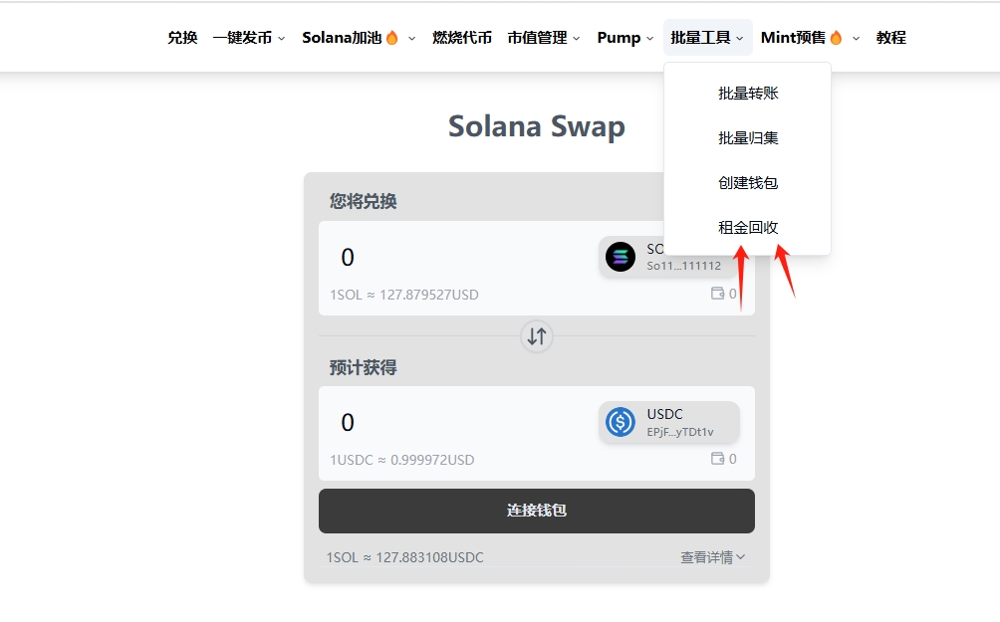
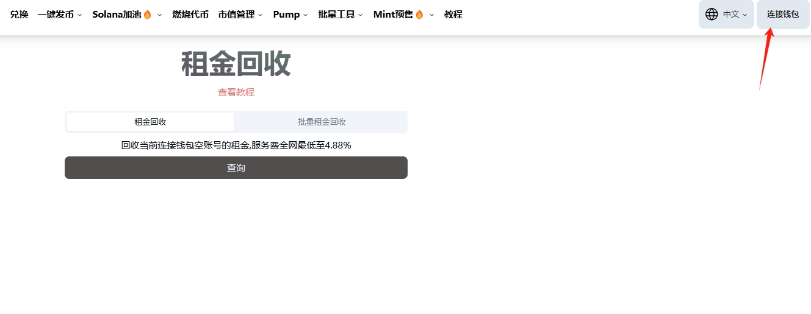
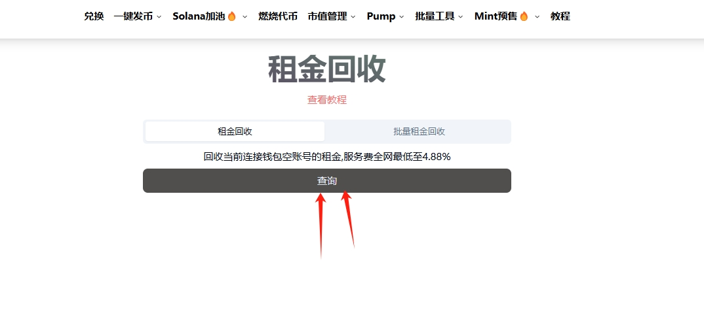
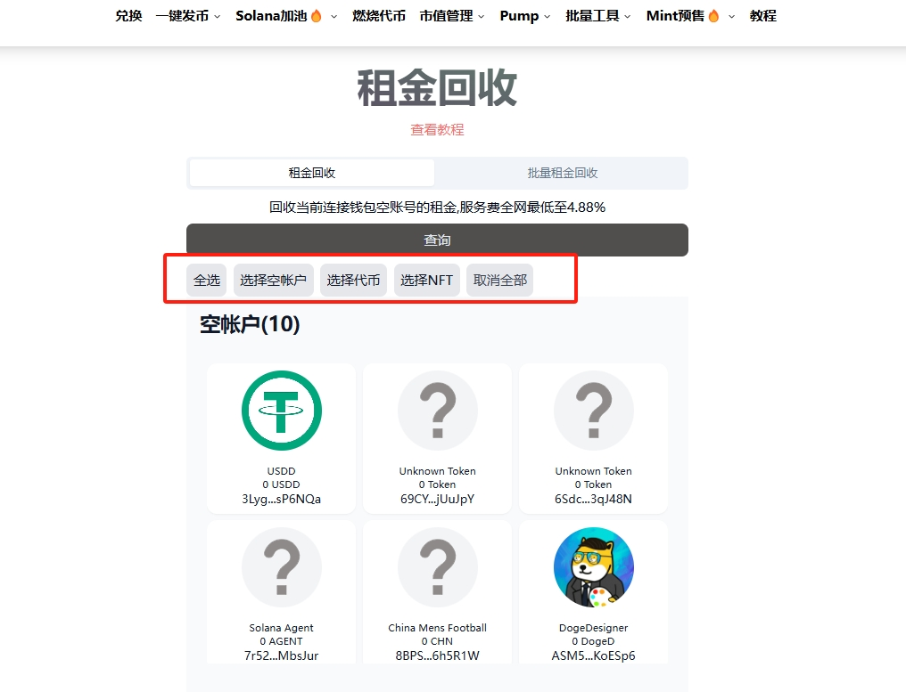
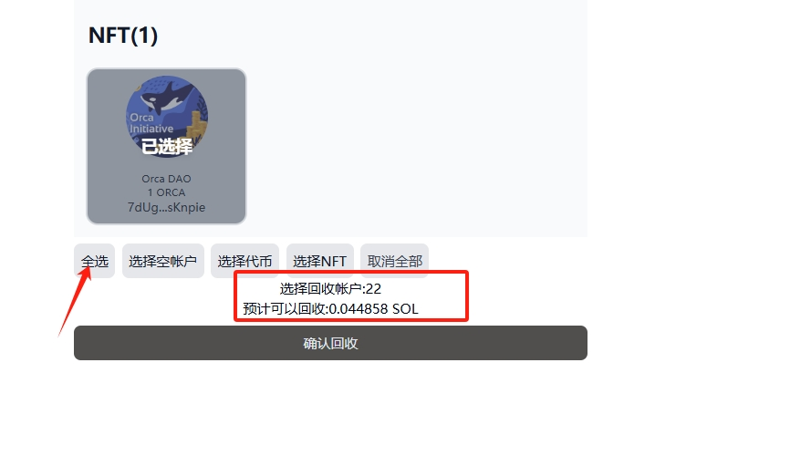
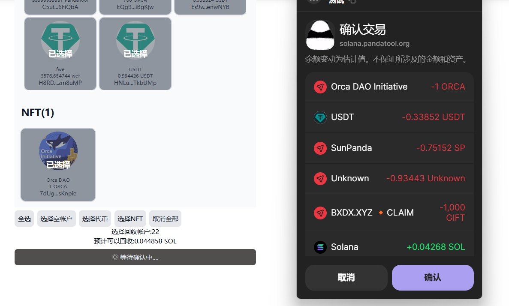
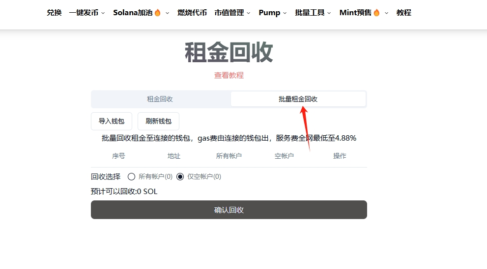
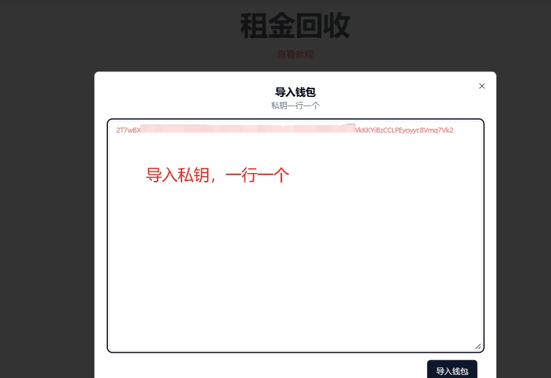
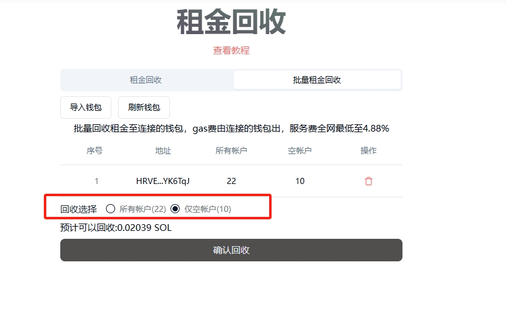
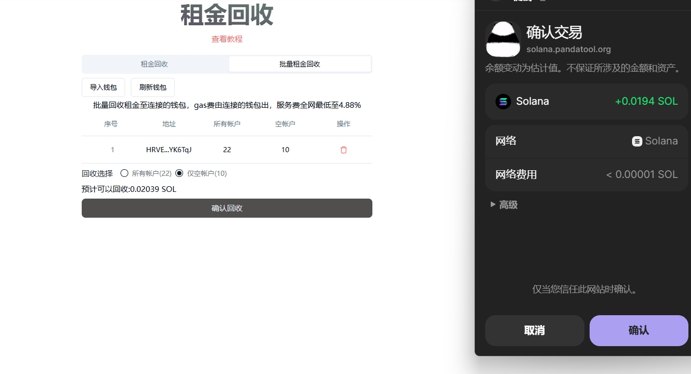

# Solana租金回收教程

## 什么是租金？

想象一下你租了一个仓库存放货物。仓库管理员（区块链网络）需要定期收租金，否则就会清空你的货物腾出空间。**Solana的租金机制正是这样的“仓库管理规则”。**

根据存储的内容和大小不同，租金也有所不同。在正常的Solana区块链里，我们接触到的主要是0.002的租金。即：钱包地址内每存储一个代币，需要收取0.002Sol的租金。

你可以将这个费用理解为Solana链的“数字快递柜押金”！

* **每个代币都是独立包裹**：就像快递需要单独柜格存放，每个代币在Solana上必须有独立账户
* ​**押金防滥用**：0.002 SOL相当于租用柜格的押金，防止有人乱占空间
* ​**所有权仍归你**：就像快递柜押金可退还，这个费用后续能通过PandaTool回收

## Solana租金回收流程

1.打开PandaTool回收工具

2.连接钱包并查询账户

3.选择回收的账户类型或账户代币

4.确认回收

## 如何回收租金

正如上面所说，您可以通过PandaTool回收您的代币租金。假设您的钱包内有10种代币，而这些代币都不再使用了，那么就可以回收：10x0.002=0.02sol的金额。如果代币超过100个，那这将是一笔不少的费用。因此，回收租金是非常有必要的。

接下来，我将给详细说明租金回收的流程

### 1、找到回收租金工具

我们可以通过PandaTool导航栏找到租金回收工具，也可以直接通过链接进去：[https://solana.pandatool.org/zh/rent](https://solana.pandatool.org/zh/rent)

<figure><figcaption></figcaption></figure>

### 2、连接钱包并查询

之后，我们点击右上角连接钱包

<figure><figcaption></figcaption></figure>

钱包连接成功后，点击查询按钮，可以知道自己的钱包内的代币账户情况

<figure><figcaption></figcaption></figure>

### 3.选择回收类型

查询之后，会发现钱包内有不同类型的代币。您可以根据类型进行租金回收

<figure><figcaption></figcaption></figure>

* **空账户：**&#x6CA1;有任何代币余额，可放心回收
* **代币：**&#x8D26;户内仍然有余额，需谨慎回收（可选择没有任何价值的代币）
* **NFT：**&#x8C28;慎回收（可选择没有任何价值的NFT）

假设您已经确认不再需要该钱包了，就可以点击“全选”，如下图所示

<figure><figcaption></figcaption></figure>

### 4.确认回收

选择好要回收的账户类型后，点击“确认回收”按钮，此时会弹出钱包进行确认，钱包确认后等待几秒钟，即可完成租金回收的工作

<figure><figcaption></figcaption></figure>

## 批量回收租金

前面的教程，是针对单个钱包进行租金回收的。假设我们有很多钱包都需要回收租金，该怎么办呢？可以使用批量租金回收工具来完成

### 1、打开批量租金回收工具

在租金回收的工具页面，找到批量回收工具

<figure><figcaption></figcaption></figure>

### 2、导入钱包私钥

将要回收租金的钱包私钥导入，您需要回收几个钱包，就导入几个钱包

<figure><figcaption></figcaption></figure>

### 3.选择账户类型

成功导入钱包后，可以看到钱包内的账户类型。我们需要选择回收全部账户，还是回收空账户

<figure><figcaption></figcaption></figure>

### 4.确认回收

选择好之后，我们点击“确认回收”按钮，弹出钱包确认即可完成

<figure><figcaption></figcaption></figure>

##
