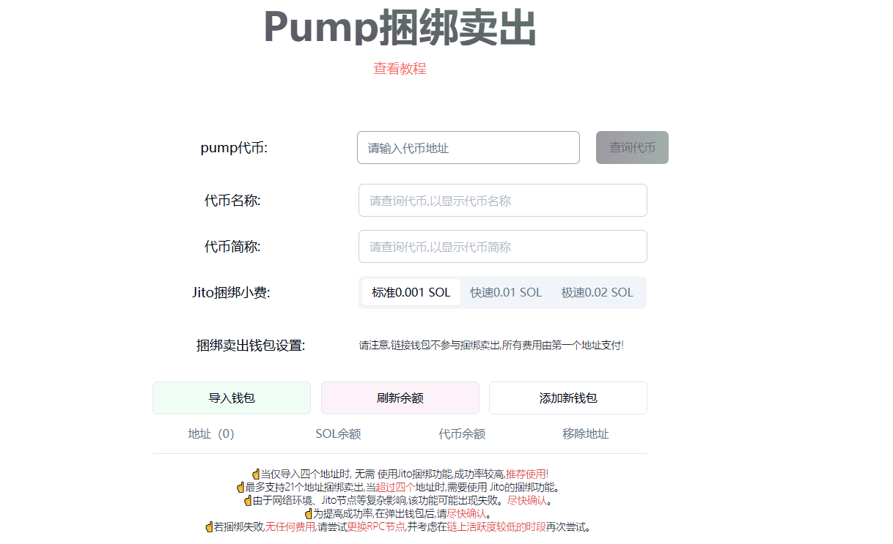
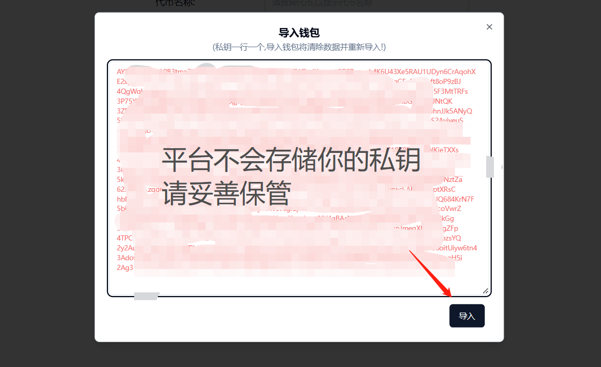
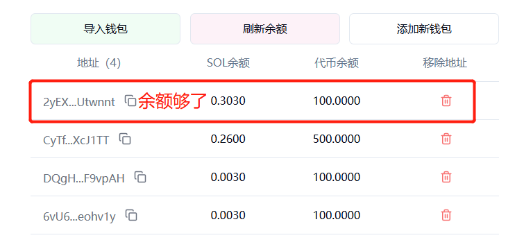
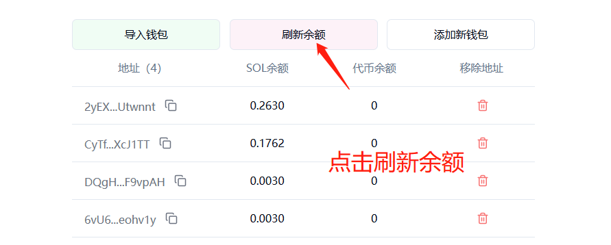

# PUMP一键捆绑卖出教程

### 怎么理解PUMP一键捆绑卖出这个功能？

我们假设这样一种情况，当你使用PUMP捆绑买入功能在多个地址内买入代币，或者拉盘刷量期间操作多个地址买入代币后，想将这些地址里面的代币全部卖出，应该怎么办？

传统的方式就是三种：

* **第一种：**手动卖。不断地切换钱包操作。这样不仅慢，而且机器人会泡在你的前面，不合适
* **第二种：**机器人卖。通过我们的机器人可以自动化卖出，省去了手动操作的麻烦，但是速度跟不上
* **第三种：**归集后卖。将代币归集到一个地址后统一卖出。听起来比较合适，但也是麻烦，多了一步归集的操作

基于此，我们开发了一键捆绑卖出的功能，导入钱包私钥后，即可**一次性将所有钱包内的相关代币全部卖出。**目前一次最多支持21个地址，如果钱包比较多，可以多导入几次。

### PUMP一键捆绑卖出教程

#### 1、配置卖出参数

接下来，我们需要填写并操作卖出的参数

<figure><figcaption></figcaption></figure>

* **pump代币：**输入pump代币合约地址，点击查询
* **代币名称：**查询后自动识别，无需填写
* **代币简称：**查询后自动识别，无需填写
* **Jito捆绑小费：**默认是0.001sol。如果捆绑失败，可尝试提高Jito小费（4个地址以内不需要，4个地址以上需要）
* **捆绑钱包设置：**请注意,链接钱包不参与捆绑卖出,所有费用由第一个导入的地址支付!

<figure><figcaption></figcaption></figure>

导入钱包后，我们点击刷新余额，大概就是这样一个页面

<figure><figcaption></figcaption></figure>

从这张截图中我们发现一个问题：第一个钱包尾号为wnnt的地址，钱包内的Sol余额比较少（必须大于0.3个sol），无法支付卖出费用。

<figure><figcaption></figcaption></figure>

因此，我们需要转一些sol给第一个钱包地址

<figure><figcaption></figcaption></figure>

搞定后，在确认其他地方也没有问题后，我们点击立即卖出

<figure><figcaption></figcaption></figure>


☝当仅导入四个地址时, 无需 使用Jito捆绑功能,成功率较高,推荐使用!

☝最多支持21个地址捆绑卖出,当超过四个地址时,需要使用 Jito的捆绑功能。

☝由于网络环境、Jito节点等复杂影响,该功能可能出现失败。尽快确认。

☝为提高成功率,在弹出钱包后,请尽快确认。

☝若捆绑失败,无任何费用,请尝试更换RPC节点,并考虑在链上活跃度较低的时段再次尝试。


#### 2、确定钱包卖出

当我们点击**立即卖出，**平台的前端会自动执行，将地址内的代币全部卖出。注意，是全部卖出，不可以指定数量哦

等待15\~30秒，如果还没有成功，大概率就是失败了，需要重新提交。

如果卖出成功，会出现以下提示

<figure><figcaption></figcaption></figure>

之后我们点击刷新余额，就能看到余额为0了

<figure><figcaption></figcaption></figure>

### 疑问解答

1. **一键捆绑卖出需要收费吗？**
   * **答：**每个地址收费0.01sol，这部分费用全部由第一个钱包出
2. **一键捆绑卖出是卖出钱包内的所有代币吗？**
   * **答：**捆绑卖出是卖出你选择的那个PUMP的币，没有选择的币是不受影响的
3. **卖出失败是怎么回事？**
   * **答：**正常4个地址以内，应该不会失败。超过4个地址之后，需要用Jito捆绑。捆绑的话可能会失败，这个时候需要刷新后重试，并增加Jito费用

任何问题，都可以进入Telegram电报群找志愿者解答： [https://t.me/pandatool](https://t.me/pandatool)
