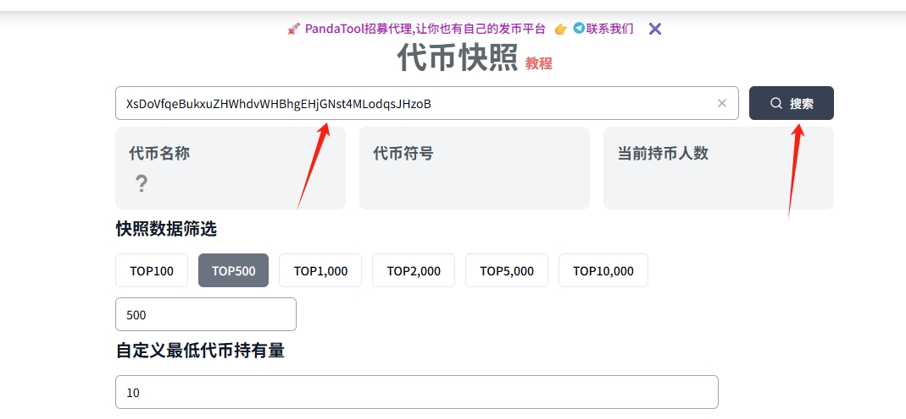
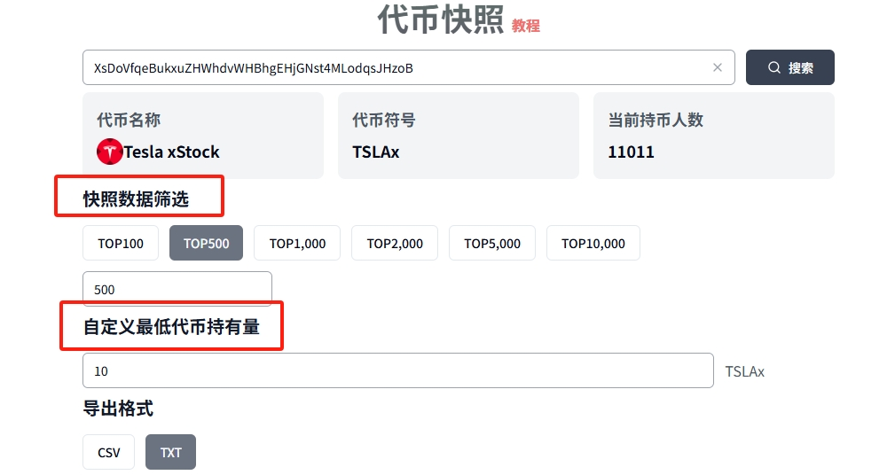
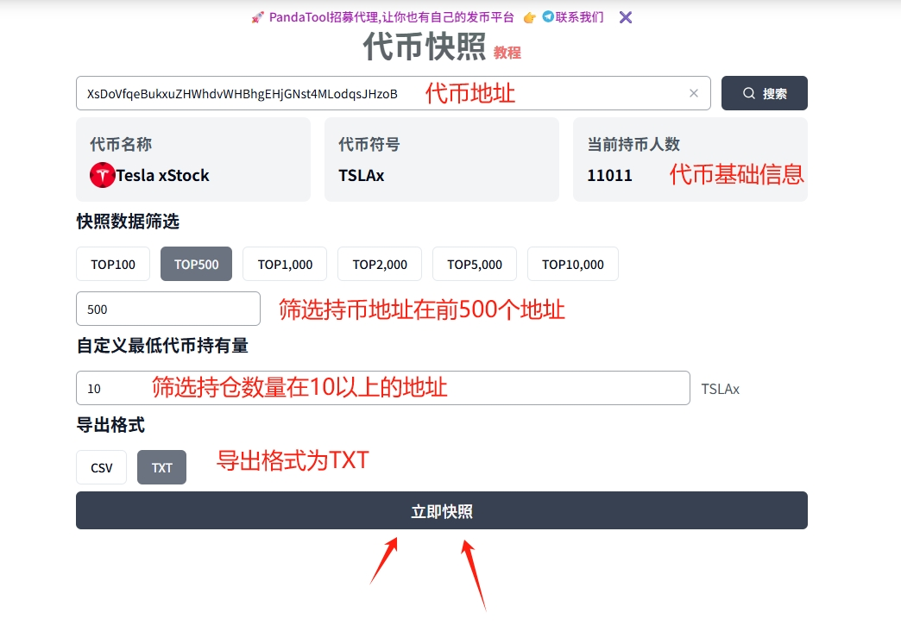
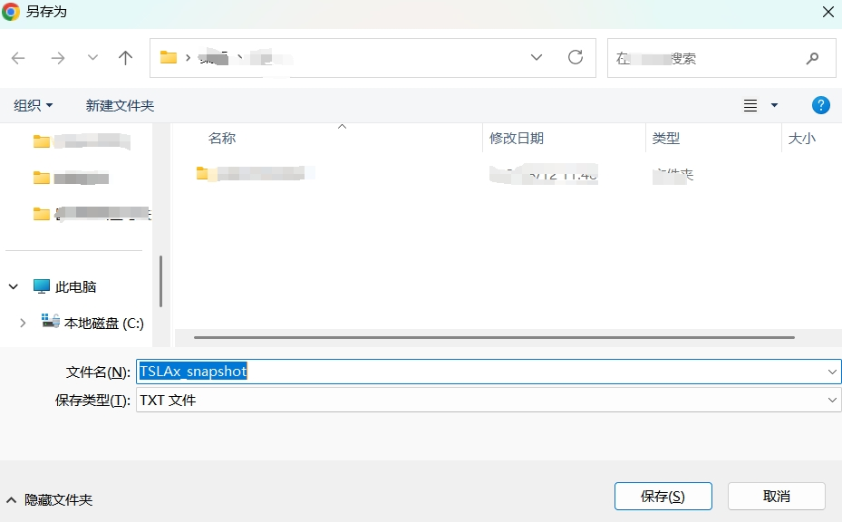
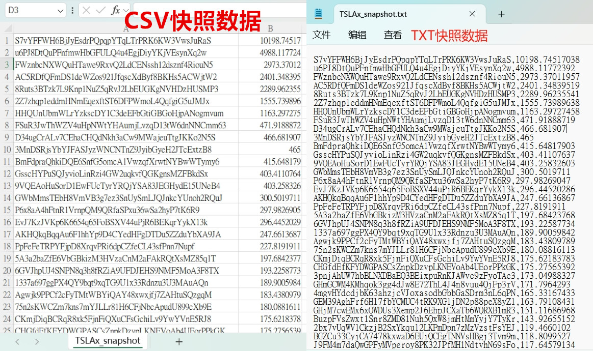

# Solana代币快照教程

### **什么是代币快照？**

代币**快照**，通俗点说，就是在区块链上“拍一张照”——记录某一时刻（或某个区块高度）、某个代币的所有持仓地址，以及每个地址的持仓数量。

### **为什么要对代币进行快照？**

1. **空投 / 分发奖励：**&#x6309;快照上的持币量发放代币或 NFT，防止在发放前有人临时买入套现。&#x20;
2. **治理投票：**&#x786E;定在某一时刻谁有投票资格及其投票权重（基于当时持币量）。&#x20;
3. **数据分析与合规审计：**&#x7EDF;计持币分布、识别大户/交易所/燃烧地址、评估去中心化程度。&#x20;
4. **迁移/空转准备：**&#x9879;目从旧合约迁移到新合约时，用快照保证老用户权益完整转移。

可以说，快照能保证“按某一时刻谁持有多少来发放权益”的公平性与可溯源性。

### **如何对代币进行快照？**

为了满足用户对于代币快照的需求，PandaTool开发了针对于Solana代币的快照工具，任何人只需要几个简单的步骤，就可以快速进行代币快照，以获取代币持仓信息。

#### **1、打开PandaTool**

首先，我们打开PandaTool的代币快照工具：[https://solana.pandatool.org/snapshotToken](https://solana.pandatool.org/snapshotToken)

<figure><figcaption></figcaption></figure>

#### **2、输入代币合约地址**

之后，我们在输入框填入要抓取的代币合约地址，如：XsDoVfqeBukxuZHWhdvWHBhgEHjGNst4MLodqsJHzoB，点击**搜索**

<figure><figcaption></figcaption></figure>

#### **3、筛选快照数据**

搜索之后，就可以看到代币的名称、符号以及持币人数等等。接下来，就要筛选一下快照的数据了

<figure><figcaption></figcaption></figure>

* **持仓地址筛选：**&#x54;OP100的意思，就是快照前100持币者的地址
* **自定义最低代币持有量：**&#x7B5B;选出持有这个数量以上的地址。假设您填写100，意味着持币数量少于100的地址将**不会**被快照

#### **4、快照导出**

当我们设定好筛选的数据后，再选择导出格式：

* **CSV：**&#x7C7B;似于Excel表格，可以在批量转账的时候用来上传识别地址。
* **TXT：**&#x6587;本格式，便于查看与复制

如果您拿到快照数据是为了进行批量空投，就选择CSV格式导出。如果您拿到快照数据是为了看一下，那么TXT格式比较合适。

确定好格式后，我们点击“立即快照”按钮

<figure><figcaption></figcaption></figure>

之后，浏览器会提示您下载一个文档，这个就是您导出的快速数据

<figure><figcaption></figcaption></figure>

接下来就能看到一些快照数据了

<figure><figcaption></figcaption></figure>

### **代币快照注意事项**

**1、PandaTool的代币快照工具需要收费吗？**

* **答：**&#x4E0D;收费，该工具是免费使用的

**2、快照的数据准确吗？**

* **答：**&#x4EE3;币快照的数据是基于某一个区块高度或者时间的，过了这个时间，数据可能就会有变化。

**3、代币快照支持BSC链、ETH链吗？**

* **答：**&#x6682;时还不支持，PandaTool会尽快开发

当然，如果您对代币快照这个工具还有哪些问题，可以直接在Telegram群里咨询志愿者：[https://t.me/pandatool](https://t.me/pandatool)

