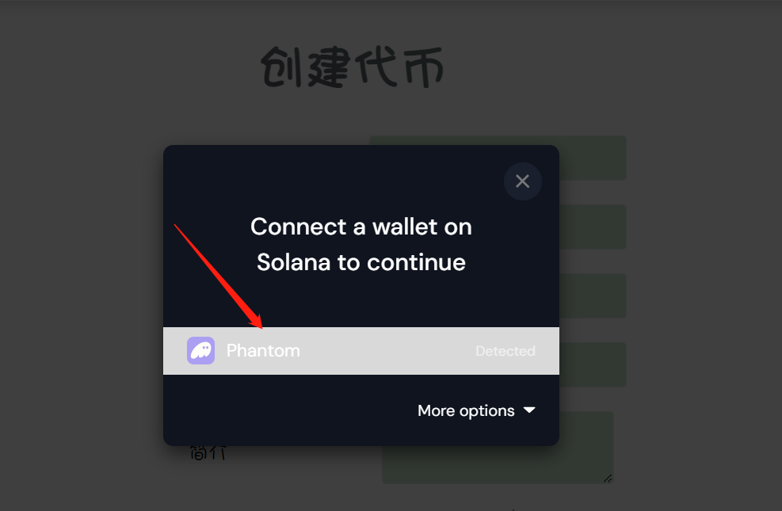
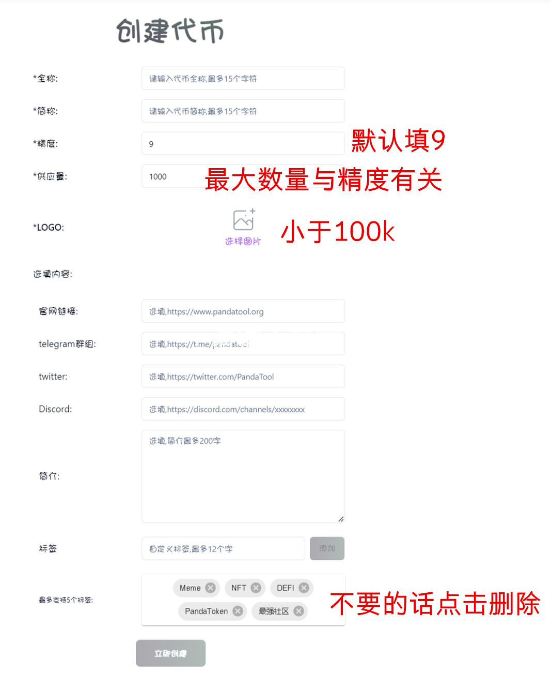
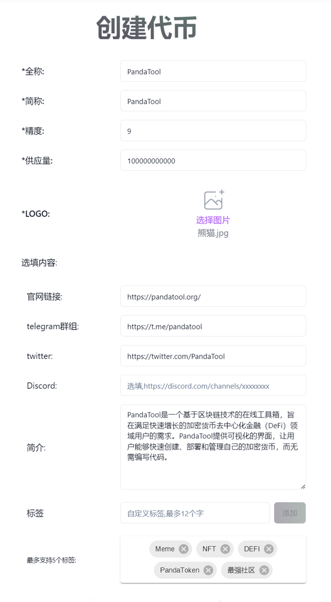
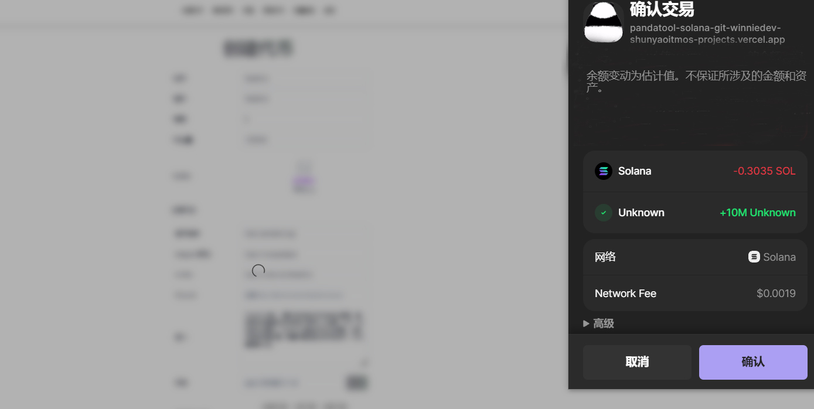
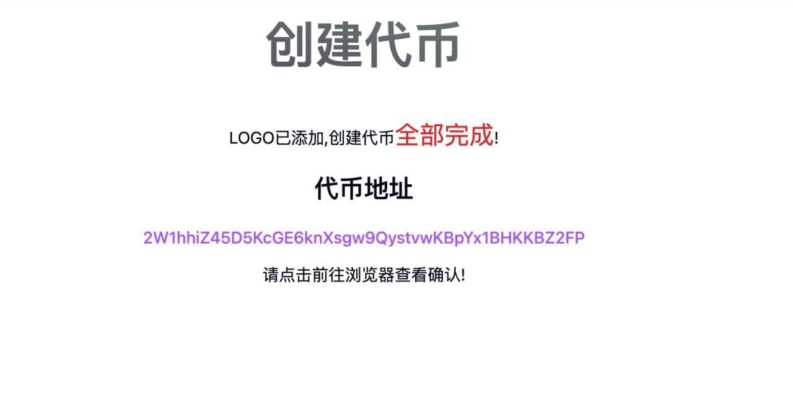
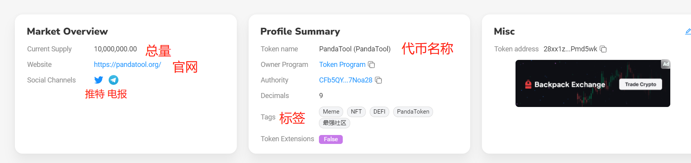

# Solana一键发币教程

## 前提条件

* 发币之前，务必使用安装好幻影钱包插件，安装教程➔ [https://help.pandatool.org/sol/phantom](https://help.pandatool.org/sol/phantom)
* 钱包内最少准备0.3个Sol
* 请打开翻墙软件（VPN/加速器），以防止网络错误
* 手机发币也使用Phantom钱包或欧易web3钱包，不要用TP钱包，TP不能传logo

## Sol发币教程

### 1、连接幻影钱包Phantom

首先，我们打开发币链接：[https://solana.pandatool.org/](https://solana.pandatool.org/)，点击右上角“选择钱包”

<figure><figcaption></figcaption></figure>

之后会跳出钱包选择页面，点击Phantom，即可链接钱包

<figure><figcaption>
点击幻影钱包
</figcaption></figure>

右上角出现钱包地址，表示你已经完成的钱包链接

<figure><figcaption></figcaption></figure>

**注意：**如果没有提前安装幻影钱包，那么点击连接钱包，会出现如下提示

<figure><figcaption></figcaption></figure>

该提示是错误提示，不用管。请重新刷新页面，并确认是否安装好钱包

### 2、填写参数

完成钱包链接之后，接下来就是填写代币参数，具体有如下几项：

<figure><figcaption></figcaption></figure>

**必填部分**

* **全称：**支持英文、中文以及中英混合，最多15个字符
* **简称：**支持英文、中文以及中英混合，最多15个字符
* **精度：**默认填9，精度与你能填写的最大供应量有关。
* **供应数量：**当精度为9时，供应量最大不能超过100亿。当精度为8时，不能超过1000亿，以此类推
* **logo：**图片小于**100k**，尺寸建议256x256像素（正方形）

**选填部分**

* **官网链接：**会出现在Solana浏览器上，如：[https://pandatool.org/](https://pandatool.org/)
* **Telegram群组：**会出现在Solana浏览器上，如：[https://t.me/pandatool](https://t.me/pandatool)
* **Twitter链接：**会出现在Solana浏览器上，如：[https://twitter.com/PandaTool](https://twitter.com/PandaTool)
* **Discord链接：**会出现在Solana浏览器上，如：[https://discord.orca.so/](https://discord.orca.so/)
* **简介：**不能超过200个汉字（或200个英文字母）
* **标签：**最多支持5个。默认会给你写5个，觉得哪个不合适，直接删掉自己创建一个就可以

例如我填写的信息如下

<figure><figcaption></figcaption></figure>

这个代币的名字就叫PandaTool，除了Discord没有填之外，其他都填了。标签是默认的5个，大家可也可以根据自己需要删除或者增加。

确定好信息无误之后，点击“立即创建”按钮，这时候会跳出Phantom钱包，确认并支付费用即可，如下所示：

<figure><figcaption></figcaption></figure>

等待几秒钟之后，会弹出一个页面提示你代币创建成功。（注意：代币是否创建成功以扣费为准，只要扣费了就肯定成功，只要没成功就肯定没扣费）

<figure><figcaption></figcaption></figure>

然后我们通过Sol浏览器([https://solscan.io/](https://solscan.io/))查询，看到代币的logo和详细信息（代币简介一般不会在浏览器显示，会在Birdeye等平台显示）

<figure><figcaption></figcaption></figure>

此时我们打开自己的Phantom钱包，应该也可以看到代币的logo。（注意，有时候Phantom钱包更新的比较慢，logo可能不显示，这时候你的代币可能会显示为`未知代币`，需要等待一段时间，几个小时\~几天差不多就能更新）

此时，代币就算是基本创建完成了，大家可以根据需求去做池子，然后就能交易了。

* Raydium加池教程：[https://help.pandatool.org/sol/raydium](https://help.pandatool.org/sol/raydium)
* Orca加池教程：[https://help.pandatool.org/sol/orca](https://help.pandatool.org/sol/orca)
* Meteora加池教程：[https://help.pandatool.org/sol/meteora](https://help.pandatool.org/sol/meteora)

## 疑问解答

#### 1、Sol发币需要开源吗？

* **答：**不需要，Sol没有开源的说法，发行完成就可以了

#### 2、Sol发币需要多少钱？

* **答：**发币费用是0.2sol，如果再加上一些gas费，估计0.21sol左右

#### 3、为什么发币之后钱包显示未知代币？

* **答：**Phantom钱包有时候抓取信息过慢，或者钱包本身有缓存，需要一段时间才能显示logo和代币名称等信息

#### 4、手机应该怎么发币？

* **答：**手机可以使用欧易web3钱包或者Phantom钱包app进行操作，不支持TP钱包哦

#### 5、为什么浏览器没有显示我的推特和电报？

* **答：**solana浏览器在近期做了更新升级，已经在外面显示推特和电报了，需要在metadate查询

**6、发币之后需要丢弃权限吗？怎么丢？**

* **答：**我建议大家发币之后将权限丢弃，可以在此处丢权限：[https://solana.pandatool.org/control](https://solana.pandatool.org/control)

**7、其他问题**

* 任何问题，都可以进入Telegram电报群找志愿者解答： [https://t.me/pandatool](https://t.me/pandatool)
