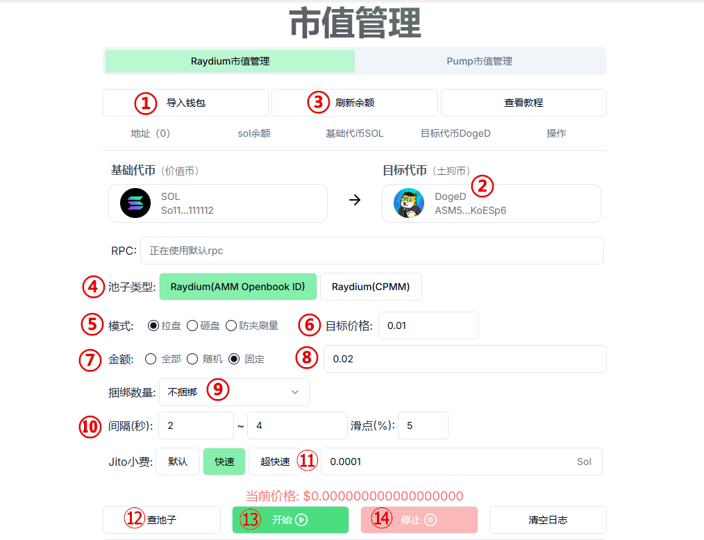
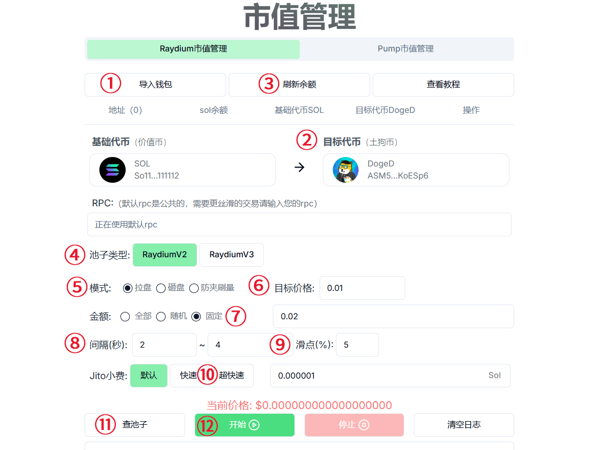
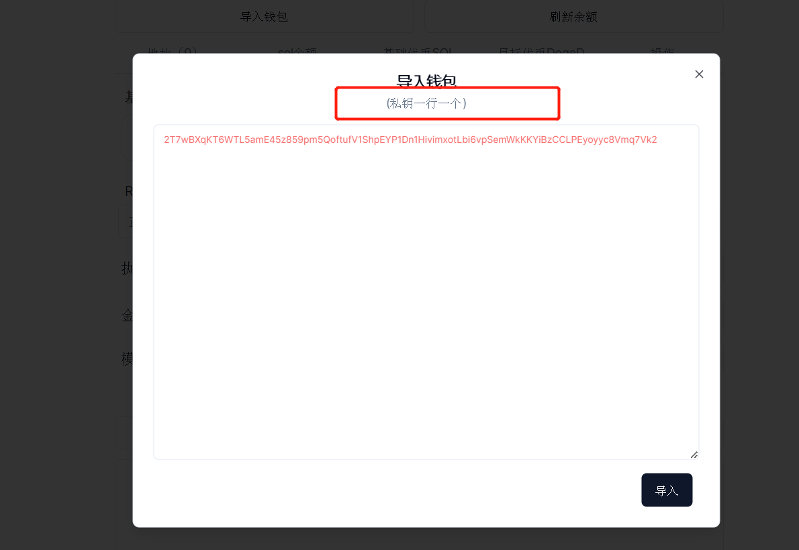
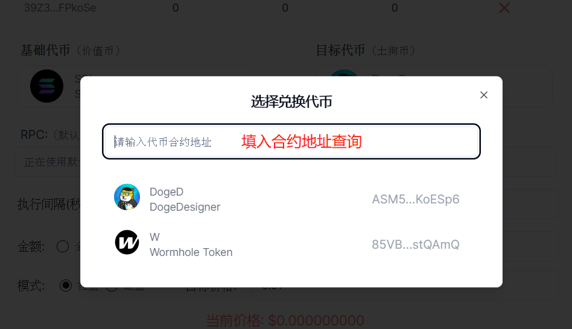
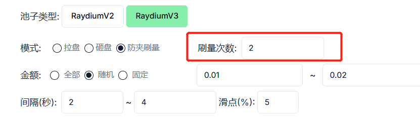

# Solana市值管理机器人教程

Solana市值管理机器人，简单来说就是一个支持自动交易、批量交易的机器人系统，可以按照设定好的目标价格进行买卖



### 注意事项

1、 机器人为`单路由`模式：即，SOL的池子，只能用sol交易。USDC的池子，只能用USDC交易&#x20;

2、 机器人目前只支持Raydium V2 AMM池和V3的CPMM池子，不支持CLMM池子 ，也不支持Orca池子

3、 刚开盘项目价格不稳定，往往需要`提高滑点`才能交易成功&#x20;

4、 不支持**`Token2022`**的代币

5、交易失败的大部分原因都是这几种：余额不够（查看参数是否填写错误）、交易过期（节点速度慢）、没有按照流程操作（比如没查池子就开始交易）、矿工费较低（可以增加矿工费）

### 市值管理使用教程

打开市值管理机器人页面：[https://solana.pandatool.org/swapbot](https://solana.pandatool.org/swapbot)，选择你需要使用的版本：**Raydium**

<figure><figcaption></figcaption></figure>

之后我们按照如下流程进行操作

<figure><figcaption></figcaption></figure>

① **导入钱包：**在选择的页面导入你的钱包私钥（需要几个钱包操作，就导入几个 ）

<figure><figcaption></figcaption></figure>

② **选择代币：**输入合约地址，选择你要操盘/控制的代币

<figure><figcaption></figcaption></figure>

③ **刷新余额：**看下你的钱包内有多少的sol、多少的代币

**④ 池子类型**

* Raydium V2：老版本的Raydium，需要创建市场ID。PUMP发射后就是到这里，合约名称是V4
* Raydium V3：新版本的Ryaidum，即CPMM，不需要市场ID的池子

**⑤ 操作模式**

* 拉盘：买入代币
* 砸盘：卖出代币
* 防夹刷量：一次=买卖各一笔，同一个哈希完成，防止夹子攻击

**⑥ 目标价格**

* 拉盘：代币要拉升到某个目标价位
* 砸盘：代币要砸到某个目标价位
* 防夹刷量：无需设置价格，改为设置刷量次数（买一笔+卖一笔为一次）

<figure><figcaption></figcaption></figure>

**⑦ 操作金额：**在**拉盘**模式下，这里的金额就是你所花费的sol数量。在**砸盘**模式下，这里的金额就是你要出售的代币数量。在**防夹刷量**模式下，金额为你要买入的金额

* 全部：一次性卖出所有代币，无视价格与滑点
* 随机：根据设置的金额范围，随机买入/卖出代币
* 固定：按照固定数额的sol买入，或者按照固定数量的代币进行卖出

**⑧ 时间间隔：**每次买入或者卖出之间的执行间隔时间，以秒为单位

**⑨ 滑点：**每笔交易所能接受的最大磨损成本。刚上线的代币，滑点要高一点

**⑩ Jito小费：给Jito验证者的小费，可以帮助你快速打包交易，提高成功率**

* 默认：0.000001sol
* 快速：0.00005sol
* **超快速：**0.0001sol（如果是防夹刷量，推荐用这个）
* 其他：可以自己自定义Jito费

⑪ **查池子：**查询池子地址和代币价格

⑫ **开始：**点击开始运行

⑬ **停止：**点击停止运行

### 疑问解答

**1、平台会拿到你的私钥吗？**&#x20;

* 答：绝对不可能，你的私钥不会存储在平台上，所有操作都是基于前端执行的，请放心使用。如果你比较担心，可以使用新的钱包操作

**2、市值管理是收费的吗？**

* 答：每笔交易我们会收取0.003sol的手续费，防夹刷量每次收取0.004sol的手续费

**3、防夹刷量的逻辑是什么？**

* 答：机器人会按照您设定的金额买入一笔，然后在同一笔哈希中卖出一笔。将买入和卖出放在一个哈希里进行打包确认，从而防止夹子机器人套利

**4、导入多个地址进行防夹刷量，次数是单地址次数还是总次数？**

* 答：次数是所有地址的总次数。每个地址买+卖一笔，即为一次。所有钱包轮循进行刷量，直到总次数达到设定值

**5、最多可以导入多少钱包？**

* 答：为了确保操作的稳定性和流畅性，一次性导入的钱包数量最好低于100个

**6、这个机器人能冲土狗吗？**

* 答：市值管理机器人是为了项目方控盘用的，不是用来开盘冲土狗的。尽管可以用它来进行交易，但是并不会像市面上的PEPE BOT一样可以快速买入卖出，暂时没有这个功能

**7、为什么查不到我的池子？**

* 答：目前机器人不支持Token2022的代币，该类型的代币可能无法查到池子

如有不明白或者不清楚的地方，请加入官方电报群：[https://t.me/PandaTool](https://t.me/PandaTool)
