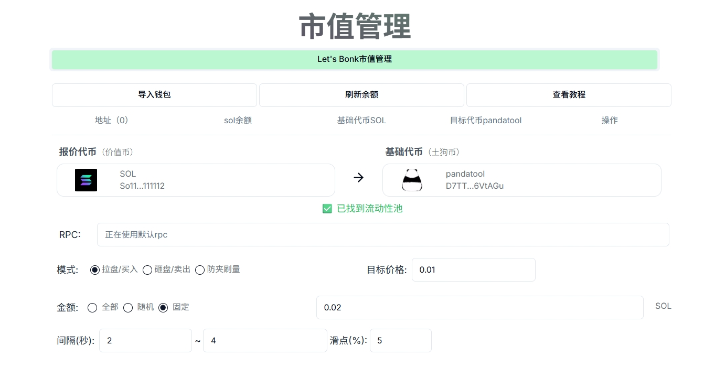
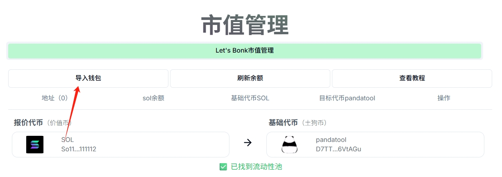
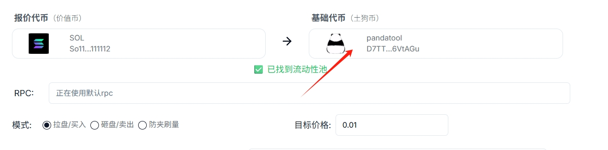
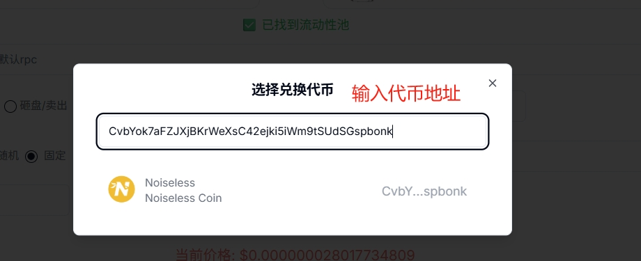
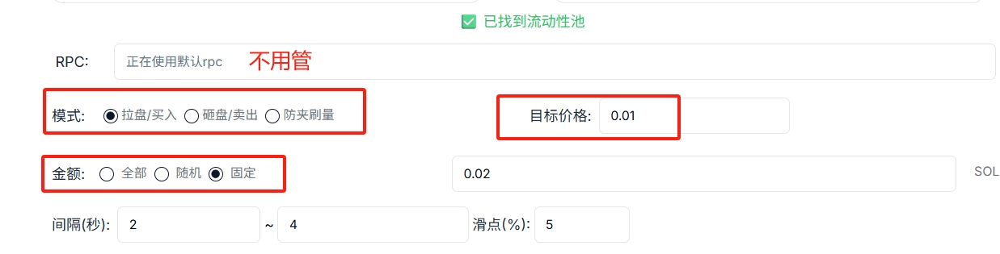
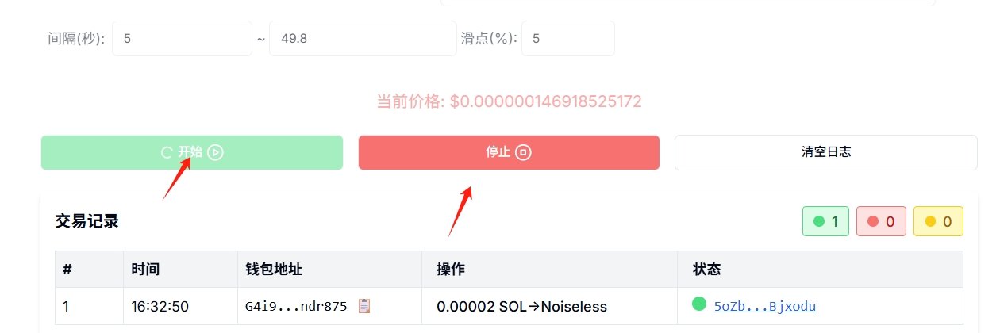

# BonkFun批量交易/市值管理教程

BonkFun市值管理机器人，简单来说就是一个支持[LetsBonk](https://letsbonk.fun/)代币自动交易、批量交易的机器人系统，可以按照设定好的目标价格、交易次数等方式进行自动化批量买卖。

<figure><figcaption></figcaption></figure>

### BonkFun机器人使用注意

1、 该机器人主要是交易BonkFun内盘代币，如果您的代币已经发射到了Raydium，请使用Raydium批量交易机器人：[https://solana.pandatool.org/swapbot](https://solana.pandatool.org/swapbot)

2、批量交易机器人的成功率为98%，如果失败次数较多，可以咨询客服询问原因

3、使用机器人有任何建议或者想法，可以在PandaTool官方电报群咨询：[https://t.me/pandatool](https://t.me/pandatool)

### BonkFun机器人使用教程

在PandaTool打开批量交易/市值管理机器人页面：[https://solana.pandatool.org/swapbotBonk](https://solana.pandatool.org/swapbotBonk) ，需要进行以下操作

<figure><figcaption></figcaption></figure>

### **1、导入钱包**

进入到批量交易网页后，我们第一步需要导入参与交易的钱包私钥。例如您要使用 20个钱包进行买卖，就点击**导入钱包**按钮，在输入框内填入20个私钥。（私钥一行一个）

<figure><figcaption></figcaption></figure>

<figure><figcaption></figcaption></figure>


**安全提醒：**&#x6240;有的交易都是基于您的设备前端进行的，所有私钥不会上传服务器。PandaTool没有任何办法获取到您的私钥，请您妥善保管好自己的钱包私钥


### **2、选择代币**

接下来，我们需要选择要交易的代币。您要对哪个代币操盘，就在`基础代币`那里搜索自己的代币

<figure><figcaption></figcaption></figure>

<figure><figcaption></figcaption></figure>

正常情况下，会提示您“**已找到流动性池**”，这说明可以进行下一步。如果没有找到流动性，那可能是您输入的代币地址错误，请重新核查。

### **3、选择交易模式**

<figure><figcaption></figcaption></figure>

接下来，我们需要选择交易模式。目前的交易模式有三种：拉盘/买入、砸盘/卖出、防夹刷量

* **拉盘：**&#x591A;地址批量、快速买入代币
* **砸盘：**&#x591A;地址批量、快速卖出代币
* **防夹刷量：**&#x5728;同一个哈希完成一笔买卖，防止夹子攻击

### **4、填写目标价格**

所谓目标价格，是代币需要达成的一个价格。如果您选择拉盘模式，就是将代币拉升到某个价格。如果您选择砸盘模式，就是将代币卖出，使其降低到某个价位。

* **拉盘：**&#x4EE3;币要拉升到某个目标价位
* **砸盘：**&#x4EE3;币要降低某个目标价位
* **防夹刷量：**&#x65E0;需设置价格，改为设置刷量次数（买一笔+卖一笔为一次）


需要注意的是，当您选择拉盘模式的时候，目标价格**不得低于**当前价格。当您选择砸盘模式的时候，目标价格**不得高于**当前价格


### **5、填写交易金额**

在**拉盘**模式下，这里的金额就是你所花费的sol数量。在**砸盘**模式下，这里的金额就是你要出售的代币数量。在**防夹刷量**模式下，金额为你要买入的金额

* 全部：一次性卖出所有代币，无视价格与滑点
* 随机：根据设置的金额范围，随机买入/卖出代币
* 固定：按照固定数额的sol买入，或者按照固定数量的基础代币进行卖出

### **6、设置时间间隔与滑点**

* **时间间隔：**&#x6BCF;次买入、卖出或者刷量交易之间的执行间隔时间，以秒为单位。该时间间隔可以是时间范围，也可以是固定时间
* **滑点：**&#x6BCF;笔交易能接受的最大磨损成本，默认5%不用修改

### **7、交易的开始与暂停**

设置好所有参数信息后，我们点击**开始**按钮，即可运行程序。如果您希望在中途停止交易，只需点击**停止**按钮，即可立即停止交易

<figure><figcaption></figcaption></figure>

## **机器人疑问解答** 

**1、PandaTool会拿到你的私钥吗？**

* 答：绝对不可能，你的私钥不会存储在平台上，所有操作都是基于前端执行的，请放心使用。如果你比较担心，可以使用新的钱包操作

**2、市值管理是收费的吗？**

* 答：当前的交易机器人是免费的，未来可能会收费

**3、防夹刷量的逻辑是什么？**

* 答：机器人会按照您设定的金额买入一笔，然后在同一笔哈希中卖出一笔。将买入和卖出放在一个哈希里进行打包确认，从而防止夹子机器人套利

**4、导入多个地址进行防夹刷量，次数是单地址次数还是总次数？**

* 答：次数是所有地址的总次数。每个地址买+卖一笔，即为1次。所有钱包轮循进行刷量，直到总次数达到设定值

**5、最多可以导入多少钱包？**

* 答：为了确保操作的稳定性和流畅性，一次性导入的钱包数量最好低于100个

**6、为什么查不到流动性？**

* 答：先确认一下您输入的代币合约地址，是否为LetsBonk平台的代币，该机器人只支持操盘LetsBonk.fun平台的代币

如有不明白或者不清楚的地方，请加入官方电报群：[https://t.me/PandaTool](https://t.me/PandaTool)
