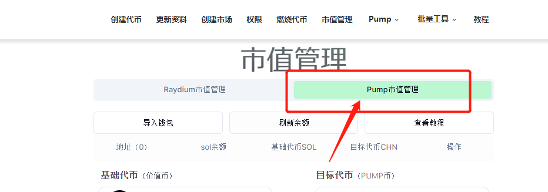
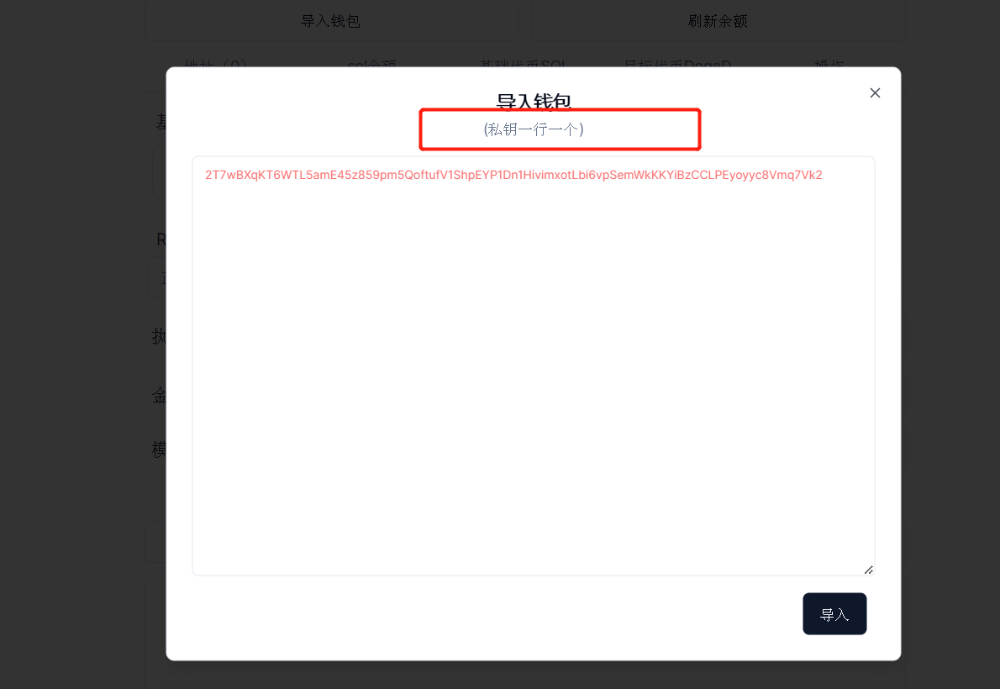
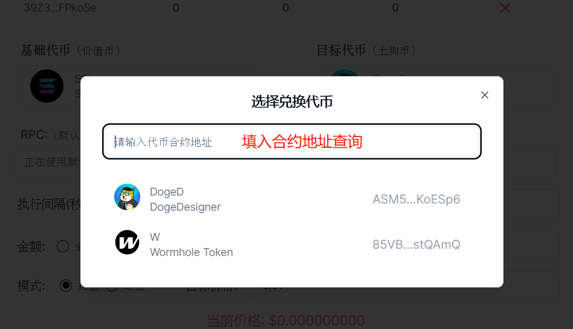

# pump.fun市值管理机器人教程

PUMP市值管理机器人，简单来说就是一个支持pump.fun内盘自动交易、批量交易的机器人系统，可以按照设定好的目标价格进行买卖

### 注意事项

1、 该机器人主要是交易PUMP内盘币，如果已经发射上了Raydium，请使用另一款机器人：

2、 机器人交易成功率为95%，如果失败次数较多，请适当增加矿工费

3、使用机器人有任何问题，可以联系：[https://t.me/xiaoba8](https://t.me/xiaoba8)

### pump.fun市值管理使用教程

打开市值管理机器人页面：[https://solana.pandatool.org/swapbot](https://solana.pandatool.org/swapbot)，选择你需要操作的版本：PUMP

<figure><figcaption></figcaption></figure>

然后再按照如下流程操作

<figure><figcaption></figcaption></figure>

**1、导入钱包：**在选择的页面导入你的钱包私钥（需要几个钱包操作，就导入几个 ）

<figure><figcaption></figcaption></figure>

**2、选择代币：**输入合约地址，选择你要操盘/控制的代币

<figure><figcaption></figcaption></figure>

**3、刷新余额：**看下你的钱包内有多少的sol、多少的代币

**4、执行间隔：**每次买入或者卖出之间的执行间隔时间，以秒为单位

**5、滑点：**每笔交易所能接受的最大磨损成本。刚上线的代币，滑点要高一点

**6、操作金额：**在拉盘模式下，这里的金额就是你所花费的sol数量。在砸盘模式下，这里的金额就是你要出售的代币数量

* 全部：一次性卖出所有代币，无视价格与滑点
* 随机：根据设置的金额范围，随机买入/卖出代币
* 固定：按照固定数额的sol买入，或者按照固定数量的代币进行卖出

**7、操作模式：**拉盘模式→买入代币；砸盘模式→卖出代币

**8、目标价格：**拉盘模式下，目标价格要高于当前代币价格。砸盘模式下，目标价格要低于当前代币价格

**9、Jito小费：给Jito验证者的小费，可以帮助你快速打包交易，提高成功率**

* 默认：0.000001sol
* 快速：0.00005sol
* 超快速：0.0001sol
* 其他：可以自己自定义Jito费

**10、查池子：**查询池子地址和代币价格

**11、开始：**点击开始运行

**12、停止：**点击停止运行

### 疑问解答

**1、平台会拿到你的私钥吗？**&#x20;

* 答：绝对不可能，你的私钥不会存储在平台上，所有操作都是基于前端执行的，请放心使用。如果你比较担心，可以使用新的钱包操作

**2、PUMP市值管理是收费的吗？**

* 答：每笔交易我们会收取0.002sol的手续费

**3、最多可以导入多少钱包？**

* 答：为了确保操作的稳定性和流畅性，一次性导入的钱包数量最好低于100个

**4、这个机器人能冲土狗吗？**

* 答：市值管理机器人是为了项目方控盘用的，不是用来开盘冲土狗的。尽管可以用它来进行交易，但是并不会像市面上的PEPE BOT一样可以快速买入卖出，暂时没有这个功能

如有不明白或者不清楚的地方，请加入官方电报群：[https://t.me/PandaTool](https://t.me/PandaTool)
