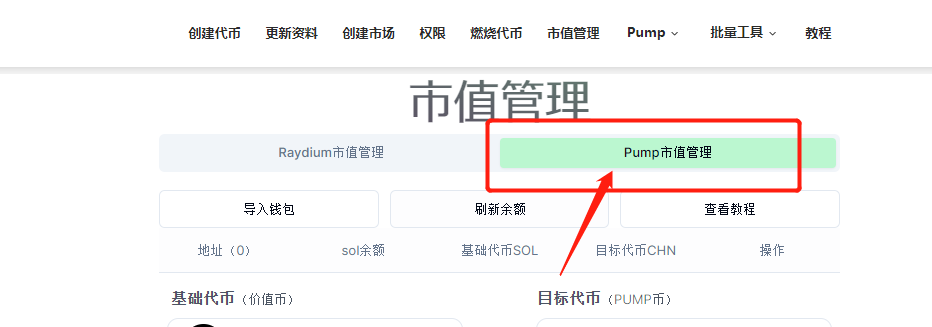
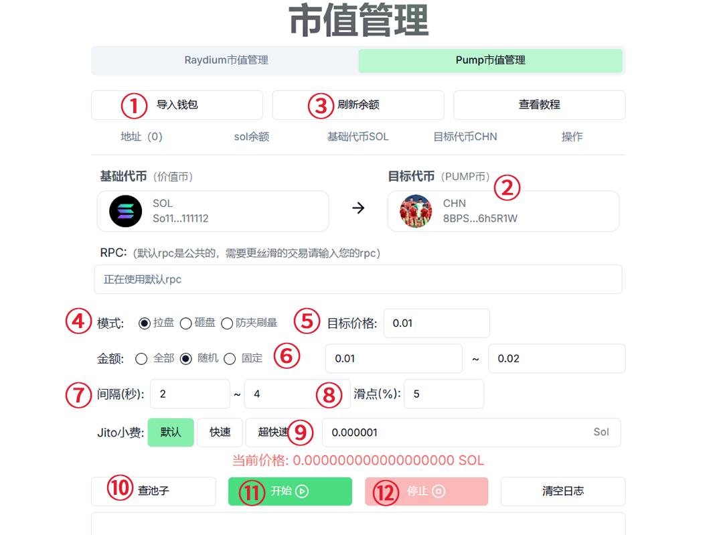

# pump.fun市值管理机器人教程

PUMP市值管理机器人，简单来说就是一个支持pump.fun内盘自动交易、批量交易的机器人系统，可以按照设定好的目标价格进行买卖

### 注意事项

1、 该机器人主要是交易PUMP内盘币，如果已经发射上了Raydium，请使用另一款机器人，并选择Raydium V2

2、 机器人交易成功率为95%，如果失败次数较多，请适当增加Jito小费

3、使用机器人有任何问题，可以联系：[https://t.me/xiaoba8](https://t.me/xiaoba8)

### pump.fun市值管理使用教程

打开市值管理机器人页面：[https://solana.pandatool.org/swapbot](https://solana.pandatool.org/swapbot)，选择你需要操作的版本：PUMP

<figure><figcaption></figcaption></figure>

然后再按照如下流程操作

<figure><figcaption></figcaption></figure>

**① 导入钱包：**&#x5728;选择的页面导入你的钱包私钥（需要几个钱包操作，就导入几个 ）

<figure><figcaption></figcaption></figure>

**②** **选择代币：**&#x8F93;入合约地址，选择你要操盘/控制的代币

**③ 刷新余额：**&#x770B;下你的钱包内有多少的sol、多少的代币

**④ 操作模式**

* 拉盘：买入代币
* 砸盘：卖出代币
* 防夹刷量：1次=买卖各一笔，同一个哈希完成，防止夹子攻击

**⑤ 目标价格**

* 拉盘：代币要拉升到某个目标价位
* 砸盘：代币要砸到某个目标价位
* 防夹刷量：无需设置价格，改为设置刷量次数（买一笔+卖一笔为一次）

**⑥ 操作金额：**&#x5728;**拉盘**模式下，这里的金额就是你所花费的sol数量。在**砸盘**模式下，这里的金额就是你要出售的代币数量。在**防夹刷量**模式下，金额为你要买入的金额

* 全部：一次性卖出所有代币，无视价格与滑点
* 随机：根据设置的金额范围，随机买入/卖出代币
* 固定：按照固定数额的sol买入，或者按照固定数量的代币进行卖出

**⑦ 时间间隔：**&#x6BCF;次买入或者卖出之间的执行间隔时间，以秒为单位

**⑧ 滑点：**&#x6BCF;笔交易所能接受的最大磨损成本。刚上线的代币，滑点要高一点

**⑨ Jito小费：给Jito验证者的小费，可以帮助你快速打包交易，提高成功率**

* 默认：0.000001sol
* 快速：0.00005sol
* **超快速：**&#x30;.0001sol（如果是防夹刷量，推荐用这个）
* 其他：可以自己自定义Jito费

**⑩ 查池子：**&#x67E5;询池子地址和代币价格

**⑪ 开始：**&#x70B9;击开始运行

**⑫ 停止：**&#x70B9;击停止运行

### 疑问解答 

**1、平台会拿到你的私钥吗？**

* 答：绝对不可能，你的私钥不会存储在平台上，所有操作都是基于前端执行的，请放心使用。如果你比较担心，可以使用新的钱包操作

**2、市值管理是收费的吗？**

* 答：每笔交易我们会收取0.003sol的手续费，防夹刷量每次收取0.004sol的手续费

**3、防夹刷量的逻辑是什么？**

* 答：机器人会按照您设定的金额买入一笔，然后在同一笔哈希中卖出一笔。将买入和卖出放在一个哈希里进行打包确认，从而防止夹子机器人套利

**4、导入多个地址进行防夹刷量，次数是单地址次数还是总次数？**

* 答：次数是所有地址的总次数。每个地址买+卖一笔，即为1次。所有钱包轮循进行刷量，直到总次数达到设定值

**5、最多可以导入多少钱包？**

* 答：为了确保操作的稳定性和流畅性，一次性导入的钱包数量最好低于100个

**6、这个机器人能冲土狗吗？**

* 答：市值管理机器人是为了项目方控盘用的，不是用来开盘冲土狗的。尽管可以用它来进行交易，但是并不会像市面上的PEPE BOT一样可以快速买入卖出，暂时没有这个功能

**7、为什么查不到我的池子？**

* 答：目前机器人不支持Token2022的代币，该类型的代币可能无法查到池子

如有不明白或者不清楚的地方，请加入官方电报群：[https://t.me/PandaTool](https://t.me/PandaTool)
