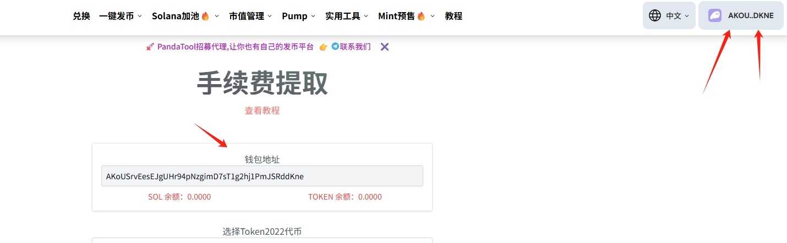
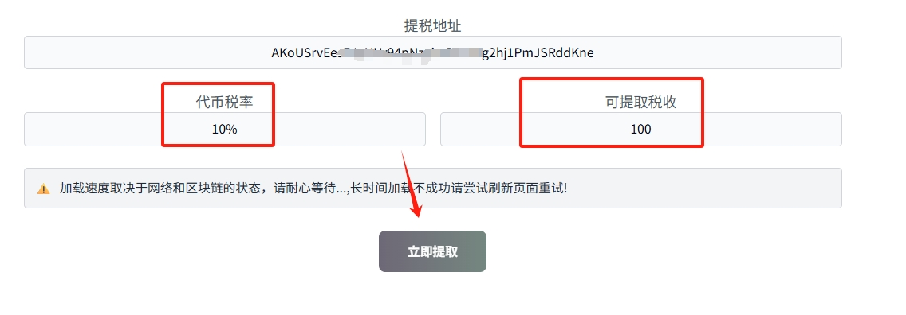
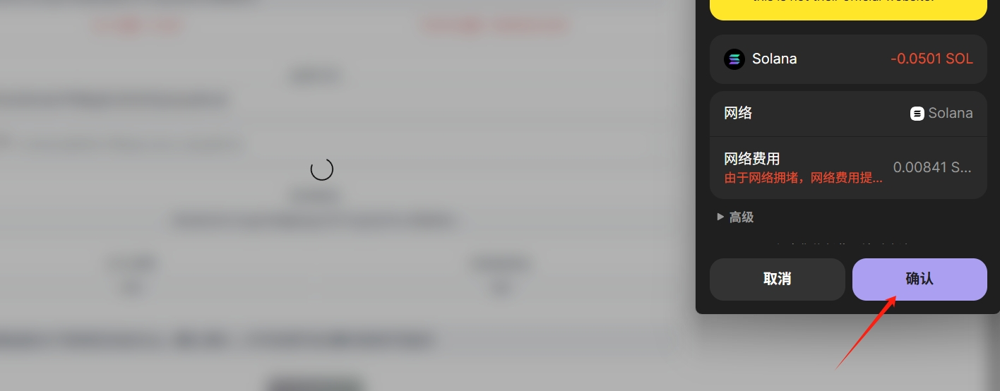

# Solana提取手续费教程

## **Solana提取手续费概念解读**

#### **1、哪些代币支持提取手续费？**

目前只有Solana Token2022的代币（税率代币）支持手续费提取，其他代币不支持

#### **2、为什么要手动提取手续费？**

Token2022代币的税率不是实时到账的，它是累计存储在某个地方，需要通过提税地址去手动提取才可以获得。

#### **3、哪些地址可以提取手续费？**

只有创建代币时填写的`提税地址`可以提取手续费，其他地址包括代币的权限地址均无法进行该操作

## **Solana提取手续费教程**

步骤1：打开PandaTool并链接钱包

步骤2：选择代币（输入代币地址）

步骤3：点击提取，钱包确认

### 1、进入提税页面并连接钱包

首先，我们需要进入提税工具的网页：[https://solana.pandatool.org/zh/taxClai](https://solana.pandatool.org/zh/taxClaim) 右上角连接钱包

<figure><figcaption></figcaption></figure>

此时会跳出Phantom钱包，点击进行连接。成功连接后，右上角会出现钱包地址，操作页面也会自动识别出钱包地址

<figure><figcaption></figcaption></figure>

### 2、选择代币

识别出地址后，我们需要选择代币。PandaTool会自动识别出您钱包内的Token2022代币，您需要选中要提取税率的代币

<figure><figcaption></figcaption></figure>

选择代币后，PandaTool将自动分析出该代币的税率、提税地址以及可以提取的手续费数量

<figure><figcaption></figcaption></figure>

### 3、立即提取

确认好提取的信息无误之后，我们点击立即提取，此时会跳出钱包，点击确认即可

<figure><figcaption></figcaption></figure>

## **Solana提取手续费疑问解答**

**1、非提税地址可以提取手续费吗？**

* **答：**&#x4E0D;可以，手续费只能提税地址操作，其他地址无法操作

**2、手续费时间长不去提，会消失吗？**

* **答：**&#x5B8C;全不会，它会一直存储在那里

**3、不是PandaTool创建的代币，也可以用这个工具提取税收吗？**

* **答：**&#x6CA1;有问题，只要是Token2022代币，不管是在哪里创建的都可以提取税收

**4、提税需要费用吗？**

* **答：**&#x76EE;前单次提取的费用是0.05SOL。您可以将手续费累积到一个数量后，统一提取

如果您对提取Token2022的手续费还有什么问题，可以进入Telegram电报群找志愿者解答： [https://t.me/pandatool](https://t.me/pandatool)
