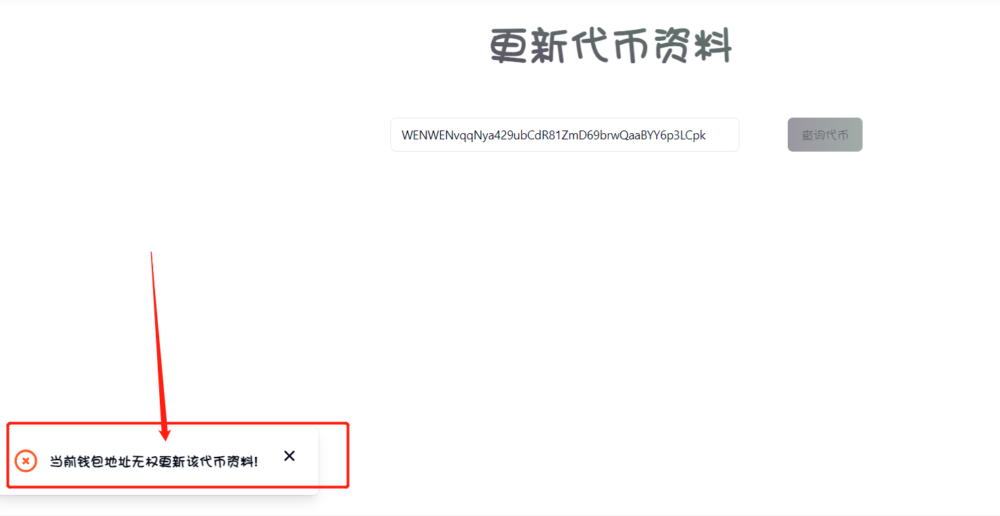
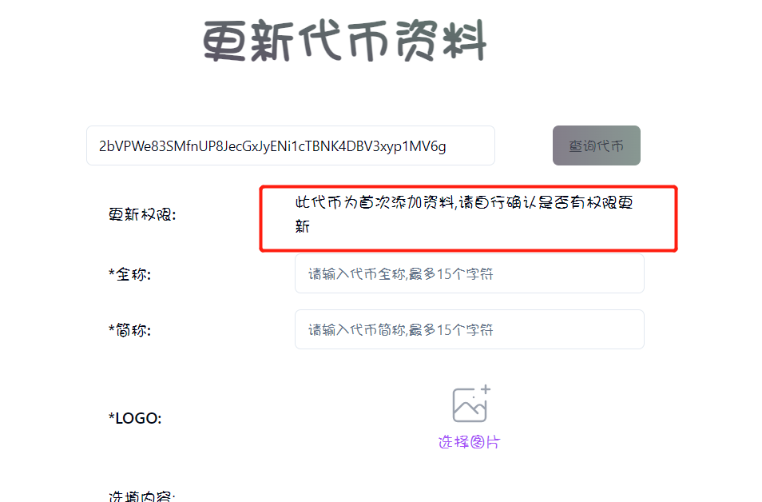
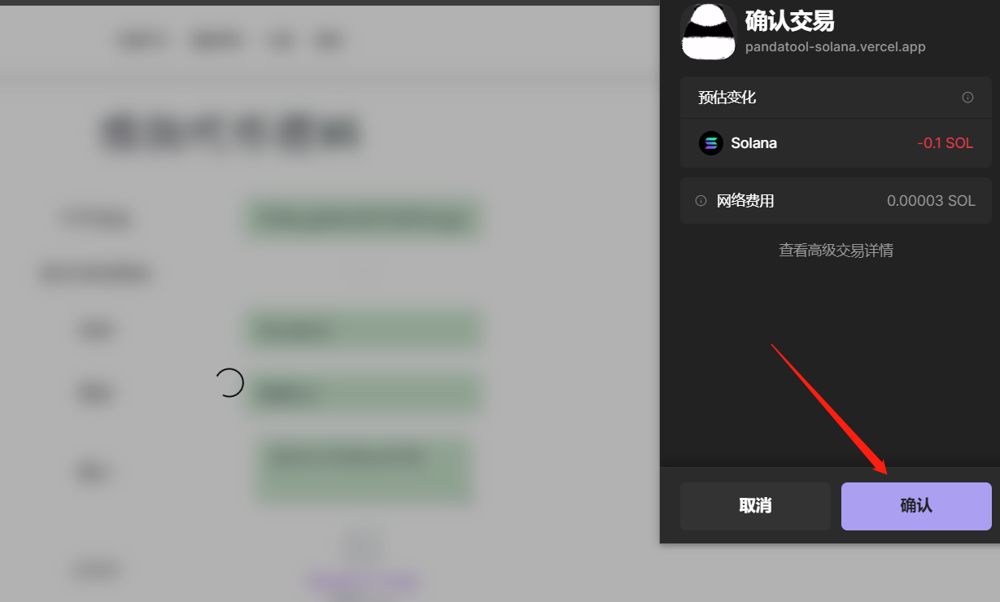
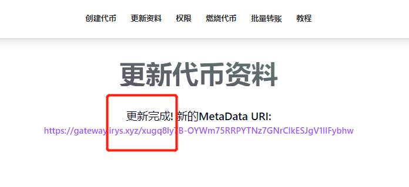
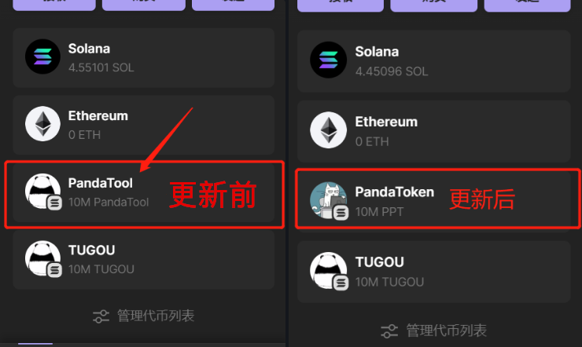

# Solana更新代币资料

和以太坊、币安链不同，Sol发币之后，依然可以修改代币名称、头像、推特链接、网址等信息。如果你想更换代币logo，或者增加/删除一些链接，就可以通过该工具完成。

### 第一步：判断更新权限

首先，打开网页[https://solana.pandatool.org/upload](https://solana.pandatool.org/upload)，右上角先连接上钱包，然后输入代币合约地址，点击查询后，可能会有三种展示结果：

#### 1.当前钱包无权更新代币地址

<figure><figcaption></figcaption></figure>

出现该提示的原因是，你右上角连接的钱包没有该地址的更新权限。 也许是你连接错了钱包，或者输错了地址。如果出现这个提示，需要你仔细核查一下钱包或者合约是否错误。

#### 2.此代币为首次添加资料,请自行确认是否有权限更新

<figure><figcaption></figcaption></figure>

该提示的意思是说，这个代币之前没有上传过logo，也没有代币名字，是一个没有任何资料的处女币。针对这个处女币，我们很难判断其是否有权限。如果你觉得自己有权限，就可以在下方填写资料，进行更新。如果你有权限，最后更新资料的时候，会弹出钱包，确认更新。如果你没有权限的，那么在提交资料的时候，是无法提交的。

总得来说，出现这个提示的时候，可以试着更新一下看看。

#### 3.当前钱包地址可更新资料

<figure><figcaption></figcaption></figure>

该提示是说明，你的钱包具有更新代币资料的权限，可以自行填入、修改、增删代币信息。我们这个教程，主要是教大家进行这方面的修改。

### 第二步：更新代币资料

在搞定权限问题后，我们按照要求填写代币更新后的全称、简称、头像等，具体如下：

* **全称：**更新后的代币全称（最多15个字符）
* **简称：**更新后的代币简称（最多15个字符）
* **logo：**上传最新的代币logo（图片小于100k，尺寸建议256x256像素）

**选填内容**

* **官网链接：**不填，更新后就没有网址。填了，就以这次填的为准
* **Telegram群组：**不填，就更新后没有电报。填了，就以这次填的为准
* **Twitter链接：**不填，就更新后没有推特。填了，就以这次填的为准
* **Discord链接：**不填，就更新后没有Discrod。填了，就以这次填的为准
* **简介：**不能超过200个汉字（或200个英文字母）
* **标签：**最多支持5个。默认会给你写5个，觉得哪个不合适，直接删掉自己创建一个就可以

例如按照以下方式填写：

<figure><figcaption></figcaption></figure>

确认无误后点击“更新资料”的按钮，然后会弹出钱包，确认支付费用（大概0.1sol），几秒钟后即可完成更新

<figure><figcaption></figcaption></figure>

等待几秒钟，会给你一个提示显示更新完成。（注意：如果你被扣费了，但是却提示你没有更新成功，这有可能是前端提示错误。**不要**点击重试，先去Solana浏览器搜一下合约地址看看是不是更新了。一般来说，**扣费成功就说明资料更新**了，那个提示就不要管了了）

<figure><figcaption></figcaption></figure>

大家可以发现，在钱包里，代币的logo和名称都不一样了

<figure><figcaption></figcaption></figure>

通过浏览器查询，同样可以发现变化。在合约地址不变的情况下，网址、标签均发生了改变，推特/电报由于没有填写，也消失了：

<figure><figcaption></figcaption></figure>

* **注意：**代币资料更新，理论上可以无限次更新。但是为了项目的长久运行，建议大家谨慎操作

有任何问题可以进电报群找志愿者咨询：[https://t.me/pandatool](https://t.me/pandatool)
