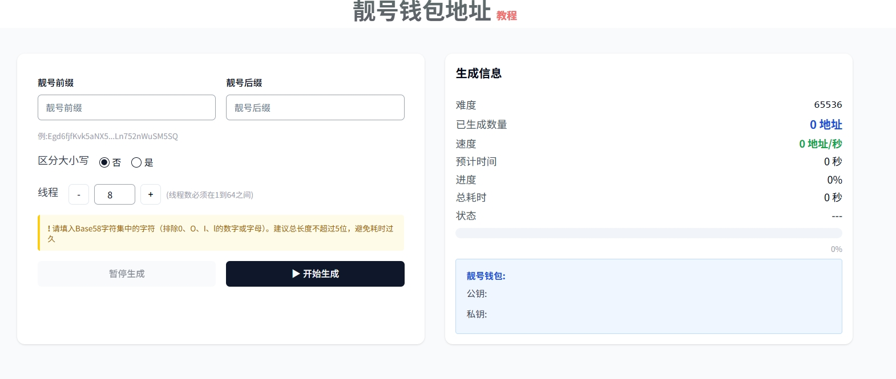
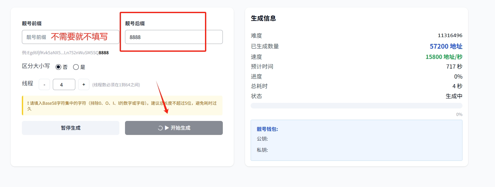

# Solana靓号钱包地址生成教程

## 一、**靓号地址概念**

### **1、什么是Solana地址靓号？**

* 在Solana等区块链上，地址通常是 Ed25519 算法生成的 32 字节公钥哈希（如 `RedGJbeNejUtP6vMEPDkG55yRf7oAbkMFGeDjXaNfe1`）。靓号地址则是通过不断尝试生成满足特定前缀（或后缀、包含某段字符等）规则的地址，比如`666Egd6fjfKvk5aNX5...Ln752nWuSM5SQ8888`

### **2、Solana靓号有什么特点？**

* **可读性更强**：地址里包含用户名、品牌名或易记的数字/字母组合。
* **识别度高**：在社交媒体、名片、官网等场景中，能提升品牌或个人的辨识度。
* **“面子”效应**：在链上公开地址里拥有“靓号”，也是一种身份或地位的象征。
* **多链一致性**：通过 CREATE2 类似机制（如 Solana 的派生地址），可在不同链部署相同地址的合约，简化跨链集成
* **技术象征**：体现开发者对链上机制的掌握，提升社区信任度

<figure><figcaption></figcaption></figure>

## **二、Solana靓号生成流程**

1、打开PandaTool

2、断开网络

3、输入前缀和后缀

4、区分大小写

5、选择线程

6、开始与停止

7、保存私钥


我们不会存储私钥，请您自行保管，丢失后无法找回！！！

我们不会存储私钥，请您自行保管，丢失后无法找回！！！

我们不会存储私钥，请您自行保管，丢失后无法找回！！！


## **三、创建Solana靓号详细教程**

创建Solana靓号地址，我们一般需要PandaTool这样的免费第三方工具来完成。

### **1、打开PandaTool**

首先，我们在手机或者电脑上打开PandaTool，找到专门用于生成靓号合约的工具页面：[https://solana.pandatool.org/vanityAddress](https://solana.pandatool.org/vanityAddress)

<figure><figcaption></figcaption></figure>

### **2、断开网络**

进入PandaTool之后，请立即关闭WiFi或拔掉网线，使整个操作在断网情况下完成。因为在断开网络、“空气隔离”（air‑gapped）的环境下生成靓号地址，可以最大程度地降低私钥被窃取或外泄的风险。

### **3、前缀与后缀**

创建的靓号地址，主要体现在地址的`前缀`和`后缀`两个地址。一般会采用连号，或者特殊的尾号来彰显，如尾号是pump、bonk的地址，或者前缀为8888的地址等等。


需要注意的是，填写的字符越多，生成难度越大，所需时间越久


### **4、是否区分大小写**

如果您填写的后缀是字母的话，要确定是否区分大小写。如您输入的是**pump**，那么：

* **区分大小写：**&#x5219;只生成尾号为**pump**的钱包地址
* **不区分大小写：**&#x5219;会生成尾号为Pump、PUMp、pUMp等钱包地址
* 很显然，不区分大小写，会更容易生成

### **5、选择线程数**

所谓的“线程”（thread），就是指并行执行密钥对生成和前缀匹配任务的独立执行单元。

* 单线程环境下一次只能尝试生成并校验一个公钥，对CPU 利用率低，速度慢；
* 多线程可以让程序在**多核 CPU** 上并行工作，大幅提高每秒尝试次数，缩短搜索时间。


需要注意的是，选择的**线程数越大**，生成靓号的速度就会越快，但同样的，**电脑就会越卡**。


### **6、开始生成/停止**

确定上述填写的信息无误后，我们点击**开始生成**按钮，如下图所示：

<figure><figcaption></figcaption></figure>

### **7、保存私钥**

创建好的靓号私钥属极高安全级别的敏感信息，保存不当将导致资产被盗。地址创建成功后，将私钥手动誊抄在某张纸上，备份放在家中保险箱或银行保管箱等不同安全地点，或者打印在防火纸／刻钢板上。切记，不可在联网的环境中打开或者私钥。

## **四、疑问解答**

**1、创建靓号钱包地址要收费吗？**

* **答：**&#x4E0D;收费，该工具对PandaTool来说只是一个引流工具，不会收取费用

**2、生成的靓号钱包私钥安全吗？**

* **答：**&#x81F3;少PandaTool是无法获取的，因为整个操作都是您的设备在本地完成的，不联网的情况下，任何人无法获取。

**3、使用工具，需要注意什么？**

* 首先是设备，要用自己的手机或者电脑，不要用其他人的
* 其次是环境，要断开网络，不要进行任何形式的联网
* 然后是周边环境，是否有摄像头？是否有旁人观察等等
* 最后是保存，私钥以加密或者物理的形式保存，切记保存在网络上

当然，如果您在生成靓号钱包时还有什么其他问题，可以加入PandaTool的志愿者群询问：[https://t.me/pandatool](https://t.me/pandatool)

