# BlueMove创建AMM流动性资金池教程

BlueMove是一款基于 Aptos 和 Sui 区块链构建的应用程序，为用户提供 NFT交易、DEX等功能。最初，它只是一个多链NFT市场，后面逐步拓展到集DEX、Bridge为一体的综合应用程序。

值得注意的是，BlueMove也是Sui区块链上为数不多的支持AMM的去中心化交易所，所以PandaTool建议大家可以在这里创建流动性。

<figure>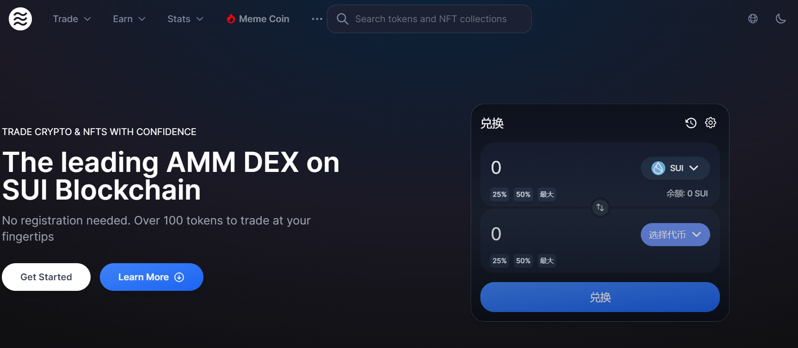<figcaption></figcaption></figure>


注意：本文仅作为教学演示，所涉及到的资金池和代币均**没有任何实际价值**，大家也不要进行任何形式的交易。如果因此造成资金损失，PandaTool无法对此负责


## 一、创建流动性资金池

### 1、连接钱包

所有的链上操作第一步都是连接钱包，以识别你的地址。我们打开BlueMove的官网：[https://dex.bluemove.net/](https://dex.bluemove.net/) ，点击右上角[**连接钱包**](https://dex.bluemove.net/connect-wallet)按钮

<figure><figcaption></figcaption></figure>

点击之后，会弹出提示让你选择钱包，我们可以选择Suiet

<figure><figcaption></figcaption></figure>

之后会弹出钱包让你确认，点击继续连接就可以了（如果没有弹出钱包，看一下是不是钱包上锁了）

<figure>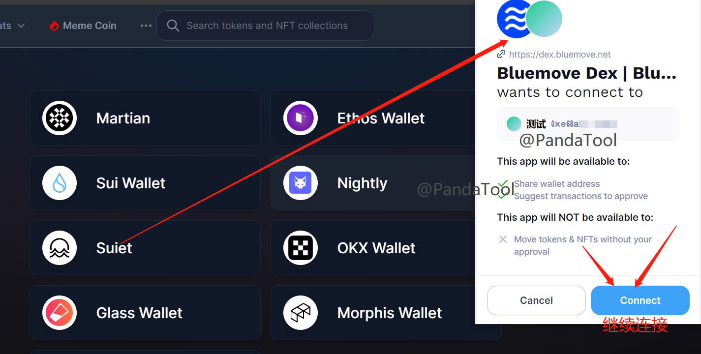<figcaption>
连接钱包
</figcaption></figure>

和所有的DAPP一样，连接成功后右上角会出现钱包地址

<figure>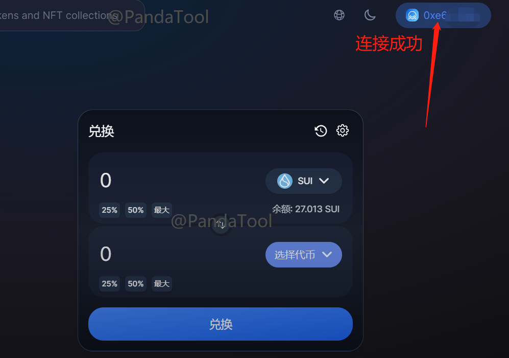<figcaption>
钱包连接成功
</figcaption></figure>

### 2、找到资金池

我们在首页找到Pools点击进入，直接通过链接进入：[https://dex.bluemove.net/pool](https://dex.bluemove.net/pool)

<figure>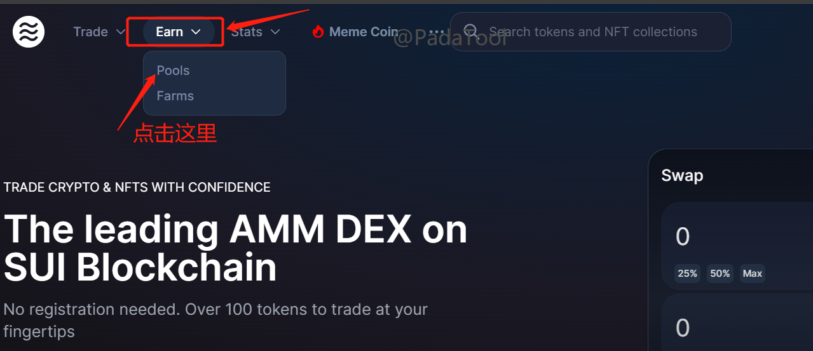<figcaption></figcaption></figure>

之后会进入到流动性管理页面，在这个页面你可以看到自己的流动性情况

<figure><figcaption></figcaption></figure>

我们创建资金池的话，就点击Creat a pool，然后进入到代币选择页面

### 3、确认交易对

左边一般就选择Sui或者USDC、USDT这些，右边就是我们自己发行的土狗币，通过合约地址进行搜索

<figure>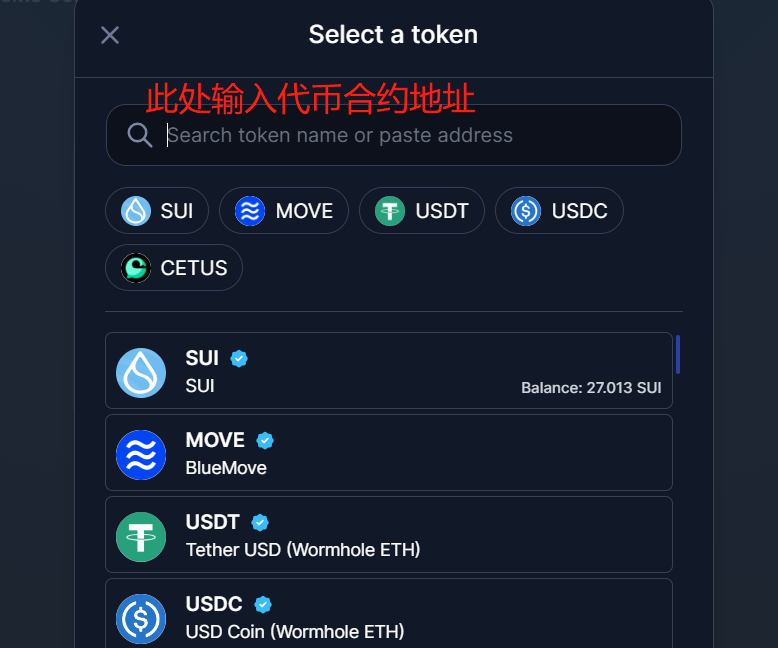<figcaption>
搜索代币
</figcaption></figure>

例如我选择用Panda这个币添加流动性，大概就是下面这样

<figure>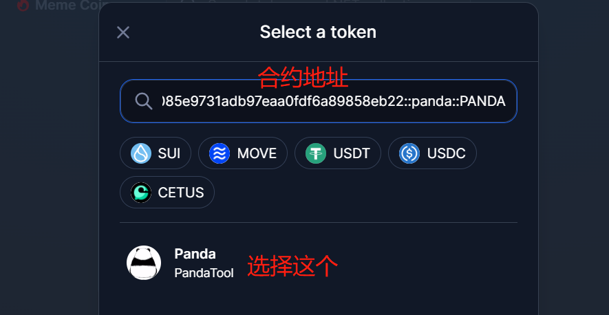<figcaption></figcaption></figure>

### 4、设定初始价格

确认代币交易对之后，下面我们需要输入各个代币的数量与比例

<figure>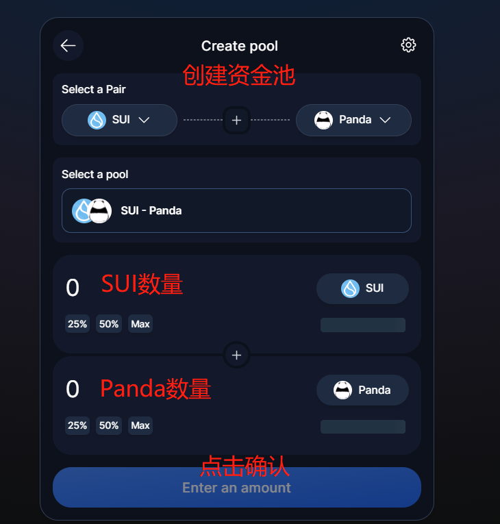<figcaption></figcaption></figure>

创建池子的初始数量和比例，决定了代币的上线价格。例如我加入10SUI和100000000个Panda币，那么代币的上线价格就是10÷100000000=0.0000001SUI。假设SUI的价格是1.8U，那么Panda代币的价格就是：0.0000001 x 1.8 =0.00000018U（注意：该说法仅作为演示，本文涉及到的代币没有任何实际价值）

<figure>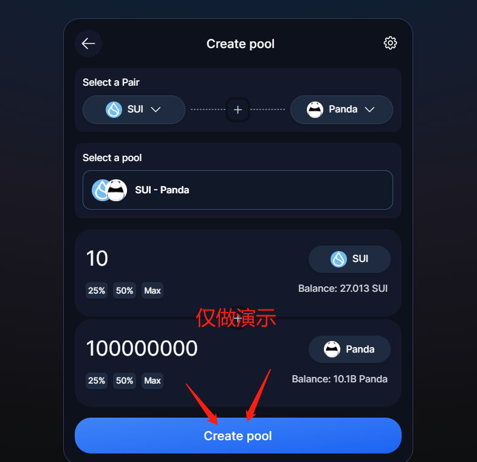<figcaption></figcaption></figure>

确定自己输入的代币数量和SUI数量无误后，点击Creat Pool，此时会弹出钱包让你确认

<figure>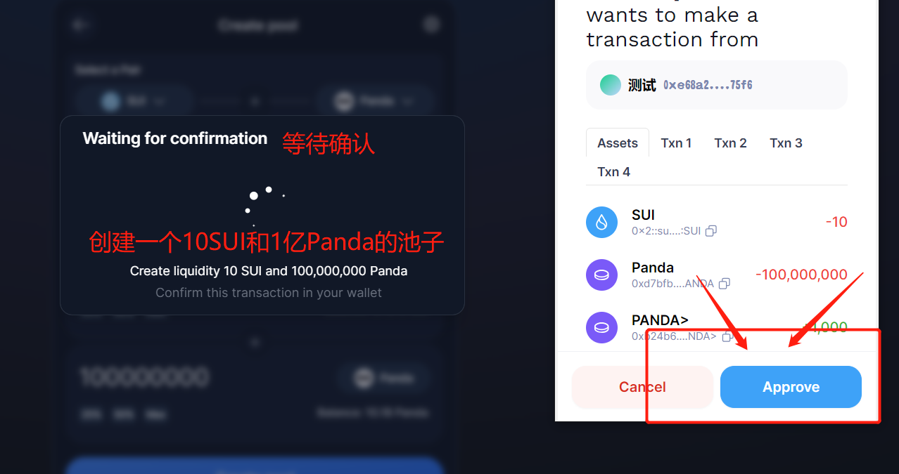<figcaption></figcaption></figure>

点击Approve之后，等待几秒钟就会有提示告诉你池子创建完成了

<figure>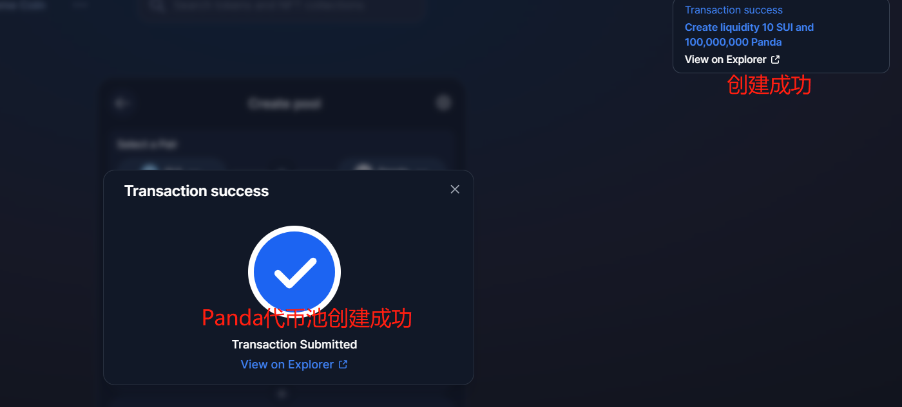<figcaption></figcaption></figure>

### 5、进行代币交易

正常来说，我们在BlueMove做了池子后，就可以在BlueMove的首页进行交易了。但是这个平台不知道遇到什么问题了，加了池子无法交易。因此，我们只能选择另一个平台交易：FlowX

我们打开官网：[https://flowx.finance/trade/swap](https://flowx.finance/trade/swap)  ，右上角连接钱包

<figure>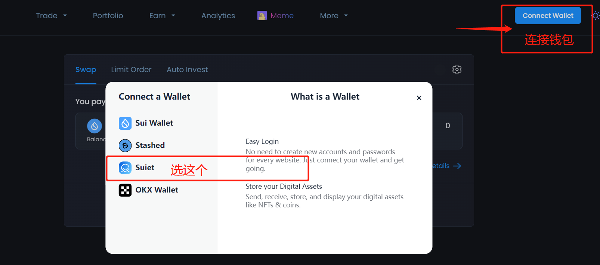<figcaption>
FlowX连接钱包
</figcaption></figure>

之后我们选择代币进行交易

<figure>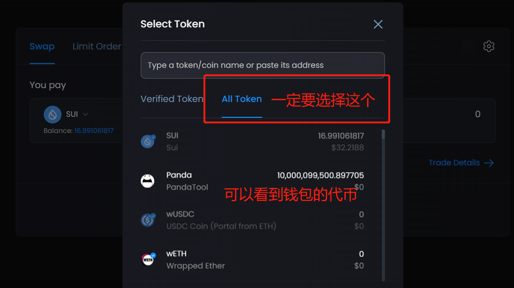<figcaption></figcaption></figure>

之后填写代币的交易数量，点击swap确认即可

<figure>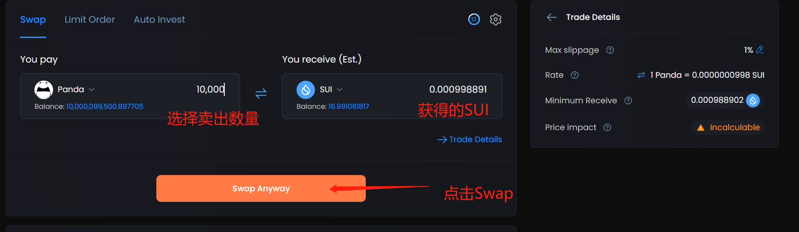<figcaption></figcaption></figure>

<figure>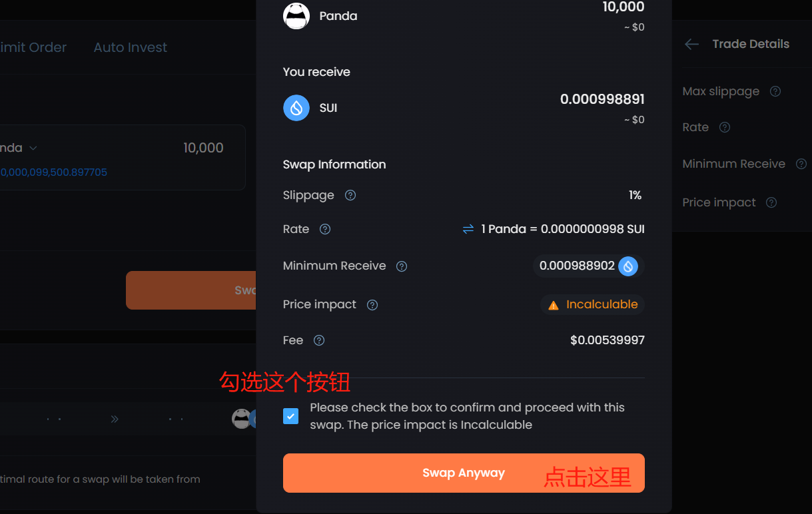<figcaption></figcaption></figure>

最后会跳出钱包进行确认授权，并进行代币支出

<figure>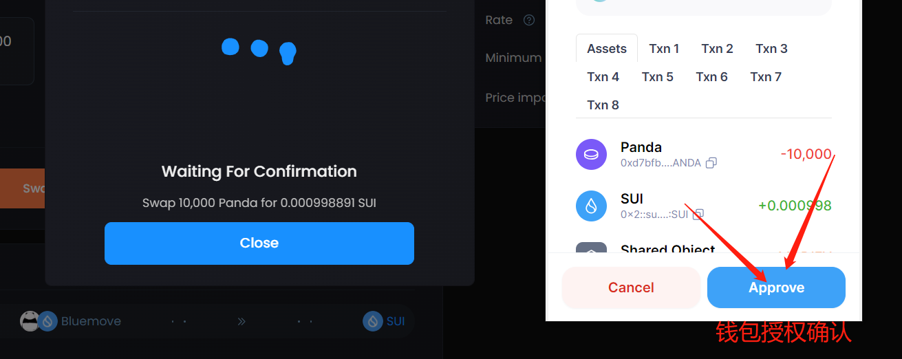<figcaption></figcaption></figure>

最后交易就完成了

<figure>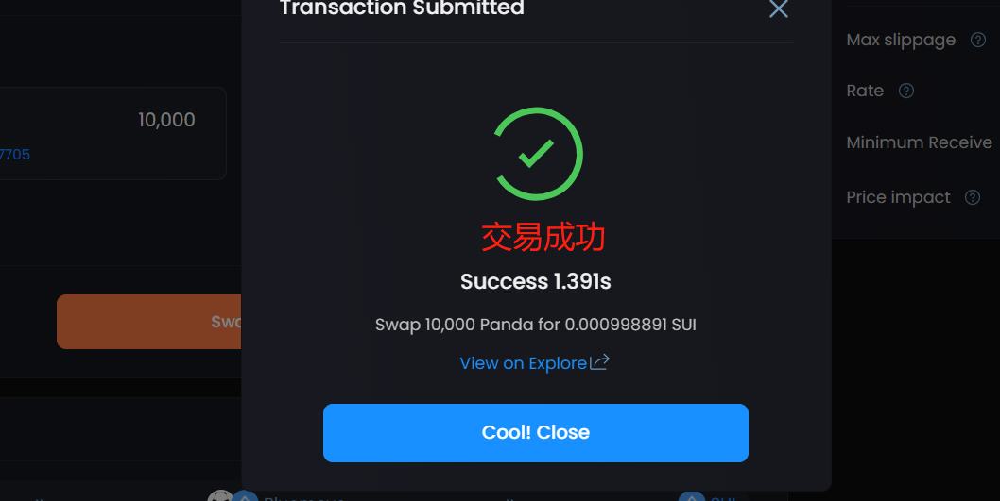<figcaption></figcaption></figure>

到这里，创建池子以及交易的流程就介绍完了

## 二、添加与撤出流动性

创建了池子后，如果我们想继续加池子怎么办呢？如果想撤池子怎么办呢？其实也很简单，我们进入BlueMove的流动性管理页面：[https://dex.bluemove.net/pool](https://dex.bluemove.net/pool) ，就能看到自己加的池子

<figure>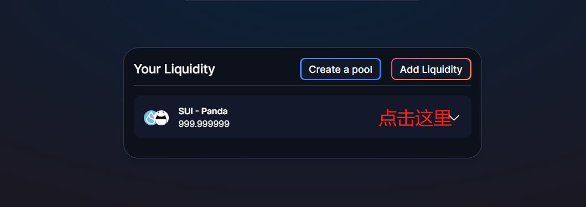<figcaption></figcaption></figure>

之后我们可以选择加池子（增加流动性）或者撤池子（移出流动性）

<figure>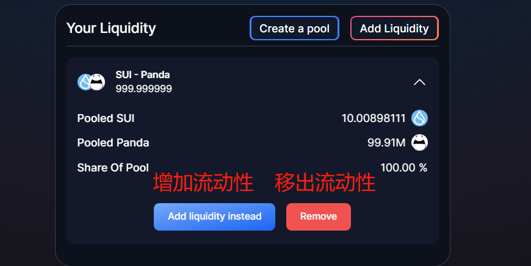<figcaption></figcaption></figure>

### 1、增加流动性

点击Add liquidity Instead后，按照当前的价格与比例进行添加流动性

<figure>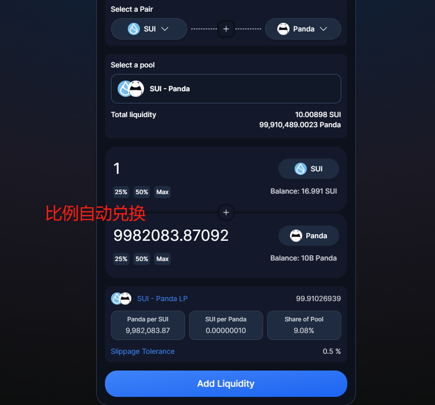<figcaption></figcaption></figure>

之后点击Add Liquidity，会跳出钱包进行确认。授权后，即可完成添加

<figure>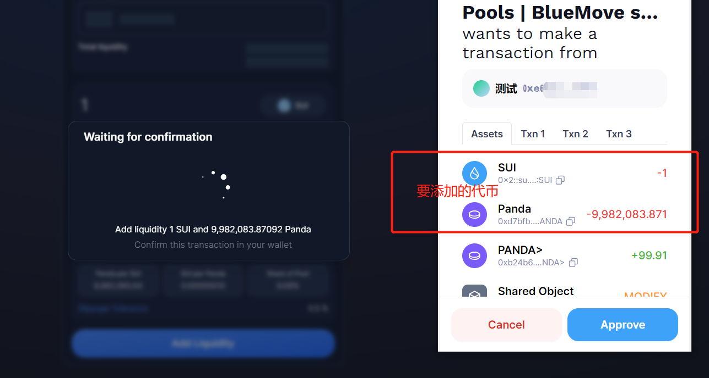<figcaption></figcaption></figure>

如果流动性添加成功，会出现以下提示（请确保自己钱包内的代币足够添加）

<figure>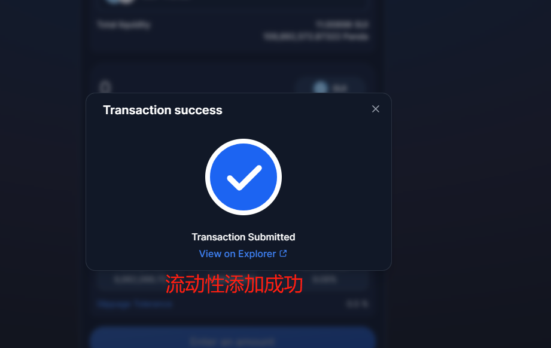<figcaption></figcaption></figure>

### 2、撤出流动性

撤出流动性或者说移出流动性其实也很简单，在[流动性管理](https://dex.bluemove.net/pool)页面点击Remove，会跳出移除页面

<figure><figcaption></figcaption></figure>

我们可以根据自己的需要选择要移出的流动性比例，从1%到100%都可以选择。确定好比例之后，点击Remove Liqiudity，会跳出钱包进行确认

<figure><figcaption></figcaption></figure>

点击钱包的Approve按钮，等待几秒钟后，即可完成流动性的撤出

<figure>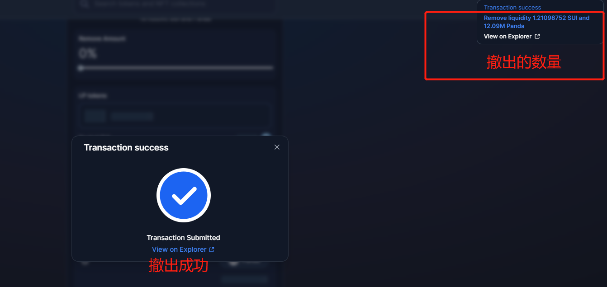<figcaption></figcaption></figure>

至此，我们关于BlueMove的加池子、撤池子教程，就算是介绍完毕了。教程写的很详细，大家仔细看都能学会，接下来教大家烧池子（锁LP）

## 三、烧毁池子LP（锁池子）

锁池子的概念其实并不复杂，就是将Lp转移到某个地址不能取出，从而向用户证明自己不能撤池子了。如果是在BSC链，可以带时间锁，到时间就取出。但是在Sui链上，只能通过烧池子的方式完成。池子烧了之后，就不能再撤池子，永久不能撤了。

就以Cetus这个交易所来说，他们提供了烧池的入口，方便快捷。我们进入流动性管理页面：[https://app.cetus.zone/pool/position/](https://app.cetus.zone/pool/position/) ，找到 Lp Burn按钮，点击进入

<figure>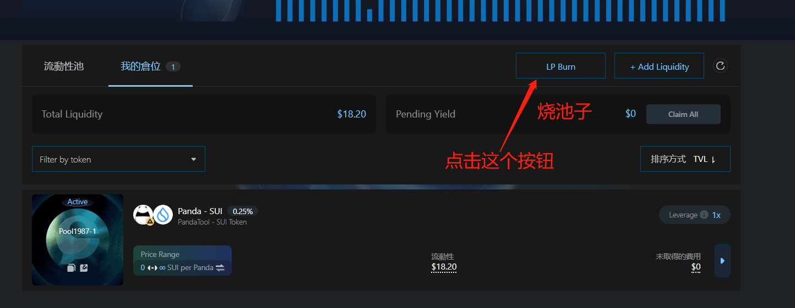<figcaption></figcaption></figure>

在新的页面勾选您要锁的流动性，然后点击Lock Liquidity，钱包确认即可

<figure>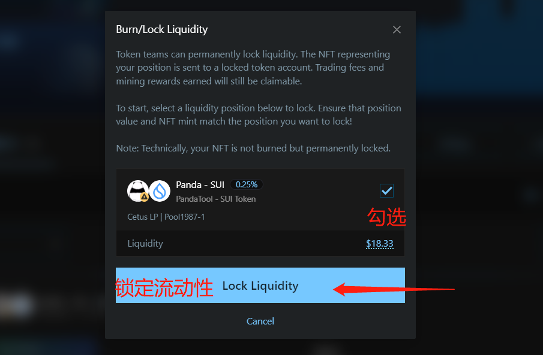<figcaption></figcaption></figure>

注意，流动性是永久锁定，且无法取回，是一个不可逆的操作。一旦完成锁定，将无法撤出该部分池子，请谨慎处理。

## 四、疑问解答

1、创建资金池的时候出现以下错误该怎么办？

<figure>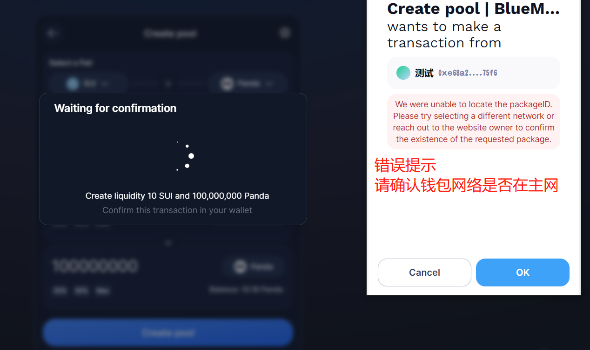<figcaption></figcaption></figure>

* 答：出现这个问题的原因在于钱包网络不在主网，将其切换到主网mainnet就可以了

2、BlueMove创建池子要收费吗？

* 答：根据实际操作经验来看，在BlueMove创建池子不收取费用

3、为什么在BlueMove创建的资金池不能在他的平台交易

* 答：这确实是一个令人困惑的问题，经过我们查验，该问题主要是由于他的前端Bug导致的，只能等BlueMove那边自己修复了

如有大家还有不明白或者不清楚的地方，请加入官方电报Telegram群：[https://t.me/PandaTool](https://t.me/PandaTool)

