# Cetus创建集中流动性资金池教程

Cetus是SUI区块链生态里最大的去中心化交易所DEX，使用类似于Uniswap V3的算法构建集中性流动性CLMM协议和一系列附属功能，为DeFi用户提供最佳的交易体验和更高的资金效率。

和传统的AMM不同，Cetus 加入了集中流动性的概念，让流动性提供者可以在定制化价格范围内，策略性地分配其资产。这项创新可以大幅度地减少传统AMM池中流动性利用不足的情况，还可以提高效率，并且为流动性提供者大幅提高费用，与PancakeSwap V3、Uniswap V3类似。

<figure><figcaption></figcaption></figure>


注意：本文仅作为教学演示，所涉及到的资金池和代币均**没有任何实际价值**，大家也不要进行任何形式的交易。如果因此造成资金损失，PandaTool无法对此负责


## 一、创建集中流动性资金池

在Cetus无法创建AMM资金池，只能创建CLMM资金池。

### 1、连接钱包

连接钱包是所有操作的第一步，老手可以直接忽略。我们打开Cetus的官网：[https://app.cetus.zone/](https://app.cetus.zone/)，点击右上角**连接钱包**按钮

<figure><figcaption></figcaption></figure>

之后会弹出一些钱包让你选择，PandaTool推荐选择Suiet钱包，点击连接即可

<figure><figcaption></figcaption></figure>

<figure><figcaption>
点击连接
</figcaption></figure>

连接成功后，我们能在右上角看到钱包地址。之后我们点击左上角的**Earn**按钮，找到**Pools**，进行加池操作

<figure>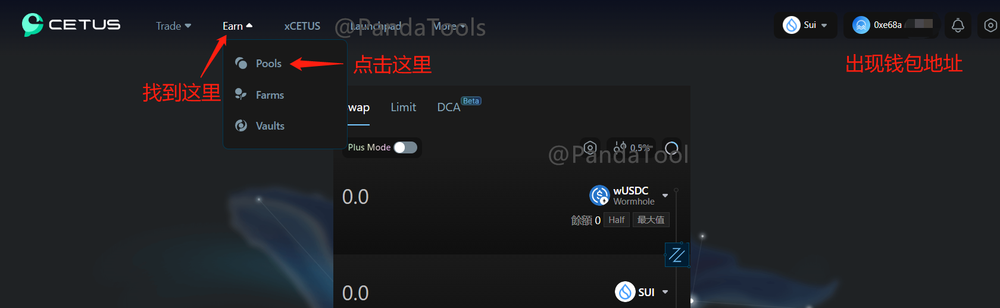<figcaption></figcaption></figure>

### 2、找到交易对

当然，除了从首页进入以外，我们也可以直接点击链接进入资金池：[https://app.cetus.zone/pool/list](https://app.cetus.zone/pool/list)  ，在页面的中间位置点击**Create Pool**

<figure>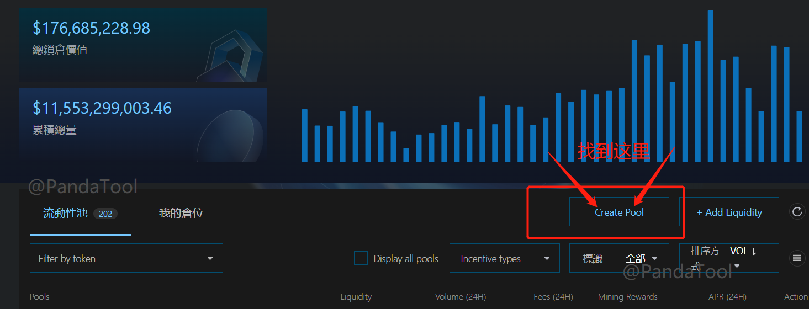<figcaption></figcaption></figure>

进入我们进行代币选择页面，左边一般是自己发行的土狗币，右边是SUI

<figure>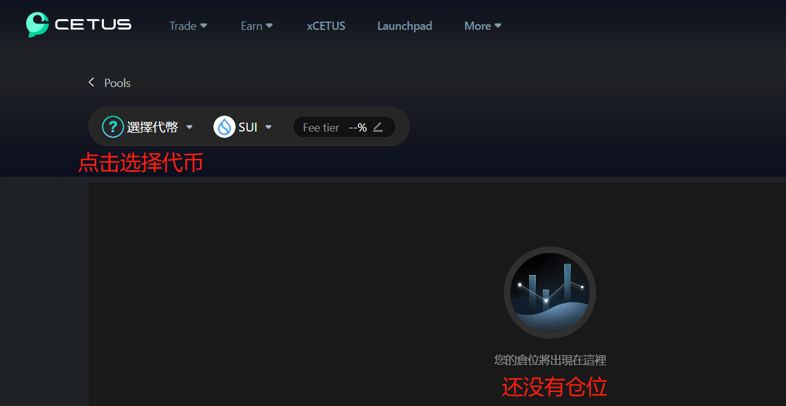<figcaption></figcaption></figure>

<figure>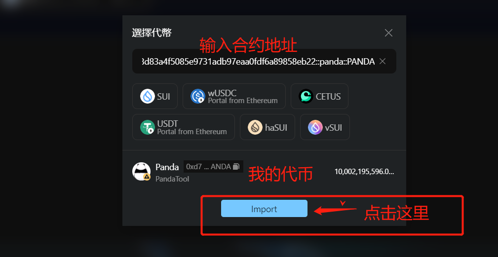<figcaption></figcaption></figure>

当我们通过合约地址找到自己发行的代币之后，点击Import，会有一个风险提示，大意就是说：

> 该代币不在频繁交易列表中。请注意，任何人都可以在 Sui 区块链上以任何名称创建代币，包括创建现有代币的假版本或声称代表没有代币的项目的代币。交易前务必进行自己的研究。

这个提示基本上每个土狗币都有，不用担心也不用在意，直接勾选继续下一步就行了

<figure>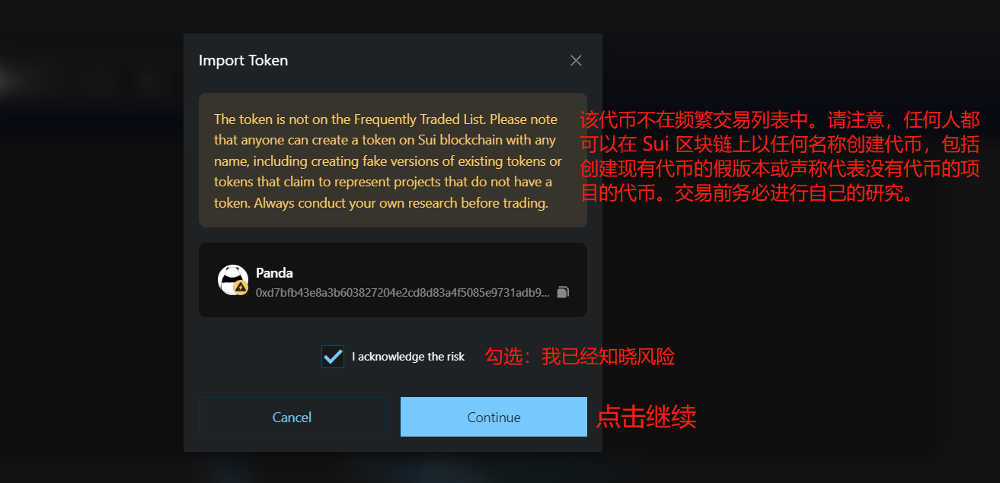<figcaption></figcaption></figure>

确定交易对之后，我们选择交易费率，也就是我们通常理解的交易滑点

<figure>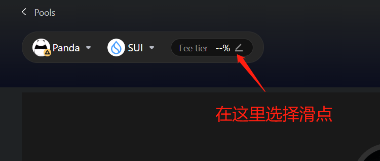<figcaption></figcaption></figure>

一共有4个选择，分别是：0.01%、0.05%、0.25%、1%。这个滑点越大，意味着交易摩擦成本越高，但是也越容易成交。像稳定币，价格波动低的，可以选择0.01%、0.05%。正常的土狗币，推荐选择**0.25%和1%**。因为土狗币交易不频繁、不稳定，滑点大一点有助于交易顺利完成

<figure>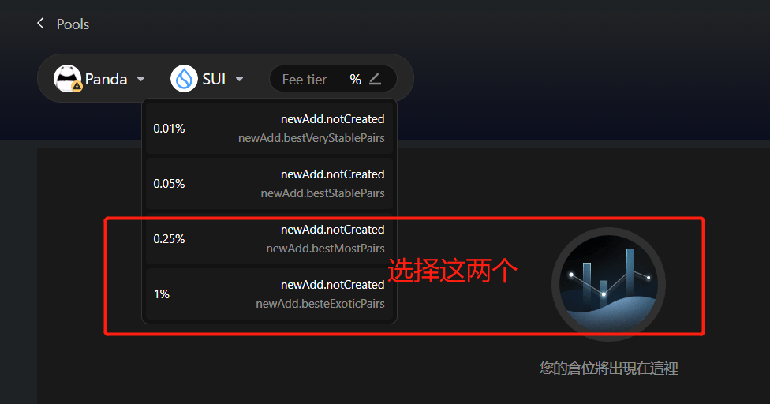<figcaption></figcaption></figure>

### 3、设置并创建资金池

当我选择一个滑点（0.25%）之后，我们就可以进行下一步配置了

首先需要给一个初始上线价格，这个价格是基于SUI的，即：1个土狗币=多少SUI

<figure>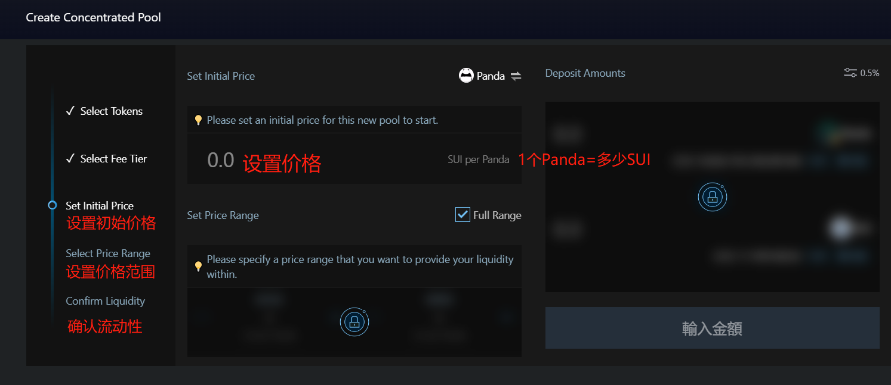<figcaption></figcaption></figure>

假设我设置价格为：0.0000001SUI，它的意思就是：代币上线的价格是1Panda=0.0000001SUI。之后我们进入下一步，设置价格范围

<figure>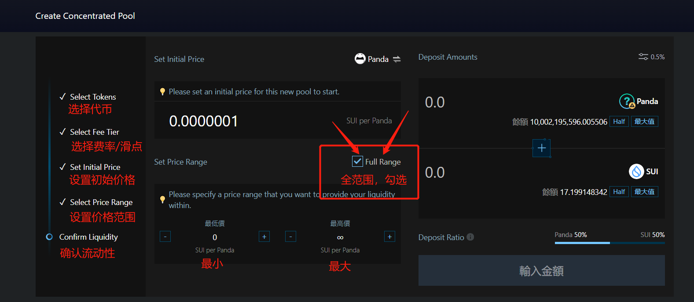<figcaption></figcaption></figure>

如果你不太了解这个价格范围是啥意思，就把**Full Range勾选上**。

> Full Range：全范围的意思。代币价格波动没有上限和下限，可以根据用户需求随时交易。

之后，我们填写要加池子的金额。例如，我选择加10个SUI，交易所会自动给我配对1亿个左右的Panda，确认数量后，点击n**ewAdd**按钮即可

<figure>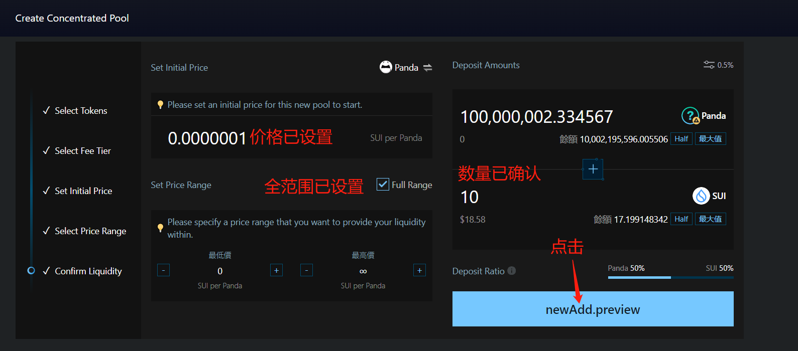<figcaption></figcaption></figure>

之后会弹出提示，让你确认创建资金池，我们点击按钮

<figure>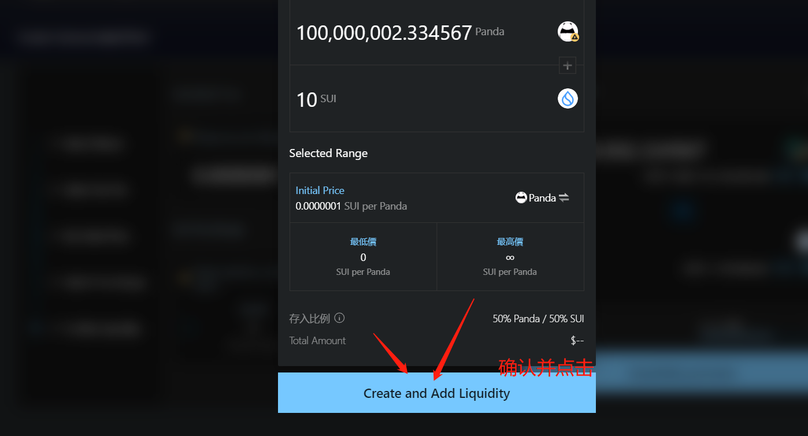<figcaption></figcaption></figure>

最后会弹出钱包让你进行确认，点击Approve就可以了

<figure>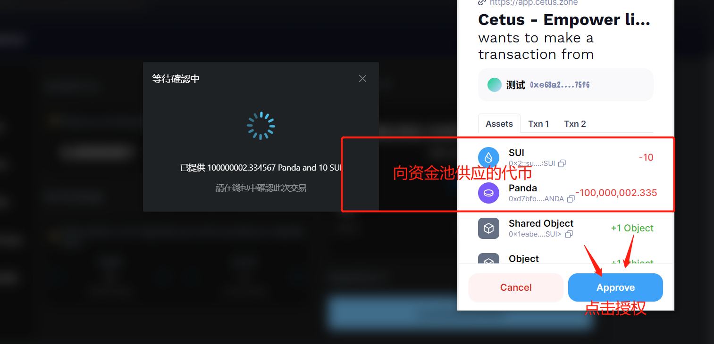<figcaption></figcaption></figure>

如果资金池创建成功了，会有下面这个提示

<figure>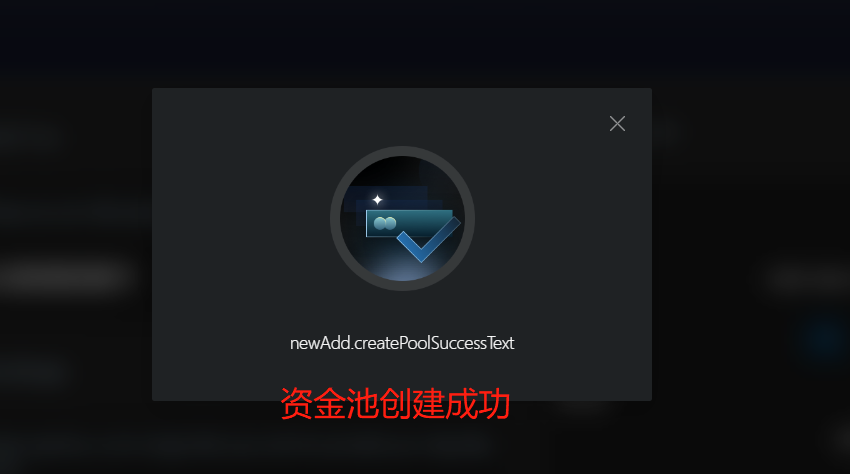<figcaption></figcaption></figure>

到这里，资金池创建就完成了，我们试一下交易

### 4、交易代币

我们回到Cntus的官网首页：[https://app.cetus.zone/](https://app.cetus.zone/) ，在交易对那里输入Panda的合约地址，进行一笔500万的代币卖出

<figure>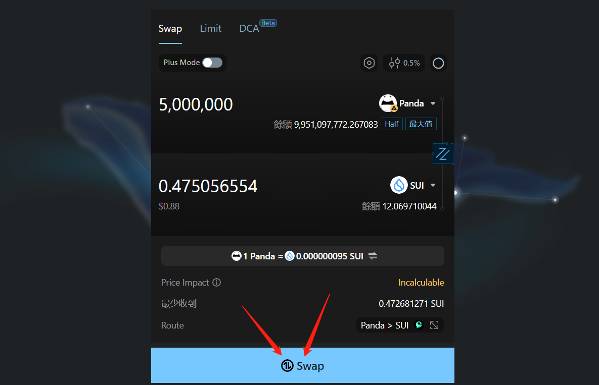<figcaption></figcaption></figure>

点击Swap，钱包确认后，即可完成交易

<figure>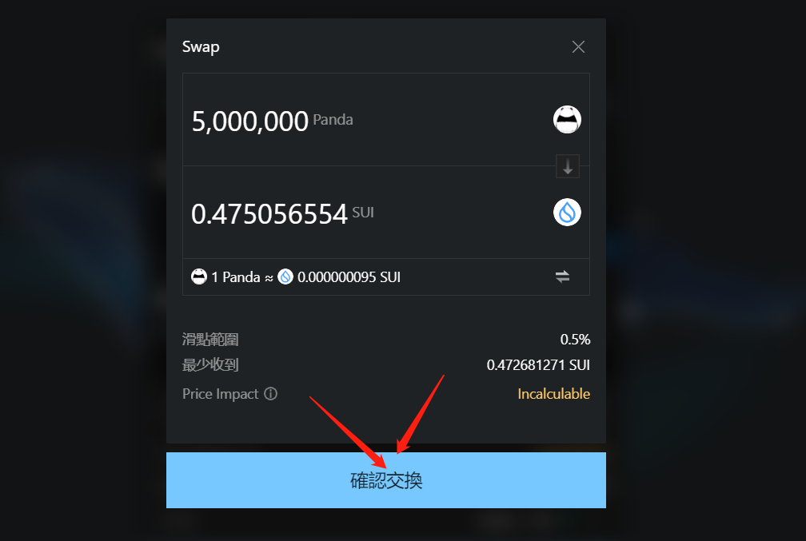<figcaption>
确认交易
</figcaption></figure>

<figure>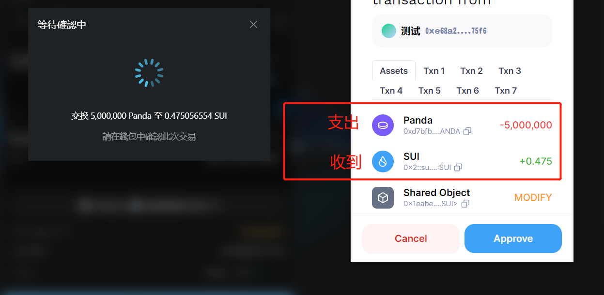<figcaption>
钱包确认交易
</figcaption></figure>

等待几秒钟，页面会有提示，就说明交易成功了

<figure>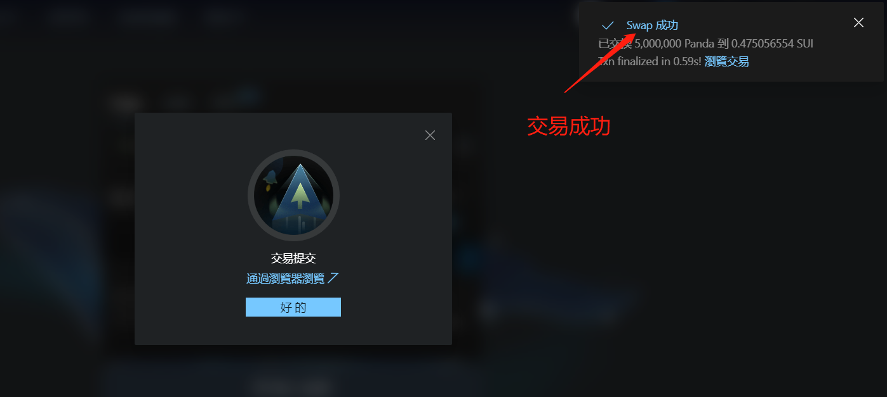<figcaption></figcaption></figure>

## 二、增加与撤出流动性资金池

池子创建成功后，接下来我们看怎么增加流动性与撤出流动性，即所谓的：加池子与撤池子。

首先我们要做的是找到自己的流动性，在Cetus的流动性管理页面，点击**我的仓位，**找到自己的流动性：[**https://app.cetus.zone/pool/position**](https://app.cetus.zone/pool/position)

<figure>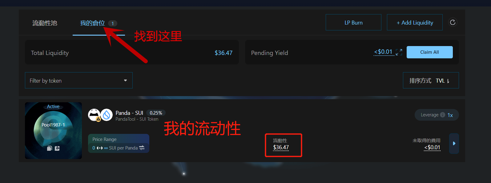<figcaption></figcaption></figure>

之后我们点击最右边的小按钮，这个按钮不太好找，请注意下图位置

<figure>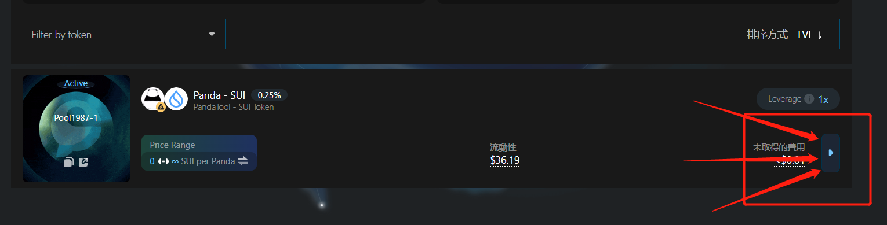<figcaption></figcaption></figure>

然后就会进入到一个流动性操作的页面，具体内容如下图所示

<figure>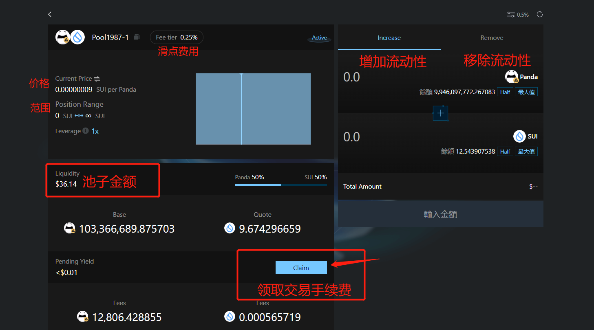<figcaption></figcaption></figure>

如果我们要增加流动性，就在增加的页面输入金额，比如这样

<figure>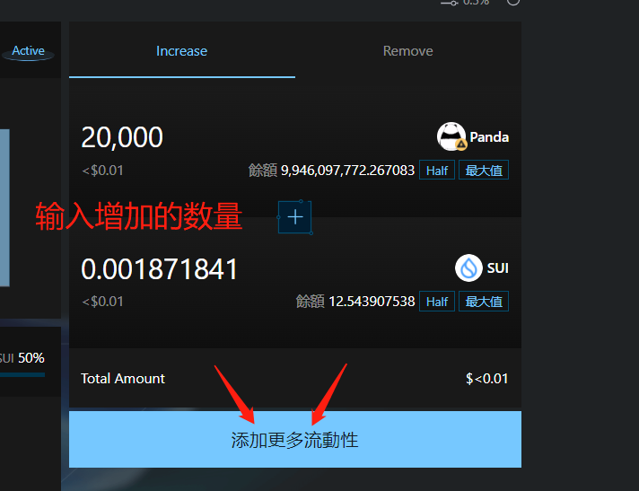<figcaption></figcaption></figure>

如果要移除流动性，就在移除的页面输入数量，并确认移除比例即可

<figure>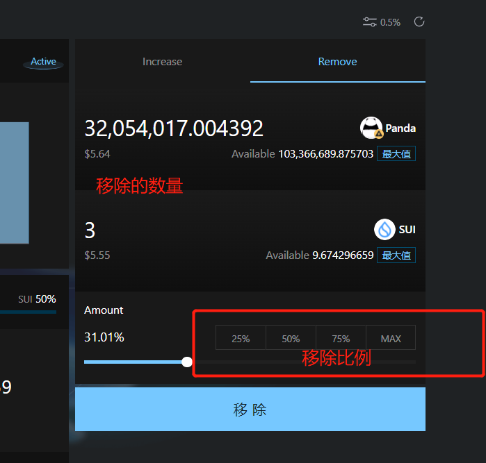<figcaption></figcaption></figure>

其他的操作都是一样，点击按钮，钱包授权确认，即可完成操作

<figure>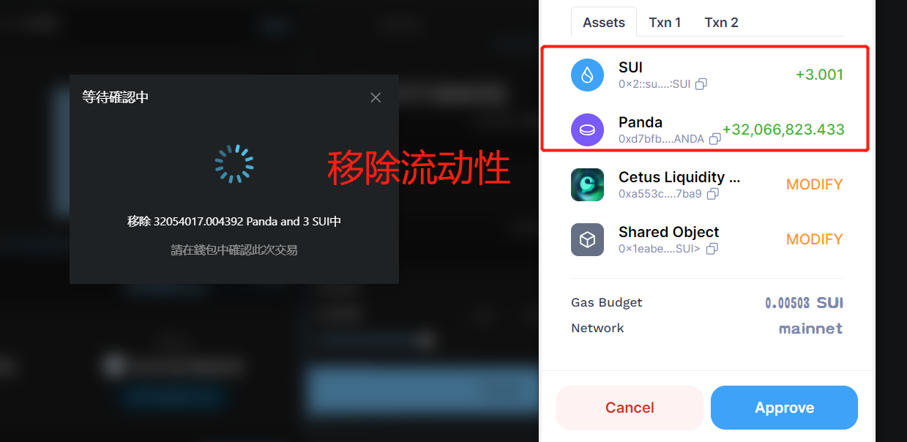<figcaption></figcaption></figure>

到这里，整个关于Cetus的流动性教程就全部结束了，接下来解答一些疑问

## 三、疑问解答

**1、创建资金池的过程中不弹出钱包怎么办？**

* 答：如果在页面操作时间过久，就会这样，可以刷新页面重试。或者查看一下钱包是否锁住，如果上锁了，把钱包解锁后刷新页面就可以了

**2、Cetus创建池子要收费吗？**

* 答：根据实际操作经验来看，在Cetus创建池子不收取费用

**3、为什么池子创建成功后，在流动性管理那里找不到我的仓位？**

* 答：池子创建成功后，等待几分钟，才能看到。如果很长时间找不到自己的池子，可以刷新页面，看看网络是否有问题

如有大家还有不明白或者不清楚的地方，请加入官方电报Telegram群：[https://t.me/PandaTool](https://t.me/PandaTool)
