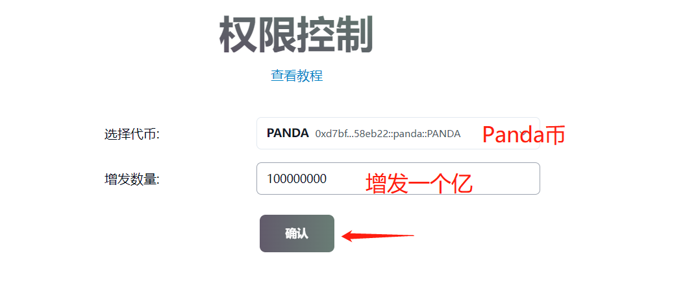
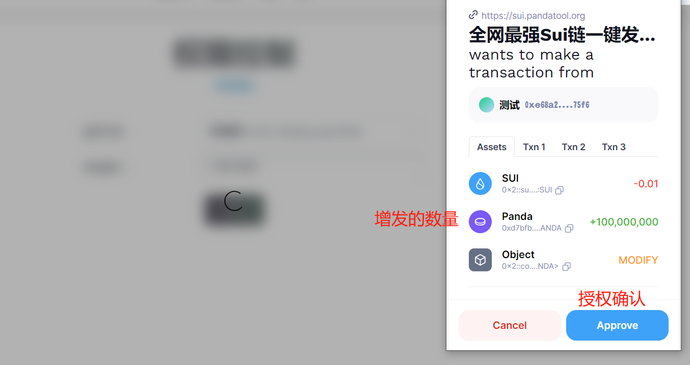
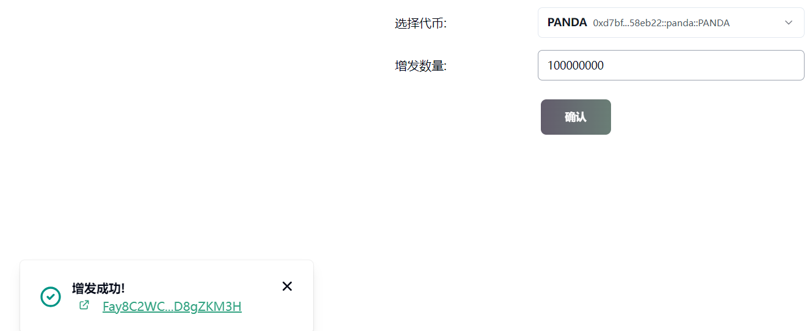
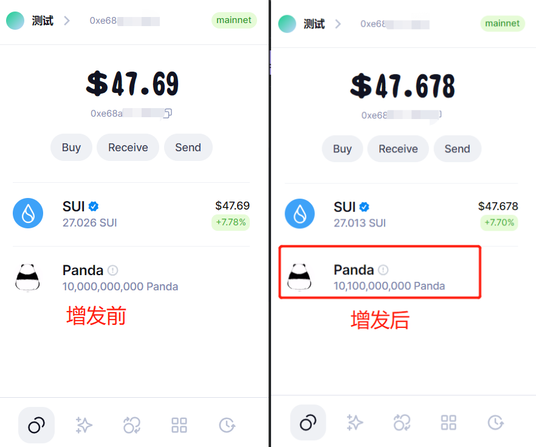
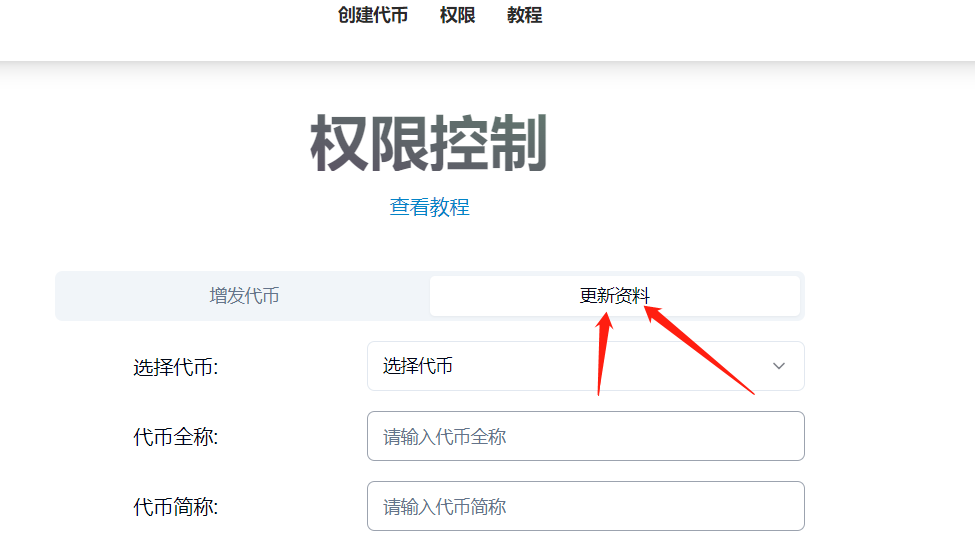
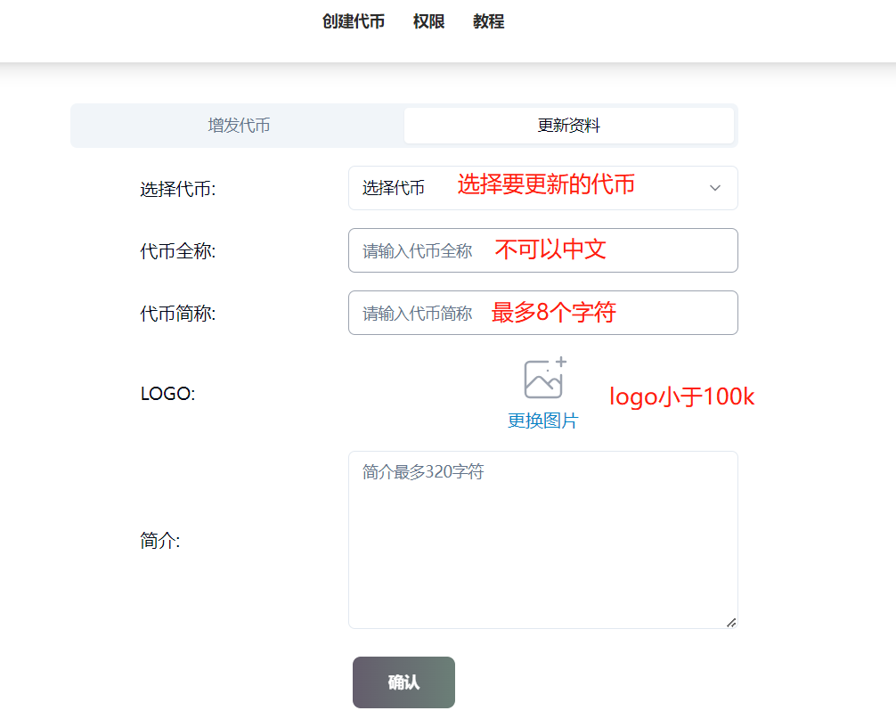
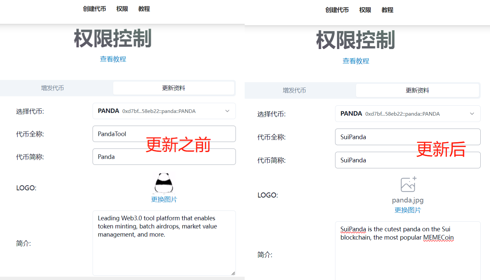

# Sui代币增发与更新资料教程

Sui链的代币创建出来后，会有2个权限：增发权限（铸币权）、更新资料权限

* **增发权限：**可以增发、铸造代币，提高代币供给量
* **更新资料权限：**可以修改代币名称、logo等

如果是在PandaTool发行的代币，并已上传了logo，会自带这两个权限。

当然，不管你是在哪里创建发行的代币，都可以使用PandaTool的权限控制工具来操作。


**增发铸币**的功能在两个场景下使用：

* 1、发币的时候没有进行二次确认，导致发币没有完成，此时可以通过铸币来实现代币创建
* 2、发币的时候代币数量填少了，此时通过铸币功能来增发代币，提高供给

尽管如此，该功能的使用依旧不利于项目的长期良性发展，我们**鼓励大家丢弃权限**


### 一、增发铸币教程

具体该怎么使用呢？首先，我们打开控制台链接：[https://help.pandatool.org/sui/control](https://help.pandatool.org/sui/control)  ，右上角连接钱包（这一步之大家应该很熟悉了），连接成功后右上角能看到钱包地址

<figure><figcaption>
确认钱包已经连接
</figcaption></figure>

钱包连接完成后，我们开始选择代币，此时平台会列出所有你有权限可以管理的代币，我们选择要增发的代币，如下图所示

<figure><figcaption>
选择代币
</figcaption></figure>

然后输入要增发的数量，点击确认即可，比如我选择增发1个亿，就按照下图进行操作

<figure><figcaption></figcaption></figure>

之后钱包确认，即可完成

<figure><figcaption></figcaption></figure>

<figure><figcaption>
增发成功
</figcaption></figure>

怎么确认自己已经完成增发？可以通过钱包的数量来确认，如下图所示的对比。增发前Panda币是100亿，增发后是101亿，这多出来的1亿就是增发来的

<figure><figcaption></figcaption></figure>

### 二、代币资料更新教程

**更新资料**指的是代币创建成功后，将代币的名称、头像等进行修改更新


该功能的使用，非常不利于项目的长期发展。我们**非常不建议**大家使用该功能，并因此提高了使用费用，请大家谨慎操作。如无必要，请勿使用该功能


和增发一样，我们打开PandaTool的代币控制页面：[https://sui.pandatool.org/control](https://sui.pandatool.org/control) ，首先要连接钱包（这一步就不演示了），然后点击**更新资料**按钮

<figure><figcaption></figcaption></figure>

在更新资料的操作页面，我们需要按照以下方式填写操作相关内容

<figure><figcaption></figcaption></figure>

* **选择代币：**只能选择自己有权限的代币进行更新
* **代币全称：**不能是中文或符号，不能超过**32**个字符
* **代币简称：**不能是中文或符号，控制在**2\~8**个字符
* **Logo：**尺寸小于100k，建议是1:1比例
* **简介：**不能带中文或符号，不能超过**320**个字符

例如我要将之前发行的Panda代币，修改为SuiPanda代币，如下图所示

<figure><figcaption>
更新资料
</figcaption></figure>

确认信息无误后，点击确认，钱包支付费用就可以了

<figure><figcaption>
钱包确认
</figcaption></figure>

等待半小时后，我们验证一下是否更新成功，首先是钱包里的logo已经发生变化（Suiet钱包更新比较慢，SuiWallet更新较快）

<figure><figcaption></figcaption></figure>

整个更新流程到这里就结束了，接下来解答一些问题

### 三、疑问解答

**1、为什么我更新成功了，但是钱包logo没变？**

* 答：不同钱包更新的有快有慢，像SuiWallet几分钟就会更新，Suiet要半小时以上。如果几个小时仍然没有更新，那可能是缓存问题，记得关闭钱包再重新打开试一下

**2、为什么有的代币会增发失败？**

* 答：这可能与代币精度有关系。如果代币精度为9 ，那么该代币的总量上线就是100亿左右。超过这个上线，就无法再继续增发了

**3、增发代币以及更新资料是否需要额外收费？**

* 答：是的，每次增发铸币，PandaTool平台会收取1 SUI的费用。每次更新资料，会收取8 SUI的费用。

**4、使用该功能会产生哪些危害？**

* **答：**恶意使用增发权限与更新资料权限，会损害项目的长期发展。事实上，我们不建议使用该功能

如果使用权限的过程有相关问题，欢迎进群询问解答：[https://t.me/pandatool](https://t.me/pandatool)
