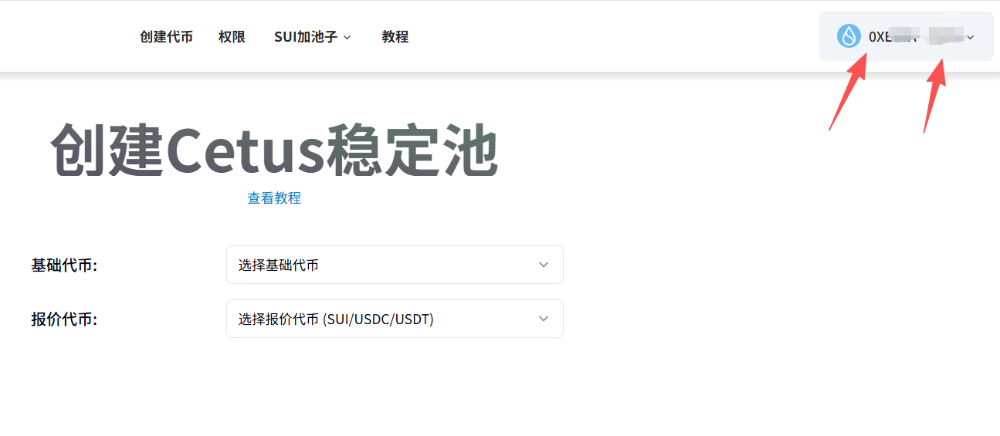
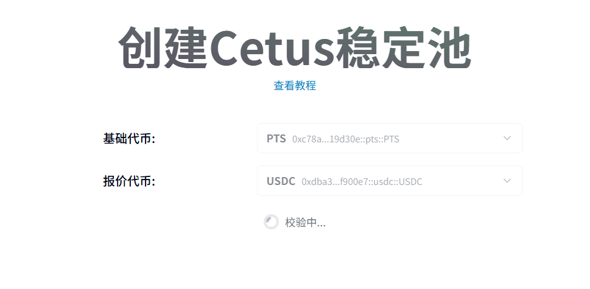
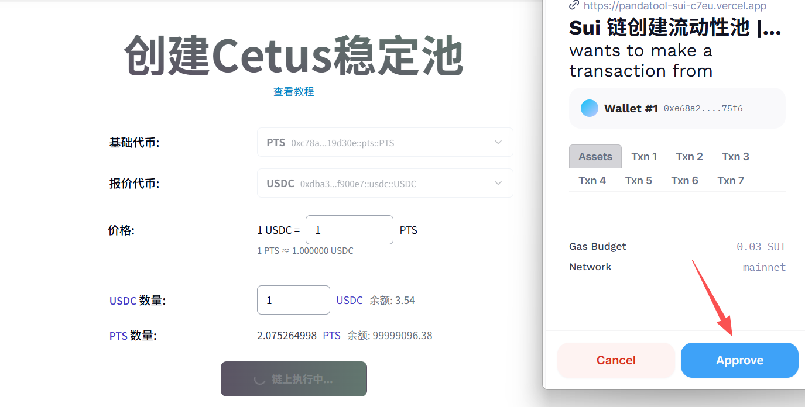
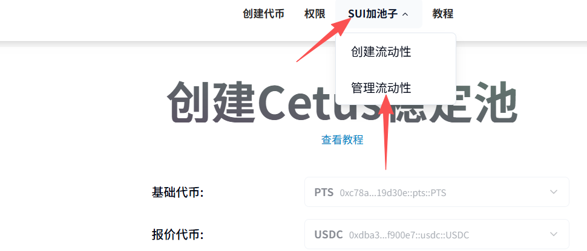
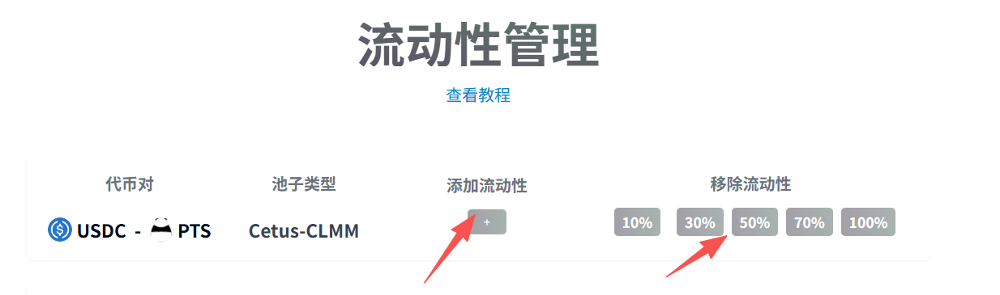

# Sui链代币创建稳定池教程

## **一、稳定池概念解读**

### **1、什么是稳定池？**

顾名思义，稳定池指的就是价格稳定的流动性池。创建了该类型的流动性池之后，可以让Sui代币在交易时保证价格稳定在一定的区间，而不至于波动太大。

### **2、为什么要创建稳定池？**

创建稳定池的主要原因就有两个：

* **防机器人：**&#x73B0;在链上机器人猖獗，通过低买高卖的形式套利，从而掏空资金池。如果代币价格稳定，就可以杜绝套利空间
* **确保代币价值：**&#x5F88;多项目方或者用户，创建代币的目的是为了和实有资产链接，打造RWA生态。一旦代币价格波动太大，就会导致实体资产失衡。保证价格相对稳定，是非常有长期意义的。

### **3、稳定池是什么逻辑？**

PandaTool提供的稳定池创建工具，是基于Cetus的clmm集中流动性协议的。通过创建一个有限的价格区别，使代币的交易价格长期稳定在一个范围内。通过较小的波动实现价格的相对稳定。

### **二、创建Sui链稳定池教程**

接下来，我们详细解读一下，该如何为您的Sui链代币创建一个稳定池。

### **1、打开PandaTool并连接钱包**

第一步，我们先打开PandaTool的工具页面:[https://sui.pandatool.org/createpool](https://sui.pandatool.org/createpool)，然后右上角连接钱包

<figure><figcaption></figcaption></figure> <figure><figcaption></figcaption></figure>

具体看您电脑安装了哪些钱包插件，就选择什么插件进行连接。钱包连接成功后，右上角会出现您的钱包地址

<figure><figcaption></figcaption></figure>

### **2、选择代币**

下一步，我们需要选择代币，这里有两个选项：

* **基础代币：**&#x5C31;是您自己创建的代币，PandaTool会自动识别并让您选择
* **报价代币：**&#x4E3A;您的代币进行报价的单位，如SUI、USDC等等

<figure><figcaption></figcaption></figure>

代币选择好之后，会自动进行校验。如果校验完成，就会推进到下一步

### **3、填写价格与数量**

然后，我们就需要确定代币的价格与入池数量：

<figure><figcaption></figcaption></figure>

* **价格：**&#x5C31;是你希望代币价格稳定在多少，就填多少。填1，意思是说代币价格稳定在1USDC
* **USDC数量：**&#x4F60;希望首次往池子里放多少USDT（首次肯定是越多越好）
* **PTS数量：**&#x8FD9;个就是您发行的土狗币数量，无需填写，根据USDC的数量计算得出


注意：这里的USDC和土狗币的比例，并不是1:1的。这里涉及到价格扭曲的模型，大家不用在意。比例并不会影响价格，最终的价格由您填写的数字决定，所以无需担心，正常创建即可。


### **4、创建流动性**

所有信息确认完成后，我们点击立即创建按钮，此时会弹出钱包，确认即可

<figure><figcaption></figcaption></figure>

### **5、查看流动性**

一旦您的流动性创建完成，可以通过我们的流动性管理工具进行查看

<figure><figcaption></figcaption></figure>

在这里，您可以查到该地址下的所有流动性，同时进行加池子、撤池子等操作

<figure><figcaption></figcaption></figure>

## **三、Sui加池疑问解答**

**1、稳定池不支持USDT吗？**

* 答：**目前是不支持的。**&#x56E0;为Sui链上，USDC的使用率远远高于USDT，而且Sui区块链里有多个USDT版本，无法统一，我们不确定应该支持哪一个。

**2、创建稳定池需要收费吗？**

* 答：创建一个稳定池，需收取5SUI的费用。创建之前，请大家确保钱包内有足够的代币

**3、为什么创建流动性的时候，U和代币的比例不是1:1的？**

* 答：加池的两种代币比例无需1:1，同样可以实现价格稳定，大家无需为此担心

**4、如何降低池子内U的数量，并且增加代币的数量呢？**

* 答：这是个好问题。您可以通过交易（主要是卖出代币），来改变池子内USDC和代币的比例（让U变少，币变多）。然后通过增加流动性的方式，来加大代币的注入。

如果您对Sui链创建稳定池还有其他的疑问，可以进入我们的官方Telegram群询问志愿者：[https://t.me/pandatool](https://t.me/pandatool)
