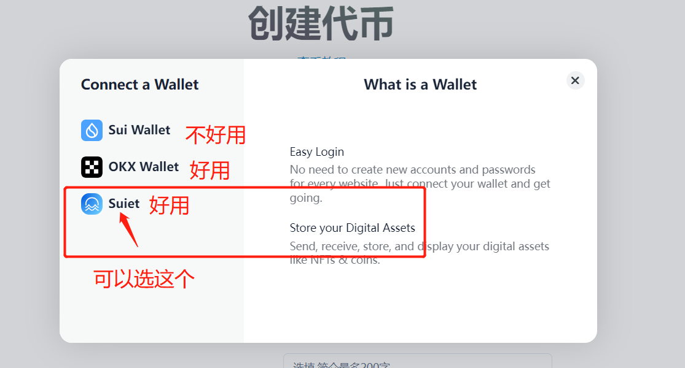
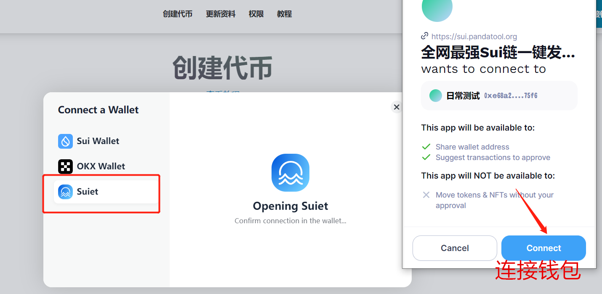
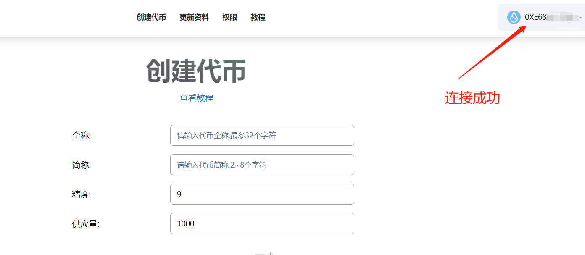
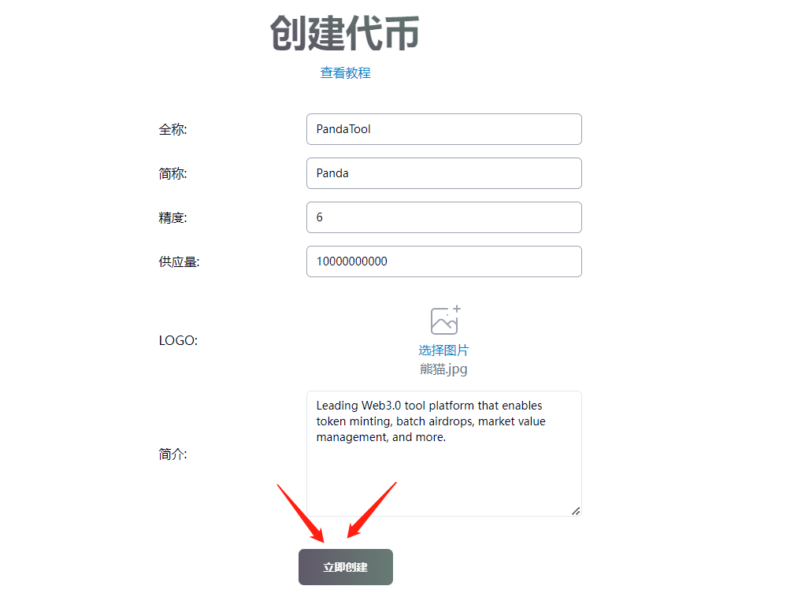
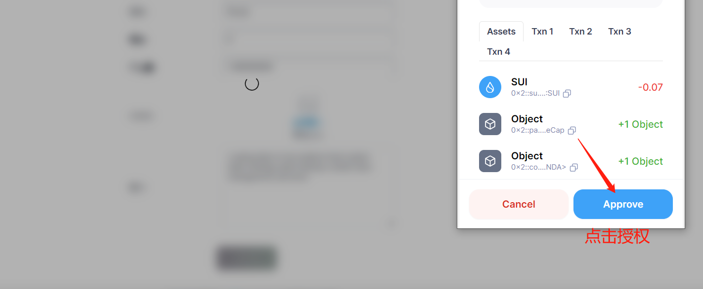
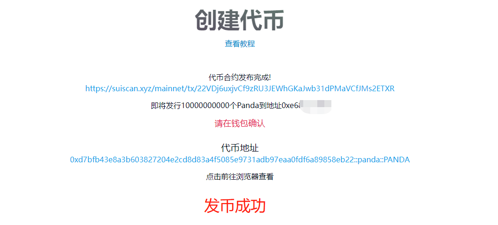
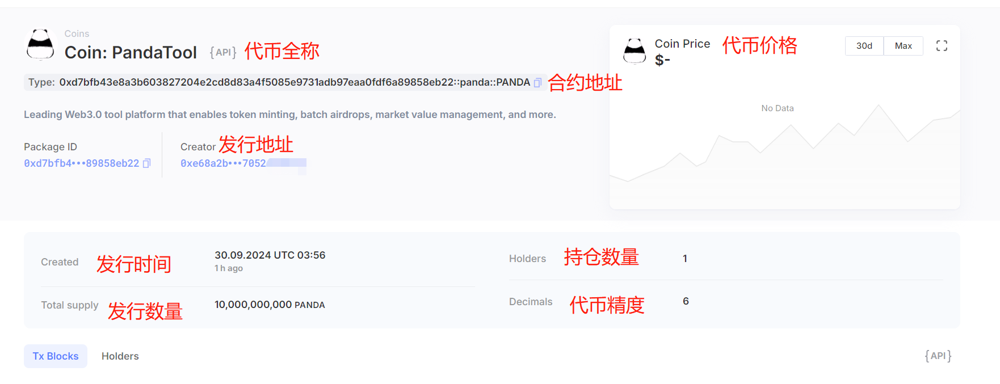

# Sui链一键发币教程

Sui堪称是近2个月来的当红炸子鸡，TVL节节攀升、MEME层出不穷。不过Sui作为Move系公链，估计很多人对其代码结构不是很了解，想要参与却不知道如何进行。基于这个因素，PandaTool开发了Sui链一键发币工具，实现无代码开发Sui链MEME币，让任何人都能尽快参与到Sui的生态中。

## Sui发币前提条件 

* 发币之前，务必使用安装好Suiet钱包或者SuiWallet插件：[Suiet钱包安装](suiet.md)、[Suiwallet钱包钱包](suiwallet.md)
* 如果没有安装这两个钱包，欧易Web3钱包也是支持的
* 钱包内最少准备20个SUI，如果数量不够，会导致发币失败
* 手机发币建议使用欧易Web3钱包，不要用TP钱包，TP不能传logo

## Sui发币教程 

### 1、连接Sui钱包 

首先，我们需要确保自己已经在浏览器里下载安装了Sui钱包，并在钱包内存储了超过20个SUI代币。如果还没有安装钱包，请参考以下教程：

* Suiwallet钱包安装教程：[https://help.pandatool.org/sui/suiwallet](https://help.pandatool.org/sui/suiwallet)
* Suiet钱包安装教程教程：[https://help.pandatool.org/sui/suiet](https://help.pandatool.org/sui/suiet)

经过多次测试使用，电脑发币我们推荐大家使用Suiet钱包，手机发币我们推荐大家使用欧易Web3钱包。今天这篇教程，主要是教大家进行电脑发币。

钱包安装完成后，打开发币链接：[https://sui.pandatool.org/](https://sui.pandatool.org/)，点击右上角“连接钱包”

<figure><figcaption></figcaption></figure>

这个时候会弹出页面让你选择连接哪种钱包，默认给了三个：SuiWallet、OKX Wallet、Suiet，这里我推荐大家选择Suiet或者欧易Web3钱包

<figure><figcaption></figcaption></figure>

比如我选择Suiet钱包，点击后，钱包插件会跳出提示，继续点击连接即可

<figure><figcaption></figcaption></figure>

连接成功后，右上角会显示你的钱包地址，如下图所示

<figure><figcaption></figcaption></figure>

至此，钱包的连接工作就算是完成了。如果是老手的话，直接跳过这一步，我们进行下一步操作

### 2、输入代币参数 

相比较Solana来说，Sui的代币参数比较简单，但是要求比较多，有以下几项

<figure><figcaption></figcaption></figure>

**参数都要填**

* **全称：**不支持中文或符号，最多**32个**字符
* **简称：**不支持中文或符号，需要**2\~8个**字符
* **精度：**默认填9，精度与你能填写的最大供应量有关。
* **供应数量：**当精度为9时，供应量最大不能超过100亿。当精度为8时，不能超过1000亿，以此类推
* **logo：**图片小于**100k**，尺寸建议256x256像素（正方形）
* **简介：**必填，且不支持中文

例如我填写的代币信息如下

<figure><figcaption></figcaption></figure>

这个代币的名字就叫PandaTool，简称叫Panda，logo就是我们平台的logo。确定好信息无误之后，点击“立即创建”按钮，这时候会跳出Suiet钱包，我们确认授权，并支付费用，如下图所示

<figure><figcaption></figcaption></figure>

大家需要注意，这个只是发行了代币的名称。此时钱包会第二次弹出，以确认发行数量，我们依然在钱包进行授权确认。（如果钱包没有二次弹出就关闭页面了，钱包里是没有代币的，需要去[权限管理](https://help.pandatool.org/sui/control)那里铸币，才能获得代币：[https://help.pandatool.org/sui/control](https://help.pandatool.org/sui/control)）

<figure><figcaption></figcaption></figure>

当页面出现代币合约地址的时候，就是告诉你代币已经发布完成了

<figure><figcaption></figcaption></figure>


这里大家可能会遇到一个问题：点击创建代币的时候，钱包是不是没有弹出？出现这个现象的主要原因有2个：1、整个页面卡顿太久了导致失效，刷新一下页面就行了。2、钱包锁住了，这个时候解锁就行了。锁住的状态就是下面这样：



我们按照提示，去Sui浏览器看一下，也能看到代币信息了

<figure><figcaption></figcaption></figure>

此时我们打开自己的Suiet钱包或者Suiwallet，应该也可以看到代币的logo。

<figure><figcaption></figcaption></figure>

至此，整个发币工作就算是完成了。

如果你需要增发代币或者修改资料，可以参考这个教程

* Sui代币权限管理：[https://help.pandatool.org/sui/control](https://help.pandatool.org/sui/control)

如果你需要为代币创建资金池、添加流动性，可以参考下列教程

* Cetus加池教程：[https://help.pandatool.org/sui/cetus](https://help.pandatool.org/sui/cetus)
* Turbos加池教程：[https://help.pandatool.org/sui/turbos](https://help.pandatool.org/sui/turbos)
* BlueMove加池教程：[https://help.pandatool.org/sui/bluemove](https://help.pandatool.org/sui/bluemove)

## 疑问解答 

**1、Sui发币需要多少钱？**

* **答：**发币费用是19.5 SUI

**2、手机应该怎么发币？**

* **答：**手机可以使用欧易web3钱包或者SuiWallet进行操作，不支持TP钱包哦

**3、其他问题**

* 任何问题，都可以进入Telegram电报群找志愿者解答： [https://t.me/pandatool](https://t.me/pandatool)
