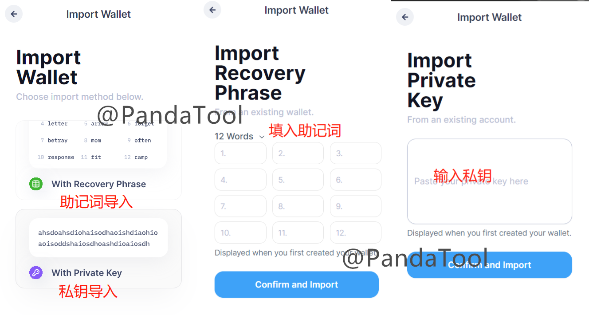
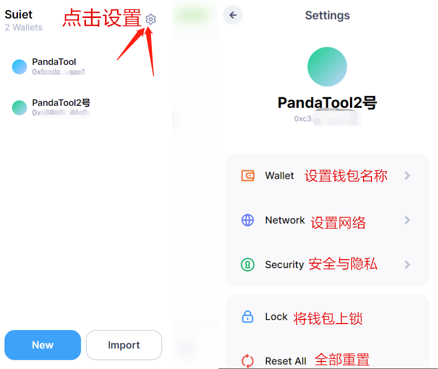

# Suiet钱包安装教程

Suiet钱包是Sui生态最大的去中心化开源钱包，由第三方开发。和官方钱包相比，这个钱包的使用体验更好、100%开源、默认具备加密隐私服务等优势，但是目前该钱包只要浏览器插件版本的，没有应用程序App。

如果大家觉得Sui Wallet不好用，PandaTool也推荐各位使用Suiet

## 一、安装Suiet钱包插件

首先，我们先找到Suiet的官网：[https://suiet.app/](https://suiet.app/) ，在首页那里点击谷歌浏览器的图标

<figure><figcaption></figcaption></figure>

然后会跳转到谷歌应用商店：[https://chromewebstore.google.com/detail/Suiet%20%7C%20Sui%20Wallet/khpkpbbcccdmmclmpigdgddabeilkdpd](https://chromewebstore.google.com/detail/Suiet%20|%20Sui%20Wallet/khpkpbbcccdmmclmpigdgddabeilkdpd)，点击**添加至Chrome**  &#x20;

<figure><figcaption></figcaption></figure>

之后弹出提示，让你**添加扩展程序**，点击即可

<figure><figcaption></figcaption></figure>

等待大概20秒钟，钱包插件就会自动安装完成。我们通过谷歌浏览器右上角，可以找到相应的Suiet钱包

<figure><figcaption>
点击插件栏
</figcaption></figure>

<figure><figcaption>
找到Suiet钱包
</figcaption></figure>

## 二、创建Suiet钱包

当我们打开Suiet钱包时，会弹出这样一个页面

<figure><figcaption></figcaption></figure>

* Create New：指的就是创建一个新的钱包
* Import Wallet：导入已有钱包

### 1、创建新钱包

当我们点击Create New的时候，会弹出一个密码配置的页面，我们需要填入密码

<figure><figcaption></figcaption></figure>

填入好密码之后，点击下一步，进行钱包的备份，并复制钱包助记词

<figure><figcaption></figcaption></figure>

确定将助记词复制到本地存储，且不会丢失后，我们点击“Yes”，进入下一步

<figure><figcaption></figcaption></figure>

这个步骤主要是要求我们确认助记词是否牢记，他会随机给出两个空格，让你填写每个位置相应的单词。助记词的单词都是按照顺序排列的，把相应的单词填入空格中，点击确认即可

然后，我们就能看到自己的钱包主页了

<figure><figcaption></figcaption></figure>

## 三、配置并使用Suiet钱包

钱包的使用是一个并不困难的过程，只是当前Suiet钱包并没有中文版本的，因此PandaTool简单教大家了解一下该钱包的页面与使用方式。

和SuiWallet相比，Suiet要简单很多，好用很多。如果你时常使用小狐狸、Phantm的话，那么使用Suiet钱包应该没什么压力的。

<figure><figcaption></figcaption></figure>

通过这个页面我们大致就可以了解Suiet钱包的基本属性。如果你要想创建新的钱包，或者再导入已有钱包，应该怎么办呢?

### 1、导入或创建钱包

我们点击钱包名称，会出现这样的设置

<figure><figcaption></figcaption></figure>

创建新钱包的流程，与我们之前没有任何区别：复制助记词，确认助记词，即可完成。

而导入钱包呢，大家可能不熟悉，其实也很简单，看下图操作就行

<figure><figcaption></figcaption></figure>

### 2、设置及导出私钥

接下来我们看看设置板块

<figure><figcaption></figcaption></figure>

这里需要注意的地方是，Reset All不要点击。点击之后将重置所有设置，谨慎操作。

假如我们想修改钱包的昵称，只需要点击**Wallet**，即可进行修改页面

<figure><figcaption></figcaption></figure>

假如我们想导出钱包的私钥，那么需要点击Security，进入操作

<figure><figcaption></figcaption></figure>

例如我们选择显示助记词，那么会进一步要求你输入密码、确认密码，然后就会显示助记词，复制就可以了

<figure><figcaption></figcaption></figure>

基本上到这里，整个钱包的功能就介绍完了，大家也可以自己探索探索，下面说一下注意事项

## 四、注意事项

1、保护好自己的私钥与助记词，防止钱包被盗

2、尽量使用谷歌浏览器或者基于谷歌内核的浏览器进行插件安装

3、在科学上网的前提下操作

如果您还有其他问题，可以加入PandaTool一键发币电报群了解，志愿者会给你一些解答：[https://t.me/PandaTool](https://t.me/PandaTool)
