# Sui Wallet 钱包安装教程

Sui Wallet是Sui官方推出的一款钱包，号称是：安全+易用。安全方面不好说，易用性有待商榷。大家要在Sui链上发币、交易、参与质押，这个钱包是应该要安装的。

这个教程，主要是教大家如何安装Sui Wallet浏览器插件，并创建Sui钱包。


1.安装钱包必须要懂得科学上网

2.钱包App必须在Apple Store或者Google Play下载

3.建议大家使用[Suiet钱包](suiet.md)，SuiWallet有点不好用


## 一、安装Sui Wallet钱包插件

不管是下载钱包插件，还是App，都需要通过官网或者谷歌Play下载，否则就有可能下载到假钱包。所以，我们先找到Sui Wallet的官网：[https://suiwallet.com/](https://suiwallet.com/)

<figure><figcaption></figcaption></figure>

然后点击“[Download Browser Extension](https://chrome.google.com/webstore/detail/sui-wallet/opcgpfmipidbgpenhmajoajpbobppdil)”这个按钮，就会跳转到Google应用商店的页面（或者直接进入链接：[https://chromewebstore.google.com/detail/sui-wallet/opcgpfmipidbgpenhmajoajpbobppdil](https://chromewebstore.google.com/detail/sui-wallet/opcgpfmipidbgpenhmajoajpbobppdil)）

<figure><figcaption></figcaption></figure>

在谷歌应用商店，点击“添加至Chrome”，然后在跳出的提示里选择“添加扩展程序”

<figure><figcaption></figcaption></figure>

之后等待5\~10秒中，插件就会安装成功，并自动跳转到注册页面。

<figure><figcaption></figcaption></figure>

## 二、注册Sui钱包

与Metamask、Phantom不同的是，Sui Wallet需要进行谷歌账号的注册才能使用。当然，如果你本身已经有了Sui钱包私钥，可以使用导入功能。如果没有，必须注册。

<figure><figcaption></figcaption></figure>

Twitch这个方式就不看了，主要是教大家通过谷歌注册或者创建私钥钱包的方式进行注册，大家可以自行选择

### 1、谷歌注册登陆

点击这个谷歌图标之后，会自动跳转到你的谷歌账号，然后点击谷歌账号，继续下一步

<figure>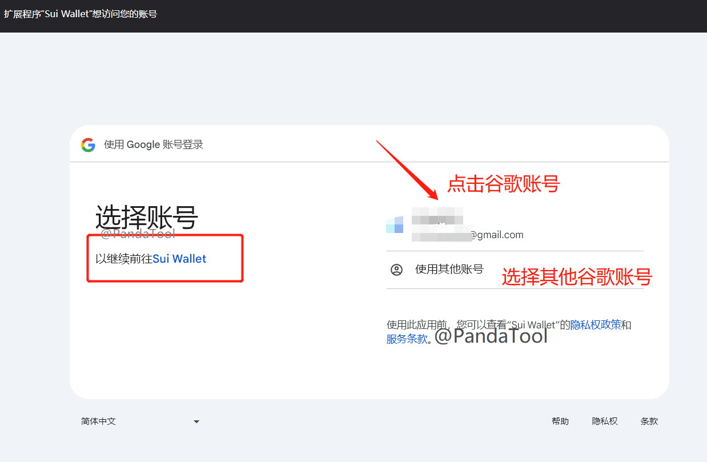<figcaption></figcaption></figure>

<figure>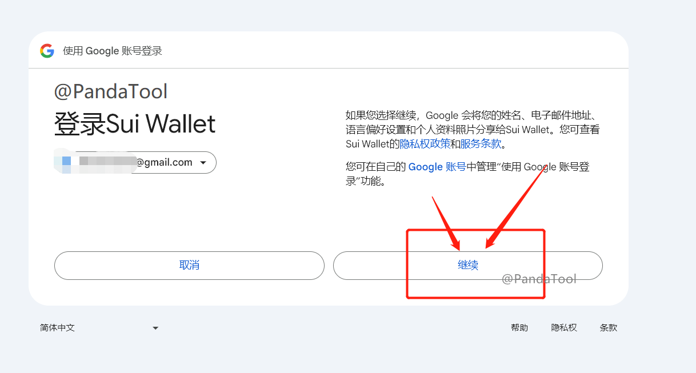<figcaption></figcaption></figure>

确认后等待几秒钟，就完成注册了。之后会弹出一个提示，让你进行2FA验证，这个如果不了解的话可以不用管，直接点击“I understand”就可以了

<figure><figcaption></figcaption></figure>

这时候，你的钱包就算是注册完成了，可以看到自己的钱包页面，如下图所示

<figure><figcaption></figcaption></figure>

到这一步，整个钱包就算是注册完成了，大家就可以自己摸索了。这个钱包地址是与你的谷歌邮箱绑定的，而且没有私钥可以导出。简单来说，只要谷歌账号不被盗，钱包就没问题。但是这个地址也不能导入到其他钱包使用了，只能与Sui Wallet强绑定，反正有利有弊吧

如果不太会用也没关系，后面PandaTool再教大家如何去修改东西

### 2、More Options登陆

More Options指的“更多选择”，即其他登陆方式。当我们选择这个按钮的时候，会出现以下提示

<figure>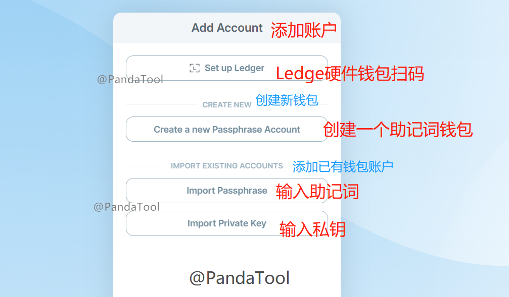<figcaption></figcaption></figure>

根据上图大家就很好理解了，就是通过不同的方式创建或者钱包。

* 如果你还没有钱包，那就选择 Creat New，创建一个钱包
* 如果你已经有了钱包，就通过助记词或者私钥导入

我们试一下如何创建新钱包，点击Creat a New Passphrase Account，会进入到下面这个页面

<figure>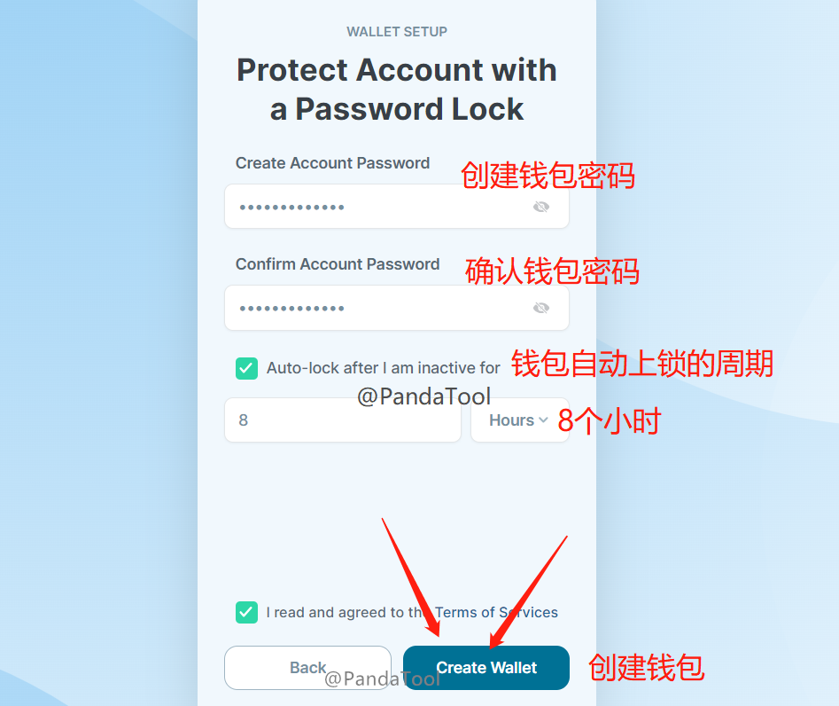<figcaption></figcaption></figure>

密码很好理解，就是一个钱包开启的密码，设置之后不要忘了就行。

Auto-lock呢，是钱包自动上锁的时间。意思就是说，多久之后钱包自动上锁。一旦上锁，就需要用密码打开。我这里设置的是8 Hours，就是8小时，指的是：钱包在打开后，8小时内不上锁，8小时后则需要通过密码才能重新打开钱包。

设置完成之后，我们点击Create Wallet，就可以完成钱包创建了，会显示下图所示

<figure><figcaption></figcaption></figure>

把助记词保存后不要被其他人看到，然后点击Open Sui Wallet，就能进入到主钱包页面了

<figure>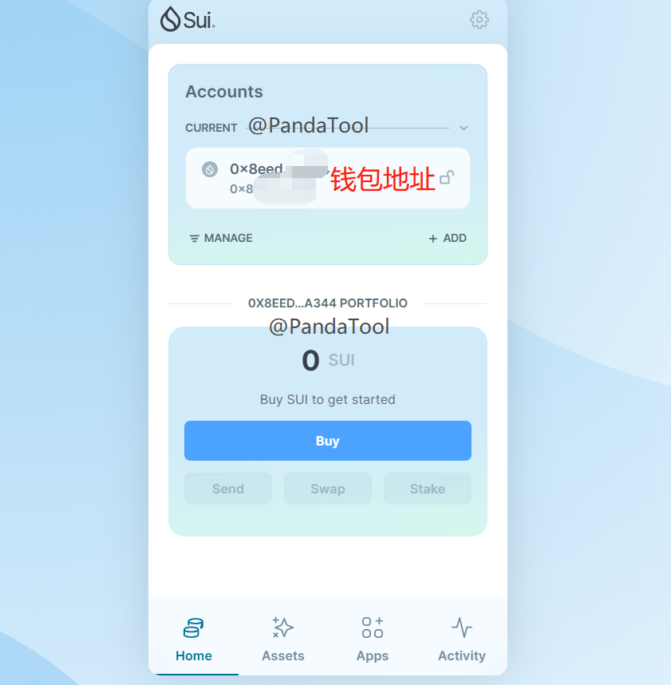<figcaption></figcaption></figure>

## 三、使用Sui钱包

考虑到这个钱包没有中文语言翻译，大家使用起来存在一些障碍，接下来PandaTool给大家大概看一下该如何使用

考虑到不同的用户是通过不同的方式注册了，那PandaTool以“谷歌注册登陆”的页面给大家解读一下钱包的使用。

### 1、钱包页面解读

当我们通过谷歌注册登陆成功以后，会看到这样的页面：

<figure><figcaption></figcaption></figure>

通过中文翻译，大家应该基本上能看得出来，没有什么需要指导的。

如果你发现自己购买的代币不显示，是因为没找到位置。鼠标往下滑动一下，就能看到：

<figure>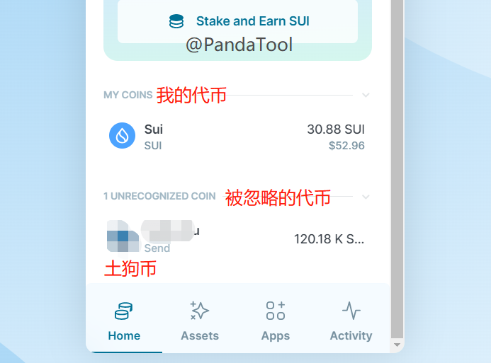<figcaption></figcaption></figure>

这个Unrecognized就是被忽略的，不受重视的，基本上所有购买的土狗币都会在这个栏目里面显示，从而与SUI做出区分。

### 2、设置钱包

接下来，PandaTool教大家简单设置一下钱包

首先是钱包名称，我们点击钱包名称的按钮，就能自定义

<figure>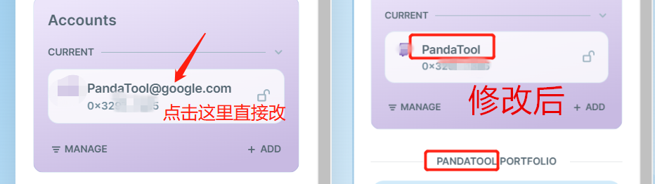<figcaption></figcaption></figure>

接下来是导出钱包私钥。需要注意的是，用谷歌邮箱注册的钱包是没有办法导出私钥的，我们需要先创建一个私钥钱包才行。

我们点击Add，然后按照上面创建私钥钱包的流程，重新走一遍，就能创建一个带私钥的钱包了

<figure><figcaption>
点击Add
</figcaption></figure>

 

<figure>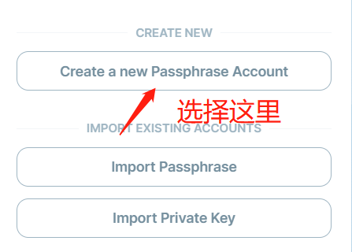<figcaption>
选择创建
</figcaption></figure>

 

<figure>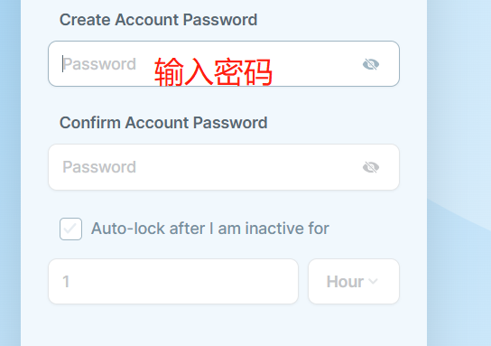<figcaption>
输入钱包密码
</figcaption></figure>

这个流程前面已经详细介绍了，就不给大家展示了，创建出来的新钱包之后，大概就是下面这个样子

<figure>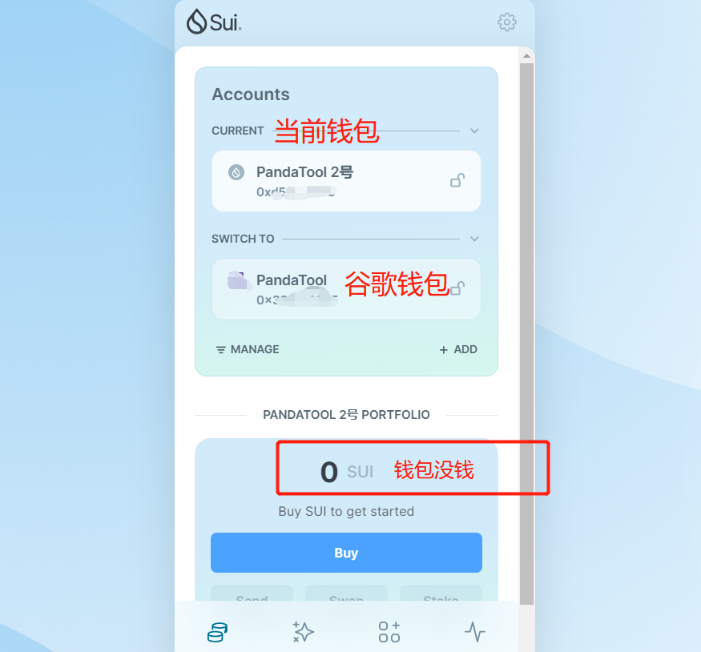<figcaption></figcaption></figure>

大家可以发现，我创建了一个名为PandaTool 2号的钱包，当我创建出来之后，这个钱包默认就是当前钱包，它是没有资产的。

如果你想通过有资产的钱包操作，就切换一下即可，比如像这样

<figure>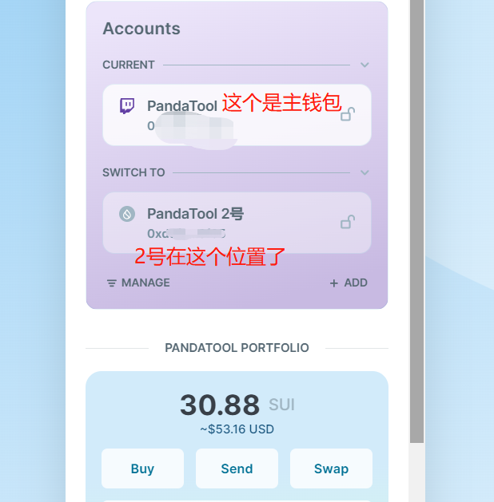<figcaption></figcaption></figure>

如果想导出私钥，就点击那个MANAGE

<figure><figcaption></figcaption></figure>

然后就会看到这样的页面

<figure>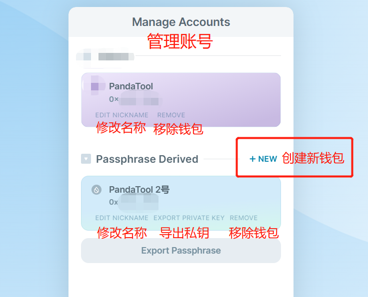<figcaption></figcaption></figure>

* EDIT NICKNAME：修改钱昵称
* EXPORT PRIVATE KEY：导出钱包私钥
* REMOVE：移除钱包
* Export Passphrase：导出钱包助记词

基本上到这里，整个钱包的使用方法就介绍完了，下面说一下注意事项

## 四、注意事项

1、谷歌钱包或者Twitch账号登录后创建的钱包，是不能导出私钥的，该钱包与账号绑定

2、使用哪个钱包就切换哪个钱包，注意别用错了

3、保护好自己的私钥与助记词，防止钱包被盗

如果您还有其他问题，可以加入PandaTool的Sui一键发币电报群了解，志愿者会给你一些解答：[https://t.me/PandaTool](https://t.me/PandaTool)
