# DeDust加池子(创建流动性)教程

[DeDust](https://dedust.io/)是构建在TON上的去中心化交易所，采用创新的 DeDust 协议 2.0。它注重用户体验、gas 效率和可扩展性，同时开发了跨链桥产品，让用户可以在TON与ETH两条链之间进行无缝对接。

## 为什么选择DeDust 

DeDust虽然成立时间不是非常久，但是增长速度很快、用户覆盖度也在迅速上升。据统计，截止到6月22日，DeDust的TVL超过3亿美元，是TON链上排名第一的应用，比第二名STON整整高出6000万美元。

DeDust 通过以下几个独特功能对 TON 区块链上的 DeFi 进行了创新：

* **资产概念**：超越传统的单一资产类型，使用允许无缝集成和交换各种资产类型的抽象层，包括来自其他链的原生币和代币。
* **Vault 系统**：一组管理不同资产类型的合约，简化交易并实现高效的多跳交换。
* **池类型**：提供AMM资金池和稳定币资金池，满足不同资产波动性和交易策略的需求。
* **工厂合约**：负责创建池和金库，集中合约管理。
* **流动性存款合约**：临时管理流动性存款，提高交易效率。

## DeDust加池子教程 

### 1、连接钱包

首先，我们打开DeDust的官网：[https://dedust.io/](https://dedust.io/)，点击右上角`Wallets`，根据提示再点击`Connect Wallet`连接钱包

<figure>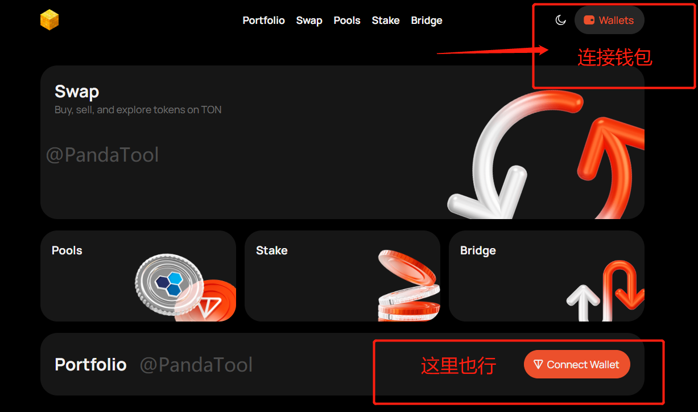<figcaption></figcaption></figure>

<figure><figcaption></figcaption></figure>

此时会弹出一列钱包让你选择，如果你安装了`Tonkeeper`，就选择这个（[Tonkeeper安装教程](tonkeeper.md)）。如果你安装了OpenMask，就选择OpenMask。一般来说，我们会推荐大家使用Tonkeeper

<figure>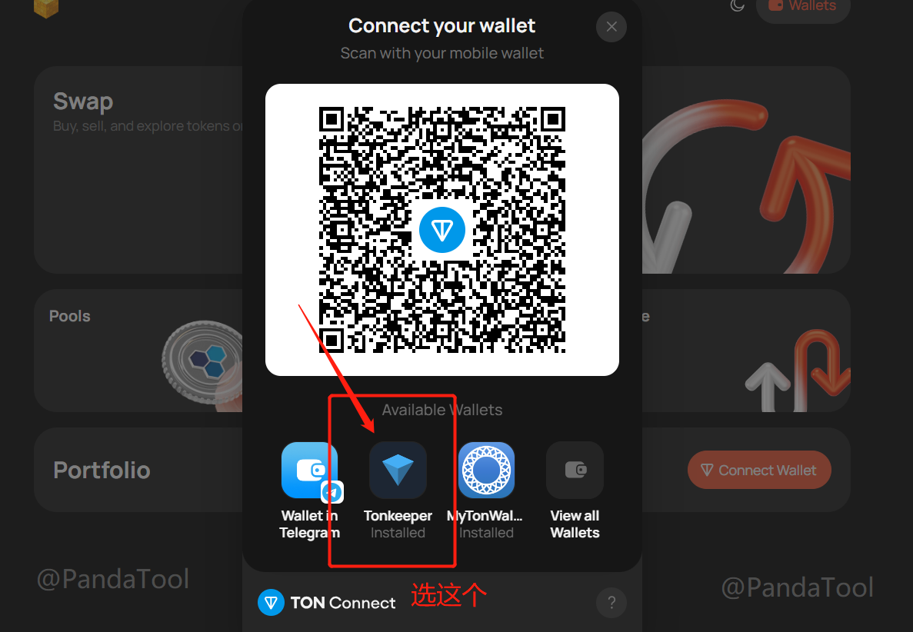<figcaption>
选择Tonkeeper
</figcaption></figure>

<figure>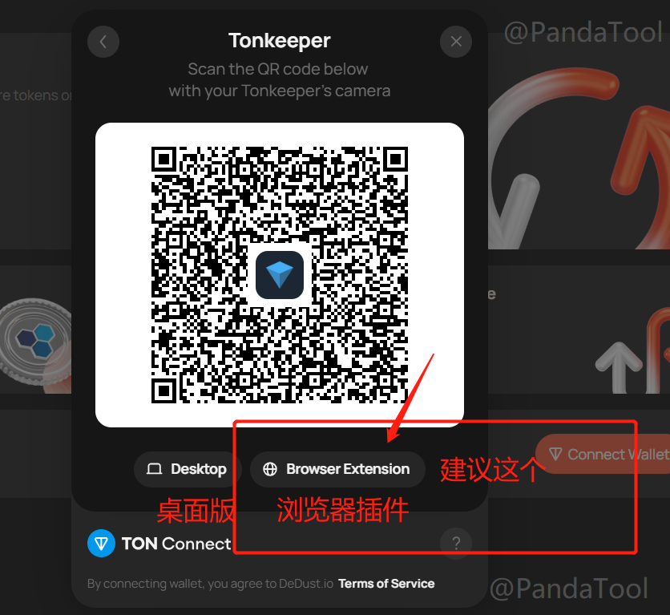<figcaption>
选择浏览器插件版本
</figcaption></figure>

然后会弹出钱包插件，点击`连接钱包`即可

<figure>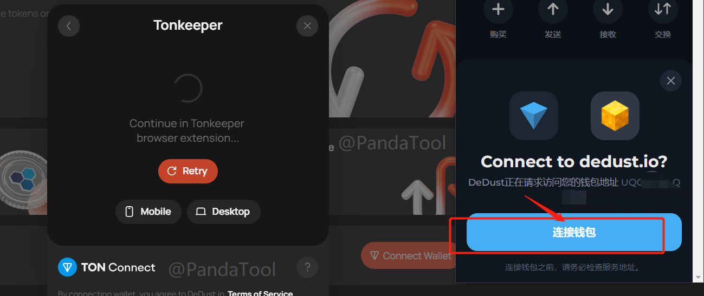<figcaption></figcaption></figure>

连接成功之后，右上角会出现你的钱包地址，如下图

<figure>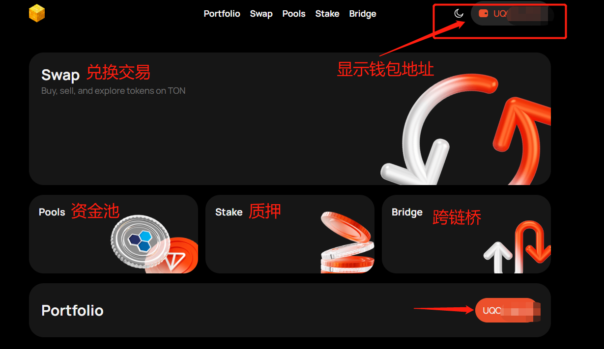<figcaption></figcaption></figure>

钱包连接成功后，接下来我们进行加池操作

### 2、创建流动性 

点击页面的`Pools`，或者直接打开页面：[https://dedust.io/pools](https://dedust.io/pools) ，点击Creat Tool（创建池）

<figure>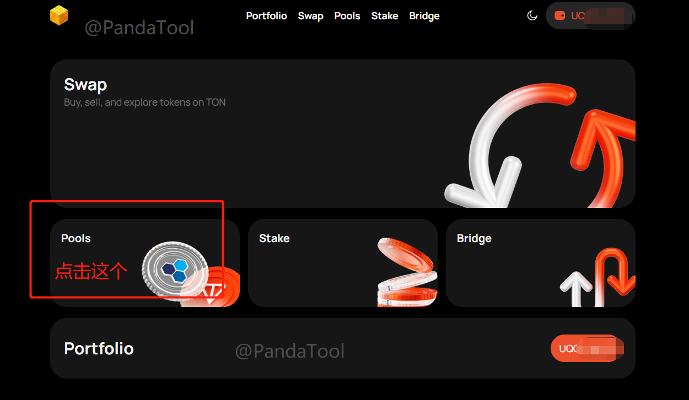<figcaption></figcaption></figure>

<figure>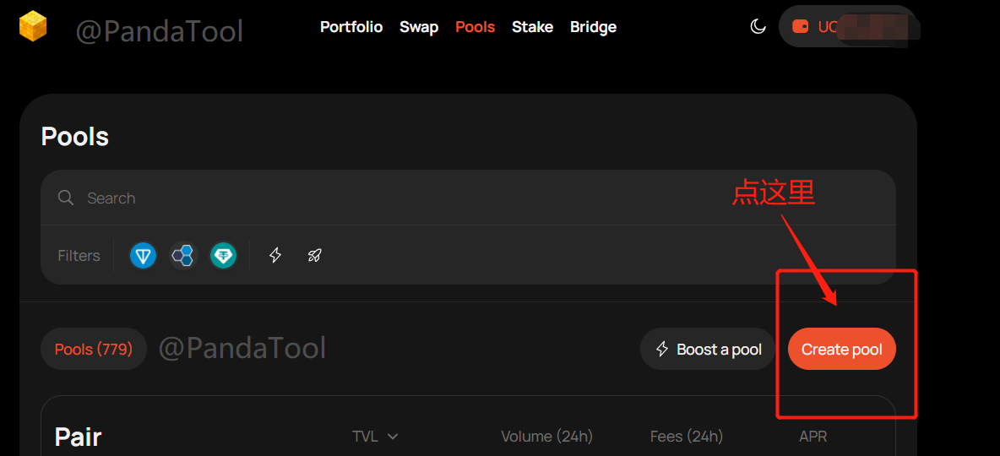<figcaption>
创建池
</figcaption></figure>

然后在打开的页面中输入你要加池的TON的数量，以及你要加池的`代币地址`与数量

<figure>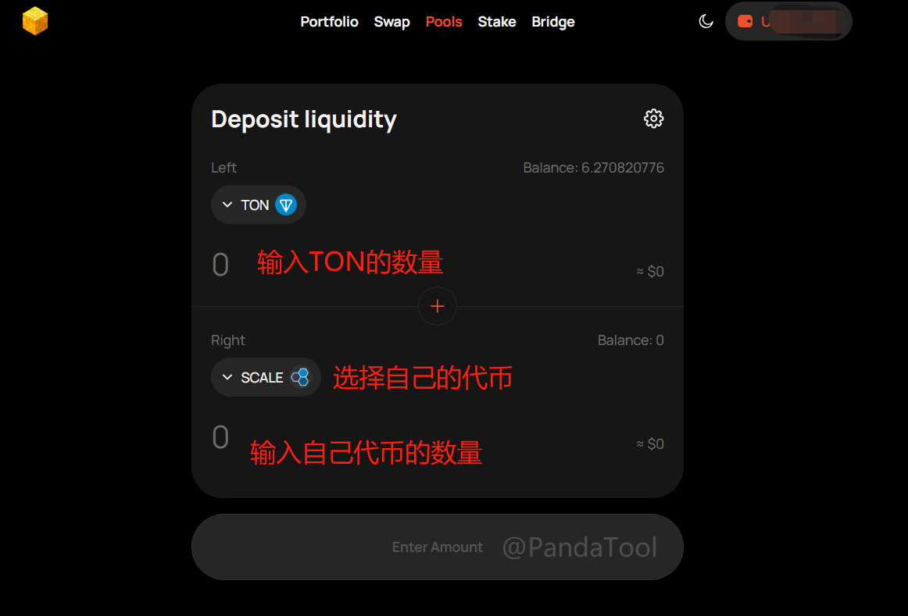<figcaption>
输入TON数量
</figcaption></figure>

输入合约地址并查找代币，并将其输入

<figure>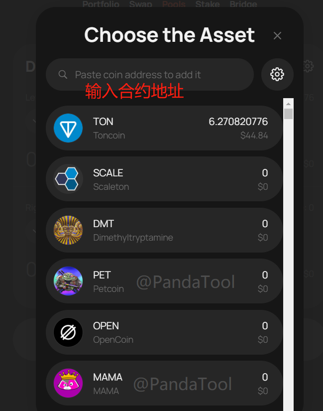<figcaption>
输入合约地址查找代币
</figcaption></figure>

<figure>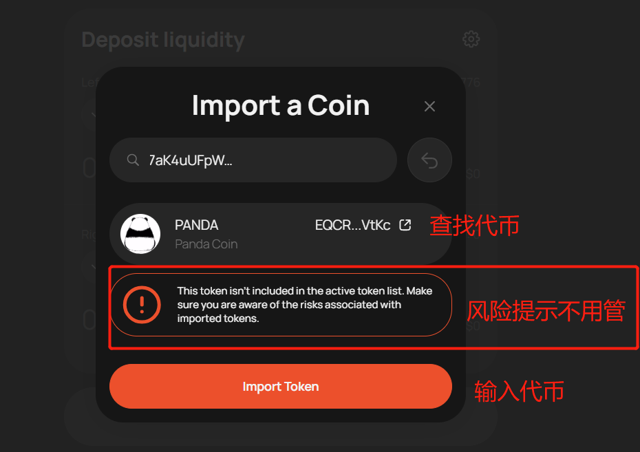<figcaption>
查找并输入代币
</figcaption></figure>

之后，我们点击Connect PANDA，进行代币的授权

<figure>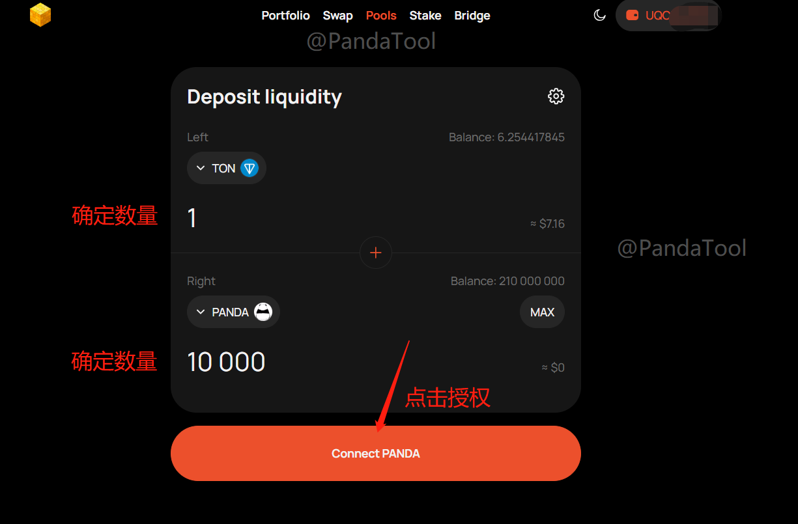<figcaption>
点击授权
</figcaption></figure>

<figure><figcaption>
钱包确认授权
</figcaption></figure>

如果钱包确认后，仍然一直在转圈，且超过1分钟，那可能是网卡了。这个时候看一下钱包，如果已经确认支付了费用，那应该就是完成了，此时刷新一下页面就可以了

<figure>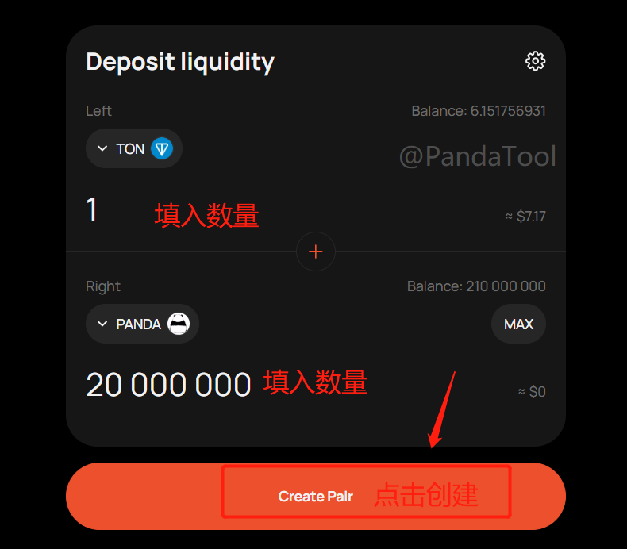<figcaption></figcaption></figure>

所有的参数填写无误后，我们点击 Create Pair，钱包确认后，就算是创建成功了

<figure>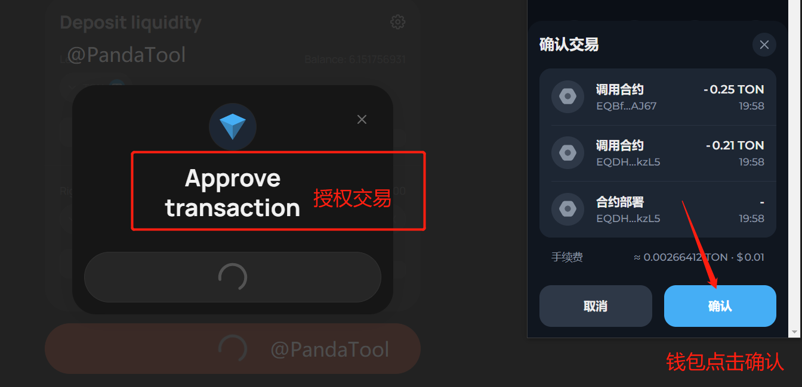<figcaption></figcaption></figure>

## DeDust加池子注意事项 

**1、DeDust上面能看到代币头像吗？**

* 答：可以的，只要链上有头像，钱包能看到头像，DeDust上就有头像

**2、DeDust创建流动性需要收费吗？**

* **答：**在DeDust创建池子，授权的时候需要支付0.1TON，创池子(Creat Pair)的时候需要支出0.5TON左右，所以累积差不多要支出0.6TON左右

如有不明白或者不清楚的地方，请加入官方电报群：[https://t.me/PandaTool](https://t.me/PandaTool)
