# TON一键发币教程

## 注意事项 

* 发币之前，务必使用安装Tonkeeper钱包插件，安装教程➔ [https://help.pandatool.org/ton/tonkeeper](https://help.pandatool.org/ton/tonkeeper)
* 钱包内最少准备10个TON


TON链发币视频教程


## TON发币教程

### 1、连接Tonkeeper钱包

首先，我们打开TON链发币链接：[https://ton.pandatool.org/](https://ton.pandatool.org/)，点击右上角“Connect Wallet”

<figure>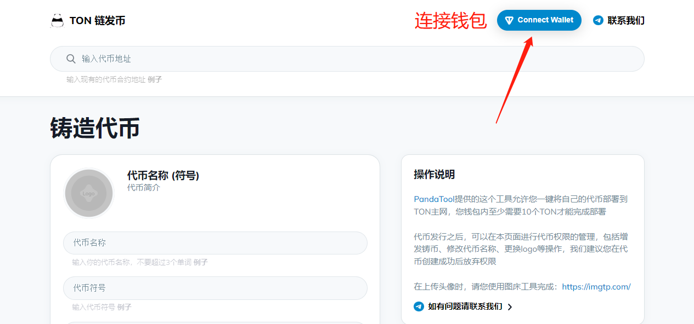<figcaption>
连接钱包
</figcaption></figure>

在弹出来的页面选择Wallets（不要用那个扫码登陆，扫描连接的钱包无法操作发币）

<figure>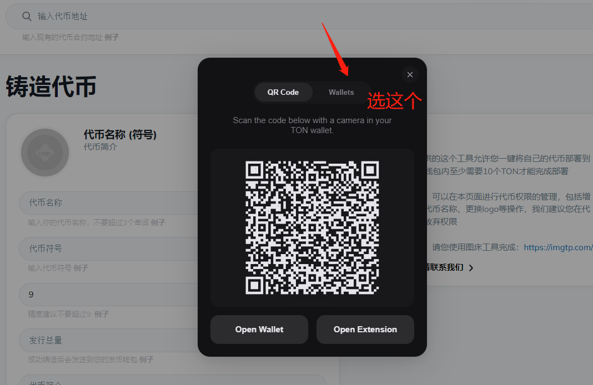<figcaption></figcaption></figure>

之后会弹出很多钱包让你选择，找到Tonkeeper，点击连接

<figure>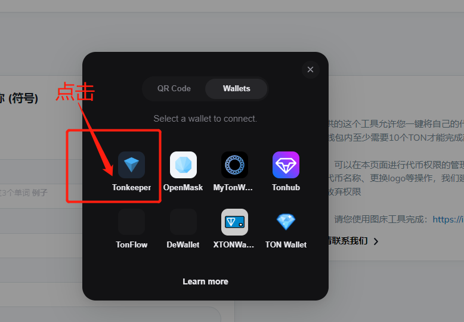<figcaption></figcaption></figure>

此时钱包会提示让你点击确认连接

<figure>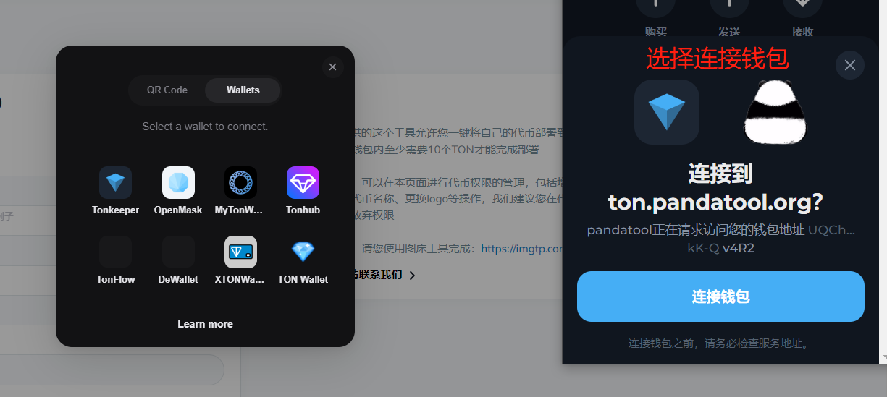<figcaption>
确认钱包连接
</figcaption></figure>

连接成功后，能在右上角看到你的钱包地址

<figure>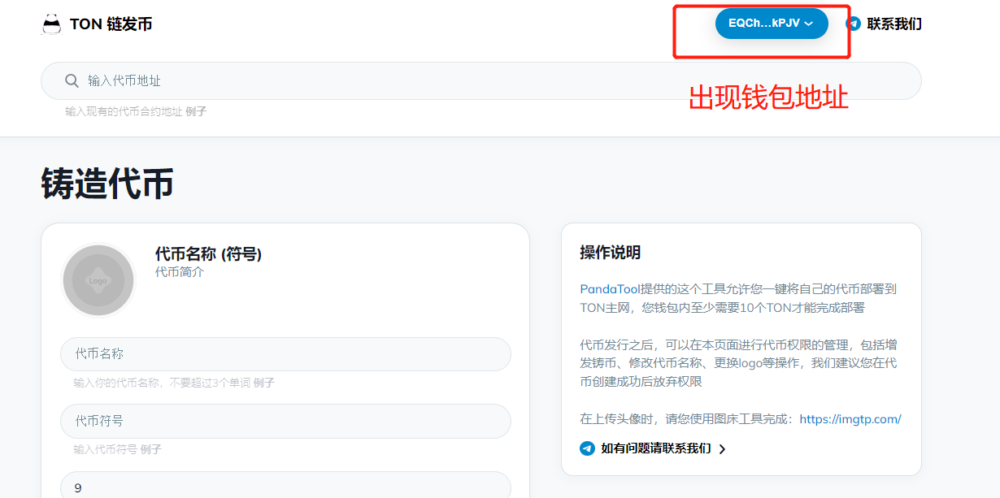<figcaption></figcaption></figure>

### 2、填写代币参数

接下来，我们按照顺序填写代币参数

<figure>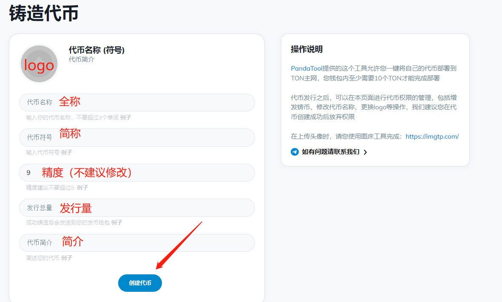<figcaption></figcaption></figure>

* **代币名称：**就是全称，例如Bitcoin
* **代币符号：**就是简称，例如BTC
* **精度：**默认是9，不建议修改
* **发行量：**代币总供应量
* **简介：**代币介绍
* **Logo：**需要手动上传，或者通过图床工具上传
* **注意：**精度为9的情况下，代币数量不能超过1,000,000,000,000,000,000,000,000,000。如果要增大发行量，可以降低精度

我们点击那个头像的位置

<figure><figcaption></figcaption></figure>

之后会看到一个提示，让你输入logo的链接或者上传图片

<figure>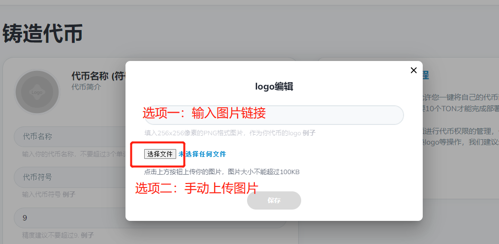<figcaption></figcaption></figure>

* **选项一：**大家可以自己找一个图床，上传图片后将链接复制进来，缺点是不方便，优点是`没有大小限制`
* **选项二：**大家手动将logo图片传上来，优点是方便，缺点是图片不能大于`100k`

具体使用哪种方式，大家可以根据自己的需要选择。我这边选择手动上传一个小于100k的图片，具体如下所示：

<figure>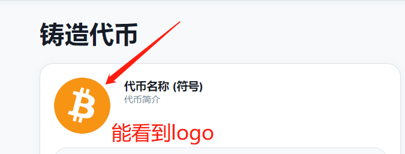<figcaption></figcaption></figure>

注意，如果图片大于100k，是有提示的，如下所示，此时需要将图片改小一点

<figure><figcaption></figcaption></figure>

如果链接输入错误，也是无法识别的，会出现下面这个情况，此时重新更换链接即可。

<figure>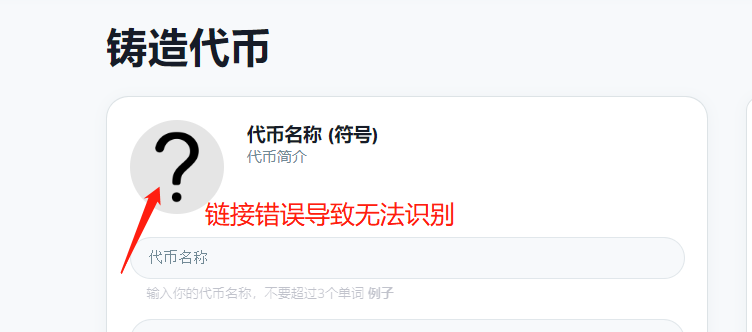<figcaption></figcaption></figure>

搞定了logo问题后，我重新填写了所有所有数据，大家可以看下

<figure>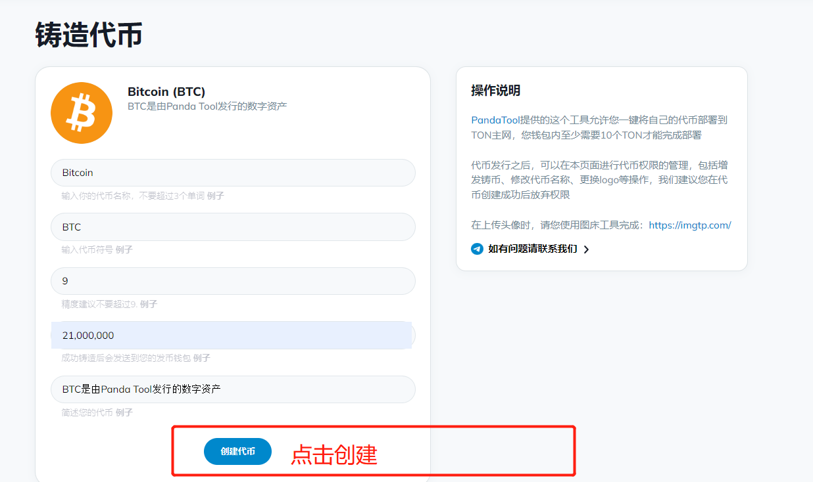<figcaption></figcaption></figure>

确认信息无误后，点击创建代币，弹出钱包进行确认就可以了

<figure>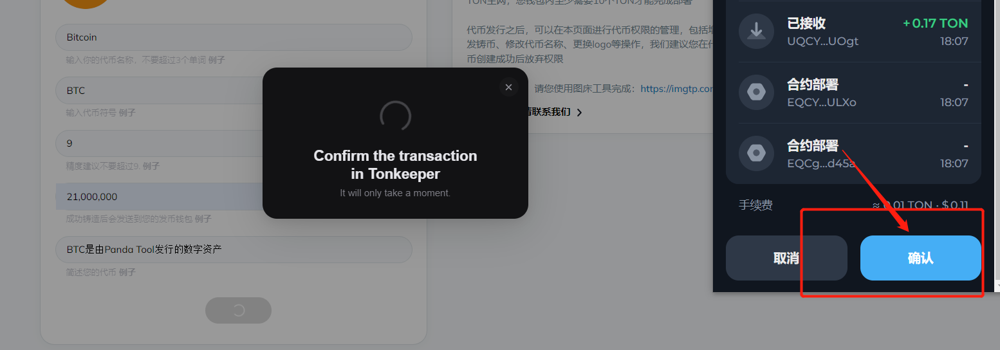<figcaption></figcaption></figure>

钱包确认并支付成功后，等待几秒钟，就能看到你发行的代币页面，并通过该页面对代币进行管理

<figure>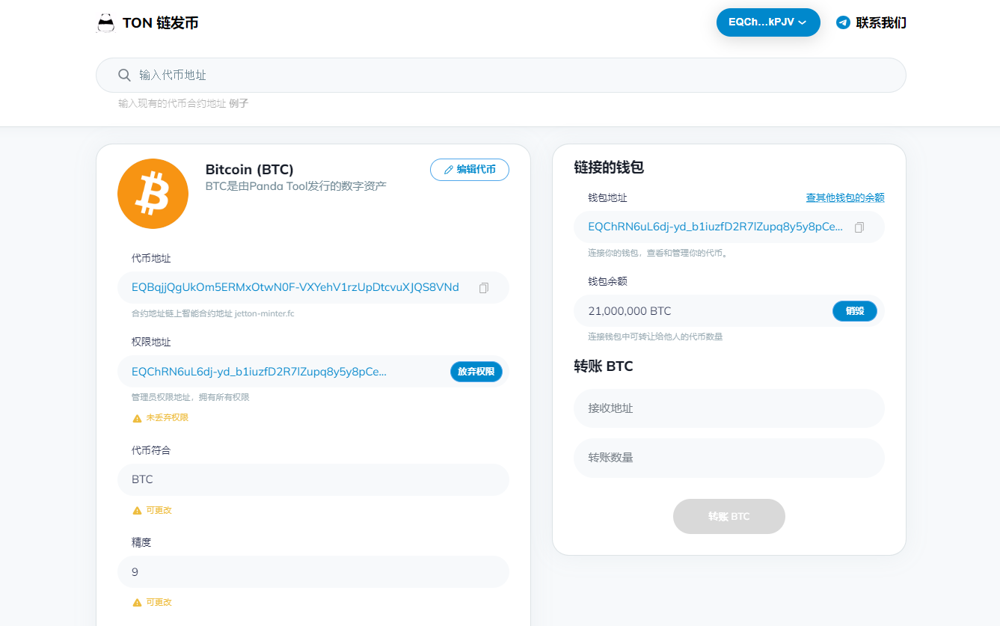<figcaption></figcaption></figure>

此时在链上浏览器里，也已经能看到你的代币资料了

<figure>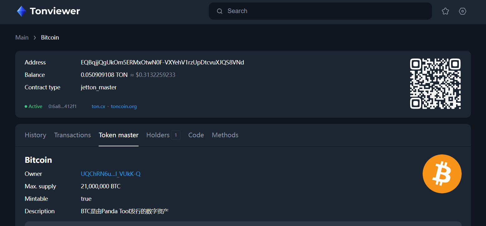<figcaption>
Tonviewer浏览器页面，不同的浏览器显示的信息可能不一样
</figcaption></figure>

### 3、修改代币参数

TON链发出来的币，默认是带有权限的，这些权限包括：修改代币名称、logo、简介、增发代币数量等。你可以选择使用这些权限修改代币参数，也可以放弃权限，操作的过程大概是这样的：

首先，我们在发币页面的`搜索框`，输入你的代币合约地址，然后点击`查找`

<figure>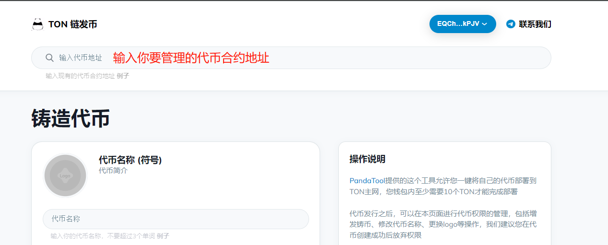<figcaption>
输入代币合约地址
</figcaption></figure>

<figure><figcaption>
查找代币
</figcaption></figure>

等待几秒钟，就能看到你的代币控制台管理页面，然后点击`编辑代币`，就能修改参数了

<figure>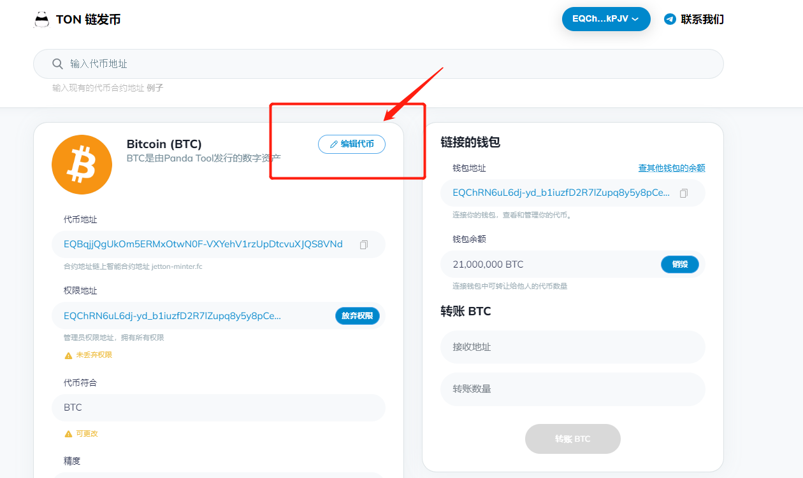<figcaption></figcaption></figure>

在编辑页面，填写新的代币全称、代币简称以及代币简介，然后点击保存，会弹出钱包，等到确认后，就可以完成更新了

<figure>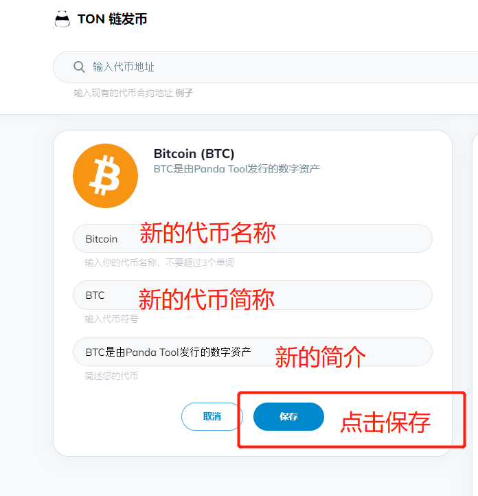<figcaption>
新的代币参数
</figcaption></figure>

<figure>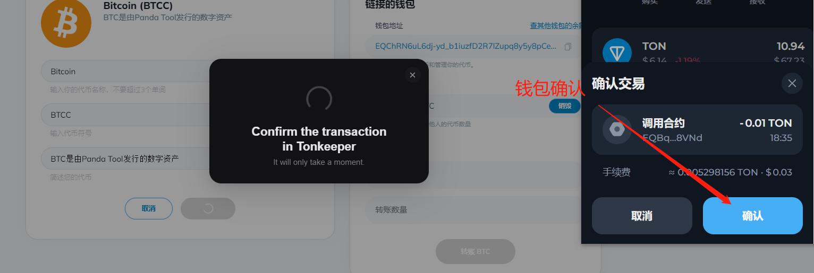<figcaption>
钱包确认
</figcaption></figure>

除此之外，你还可以进行代币增发以及代币销毁

<figure>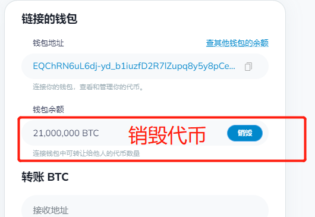<figcaption></figcaption></figure>

<figure>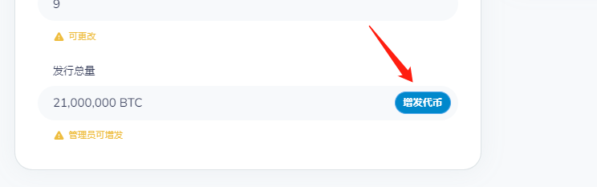<figcaption></figcaption></figure>

当然，我们还是强烈你在代币发行完成后，丢弃权限

<figure>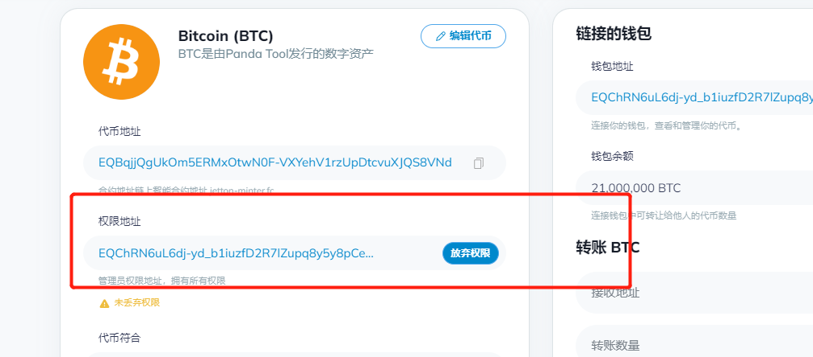<figcaption></figcaption></figure>

### 4、钱包添加代币

在代币发行完成后，我们会发现钱包里并没有看到币，这个时候应该在钱包里`添加显示`一下才行，具体的操作是这样的

打开Tonkeeper，点击设置

<figure>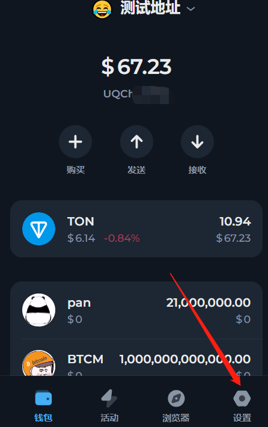<figcaption></figcaption></figure>

在设置页面，选择代币设置

<figure>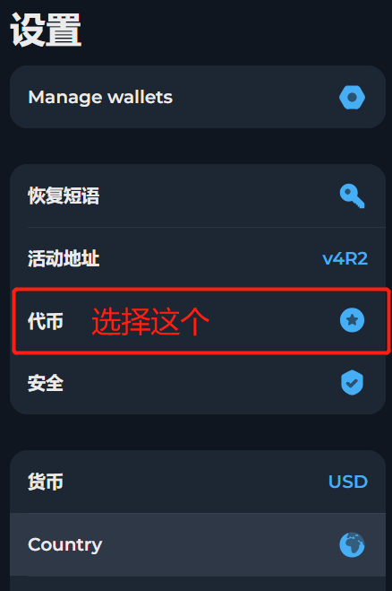<figcaption></figcaption></figure>

之后你会在看到钱包地址里所有的代币，如果你要它显示出来，就打勾。不想让他显示，就去除选项，就可以了

<figure>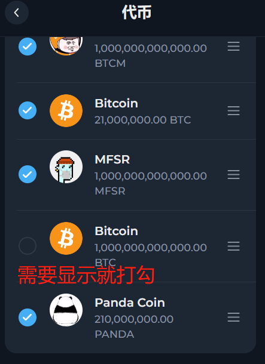<figcaption></figcaption></figure>

## 疑问解答 

**1、错误提示503是什么意思？**

<figure>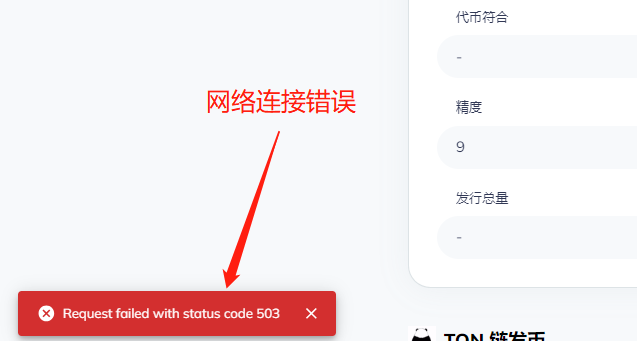<figcaption></figcaption></figure>

* **答：**这个提示的意思是，网络链接太卡，此时需要重新刷新网络

**2、Tonkeeper显示代币未验证怎么办？**

<figure>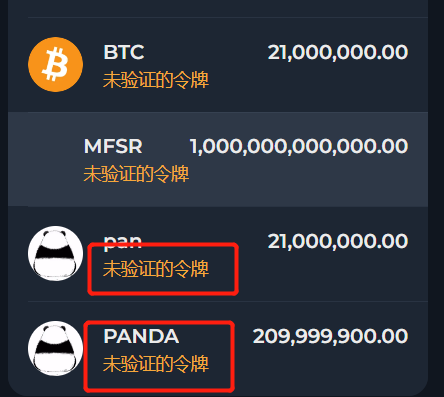<figcaption></figcaption></figure>

* **答：**需要在Github提交代币信息，由官方团队审核后完成验证，提交地址：[https://github.com/tonkeeper/ton-assets](https://github.com/tonkeeper/ton-assets)

**3、有哪些图床工具可以使用吗？**

* **答：**我这边可以给大家推荐几个，但是稳定性不太好说
* 路过图床：[https://imgse.com/](https://imgse.com/)
* 聚合图床：[https://www.superbed.cn/](https://www.superbed.cn/)
* 无铭图床：[https://wmimg.com/](https://wmimg.com/)
* IMG图床：[https://imgimg.cc/](https://imgimg.cc/)
* 简单图床：[https://png.cm/](https://png.cm/)
* 盘古图床：[https://www.panguidc.com/](https://www.panguidc.com/)

**4、我可以使用其他钱包发币吗？例如Myton、Openmask？**

* **答：**你可以使用其他钱包发行代币，但是管理代币权限、修改代币参数，只能使用Tonkeeper钱包

如有不明白或者不清楚的地方，请加入官方电报群：[https://t.me/PandaTool](https://t.me/PandaTool)

