# TON链一键发币教程

## 注意事项 

* 发币之前，务必使用安装Tonkeeper钱包插件，安装教程➔ [https://help.pandatool.org/ton/tonkeeper](https://help.pandatool.org/ton/tonkeeper)
* 钱包内最少准备10个TON


TON链发币视频教程


## TON发币教程

### 1、连接Tonkeeper钱包

首先，我们打开TON链发币链接：[https://ton.pandatool.org/zh-CN](https://ton.pandatool.org/zh-CN)，点击右上角连接钱包

<figure><figcaption></figcaption></figure>

在弹出来的页面选择Tonkeeper钱包

<figure>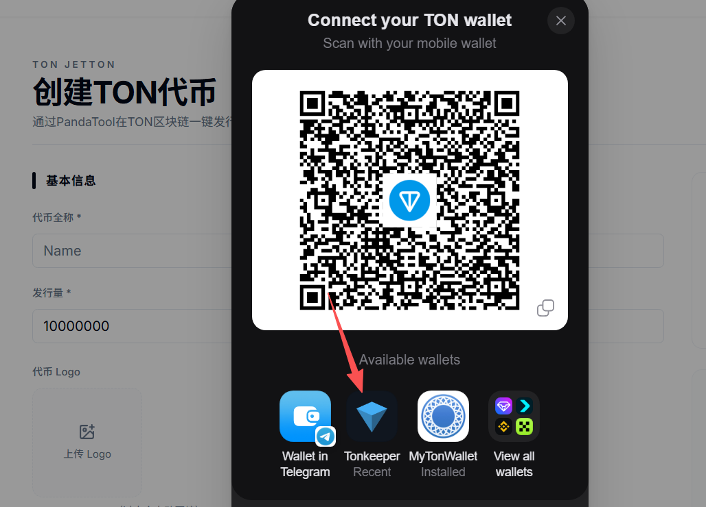<figcaption></figcaption></figure>

然后选择Browser Extension（浏览器钱包）

<figure>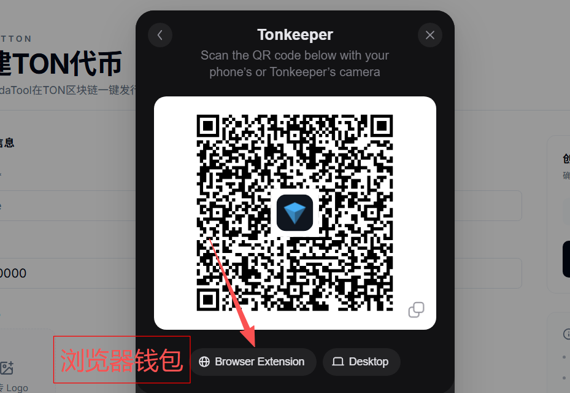<figcaption></figcaption></figure>

此时钱包会提示让你点击确认连接

<figure>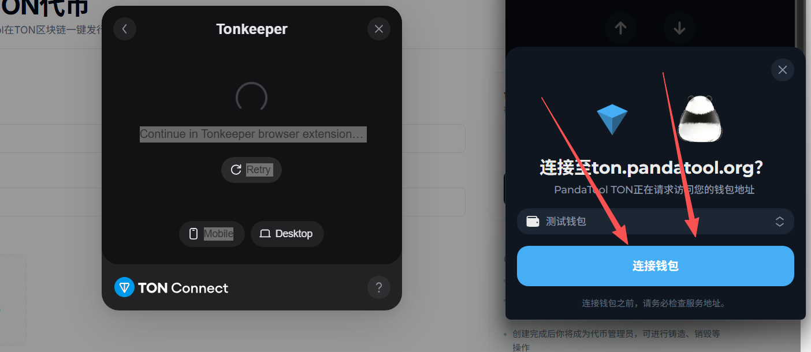<figcaption></figcaption></figure>

连接成功后，能在右上角看到你的钱包地址

<figure><figcaption></figcaption></figure>

### 2、填写代币参数

接下来，我们按照顺序填写代币参数

<figure>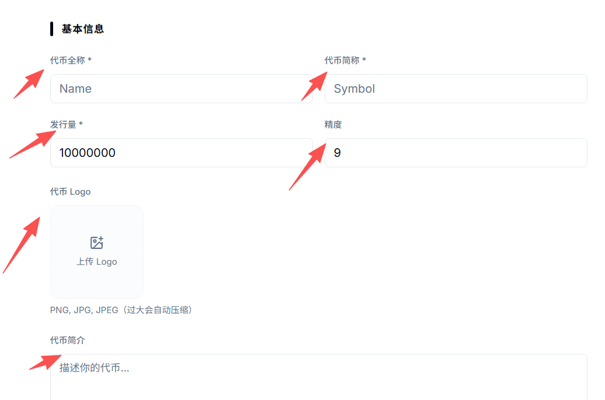<figcaption></figcaption></figure>

* **代币全称：**&#x5C31;是名称，例如Bitcoin
* **代币简称：**&#x5C31;是符号，例如BTC
* **发行量：**&#x4EE3;币总供应量
* **精度：**&#x9ED8;认是9，不建议修改
* **简介：**&#x4EE3;币的信息介绍
* **Logo：**&#x76F4;接点击需要上传
* **注意：**&#x7CBE;度为9的情况下，代币数量不能超过1,000,000,000,000,000,000,000,000,000。如果要增大发行量，可以降低精度

例如我填写的资料

<figure>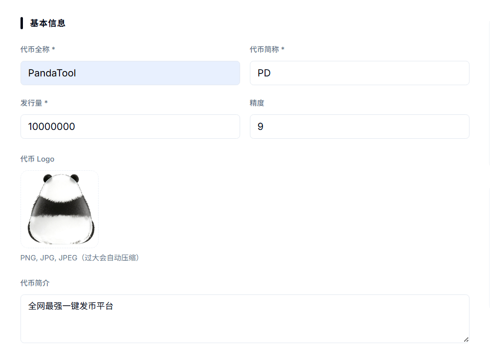<figcaption></figcaption></figure>

确认信息无误后，点击创建代币，弹出钱包进行确认就可以了

<figure><figcaption></figcaption></figure>

钱包确认并支付成功后，等待几秒钟，就能看到你发行的代币页面，并通过该页面对代币进行管理

<figure>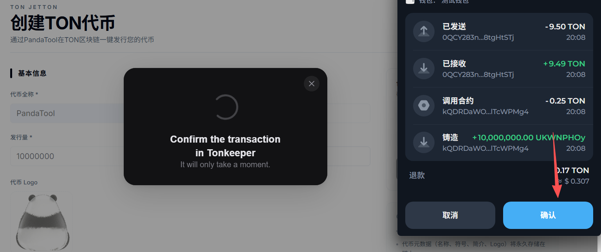<figcaption></figcaption></figure>

此时在链上浏览器里，也已经能看到你的代币资料了

<figure>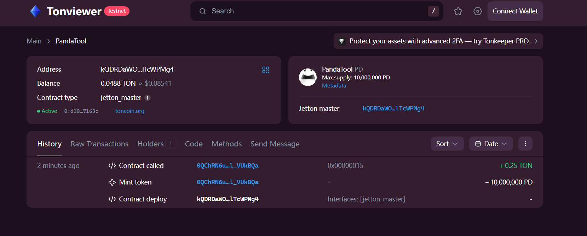<figcaption></figcaption></figure>

### 3、修改代币参数

TON链发出来的币，默认是带有权限的，这些权限包括：修改代币名称、logo、简介、增发代币数量等。你可以选择使用这些权限修改代币参数，也可以放弃权限，操作的过程大概是这样的：

首先，我们在代币管理页面：[https://ton.pandatool.org/zh-CN/jetton](https://ton.pandatool.org/zh-CN/jetton)，输入你的代币合约地址或者直接查找代币

<figure>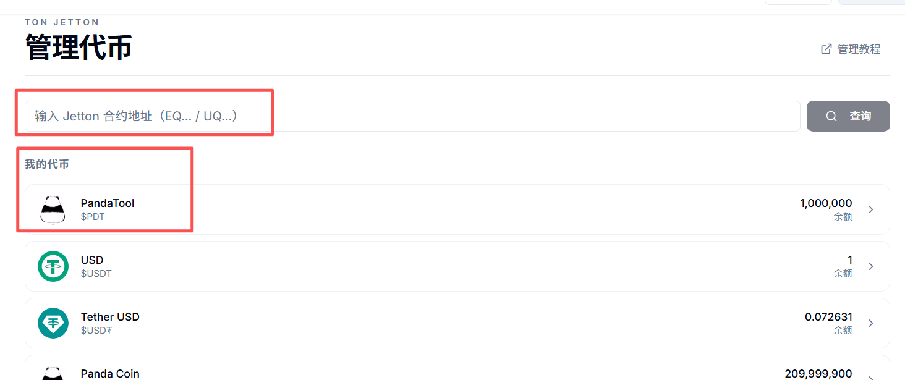<figcaption></figcaption></figure>

然后直接点击你要修改的代币，就能进入管理页面

<figure>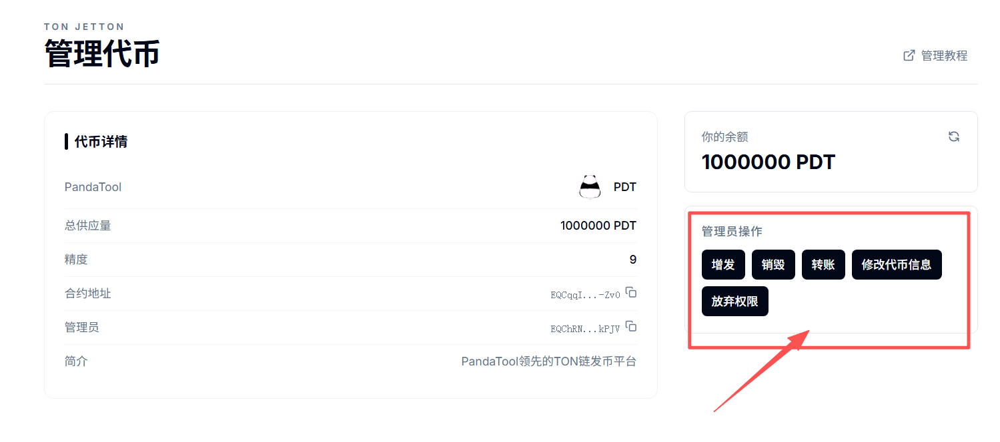<figcaption></figcaption></figure>

**增发：**&#x76F4;接增发代币数量到权限地址

<figure>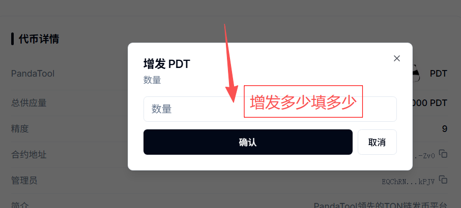<figcaption></figcaption></figure>

**销毁：**&#x5C06;钱包内的代币数量销毁

<figure>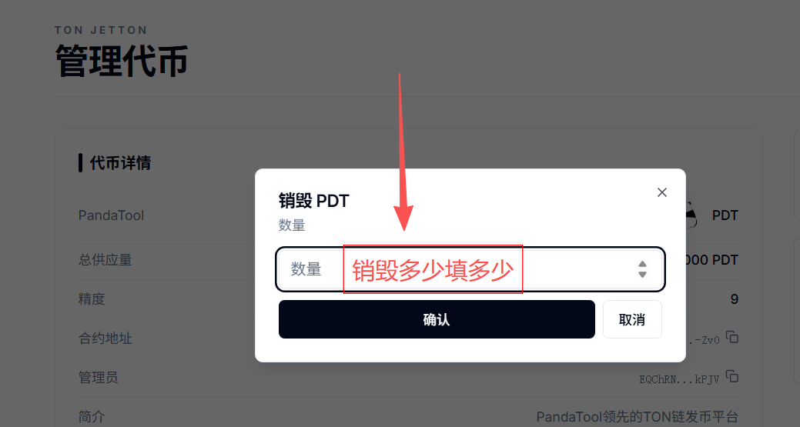<figcaption></figcaption></figure>

**转账：**&#x5C06;代币转账给目标地址

<figure>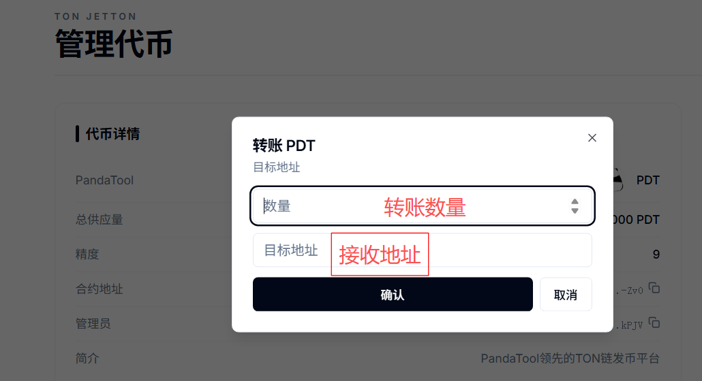<figcaption></figcaption></figure>

**修改代币信息：**&#x53EF;以根据自己的需要修改代币的logo、名称、简称、简介等等

<figure>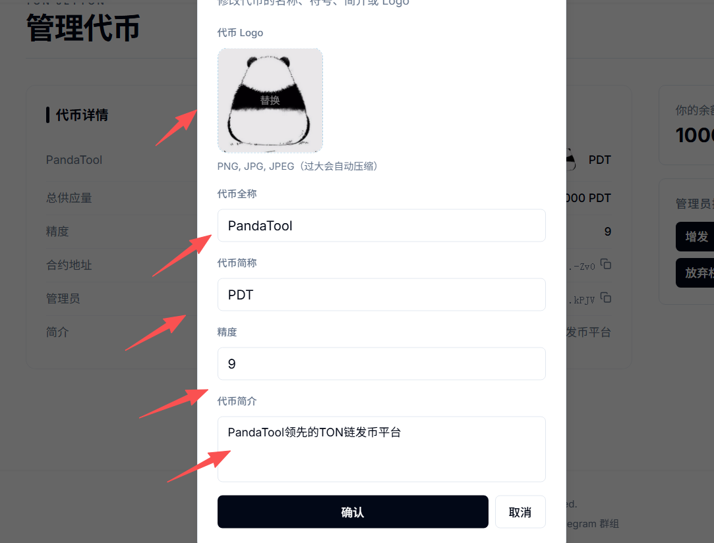<figcaption></figcaption></figure>

**放弃权限：**&#x653E;弃代币的所有权，之后将无法使用修改资料、增发等功能

<figure>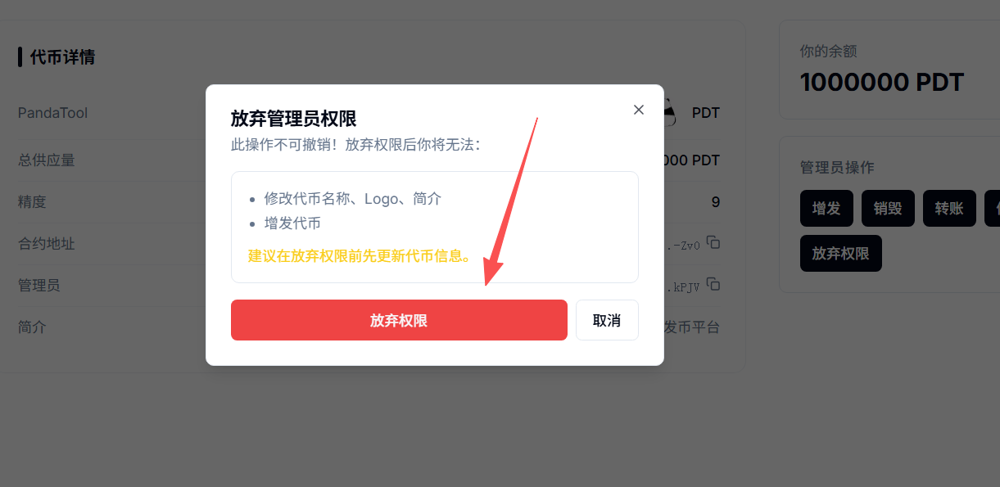<figcaption></figcaption></figure>

### 4、钱包添加代币

在代币发行完成后，我们会发现钱包里并没有看到币，这个时候应该在钱包里`添加显示`一下才行，具体的操作是这样的

打开Tonkeeper，点击设置

<figure>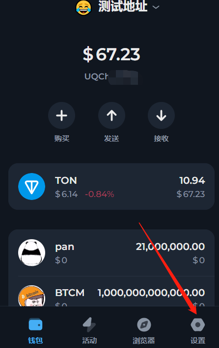<figcaption></figcaption></figure>

在设置页面，选择代币设置

<figure>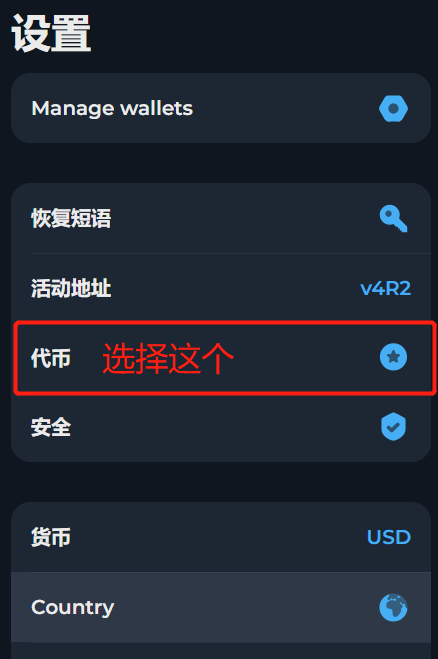<figcaption></figcaption></figure>

之后你会在看到钱包地址里所有的代币，如果你要它显示出来，就打勾。不想让他显示，就去除选项，就可以了

<figure>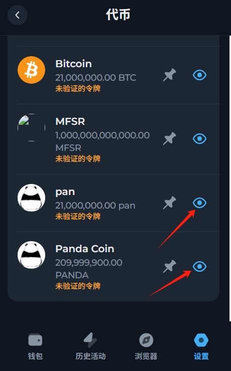<figcaption></figcaption></figure>

## 疑问解答 

**1、错误提示503是什么意思？**

<figure>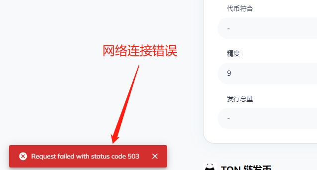<figcaption></figcaption></figure>

* **答：**&#x8FD9;个提示的意思是，网络链接太卡，此时需要重新刷新网络

**2、Tonkeeper显示代币未验证怎么办？**

<figure>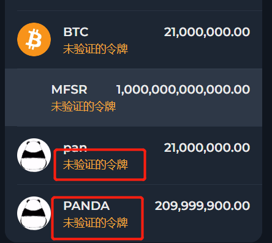<figcaption></figcaption></figure>

* **答：**&#x9700;要在Github提交代币信息，由官方团队审核后完成验证，提交地址：[https://github.com/tonkeeper/ton-assets](https://github.com/tonkeeper/ton-assets)

**3、为什么我在Tonkeeper钱包里没有看到代币选项？**

* **答：**&#x8BF7;先确认自己的地址是否正确。TON地址与比特币类似，有个多个，需要切换到正确的活动地址

<figure>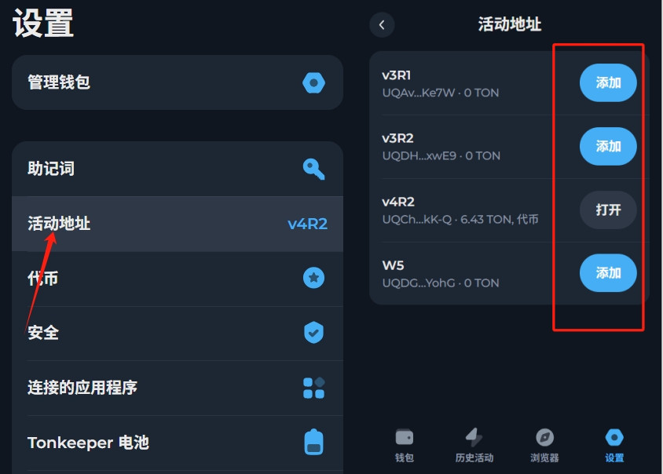<figcaption></figcaption></figure>

**4、我可以使用其他钱包发币吗？例如Myton、Openmask？**

* **答：**&#x4F60;可以使用其他钱包发行代币，但是管理代币权限、修改代币参数，只能使用Tonkeeper钱包

如有不明白或者不清楚的地方，请加入官方电报群：[https://t.me/PandaTool](https://t.me/PandaTool)

