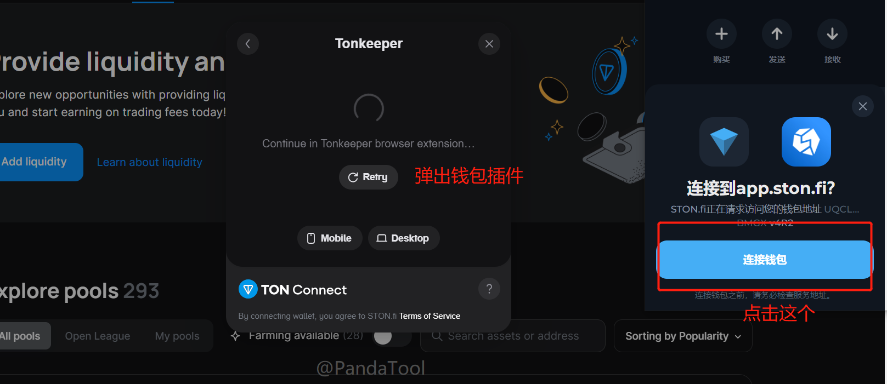
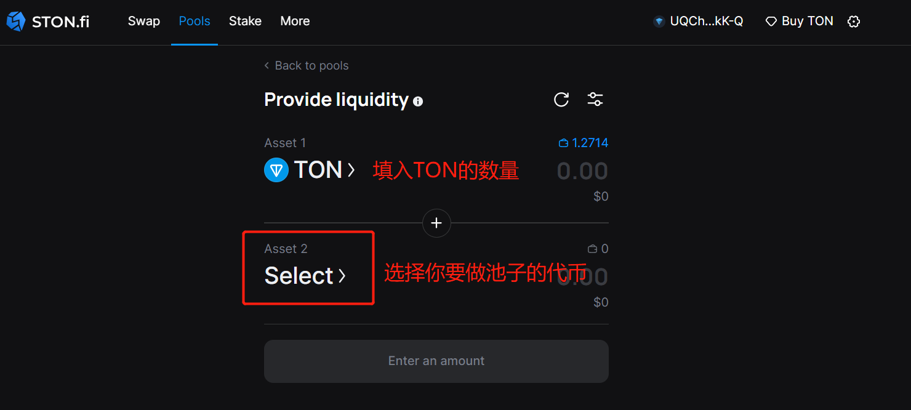
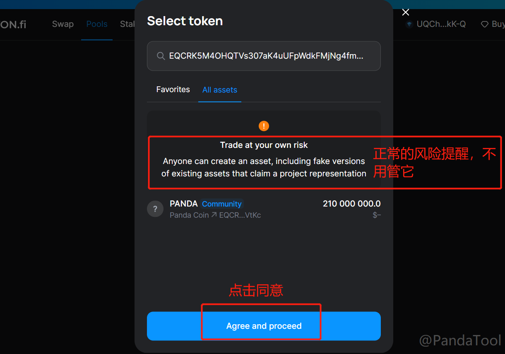
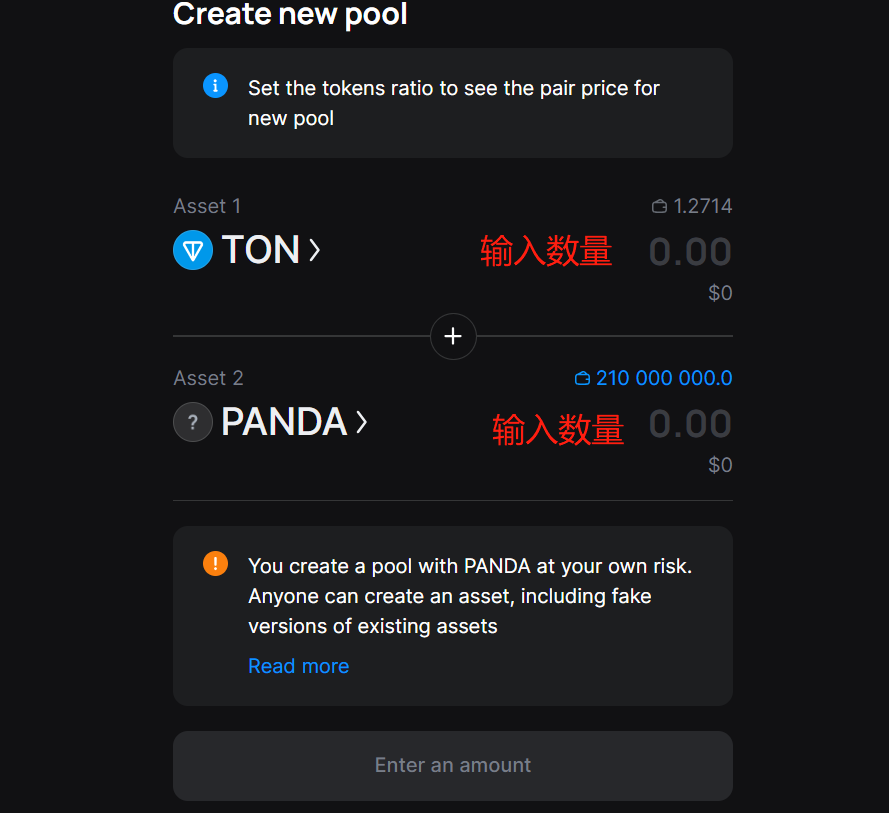
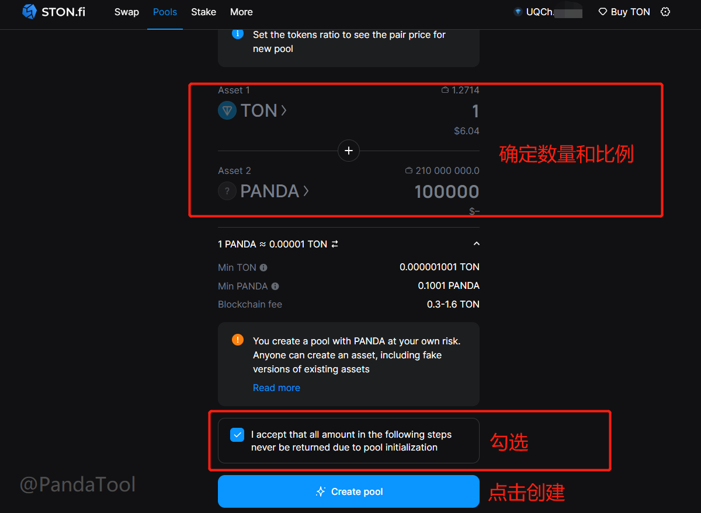
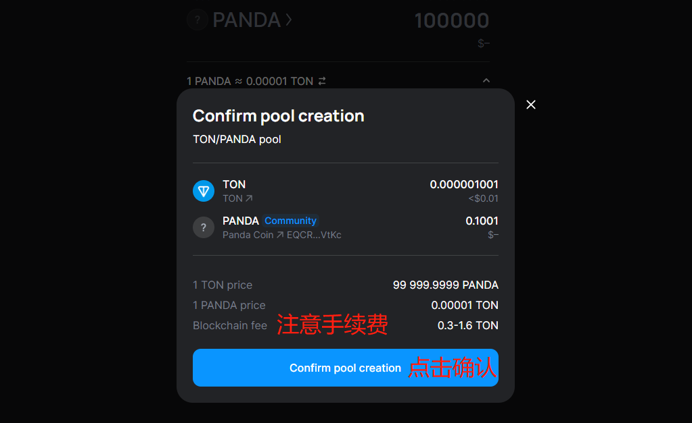

# STON.fi加池子(创建流动性)教程

[STON.fi](http://ston.fi/)是一个基于 TON 区块链的去中心化自动做市商 (AMM)，也是TON链上最大的去中心化交易所。提供几乎零费用、低滑点、极其简单的界面以及与 TON 钱包的直接集成。

## 为什么选择 STON.fi 

STON.fi 成立于 2022 年。它的目标是建立一个用户友好的加密货币交易所，通过接触 `Telegram` 受众来实现大规模采用。 STON.fi 高度重视社区，代表着一个人性化的 `DEX`，为用户提供快速支持并考虑他们的意见。

具有分片功能的 TON 区块链架构允许 STON.fi DEX 用户每秒进行数百万笔交易。

如果你想在TON区块链上发行代币并使其可以交易，[STON.fi](http://ston.fi/)是一个很棒的选择。这篇文章，将教大家在[STON.fi](http://ston.fi/)创建代币流动性，也就是俗称的加池子，和撤池子。

## STON加池子教程 

### 1、连接钱包

首先，我们打开STON的官网：[https://app.ston.fi/pools](https://app.ston.fi/pools) ，点击右上角`Connect Wallet`

<figure><figcaption></figcaption></figure>

此时会弹出一列钱包让你选择，如果你安装了`Tonkeeper`，就选择这个（[Tonkeeper安装教程](tonkeeper.md)）。如果你安装了OpenMask，就选择OpenMask。一般来说，我们会推荐大家使用Tonkeeper

<figure><figcaption></figcaption></figure>

<figure><figcaption></figcaption></figure>

然后会弹出钱包插件，点击`连接钱包`即可

<figure><figcaption>
连接钱包
</figcaption></figure>

连接成功之后，右上角会出现你的钱包地址

<figure><figcaption>
钱包连接成功
</figcaption></figure>

### 2、创建流动性

点击页面的`Add liquidity`，并选择你要`加池`的代币

<figure><figcaption></figcaption></figure>

<figure><figcaption></figcaption></figure>

输入代币合约地址，并且确定要添加的代币数量

<figure><figcaption></figcaption></figure>

<figure><figcaption></figcaption></figure>

注意，两个代币数量的比例，决定了代币的初始价格。例如，我添加1TON和100000个Panda，说明Panda代币的上线价格是0.00001TON。按照TON的价格5.9U计算的话，我的代币上线初始价格就是0.000059

<figure><figcaption></figcaption></figure>

确定好数量和比例后，点击Create Pool，此时会让你进行二次确认

<figure><figcaption></figcaption></figure>

注意，创建一个资金池，可能需要支出0.3\~1.6TON的手续费，所以建议你的钱包至少得有2TON。如果算上加池子的费用，可能还需要更多的TON。

确认无误后，点击Confirm，会弹出钱包，钱包确认就可以了

<figure><figcaption></figcaption></figure>

## STON加池子注意事项 

**1、STON上面没有代币头像怎么办？**

* 答：需要在STON完成申请，且池子内有超过1万U的流动性，才能进入到STON的默认列表里，从而获得头像。申请链接：[https://docs.google.com/forms/d/e/1FAIpQLScGTZjf5DVRutqykFKF477MHoFS9-qzPhkdbOKmo\_hZn66FVA/viewform](https://docs.google.com/forms/d/e/1FAIpQLScGTZjf5DVRutqykFKF477MHoFS9-qzPhkdbOKmo\_hZn66FVA/viewform)

**2、创建流动性的时候提示余额不够？**

* **答：**在STON创建池子，连同gas，需要额外支出1.7个TON，他会要求钱包里至少2.7TON才能发起交易

**3、在STON上面交易需要支付费用吗？**

* **答：**每笔交易需要支出0.3%的费用，其中0.2% 的费用将作为增加资金池规模而支付给流动性提供者的费用，0.1% 的费用支付给STON.fi协议

如有不明白或者不清楚的地方，请加入官方电报群：[https://t.me/PandaTool](https://t.me/PandaTool)
