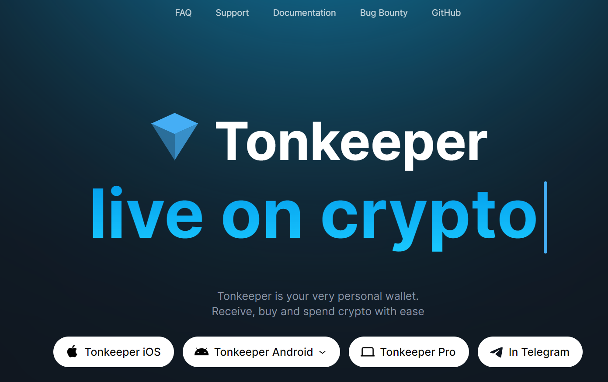
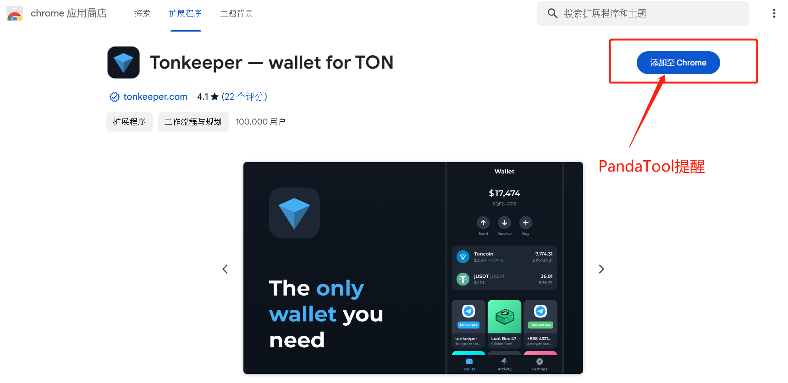
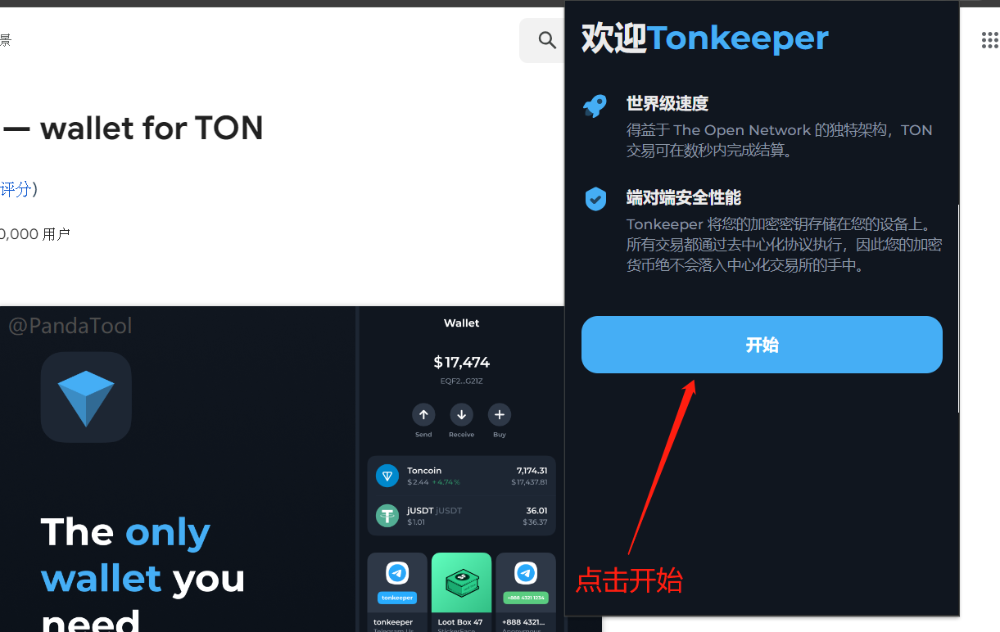
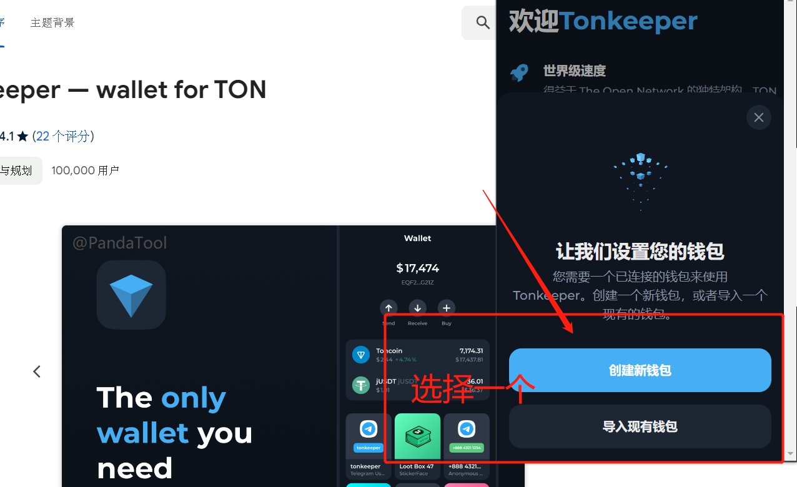
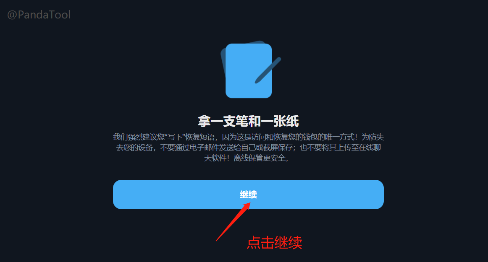
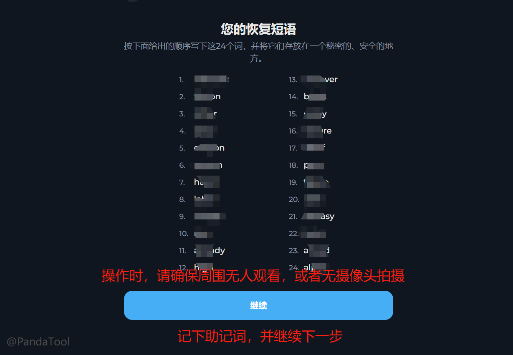
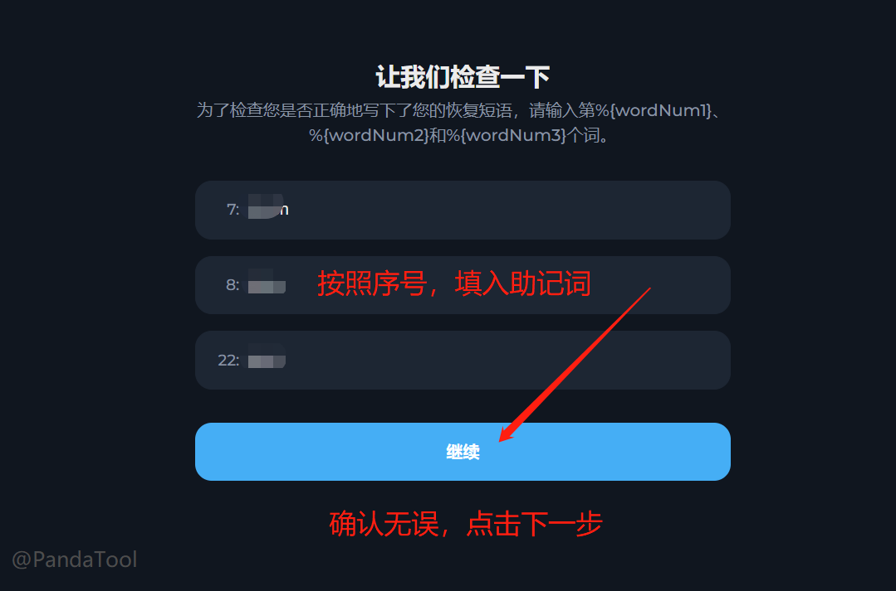
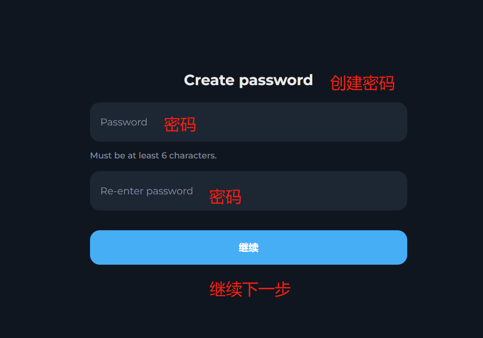
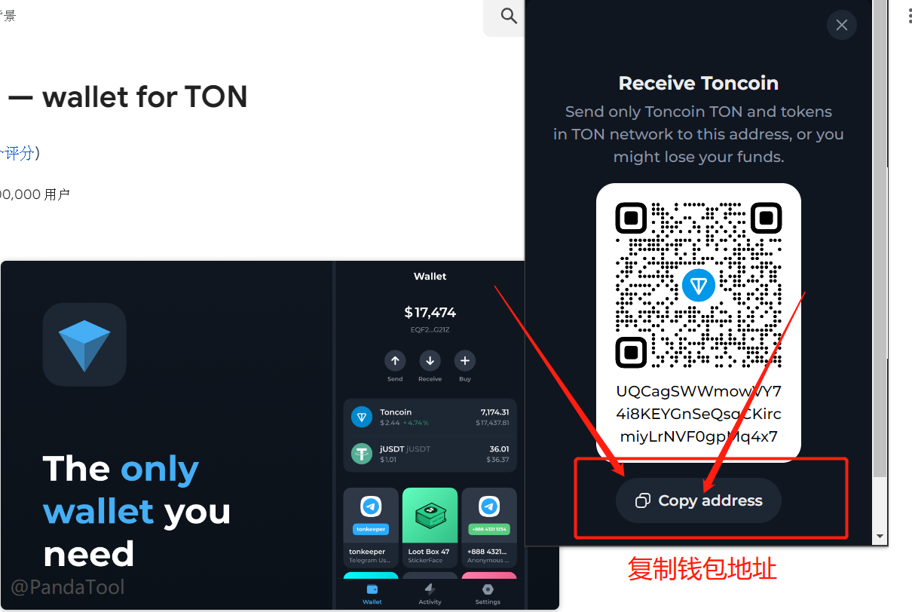

# Tonkeeper钱包安装教程

## 什么是Tonkeeper？

Tonkeeper 是 TON链上的最佳加密钱包之一。这种非托管加密货币钱包对于初学者和高级用户来说都是一个不错的选择，其简洁、简化的用户界面提供了多种功能，包括内置交易所、质押等。

<figure><figcaption></figcaption></figure>

## 怎么安装Tonkeeper钱包？

### 1、安装谷歌插件

我们打开谷歌浏览器，点击Tonkeeper钱包插件安装页面：[https://chromewebstore.google.com/detail/tonkeeper-%E2%80%94-wallet-for-to/omaabbefbmiijedngplfjmnooppbclkk?utm\_source=tonkeeper\_index](https://chromewebstore.google.com/detail/tonkeeper-%E2%80%94-wallet-for-to/omaabbefbmiijedngplfjmnooppbclkk?utm\_source=tonkeeper\_index) ，点击添加至Chrome

<figure><figcaption></figcaption></figure>

之后会弹出一个提醒说让你`添加扩展程序`，点击它等待几秒钟，即可添加完毕

<figure><figcaption></figcaption></figure>

到这一步，钱包插件就算安装完成了，接下来就是配置钱包了

### 2、生成钱包地址

我们在谷歌浏览器上方找到已经安装好的钱包插件，打开并点击开始

<figure><figcaption></figcaption></figure>

<figure><figcaption></figcaption></figure>

之后会提示你让你选择：`创建新钱包`或者`导入现有钱包`。如果你有钱包助记词，就导入钱包。如果没有助记词，就选择创建新钱包

<figure><figcaption></figcaption></figure>

假设我们选择创建新钱包，之后会跳转到一个页面，让你准备记录下你的助记词

<figure><figcaption></figcaption></figure>

之后会弹出助记词页面，记录下你的钱包助记词。注意，为防止助记词泄露，请不要在有人观看，或者附近有摄像头的环境下操作

<figure><figcaption></figcaption></figure>

之后，会让你验证助记词。按照他给的序号，填入相应的助记词（注意大小写），即可完成操作

<figure><figcaption></figcaption></figure>

助记词完成后，创建一个钱包密码。该密码是在你每次支付确认的时候需要输入的

<figure><figcaption></figcaption></figure>

密码设置完成后，恭喜你，你的钱包已经创建成功

<figure><figcaption></figcaption></figure>

### 3、接收TON

此时，如果你还没有TON代币，可以通过欧易交易所购买之后，提币到你的钱包地址

<figure><figcaption></figcaption></figure>

<figure><figcaption></figcaption></figure>

## 其他钱包

如果你觉得Tonkeeper钱包不太方便的话，还可以选择其他钱包插件

* OpenMask：[https://www.openmask.app/](https://www.openmask.app/)
* MyTonWallet：[https://mytonwallet.io/](https://mytonwallet.io/)
* Tonflow：[https://tonflow.io/](https://tonflow.io/)

如有不明白或者不清楚的地方，请加入官方电报群：[https://t.me/PandaTool](https://t.me/PandaTool)
