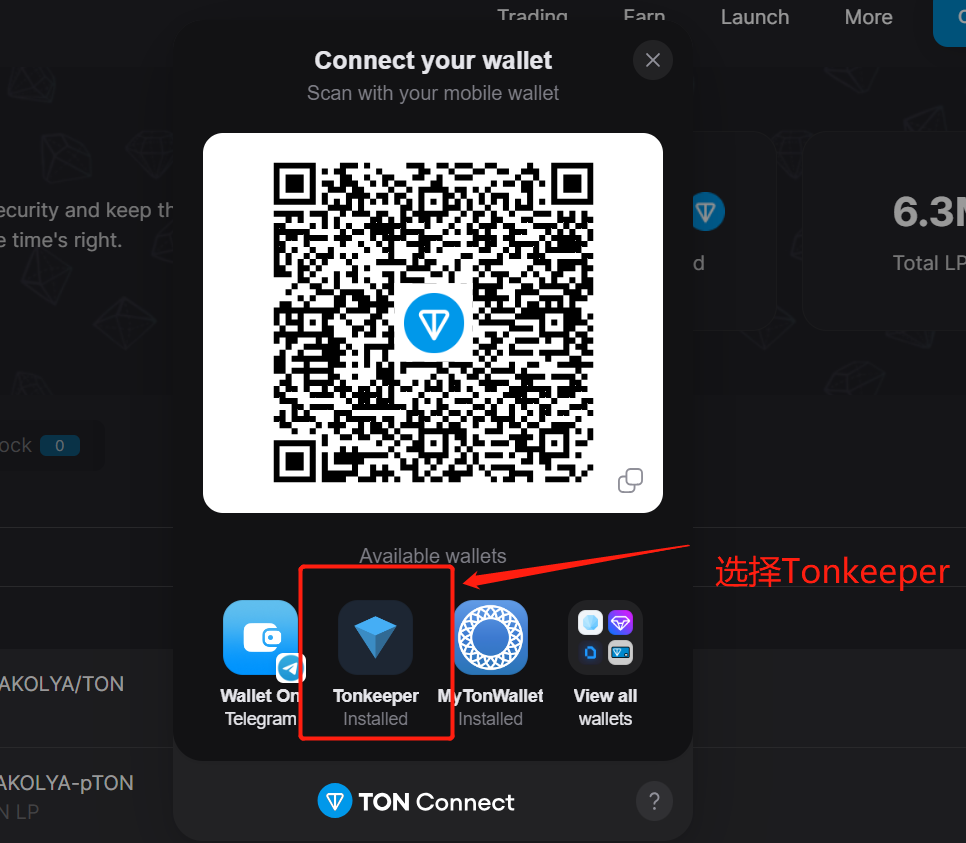
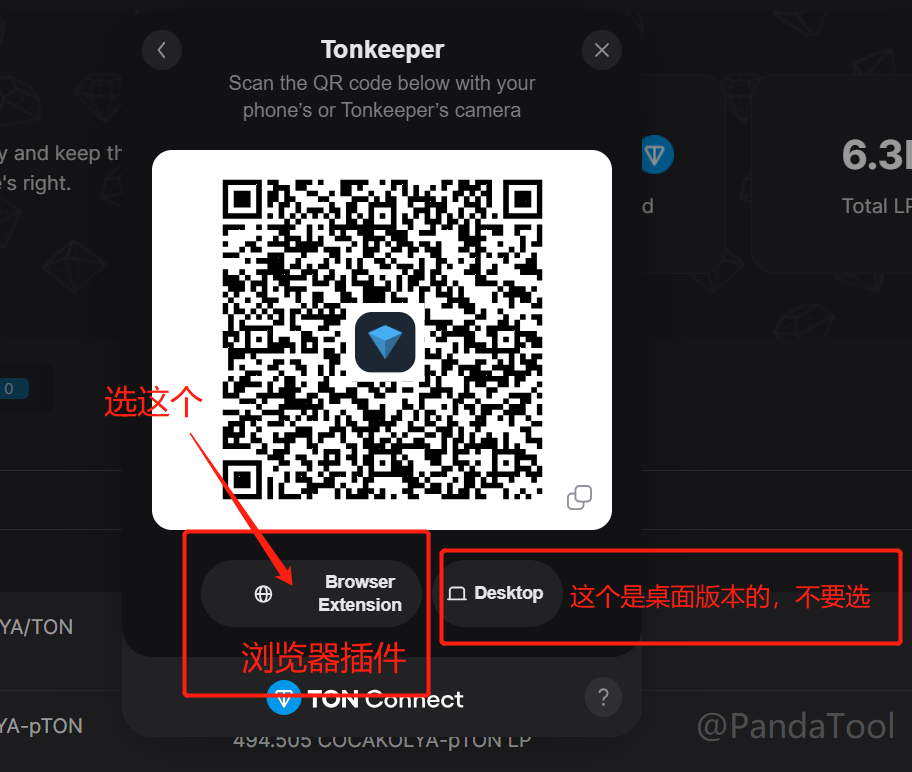
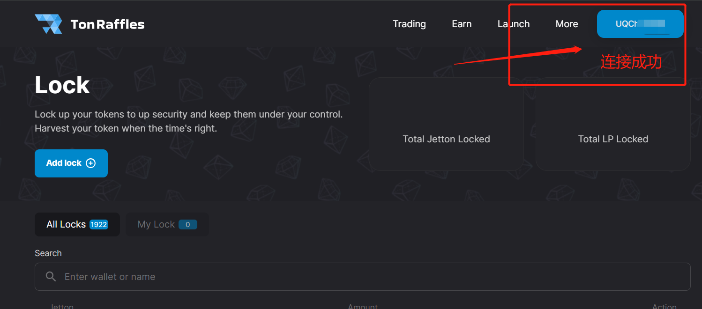
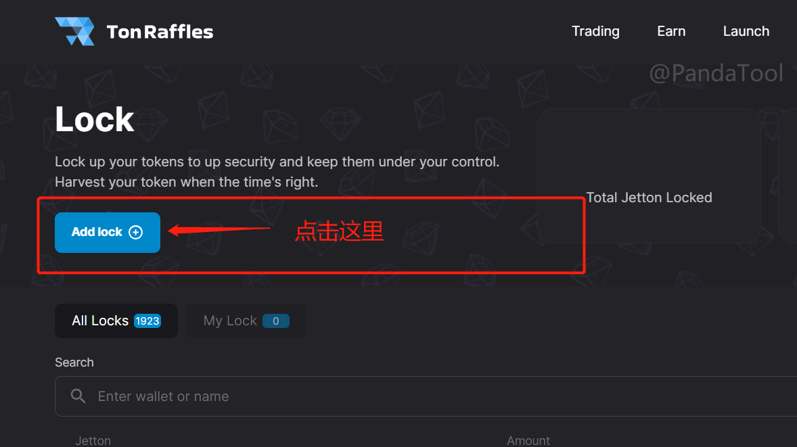
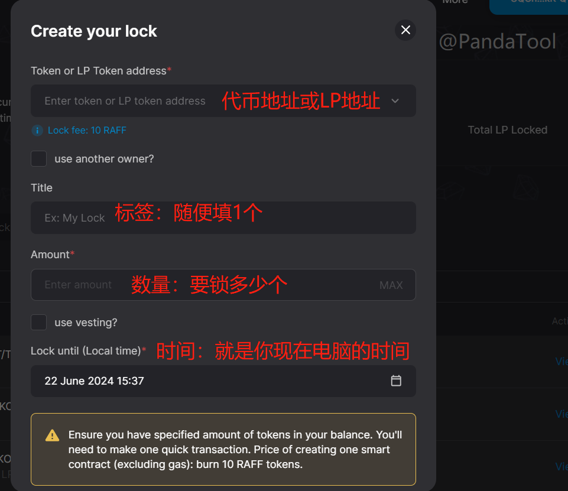

# TON锁池平台TonRaffles使用教程

TON链上面的锁仓与锁池，与BSC链上差别不大，都是将代币或LP代币转入到某个地址里，只要无法取出，就意味着完成锁定了。

## 一、TON锁池/锁仓基础概念梳理

### 1、锁池和锁仓的区别是什么？ 

答：锁池是锁LP，锁仓是锁代币

* **锁池：**将池子的流动性锁住，使其不能撤池子（主要是锁LP）
* **锁仓：**将代币锁住，使其不能转账

### 2、锁池和锁仓有几种方式？ 

答：主要是两种：永久锁和带时间锁

* **永久锁：**将代币或者LP代币转入黑洞，永久无法取出，即可完成
* TON黑洞地址：UQAAAAAAAAAAAAAAAAAAAAAAAAAAAAAAAAAAAAAAAAAAAJKZ
* **带时间锁：**将代币或者LP代币锁在某个智能合约里，到时间可以取出

### 3、TON上面的锁仓平台有几个？ 

答：目前常用的有两个：TonRaffles和TonInu

* [**TonRaffles**](https://tonraffles.app/lock)：TON上面的一站式服务平台，支持交易、预售、锁池等操作
* [**TonInu**](https://app.toninu.tech/locker)：TON区块链的综合工具包，支持发币、预售、锁仓等操作

## 二、TON锁池/锁仓操作教程

这篇教程，主要是教大家通过Tonraffles进行锁池操作。Tonraffles与Toninu两者其实在流程上没有多大区别，但是Tonraffles平台更大、更靠谱点，锁池还是建议大家选择一个大的平台，更为方便一点。

### **1、连接钱包**

我们打开Tonraffles的官网：[https://tonraffles.app/lock](https://tonraffles.app/lock) ，点击右上角Connect Wallet进行钱包连接

<figure><figcaption>
连接钱包
</figcaption></figure>

此时会弹出钱包选择页面，如果你安装的是Tonkeeper，就选择Tonkeeper。如果安装的是其他钱包插件，就选择你安装的插件。注：[Tookeeper钱包安装教程](tonkeeper.md)

<figure><figcaption>
选择Tonkeeper
</figcaption></figure>

<figure><figcaption>
选择浏览器插件版本
</figcaption></figure>

钱包连接完成后，右上角会出现你的钱包地址

<figure><figcaption></figcaption></figure>

此时钱包已经连接成功，先不要动，就留在这个页面

### **2、开始锁池/锁仓**

点击页面中部位置的Add lock，会弹出一个页面，让你输入一些信息

<figure><figcaption>
点击Add lock
</figcaption></figure>

<figure><figcaption>
填写锁池信息
</figcaption></figure>

### **3、填写锁池/锁仓信息**

**Token or LP Token Address：**就是你要锁仓/锁池的相关合约地址

* 锁仓：就输入代币合约地址
* 锁池：就输入LP合约地址

<figure><figcaption>
锁池/锁仓代币列表
</figcaption></figure>

**Lock Fee：**10个RAFF。这个是锁池的费用，RAFF是他们的平台币，需要支付10个

**Use another owner：**是否使另一个权限地址？如果是，输入的新地址将在解锁后收到代币

**Title：**一个标签，随便写就行，无关紧要，不写也无所谓

**Amount：**如果是锁仓，就填写要锁仓的代币数量；如果要锁池，就填写LP数量

**Local Time：**解锁时间。这个时间会默认转换为你的当地时间，不需要做过多改动

<figure><figcaption>
锁池时间
</figcaption></figure>

提示：Ensure you have specified amount of tokens in your balance. You'll need to make one quick transaction. Price of creating one smart contract (excluding gas): burn 10 RAFF tokens.这个句话的意思是，创建锁池/锁仓需要花费10个RAFF代币，以及一些gas费，请确保钱包内有足够的代币、TON以及RAFF。

以下是我填写的内容，可以看看：

<figure><figcaption></figcaption></figure>

我填写的信息意思是这样的：我打算把手中一个叫PANDA的币锁10万个，大概锁到2024年6月29日解锁。

信息填写完成后，点击创建，并支付相关费用，就可以了。

### **4、如何让别人知道自己锁了？**

当你锁池之后，可以在Tonraffle这个页面输入你的代币合约地址，就能看到锁池/锁仓信息。此外，也可以通过电报机器人 [https://t.me/TonkAnalyser\_bot](https://t.me/TonkAnalyser\_bot)  进行查询

## 三、疑问解答

**1、锁池/锁仓要花钱吗？**

* **答：**Tonraffles每锁一次，要支付10个[RAFF代币](https://coinmarketcap.com/currencies/ton-raffles/)。TonInu锁池不需要付费，只需要gas就可以。但为什么依然推荐Tonraffles呢？因为Tonraffles平台较大，稳定性好。

2、**锁池/锁仓是必须的吗？**

* **答：**这不是一个必须要做的事情。但是从项目运营角度来看，锁仓有利于降低代币的流动率，锁池有利于遏制项目方跑路

3、**LP地址怎么获取？**

* **答：**当你在STON等swap做了池子后，钱包会收到一个LP代币，这个地址就是LP地址。如果觉得比较麻烦，也可以通过[DEXTOOL](https://www.dextools.io/app/cn)等平台，输入代币合约地址查询，就能看到一个**对子地址**，这个`对子`，就是LP地址

<figure><figcaption></figcaption></figure>

如有不明白或者不清楚的地方，请加入官方电报群：[https://t.me/PandaTool](https://t.me/PandaTool)
