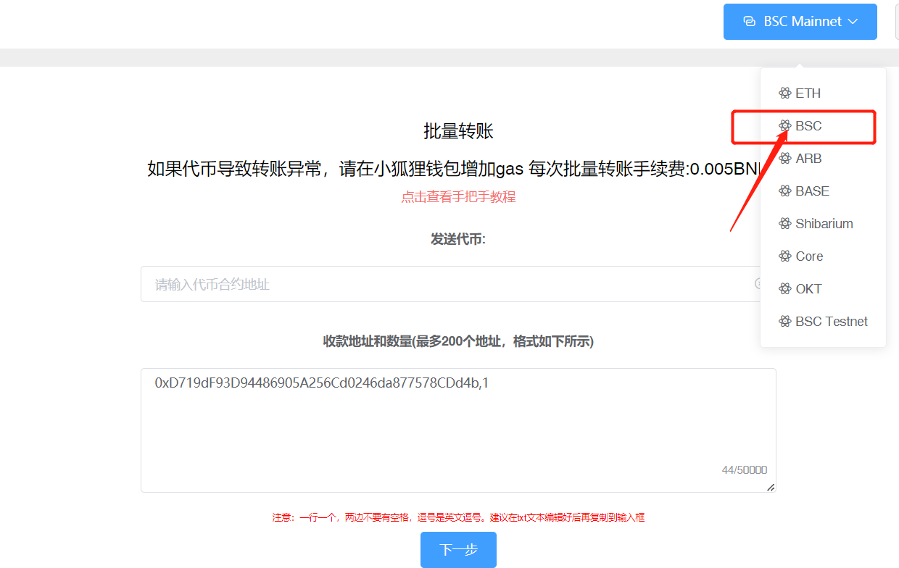
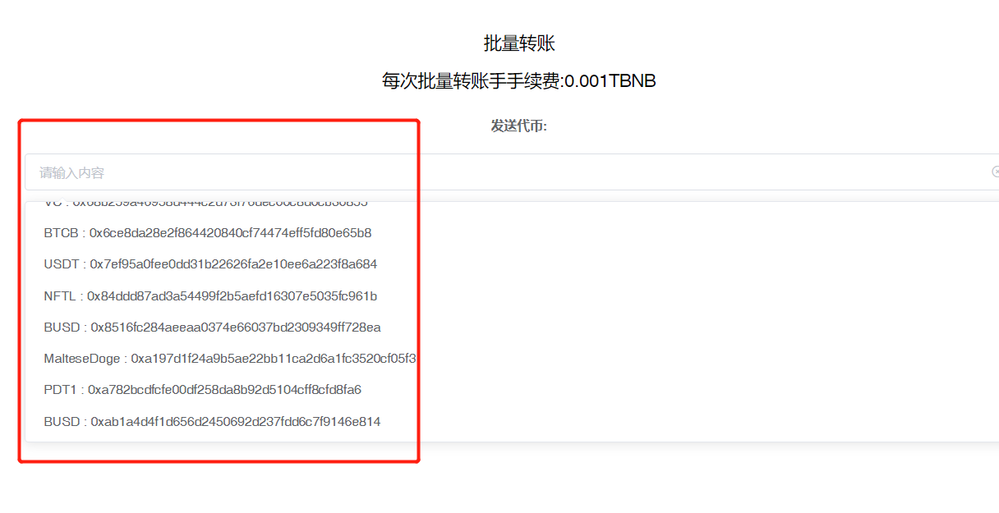
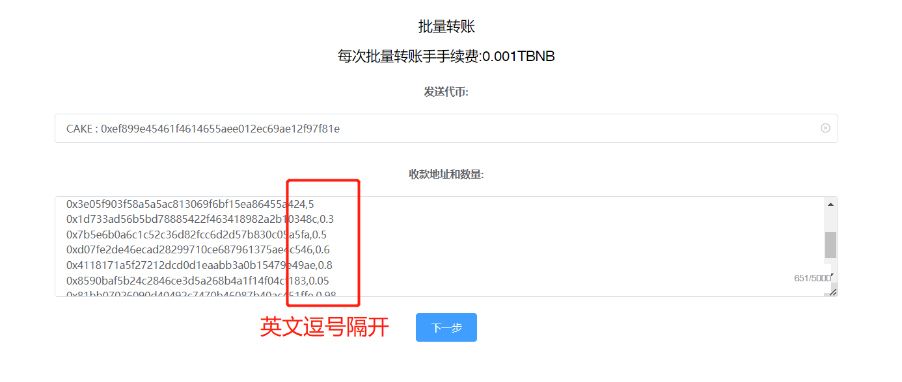
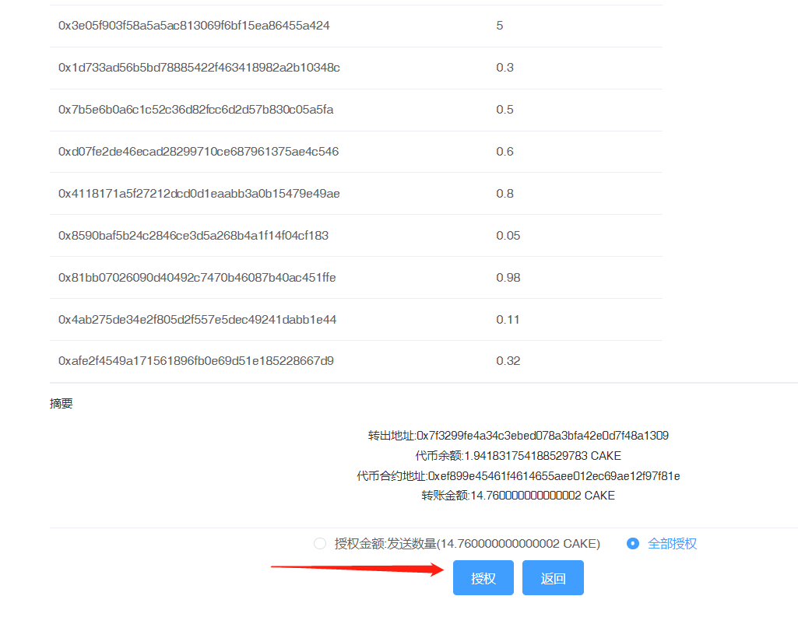

# 批量转账教程

批量转账视频操作教程



## 工具介绍

PandaTool多链批量转账工具，支持ETH、BSC、Base、Arbitrum等多条EVM公链，大大的简化了转账与空投流程，可以快速实现代币空投等多种操作。

## 批量转账费用

* Bsc链：每次收取0.005BNB
* Base链：每次收取0.0001ETH
* Arbitrum链：每次收取0.0001ETH
* ETH链：每次收取0.0001ETH
* Core链：每次收取0.5core

## 工具使用说明

### 1、连接钱包

* 使用浏览器或者钱包打开网址：[https://pandatool.org/#/multisend](https://pandatool.org/#/multisend)，点击右上角，将钱包切换到您所需要的网络，即可在哪个钱包转账。这里以币安为例（BSC）

<figure><figcaption>
选择BSC
</figcaption></figure>

### 2、选择代币

* 从代币列表中，选择要批量发送的代币。如果列表没有你要选择的代币，可以直接输入代币合约地址

<figure><figcaption>
选择代币
</figcaption></figure>

### 3、输入收款地址与数量

在输入框内，填写转账的目标地址，以及每个目标地址接受的代币数量。地址和数量以英文逗号隔开，每行一组，为保证转账效果，一次最好不要输入超过**100个地址**

<figure><figcaption></figcaption></figure>

### 4、授权

点击下一步，确认转账信息无误之后，点击`授权`，使用小狐狸钱包确认

<figure><figcaption>
授权
</figcaption></figure>

### 5、发起转账

授权完成后，点击转账，等待一会，即可完成批量转账，所有转账信息都可以在链上查询

## 工具注意事项

1.、收款地址和数量必须用英文逗号分隔

2、推荐使用PC端操作，更加方便快捷

3、如往交易所地址进行转账，请务必确认交易所是否支持合约转账，否则你的转账将无法到账

4、为保证转账顺利，一次转账的地址数请勿超过100个

5、支持大部分EVM公链，切换到哪个钱包，就自动在哪个链上转账

