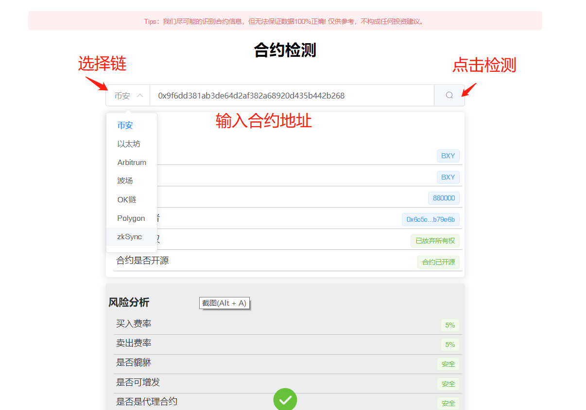

# 合约安全检测

PandaTool提供开放、无需许可、用户驱动的代币安全检测服务，致力于打造web3 的“安全基础设施”。一键体验：[https://pandatool.org/#/contractCheck/contractCheck](https://pandatool.org/#/contractCheck/contractCheck)

## 检测工具优势

### 用户体验佳

PandaTool提供的代币安全检测工具，可以快速自动检测合约代币安全性，一秒就能出结果，不用等待、无需复杂的操作过程，给予用户绝佳的用户体验

### 覆盖范围广

PandaTool集成了GoPlus的代币检测技术，支持8条公链（BSC、ETH、Arbitrum、TRON、zkSync Era、Polyton、Fantom、OKC），累积检测代币超过300w

### 检测项目多

PandaTool合约检测工具累积检测项目超30项，包括白名单、黑名单、增发、买卖税率、代理合约、权限设置、交易冷却等等，让用户可以更直观的了解代币信息

## 检测工具使用方法

打开合约检测页面[https://pandatool.org/#/contractCheck/contractCheck](https://pandatool.org/#/contractCheck/contractCheck)

<figure><figcaption></figcaption></figure>

第一步：选择要检测的合约代币所属链

第三步：输入要检测的合约地址

第四步：点击检测按钮，查询结果

## 合约检测结果分析

### 合约所有权

合约所有者权限，可以在一定程度修改合约方法，如暂停交易、修改税率等等。如果权限抛弃，则可能会恶意修改合约

### 是否合约开源

合约已开源，则可查询合约代码详情。未开源的代币合约更可能存在恶意机制，骗取用户资产

### 买入/卖出费率

代币在去中心化交易所交易时需要指出的税率，税率若超过10%就算偏高；若超过50%可能会导致无法交易

### 是否貔貅

貔貅指的是该代币只能买入，无法卖出

### 是否可增发

代币是否可以进行恶意增发。不明增发机制可能会增加市面上的该币数量，影响此币价格

### 是否是代理合约

代理机制是指项目方通过代理合约可能替换此币的相关逻辑，进而对此币价格、机制产生影响

### 是否交易冷却

交易冷却功能，指的是用户在购买后的一定时间或区块内将不能出售代币

### 是否暂停交易

若存在暂停交易功能，可能导致该代币的买卖交易全部暂停（貔貅风险）

### 是否有交易白名单

白名单地址可以无视交易规则和交易税率，以无税率的前提下在任何时间均可交易

### 是否有交易黑名单

手动黑名单功能，地址被拉黑后将无法进行代币卖出或者转账

### 合约能否自毁

合约自毁功能触发后，代币将被销毁，所有功能不可用，相关资产也会被清除

### 是否能找回权限

若存在取回所有权的逻辑，可能让项目方在放弃所有权后重新获取owner权限

