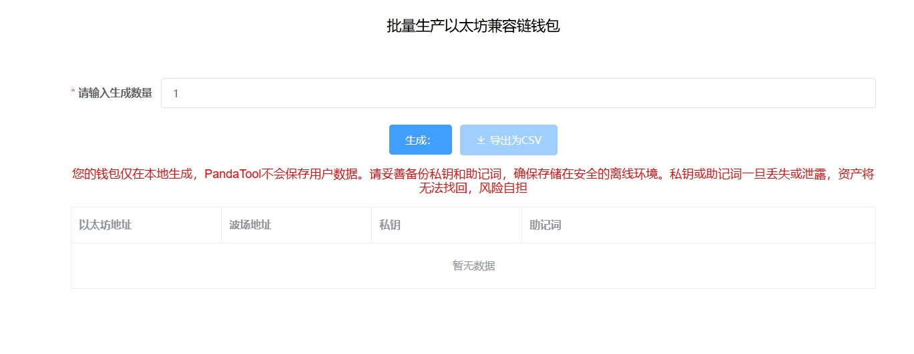

# 批量生成BSC/ETH钱包

批量生成钱包视频操作教程



## 支持公链

PandaTool批量生成钱包工具支持所有EVM兼容链和波场链，EVM兼容链包括：ETH、BSC、OKChain、Polygon、Avalanche、Fantom、Arbitrum、Optimism等

* [x] 靓号钱包生成：[https://pandatool.org/#/evmPrettyWallet?lang=zh-CN](https://pandatool.org/#/evmPrettyWallet?lang=zh-CN)


我们不会存储私钥，请您自行保管，丢失后无法找回！！！

我们不会存储私钥，请您自行保管，丢失后无法找回！！！

我们不会存储私钥，请您自行保管，丢失后无法找回！！！


## 操作流程

**1、断网**

* 为保证私钥安全性，请先断开网络，在本地状态下操作

**2、打开PandaTool**

* 打开PandaTool批量生成钱包工具：[https://www.pandatool.org/#/accountCreate/eth?lang=zh-CN](https://www.pandatool.org/#/accountCreate/eth?lang=zh-CN)

<figure><figcaption></figcaption></figure>

**3、输入数量**

* 输入要生成的地址数量

**4、点击生成**

* 等待几秒钟后，会将生成的钱包地址、私钥和助记词给出来，请妥善保存

## 相关问答

* [x] **生成钱包安全吗？**
  * PandaTool平台支持在断网环境下批量生成地址，100%安全
* [x] **需要费用吗？**
  * 使用PandaTool批量生成钱包，不收取任何费用
* [x] **可以生成靓号地址吗？**
  * 靓号生成工具：[https://pandatool.org/#/evmPrettyWallet?lang=zh-CN](https://pandatool.org/#/evmPrettyWallet?lang=zh-CN)
* [x] 私钥丢失后还能找回吗？

- 私钥丢失后永远无法找回，请妥善保管好私钥

如果您有任何关于钱包生成的问题，可以进入我们的电报群组联系：[https://t.me/pandatool](https://t.me/pandatool)
