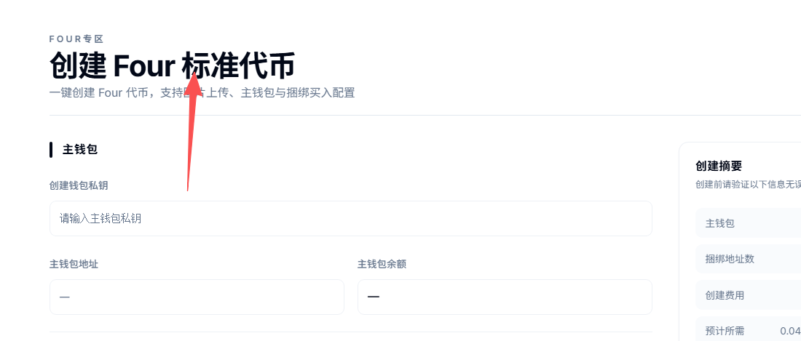
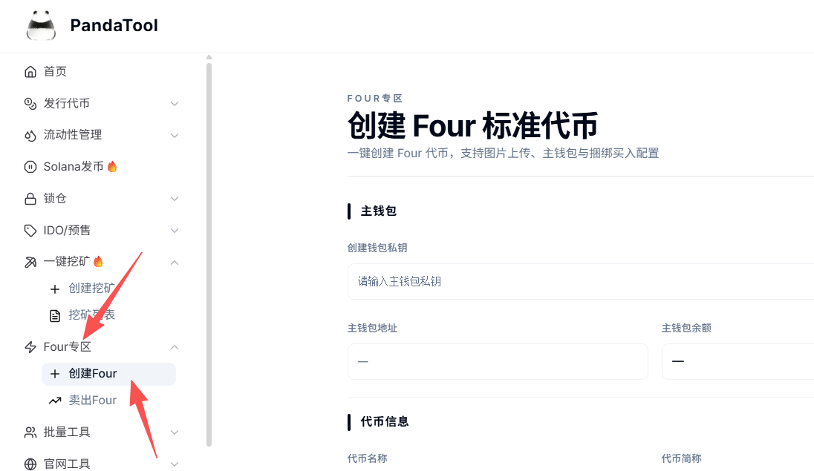
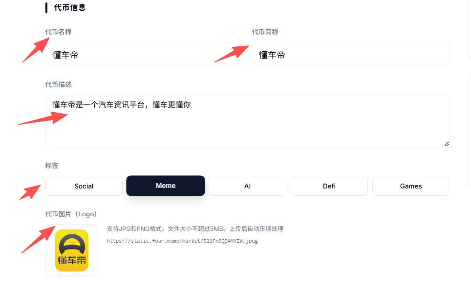
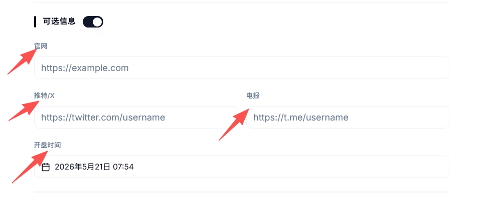
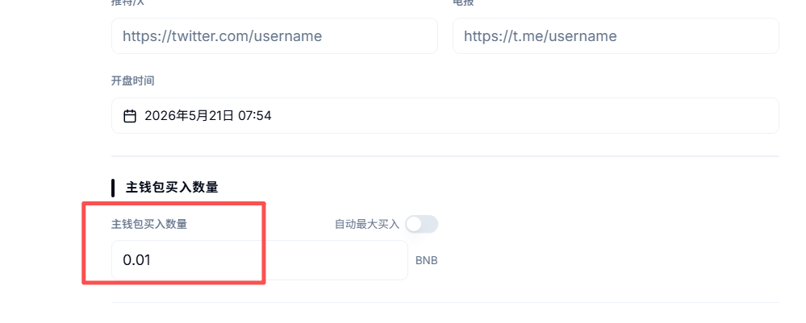
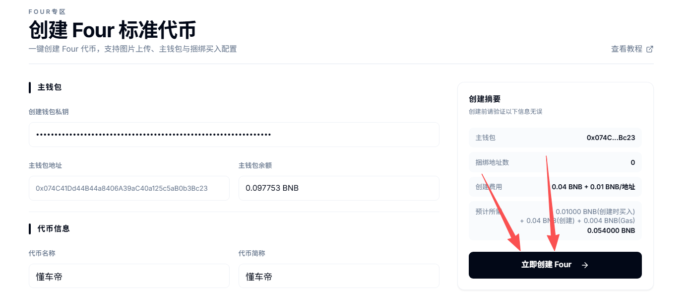
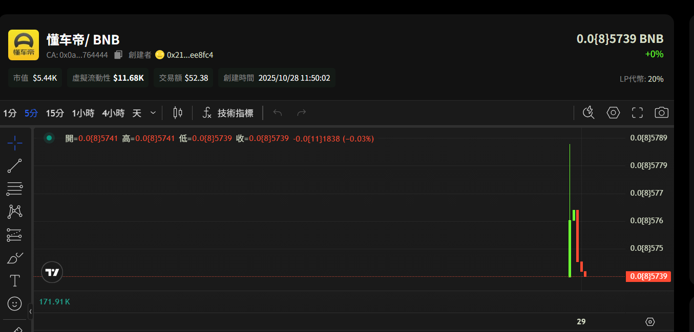
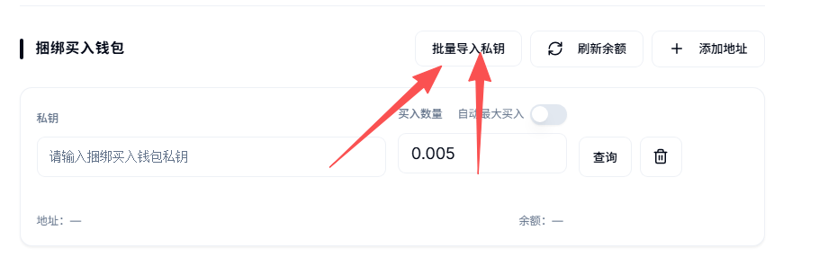

# Four.meme内盘发币教程

## **一、Four概念学习**

**1、什么是Four.meme？**

* **答：**&#x46;our.meme是基于BSC链（币安链）的一个代币发射平台，类似于Solana链的Pump.FUN。Four2024 年 7 月上线，目的就是帮助用户在BNB链上以廉价、快速、稳定地方式创建MEME币。目前Four上面已经诞生了诸多知名项目，例如币安人生、4、TST等等，都是非常知名的代币

<figure><figcaption></figcaption></figure>

**2、大家通常说的BSC内盘是不是Four？内盘和外盘什么区别？**

* **答：**&#x662F;的，BSC内盘发币主要指的就是在Four创建代币。所谓的内盘，指的是这个币发出来之后，只能在Four内部的流动性池交易。等达到条件（池子里18个BNB），就是自动发射到PancakeSwap上。这就是上外盘了，任何人都能来交易。

**3、Four.meme具体是怎么玩的？**

* 答：玩法很简单：你通过PandaTool在Four.meme创建一个代币后，自己先低价买一点，或者通过PandaTool的捆绑买入工具，让多个钱包都买一点代币。然后去推特等平台号召别人去购买代币，不断拉高价格。这个过程，一直都是在Four的内盘进行的。
* 不断的有人买入，池子里BNB越来越多，直到池子里**累积了18个BNB**，Four就会把你的代币自动发射到外盘Pancake上，这就算是完成了第一波流程。由于此时价格就算是比较高了，你就可以将之前手里低价购买的代币卖掉，获取巨额回报。

**4、Four发币与PandaTool正常的一键发币有什么区别？**

* 答：区别较大，可以说完全不是一个东西，通过下面这个表格查看

| 类型          | Four（内盘）                                 | PandaTool（一键发币）             |
| ----------- | ---------------------------------------- | --------------------------- |
| **代币创建**    | 数量固定：10亿                                 | 数量可**自定义**（10亿/20亿/100亿等）   |
| **代币机制**    | 标准币，无功能/税率/分红/销毁                         | 支持**多种功能**（LP分红、持币分红、池子燃烧等） |
| **代币控盘**    | 代币进入Four内盘池，项目方需付费买回筹码                   | 代币直接进**创建者钱包**或自定义收币地址      |
| **资金池创建**   | 内置流动性池，无需自行建池                            | 需在 Pancake 自行创建流动性池         |
| **代币定价**    | 上线初始价格一致，大概0.0000005 \~ 0.000002 BNB/枚代币 | 创建者建池时可**自定上线价格**           |
| **代币 logo** | 可在 OKX/币安钱包**显示**                        | logo 需自行申请/上传               |
| **内盘/外盘**   | 先在内盘，募资达18BNB后才上外盘                       | 一键发币后直接在外盘（Pancake）运行       |

## **二、Four发币的教程**

我们搞清楚Four的玩法之后，第一个问题肯定是：该如何在Four上面发币呢？通过PandaTool，您可以在Four上创建一个BSC上属于自己的MEME币，同时不用再去申请logo了。

以下是Four发币的流程步骤：

1、打开PandaTool的Four发币链接

2、导入钱包私钥

3、填写代币基本信息

4、选择参数填写

5、输入买入数量

6、立即创建，钱包确认

接下来，PandaTool将给大家分步骤解析整个发币的教程

### **1、打开Four发币链接**

第一步，我们需要进入PandaTool开发的Four发币工具页面：[https://www.pandatool.org/zh-CN/createfour](https://www.pandatool.org/zh-CN/createfour)

<figure><figcaption></figcaption></figure>

除了上述链接，大家也可以在PandaTool官网首页找到这一入口

<figure><figcaption></figcaption></figure>

### **2、导入钱包私钥**

进入到Four发币页面之后，我们首先要将发币钱包的私钥导入进来。私钥的作用，主要是帮助大家进行代币购买的。PandaTool支持创建者钱包在发币的同时以最低价格购买一笔，以此获得代币筹码

<figure><figcaption></figcaption></figure>


请注意！该功能只是基于您的设备前端运行。PandaTool不会获取您的私钥，您的私钥只存储在您的电脑前端，不会上传至任何服务器！


### **3、填写代币基本信息**

接下来，你可以填写代币的基本信息

<figure><figcaption></figcaption></figure>

* **代币全称：**&#x53EF;以是中文，英文或者中英结合
* **代币简称：**&#x53EF;以是中文，英文或者中英结合
* **logo：**&#x5C3A;寸小于5M
* **简介：4**00字符以内
* **标签：**&#x35;个标签，只能选择一个

### **4、可选信息**

接下来，有一些选填参数，可以填，也可以不填

<figure><figcaption></figcaption></figure>

* **官网：**&#x4EE3;币项目的官网
* **X/Twitter：**&#x4EE3;币项目的推特官网账号
* **电报：**&#x4EE3;币的Telegram官网交流群
* **开盘时间：**&#x4EE3;币的开始交易时间

### **5、填入购买数量**

Four的机制是：代币创建完成后，全部进入他们的内盘资金池。如果项目方要想获得代币，只能通过购买的方式。但如果发币之后再买，显然是非常慢的。因为几秒钟的时间，机器人就已经进场。

因此，通过捆绑购买的方式，可以确保在机器人的前面买入，这样价格更低。

值得注意的是，扣除买入金额后，您的钱包至少还要预留0.051BNB才可以，否则无法创建成功。所以如果钱包内BNB数量不多的话，买入金额不宜过大。


注意：购买数量不得超过18个BNB，不然无法买入（18是募资上限，不能超过这个数）


<figure><figcaption></figcaption></figure>

### **6、创建代币**

在以上所有信息填写完成之后，就可以点击“立即创建”按钮

<figure><figcaption></figcaption></figure>

等待几秒钟之后，就会提示你创建成功。这个时候去Four.meme，就能看到自己的代币情况了

<figure><figcaption></figcaption></figure>

## **三、Four捆绑买入教程**

前面我们已经了解了买入的概念，那么问题来了：我觉得一个钱包买的不够，想多个钱包一起买可以吗？当然可以，这就是PandaTool开发的捆绑买入工具了，最多支持25个钱包。而且所有钱包都是第一时间买入，25个钱包都比机器人快。

这样的话，可以让筹码更加分散，更有利于未来的出货。

如果你希望哪个钱包参与购买，就在这个页面导入相对应的私钥即可

<figure><figcaption></figcaption></figure>

导入之后，填写每个钱包要购买的金额，填写确认之后，点击立即创建，即可完成代币的创建和捆绑购买。


注意！每捆绑一个钱包，需要额外支付0.01BNB的费用，这个费用统一由创建钱包支付。所以，请保证创建者钱包内有足够的BNB用来支付捆绑费用。

注意：所有钱包相加的购买数量不得超过**18个BNB**，不然无法买入（18是募资上限，不能超过这个数）


## **四、Four发币问答**

**1、为什么代币创建失败？**

* **答：**&#x4E24;个原因。1、Four已经存在同名代币。根据Four.meme的规则，同一个名字只能有一种代币。如果名字一样，是无法创建的，就会失败。2、钱包内BNB数量不够，不足以支付创建费和捆绑费，这样也会失败。

**2、Four发币是怎么收费的？**

* **答：**&#x6BCF;创建一个币，Four.meme官方收取0.01BNB的押金，这个后期会给予退还。PandaTool收取0.04BNB的创建费。此外，每捆绑一个钱包，额外收取0.01BNB的费用。

**3、Four创建代币后，达到什么条件会发射到外盘？**

* **答：**&#x5728;内盘资金池内，代币要筹集18个BNB，之后会由Four自动发射到外盘，无需手动操作。

**4、Four发币，初始交易价格是多少？**

* **答：**&#x6839;据测算，初始价格大概是0.0000005 \~ 0.000002 BNB

**5、Four发币可以显示代币logo吗？**

* **答：**&#x53EF;以的，通过PandaTool的Four代币创建工具，代币无需申请即可在OKX Web3钱包和币安钱包显示代币头像。

**6、通过PandaTool创建Four代币，合约尾号是4444吗？**

* **答：**&#x662F;的，所有代币合约尾号都是4444，与官网保持一致。

如果您对Four.meme创建代币还有其他疑问，可以加入我们的官方Telegram交流群，会有专人给您解答：[**https://t.me/pandatool**](https://t.me/pandatool)
