# 代币官网一键制作教程

如果你对代码和编程技术一窍不通，该如何为代币创建一个自己的官网呢？为此，PandaTool开发了一键官网生成工具，任何人都可以在没有任何技术水平的前提下，花费1分钟的时间为代币创建一个精美的官网。

## **一键制作官网流程**

1.打开PandaTool连接BSC钱包

2.填写官网基本信息

3.创建官网，钱包确认

4.控制台修改官网资料

接下来，我们逐步解答官网创建的流程

## **一键制作官网详细教程**

### **1、打开PandaTool连接钱包**

首先，我们需要打开PandaTool工具一键官网制作的页面链接：[https://pandatool.org/#/Website/CreateWebsite?lang=zh-CN](https://pandatool.org/#/Website/CreateWebsite?lang=zh-CN)    ，然后点击右上角连接钱包，并选择BSC链

<figure>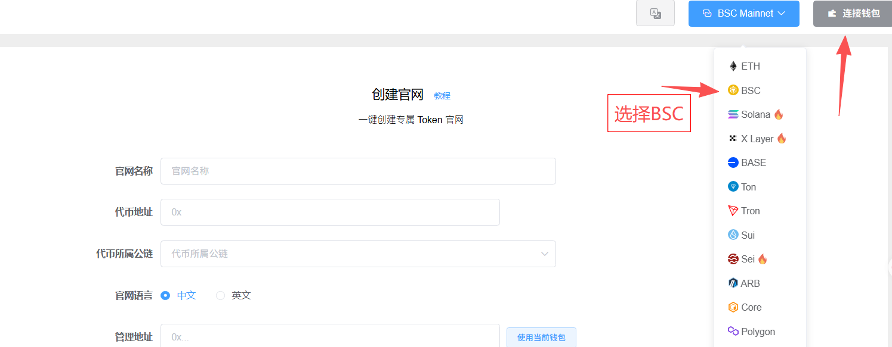<figcaption></figcaption></figure>

钱包连接成功后，右上角会出现钱包的地址


注意：不管你的代币是什么区块链的、要做什么类型的官网，右上角都需要连接自己的BSC钱包，后续也需要通过BNB进行付款


### **2、填写官网信息**

接下来，我们填写要制作的官网的基本信息

<figure>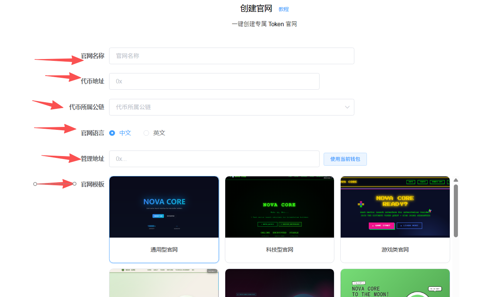<figcaption></figcaption></figure>

* **官网名称：**&#x60A8;网站的核心名称，可以直接是代币名称：如PEPE/Pepe Coin。也可以是代币名称+官网，如PEPE官网，基本没有限制，后期也可以修改
* **代币地址：**&#x5C31;是您要创建官网的代币合约地址，填进去（该地址确认后无法修改）
* **代币所属公链：**&#x60A8;的代币是在哪条区块链创建的，就选择哪个。目前支持的公链有：ETH、BSC、Solana、X Layer、BASE、Arbtirum、TRON、SUI等等
* **官网语言：**&#x53EF;以选择中文或者选择英文
* **管理地址**：也就是进入官网后台的钱包地址，一般都是直接使用当前连接的钱包
* **官网模板：**&#x50;andaTool提供10种官网模版以供选择，您可以根据自己的需要做出选择
* **预览模版：**&#x7528;鼠标选中您要预览的官网类型，然后点击预览模板，即可查看该官网的信息

<figure>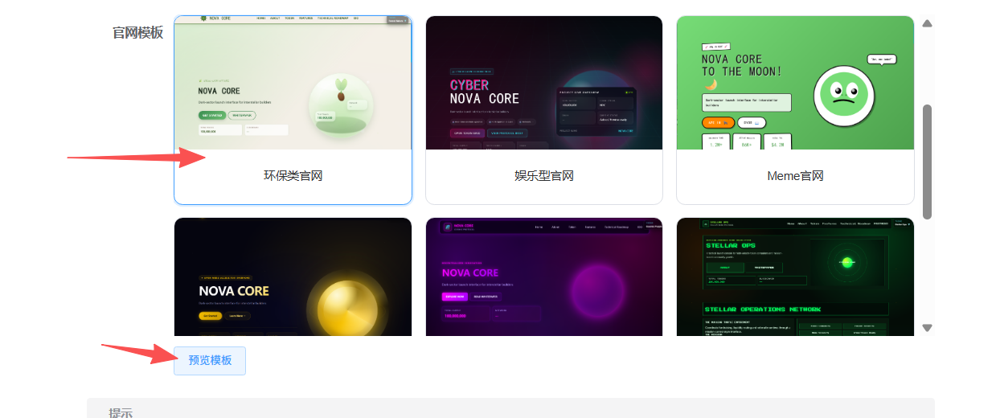<figcaption></figcaption></figure>

### **3、创建官网**

确认好信息无误后，我们点击创建官网按钮

<figure>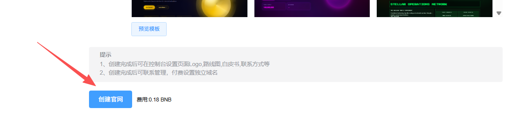<figcaption></figcaption></figure>

之后会弹出一个确认页面，您需要确认一下代币检测后是否正常

<figure>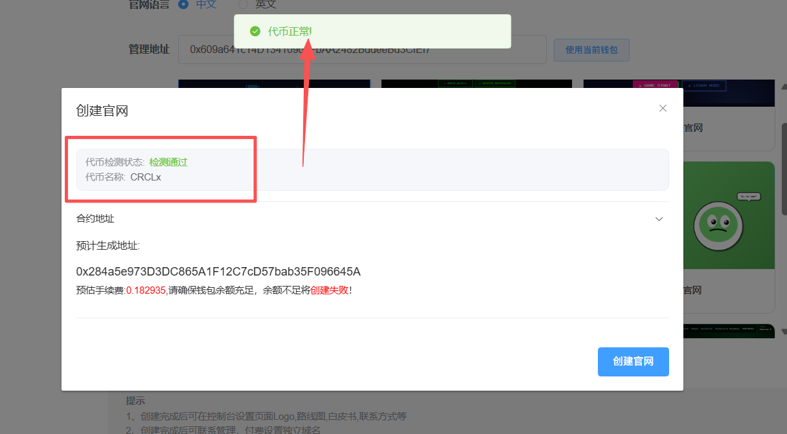<figcaption></figcaption></figure>

如果出现错误提示，可能是代币合约地址填写错误，或者公链选择错误，应该返回上一步进行核查

<figure>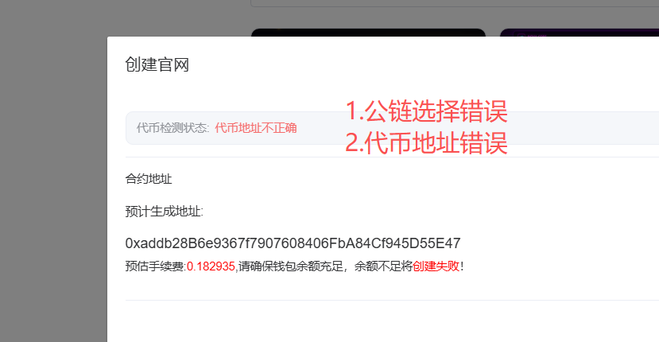<figcaption></figcaption></figure>

确认信息无误后，再次点击创建官网按钮，然后弹出钱包确认，并支付费用即可

<figure>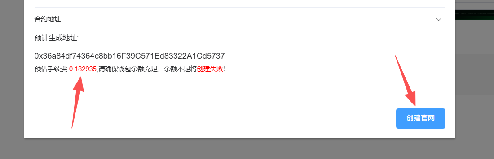<figcaption></figcaption></figure>

注意，创建官网时，请确保钱包内有至少0.19个BNB，否则可能会因为钱包内BNB余额不足导致创建失败

创建成功后，我们就能进入控制台修改资料了

### 4.控制台修改官网资料

进入控制台，可以直接从控制台列表进入：[https://pandatool.org/#/Website/Websitelist?lang=zh-CN](https://pandatool.org/#/Website/Websitelist?lang=zh-CN)  &#x20;

<figure><figcaption></figcaption></figure>

在控制台页面，我们可以看到官网的基本信息，比如官网的名称、模版类型、代币地址等等。同时，我们也能点击链接，进入到官网页面：

<figure><figcaption></figcaption></figure>

然后，我们就能看到官网的首页情况了，官网案例链接：[https://ido-web-lime.vercel.app/?contract=0xfDB3A52B00921CAb4ff2db51e675cd3Fa1A52Dad\&chainid=728126428\&theme=golden-space](https://ido-web-lime.vercel.app/?contract=0xfDB3A52B00921CAb4ff2db51e675cd3Fa1A52Dad\&chainid=728126428\&theme=golden-space)

<figure>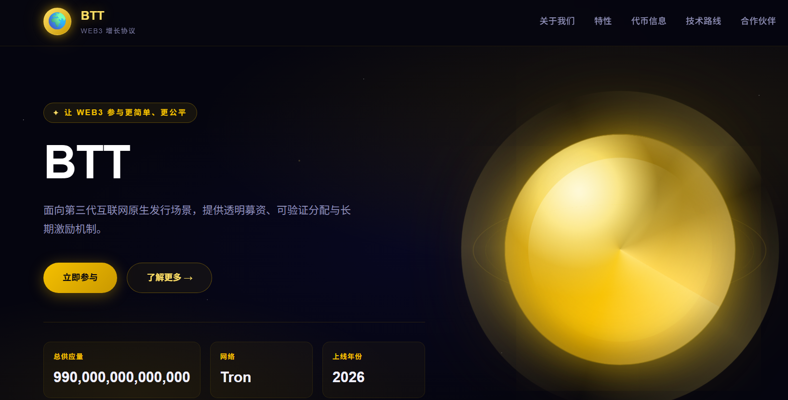<figcaption></figcaption></figure>

如果你对当前的网站页面不满意，可以回到控制台，对其内容进行修改，主要可以修改的信息如下

<figure>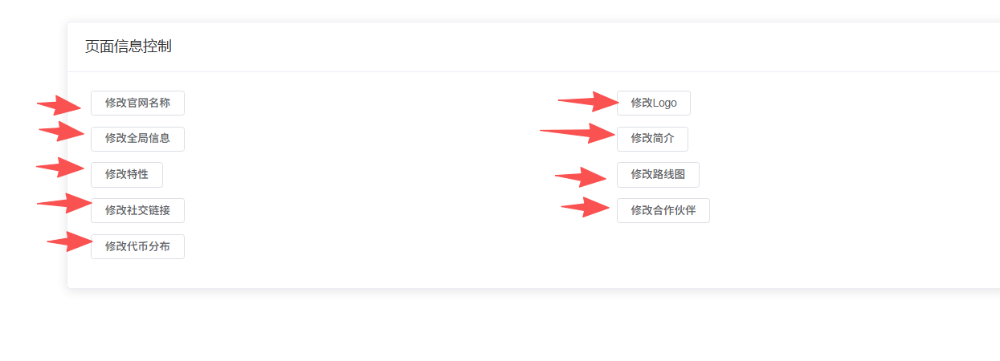<figcaption></figcaption></figure>

**修改官网名称：**&#x53EF;以根据自己的需求，填写不同的官网名称

<figure>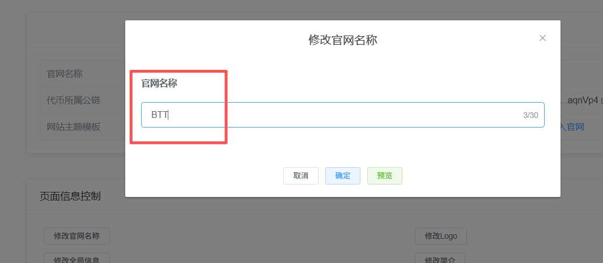<figcaption></figcaption></figure>

**修改全局信息：**&#x5305;括首页文案、白皮书链接、页脚文案等信息

<figure>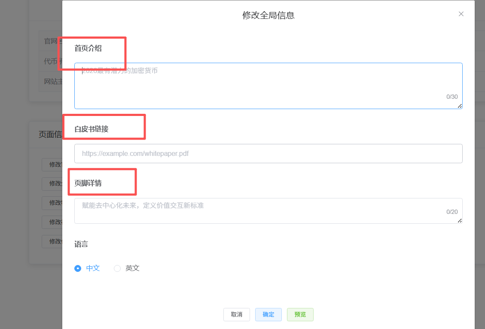<figcaption></figcaption></figure>

**修改特性：**&#x4E3B;要是修改官网上面的代币四大特性

<figure>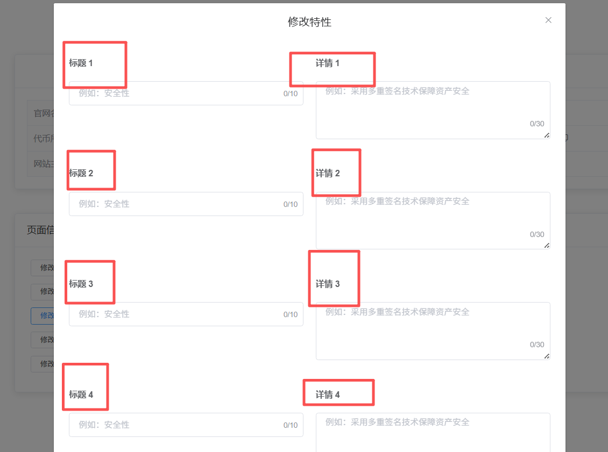<figcaption></figcaption></figure>

**修改社交链接：**&#x53EF;以根据需求，添加代币项目的官网链接，如Twitter、Telegram等

<figure><figcaption></figcaption></figure>

**修改代币分布：**&#x4E3B;要是代币经济学的部分，将代币的分配团队/名称列出来

<figure>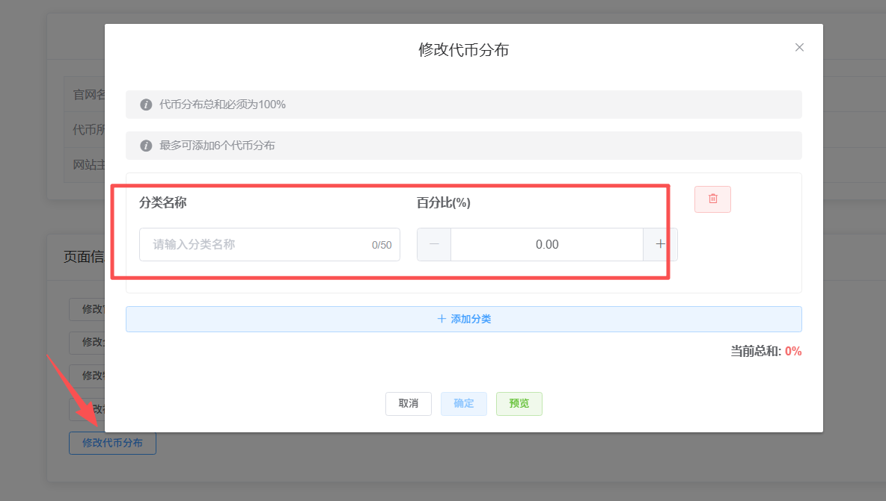<figcaption></figcaption></figure>

**修改logo：**&#x53EF;以自行上传代币的logo

<figure><figcaption></figcaption></figure>

**修改简介：**&#x4E3B;要是填写修改代币官网的标题以及简介信息

<figure>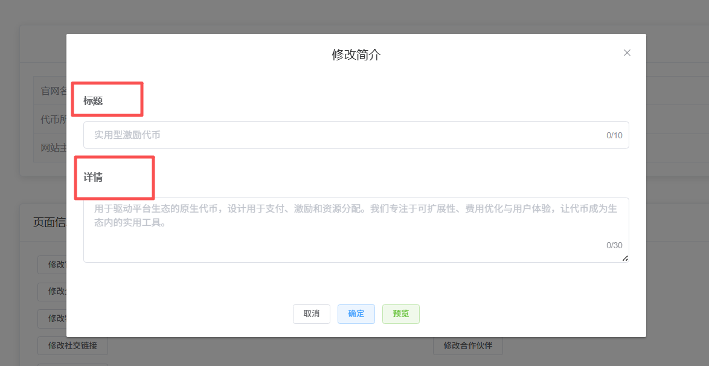<figcaption></figcaption></figure>

**修改路线图：**&#x4EE3;币项目的路线发展图，我们给提供了4个阶段，项目方可以根据需求按照时间线或者发展阶段进行填写

<figure>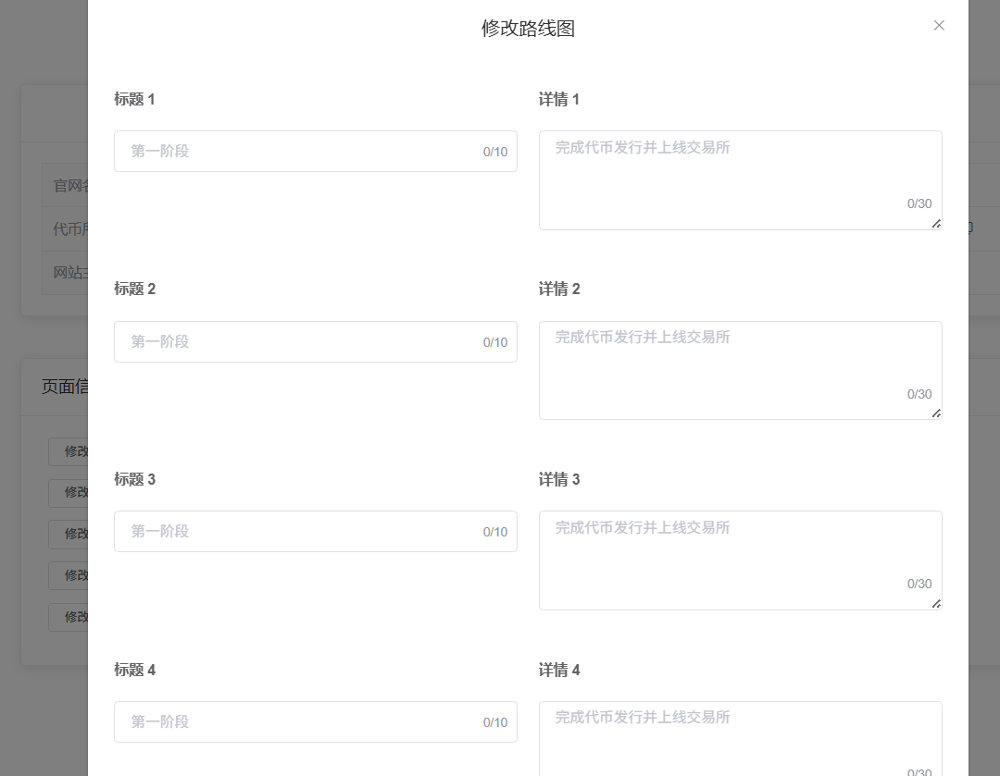<figcaption></figcaption></figure>

**修改合作伙伴：**&#x6BCF;个官网可以填写3个合作伙伴，可以带上这些合作伙伴的logo和名称

<figure>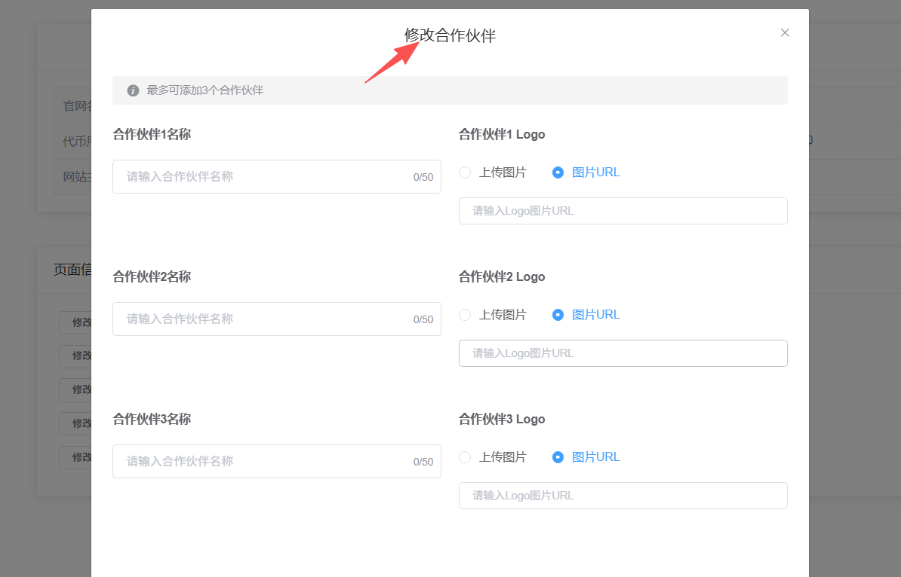<figcaption></figcaption></figure>

到此，整个官网的创建工作、修改工作基本上就到这里结束了。只要后期觉得有哪里不合适，都可以在控制台修改。接下来我们解答一些疑问

### 三、创建官网疑问解答 

**1、官网可以修改域名吗？**

* **答：**&#x53EF;以，但是需要额外付费。具体这方面，得咨询PandaTool的商务：[**@btc6560**](http://t.me/btc6560)

**2、可以修改代币名称或者合约地址吗？**

* **答：**&#x8FD9;个是不能修改了，代币名称/合约等一旦确认就无法修改

**3、网站语言可以设置中英文自动切换吗？**

* **答：**&#x5F53;前可以实现的是，根据您的设置，将网站及文案自动切换到某一种语言，如英文或者中文。两种语言无法同时存在。如果要实现这种效果，还是得联系商务：[**@btc6560**](http://t.me/btc6560)

**4、代币地址不正确是怎么回事？**

* **答：**&#x9996;先确认代币合约地址是否错误，如果合约地址没错，那就是选择的公链错误导致的。回到前面的页面，重新填写正确的代币地址或者选择正确的公链即可

当然，如果您在创建官网的过程中还有其他的问题，可以进入我们的tTelegram社区群，我们的志愿者会免费为您解答：[https://t.me/pandatool](https://t.me/pandatool)
