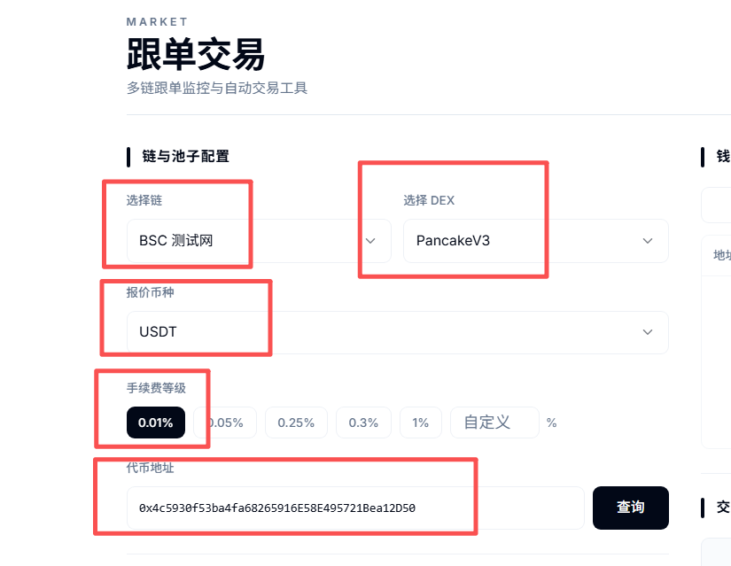
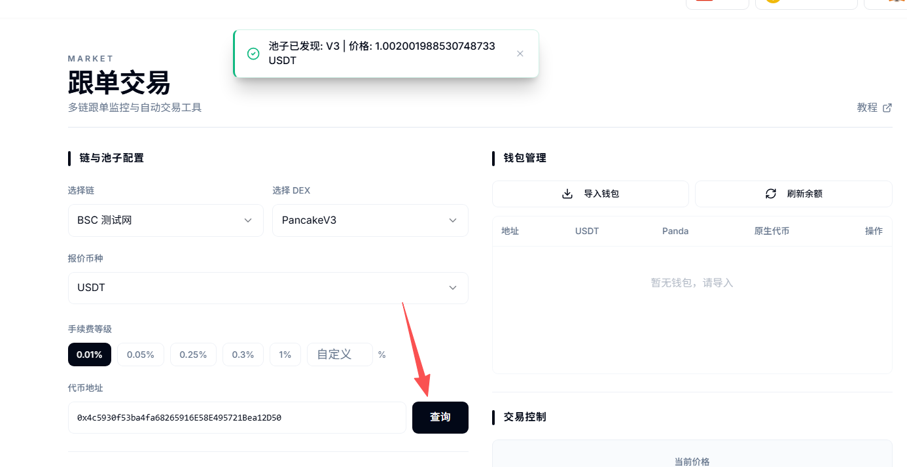
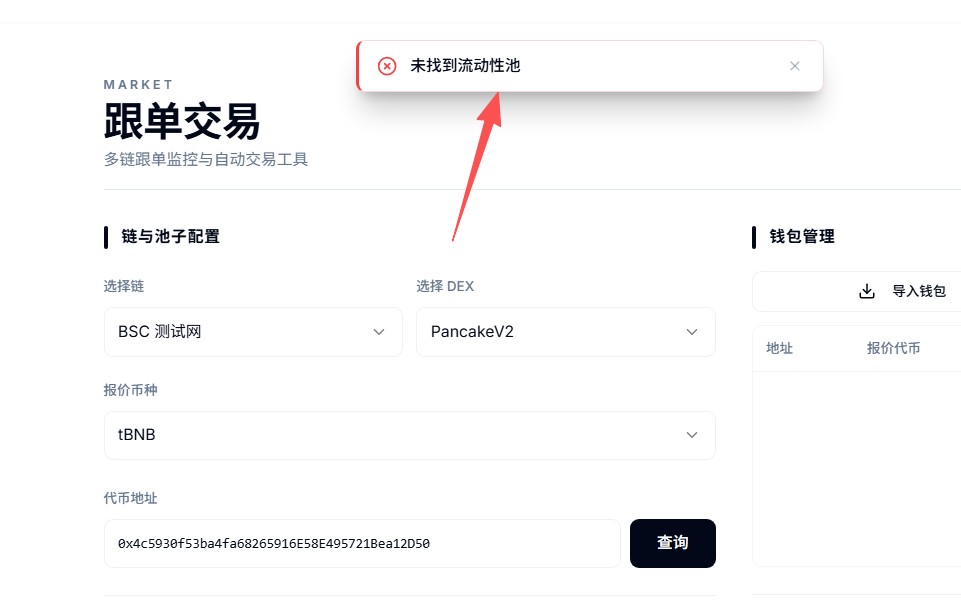
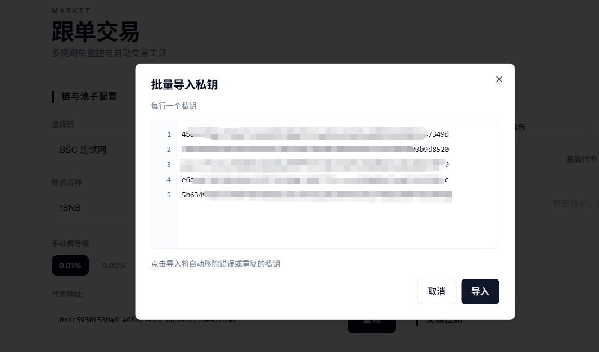
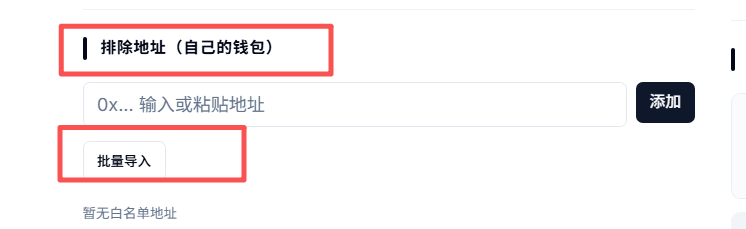
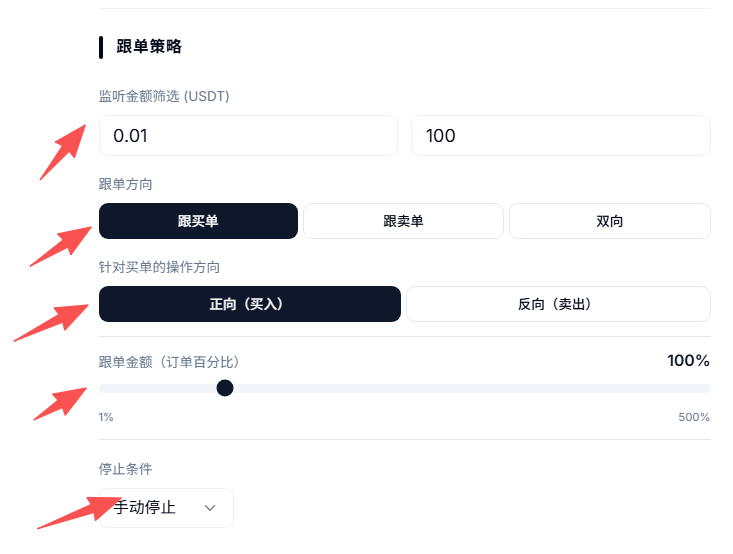
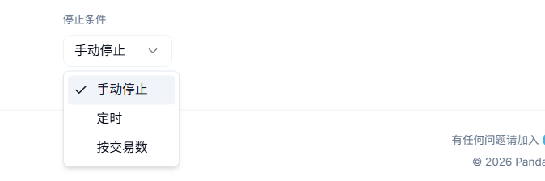
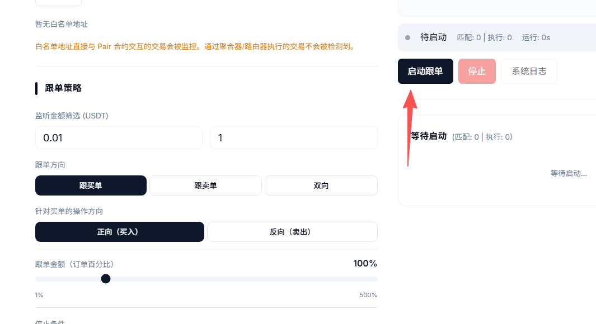
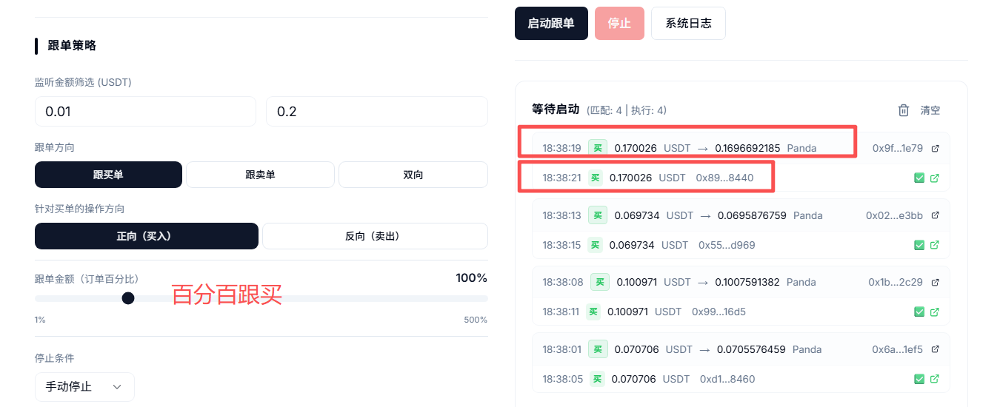

# 交易所跟单机器人教程

### **一、跟单工具解读** 

跟单机器人是PandaTool开发的针对于去中心化交易所DEX的交易工具，可以通过对目标代币的交易情况进行实时监听，并采取针对性的跟单策略，如果跟买单、跟卖单、双向跟单等等。

#### **1、功能概念** 

用户可以导入多个钱包地址，针对目标代币的买卖情况选择性跟单交易。例如，目标代币产生一笔买单，你可以跟买，也可以跟卖。还可以选择交易不同金额，非常方便快捷。

#### **2、支持的DEX** 

PandaTool开发的这款跟单机器人支持多条区块链、多个DEX资金池类型，具体如下：

* **BNB Chain：**&#x50;ancakeSwap V2、PancakeSwap V3
* **Ethereum**：Uniswap V2、Uniswap V3
* **Avalanche：**&#x55;niswap V2、Uniswap V3
* **Polygon：**&#x55;niswap V2、Uniswap V3
* **Arbitrum、Optimsim、Base：**&#x55;niswap V2、Uniswap V3

### **二、跟单机器人使用教程** 

我们打开跟单交易机器人的操作页面：[https://www.pandatool.org/zh-CN/market/follow](https://www.pandatool.org/zh-CN/market/follow)  然后根据以下教程进行操作

#### **1、查询资金池**

第一步，我们需要选择基础的信息，包括链、代币等：】

<figure><figcaption></figcaption></figure>

* **选择链：**&#x9009;择您要交易的区块链，目标代币在哪条链，就选择哪条链
* **选择DEX：**&#x9009;择您创建的资金池类型，主要是V2和V3的区别
* **报价币种：**&#x5C31;是您的资金池代币，一般是BNB、ETH、USDT等，看下您的资金池交易对
* **手续费等级：**&#x5982;果是V3池子的话，需要选择手续费等级，一般是0.01%
* **代币地址：**&#x60A8;要交易的目标代币地址，直接填进来

确定好信息填写无误后，我们点击**查询**：

* 如果查询没问题，则页面右边会出现代币的价格，并提示您池子已经发现

<figure><figcaption></figcaption></figure>

* 如果查询有问题，会提示您未找到流动性。这个时候，您需要核对选择的区块链或者交易所是否正确

<figure><figcaption></figcaption></figure>

#### **2、导入钱包**

查到资金池和价格后，我们点击右边的按钮导入钱包（私钥）

<figure><figcaption></figcaption></figure>

在弹出的页面输入钱包的私钥，一行一个，然后点击导入私钥。（一般导入几十个就可以了）

<figure><figcaption></figcaption></figure>

钱包导入之后，我们就能看到各个钱包地址了，然后点击**刷新余额**，确认一下钱包内的代币情况

<figure><figcaption></figcaption></figure>

余额刷新之后，我们进行下一步

#### **3、排除地址**

所谓排除地址，就是需要排除的跟单地址。这些地址交易的话，我们的跟单机器人不会进行跟单。类似于一个跟单白名单的功能。这样就有助于精准识别用户，避免错误跟单。比如项目方自己的钱包在操作，就没有跟单的必要

<figure><figcaption></figcaption></figure>


白名单地址直接与 Pair 合约交互的交易会被监控。通过聚合器/路由器（TP/OKX/币安Web3钱包等）执行的交易不会被检测到。


**4、跟单交易策略**

跟单策略主要就是三种：跟买单、跟卖单、双向跟单，其实很好理解

* **跟买单：**&#x6709;地址购买这个代币的时候，就跟单
* **跟卖单：**&#x6709;地址卖出这个代币的时候，就跟单
* **双向跟单：**&#x4E0D;管是买还是卖，都跟单

我们下面看如何设置跟单策略

<figure><figcaption></figcaption></figure>

* **监听跟单金额：**&#x5F53;有地址交易多少金额代币的时候，才会跟单，这种设置可以筛选掉一些小额/大额的交易，从而确保跟单的精准性
* **跟单方向：**&#x662F;选择跟买单，还是跟卖单，还是双向跟单
* **操作方向：**&#x9488;对一个跟单方向，选择交易方向。例如你选择跟买单，那是跟着买入还是卖出呢？如果是跟着买单买入，那就是正向。如果是跟着买单卖出，那就是反向
* **跟单金额：**&#x57FA;于你监听的交易金额，来决定跟单金额的比例。假设有地址购买100USDT代币，然后你选择反向卖出。当这个跟单百分比设置为100%的时候，你就会卖出100U的代币。如果设置是50%。你就会卖出50U的代币，以此类推
* **停止交易：**&#x4EE5;什么方式停止跟单。默认是手动停止，还可以选择定时停止，或者是按照交易数停止

<figure><figcaption></figcaption></figure>

#### **5、跟单实操**

跟单策略设置完成之后，我们点击**启动跟单**按钮，即可开始跟单

<figure><figcaption></figcaption></figure>

从跟单日志中可以看到，上面一行就是监听到的交易情况，下面一行就是机器人跟单的操作。

<figure><figcaption></figcaption></figure>

### **三、疑问解答**

**1、代币地址没有错，为什么提示错误？**

* **答：**&#x5982;果确认代币地址没有错，那么可能是您选择的区块链错误，或者是交易所资金池类型错误

**2、为什么会交易失败？**

* **答：**&#x901A;常的原因是钱包内Gas不足或者代币余额不足导致的

**3、私钥会不会泄露？**

* **答：**&#x79C1;钥仅保存在您的电脑页面，不上传至服务器，至少PandaTool是看不到的

**4、最多可以导入多少钱包？**

* **答：**&#x7406;论上是没有上限的，但考虑到您的电脑CPU以及用户体验，几十个应该是比较合适的

**5、为什么我设置了排除地址却没有生效？**

* **答：**&#x56E0;为机器人只能检测与池子直接交易的地址，如果这个地址使用了TP钱包、OKX或者币安Web3钱包内置的聚合交易工具，可能就无法检测到

**6、跟单交易工具如何收费？**

* **答：**&#x5177;体每笔交易的费用如下
  * BSC 主网: 0.0005 BNB
  * Ethereum: 0.0001 ETH
  * Base: 0.0001 ETH
  * Arbitrum: 0.0001 ETH
  * Avalanche: 0.01 AVAX
  * Polygon: 0.1 POL
  * Optimism: 0.0001 ETH

如果您在使用跟单交易工具的过程中，遇到了无法解决或者不清楚的地方，可以在PandaTool的官方交流群联系客服处理：[https://t.me/pandatool](https://t.me/pandatool)

 
