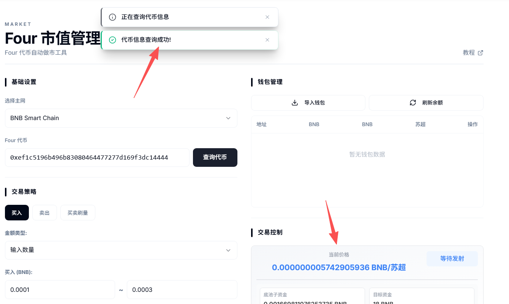
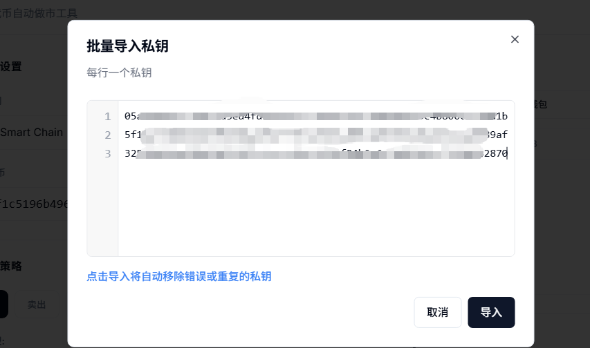
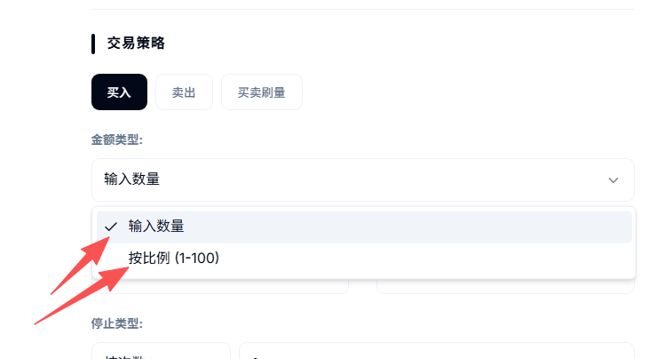
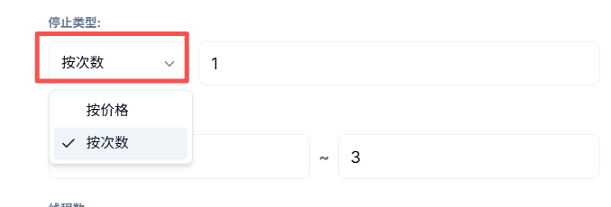
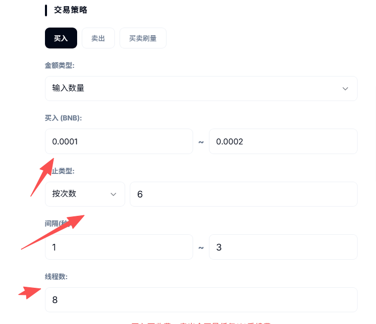
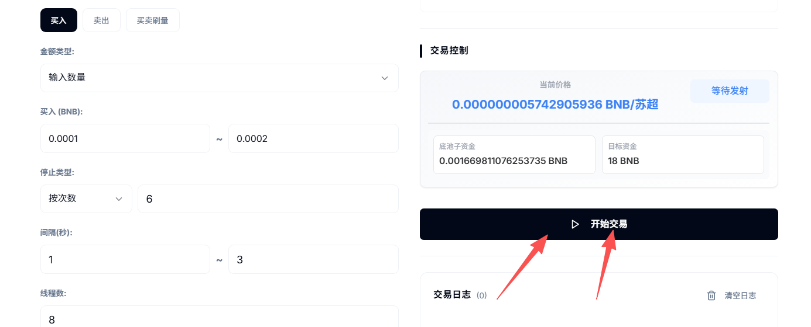
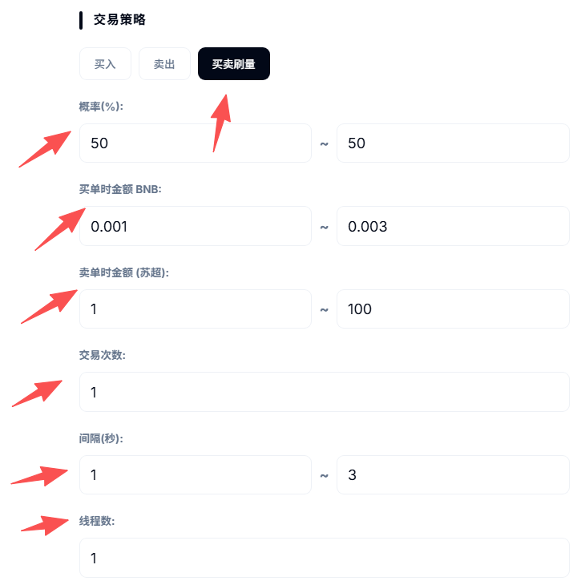

# Four市值管理/批量交易工具

### **一、Four市值工具解读** 

该工具是PandaTool开发、针对于Four.meme的市值管理工具，可以支持Four.meme代币的批量交易、批量购买、批量卖出等功能。

用户可以导入多个钱包地址，针对某一代币进行批量交易。通过设定交易次数、交易价格等要素，来实现交易的停止与启动。其目的在于解放双手，快速实现代币的大量交易。

### **二、市值工具使用教程** 

我们打开Four市值工具的操作页面：[https://www.pandatool.org/zh-CN/market/four](https://www.pandatool.org/zh-CN/market/four) 后根据以下教程进行操作

#### **1、查询代币** 

第一步，我们需要选择基础的信息，并输入代币的合约地址，点击查询

<figure><figcaption></figcaption></figure>

点击查询代币后，正常情况下，可以在页面右边看到代币的价格、资金池以及发射状态

<figure><figcaption></figcaption></figure>

#### **2、导入钱包** 

查到资金池和价格后，我们点击右边的按钮导入钱包（私钥）

<figure><figcaption></figcaption></figure>

在弹出的页面输入钱包的私钥，一行一个，然后点击导入私钥。（一般导入几十个就可以了）

<figure><figcaption></figcaption></figure>

钱包导入之后，我们就能看到各个钱包地址了，然后点击**刷新余额**，确认一下钱包内的代币情况

<figure><figcaption></figcaption></figure>

#### **3、买入与卖出交易设置** 

目前代币的交易方式有三种，分别是：**买入交易、卖出交易和买卖刷量交易，**&#x540C;时会选择不同的操作类型。现在我们了解一下买入和卖出的交易设置

**金额类型（使用买入和卖出同理）**

<figure><figcaption></figcaption></figure>

* **按照数量：**&#x8BBE;定每笔交易的买入数量，以BNB计算
* **按照比例：**&#x8BBE;定每笔交易钱包支出的余额比例
* **范围：**&#x8BBE;定交易数量或者比例的范围

**关于比例：**&#x8FD9;个比例是钱包余额的比例。如果您设置1%，钱包内100BNB的话，那么第一笔交易就是1BNB。此时钱包内只有99BNB了，那么第二笔交易就是9.9BNB，以此类推

**停止类型（买入和卖出同理）**

<figure><figcaption></figcaption></figure>

* **按价格：**&#x5C31;是到了某个价格，停止交易
* **按次数：**&#x4EA4;易了多少次之后，就停止交易
* **间隔：**&#x6BCF;一笔交易的间隔时间，以秒为单位
* **线程数：**&#x540C;一秒发起多少笔交易，线程越大，交易频率越高（最大为6）

**设置案例**

例如我填写的代币交易设置是这样的：

<figure><figcaption></figcaption></figure>

这是一笔批量买入的交易，每次买入的金额是0.0001BNB到0.0002BNB之间。一共交易6次就停止，每次交易间隔时间为1\~12秒，不固定，线程数是8。

之后，我们点&#x51FB;**`开始交易`**&#x6309;钮，即可开始操作

<figure><figcaption></figcaption></figure>

#### **4、买卖刷量设置** 

不同于前面两种针对某个方向的交易，买卖交易指的是自动实现买和卖两种交易方式。

<figure><figcaption></figcaption></figure>

**买卖概率**

* **买单概率：**&#x7CFB;统发起一笔交易时，这笔交易是**买单**的概率有多大
* **卖单概率：**&#x7CFB;统发起一笔交易时，这笔交易是**卖单**的概率有多大
* 买单概率与卖单概率相加为100%

**买单时金额设置**

* 设置每笔买单的买入金额范围，以BNB计数

**卖单时金额设置**

* 设置每笔卖单的迈出数量范围，以代币计数

**交易次数**

* 当买卖笔数达到多少笔时停止交易

**时间间隔**

* 每个钱包交易完成后等待的时间，以秒为单位线程数

**线程数**

* 同一秒发起多少笔交易，线程越大，交易频率越高

设定完成后，我点击右边的开启交易按钮，即可**开始交易**

### **三、疑问解答** 

**1、代币地址没有错，为什么提示错误？**

* **答：**&#x5927;概率是代币合约地址错误导致的

**2、为什么会交易失败？**

* **答：**&#x901A;常的原因是钱包内Gas不足或者代币余额不足导致的

**3、私钥会不会泄露？**

* **答：**&#x79C1;钥仅保存在您的电脑页面，不上传至服务器，至少PandaTool是看不到的

**4、最多可以导入多少钱包？**

* **答：**&#x7406;论上是没有上限的，但考虑到您的电脑CPU以及用户体验，几十个应该是比较合适的

**5、Four市值管理工具如何收费？**

* **答：**&#x5E02;值管理工具，买单是不收取费用的，卖单会收取**卖出金额1%**&#x7684;费用

如果您在市值管理工具的运行过程中，遇到了无法解决或者不清楚的地方，可以在PandaTool的官方交流群联系客服处理：[https://t.me/pandatool](https://t.me/pandatool)
