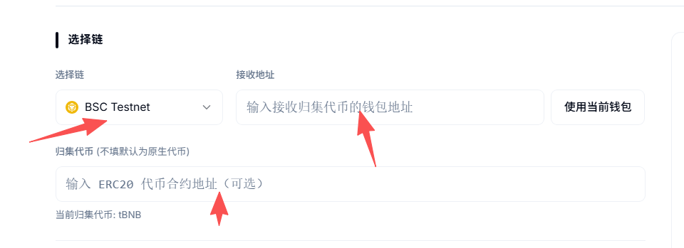
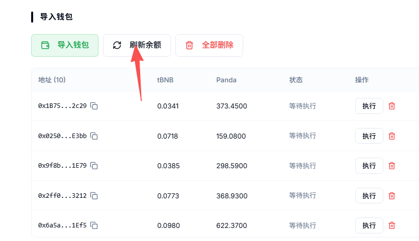
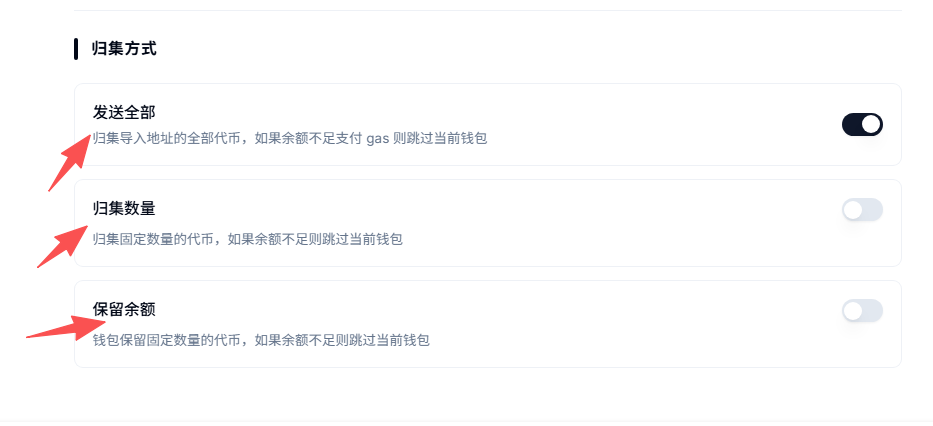
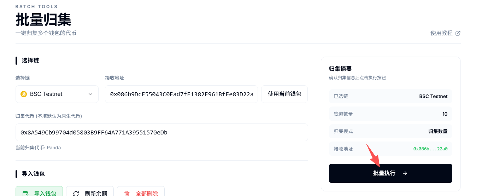
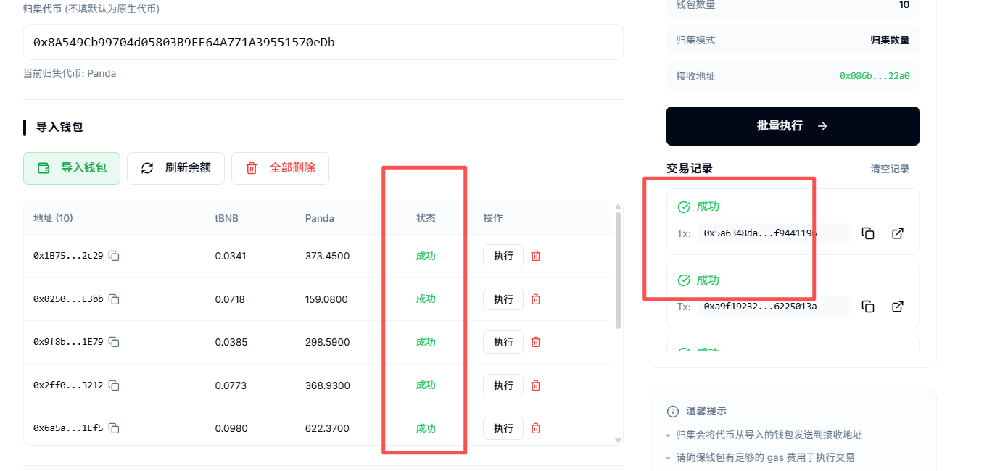
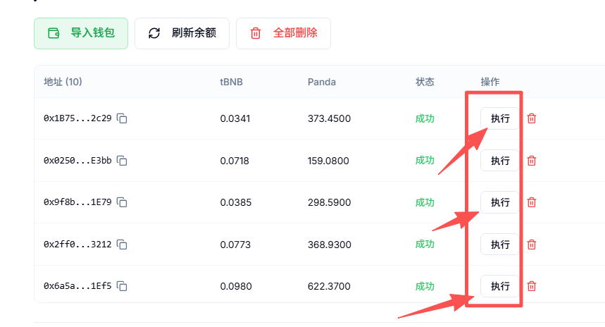

# 代币批量归集工具

批量归集工具指的是，可以将钱包内的代币一次性归集到一个地址，也就是我们常说的**多对一转账。**&#x5F52;集完的钱包地址就可以直接丢弃掉，方便钱包的管理与整合。

接下来，将给大家演示，该如何使用PandaTool平台的批量归集工具


批量归集工具免费使用


### 一、连接钱包

首先，我们需要打开批量归集工具：[https://www.pandatool.org/zh-CN/batchtools/gather](https://www.pandatool.org/zh-CN/batchtools/gather)，进入之后右上角选择链，并连接钱包

<figure><figcaption></figcaption></figure>

连接成功后，右上角能看到钱包地址和链。

### 二、配置归集参数

进入归集页面之后，我们需要按照下图顺序和要求，填写并配置相关信息，同时导入要`归集`的钱包

#### **1、选择链与地址**

<figure><figcaption></figcaption></figure>

**选择链**

* 目前支持BSC、Arb、Base、ETH等多种EVM链的代币归集

**接收地址**

* 输入接收代币的钱包地址，可以使用当前钱包

**归集代币**

* 归集原生代币：如果归集BNB、ETH这种原生代币，不需要输入合约地址
* 归集其他代币：如果归集的是其他代币，则需要填入代币合约地址

#### **2、导入钱包**

这一步，你要导入所有需要归集的钱包私钥，要归集几个就导入几个

<figure><figcaption></figcaption></figure>

**导入钱包之后，要及时刷新余额**

<figure><figcaption></figcaption></figure>

* 在导入钱包之后，需要刷新各钱包内的代币余额
* 在每一次**完成归集后**，也需要筛选钱包内的代币余额
* 在每一次**切换了链之后**，也需要刷新钱包内的代币余额

#### **3、选择归集方式**

归集方式一共有三种

<figure><figcaption></figcaption></figure>

* **发送全部：**&#x5C06;钱包内某个`指定代币`全部归集到指定的钱包地址
* **归集数量：**&#x53EF;以自定义要归集的代币数量，如果部分钱包数量不足，将跳过
* **保留余额：**&#x5728;钱包内保留固定余额的代币，其余的归集出去。如果余额不够，将跳过

### 三、执行归集

如下图所示，当所有的信息填写完成后，我们点击归集按钮，即可开始执行归集

<figure><figcaption></figcaption></figure>

点击批量执行后，等待几秒钟，就会完成。可以在钱包状态栏和交易日志那里看到成功的提示

<figure><figcaption></figcaption></figure>

如果遇到某个钱包失败的情况，可以点击地址栏的`执行`按钮，再次执行归集

<figure><figcaption></figcaption></figure>

### 四、批量归集疑问解答 

**1、为什么归集会失败？**

* 如果要归集的地址内的gas余额不足，也有可能会失败
* 如果此时链刚好延迟了，也会导致部分钱包失败
* 如果网络波动，也会导致失败
* 如果代币有特殊机制，如最大持仓限制等，也会失败

**2、归集需要收费吗？**

* PandaTool的批量归集产品是**不收费**的，除了**gas**以外，您不会额外支出其他费用

**3、为什么归集后没有返回结果？**

* 可能是网络卡住了，耐心等待几秒钟，就会有结果返回的

有任何关于批量归集的的问题，可以在电报群联系志愿者：[https://t.me/pandatool](https://t.me/pandatool)
