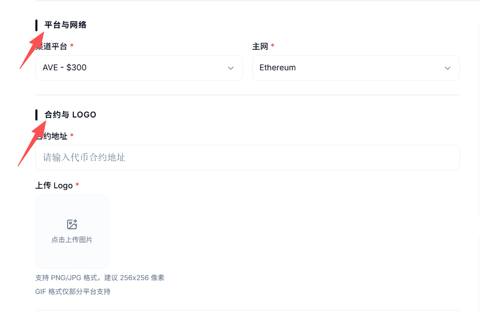
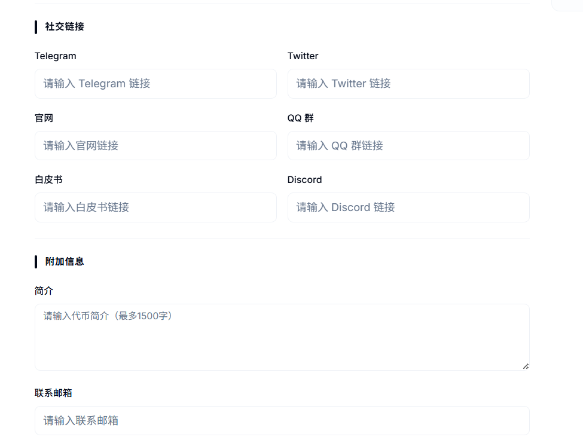
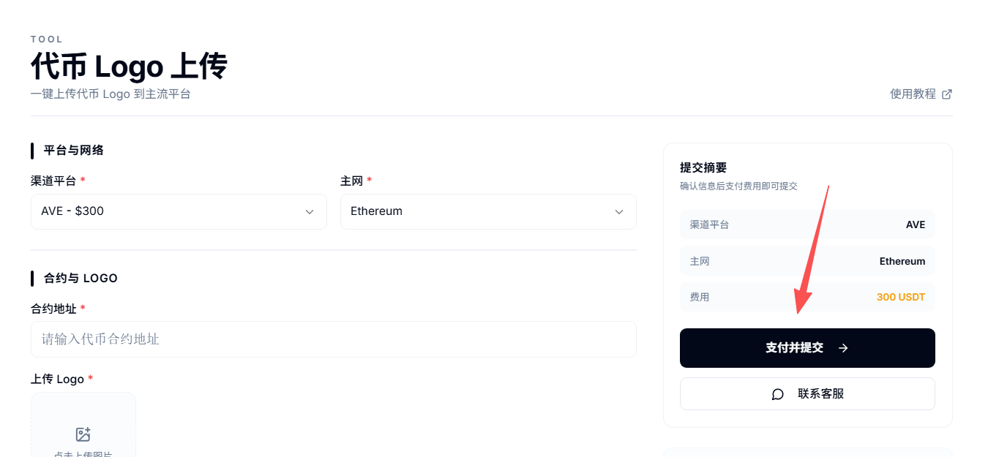
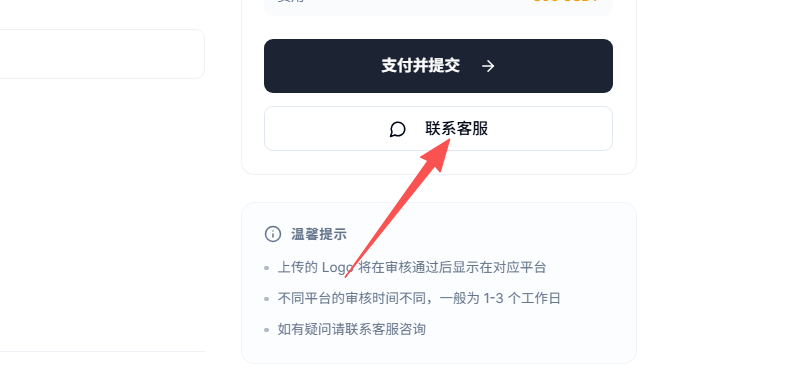

# 代币logo提交

### 一、**代币logo概念解读**

**1、什么是代币logo？**

* 代币logo就是代币图标，是一个代币品牌化的展示与形象特征。

**2、为什么我的代币没有logo？**

* 因为你的代币不知名，一些钱包、交易所只对主流代币显示logo，不知道的代币无法显示代币logo

**3、怎么才能显示代币logo？**

* 通常需要主动去各大平台提交申请，然后将代币的资料给他们。他们审核通过后，就能显示。当然，可能需要支付一些费用。

为了解决广大项目方的代币没有logo的问题，PandaTool推出了自动化logo提交工具，整合了数十个平台，可以随时提交。

### **二、代币logo提交流程**

**1、打开工具并连接钱包**

我们打开代币logo提交工具：[https://www.pandatool.org/zh-CN/tool/logo](https://www.pandatool.org/zh-CN/tool/logo)   在右上角将区块链切换到BSC，并连接钱包

<figure><figcaption></figcaption></figure>

**2、填写代币参数**

接下来，我们依次填写代币的信息

<figure><figcaption></figcaption></figure>

* **渠道平台：**&#x4F60;希望代币在哪个平台显示logo，就选择哪个
* **主网：**&#x4EE3;币是在哪条区块链发行的
* **合约：**&#x8F93;入代币的合约地址
* **上传logo：**&#x4E0A;传您的代币logo图片

<figure><figcaption></figcaption></figure>

**3、填写社交链接与附加信息**

以下选项不是必填项，可以填，也可以不填

* Telegram：代币的电报社群
* Twitter：代币项目的官方推特
* 官网：代币项目官网
* QQ群：代币官网qq社群
* 白皮书：代币白皮书文档链接
* Discord：代币官网Discord社群
* 简介：代币信息的简单介绍（1500字）
* 联系邮箱：项目方的联系邮箱

**4、支付并提交**

确定好代币信息之后，点击按钮，支付费用并提交信息即可

<figure><figcaption></figcaption></figure>

### **三、联系客服**

在您提交代币信息后，请及时通过Telegram联系客服，将资料或链接发给对方，然后他会给您安排

<figure><figcaption></figcaption></figure>

客服Telegram：[https://t.me/btc6560](https://t.me/btc6560)

客服邮箱：contactpandatool@gmail.com
