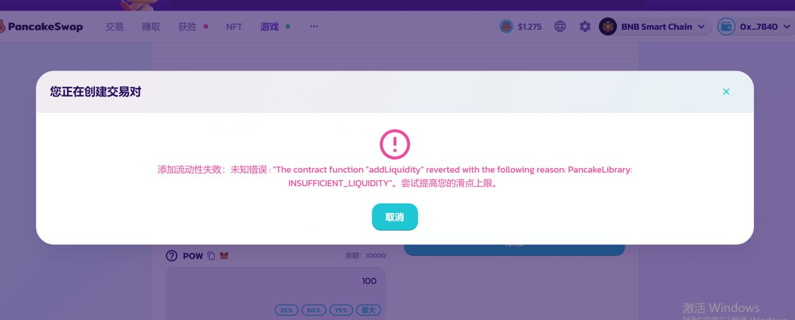
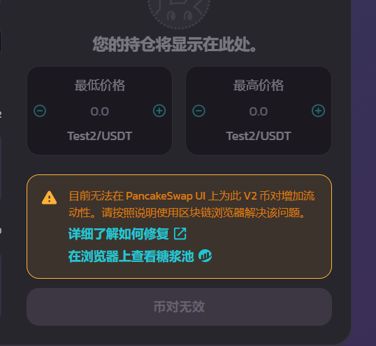
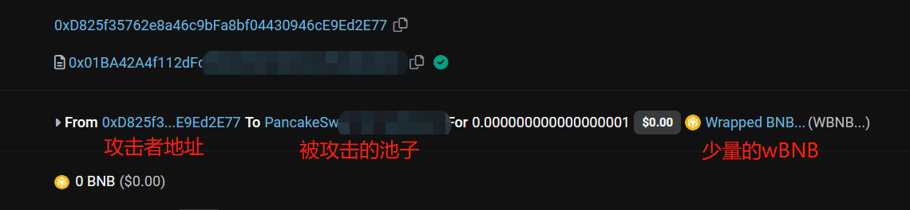
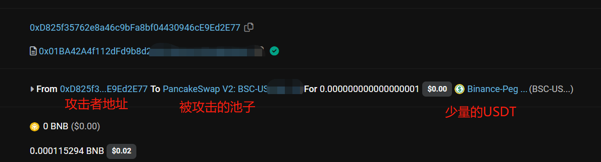
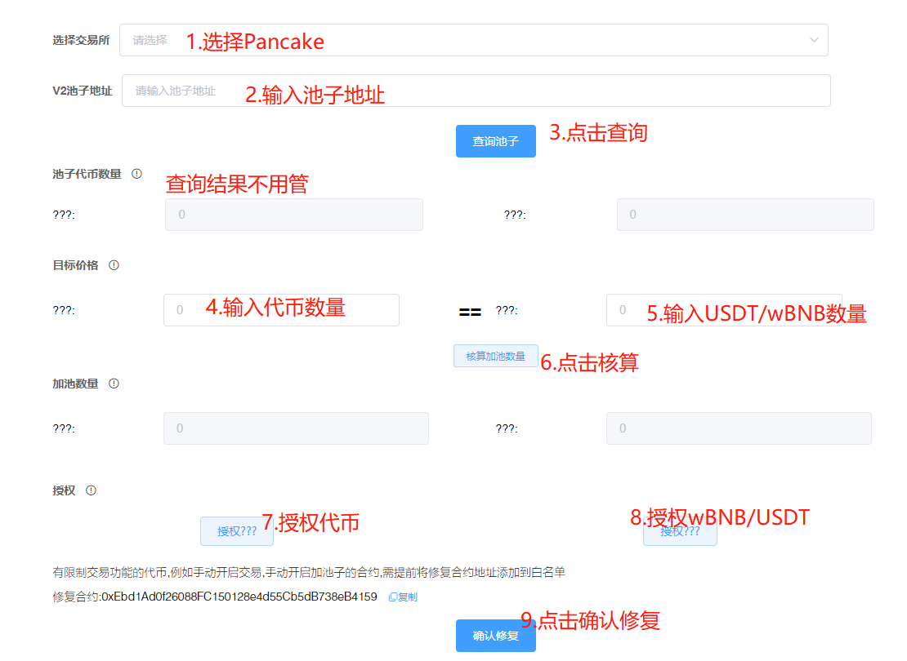
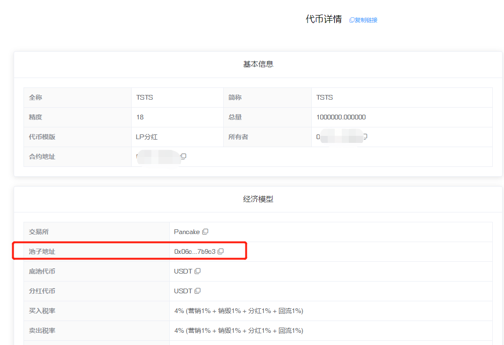
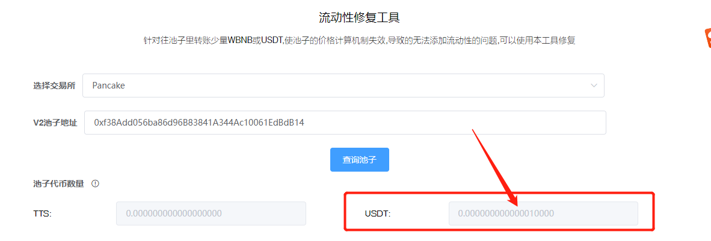
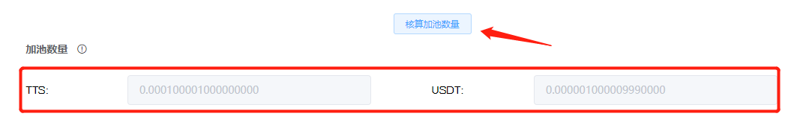
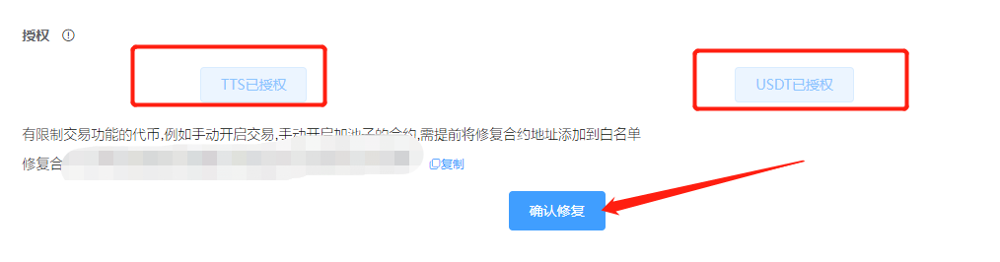
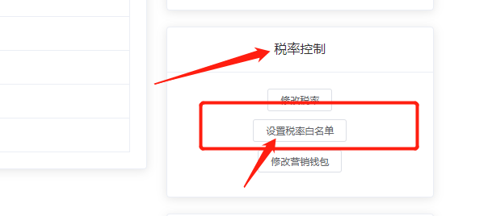

# LP流动性修复

LP流动性修复视频操作教程：



近期，BSC链上出现了一种新型的无差别攻击方式，有人向新创建的代币资金池地址转入少量的wBNB或者USDT，使得合约创建者无法添加池子，会出现一种提示：_添加流动性失败，未知错误，请尝试提高您的滑点上限。_**或者直接无法加池，不能看到加池页面**

<figure><figcaption></figcaption></figure>

或者出现这种提示：目前无法在 PancakeSwap UI 上为此 V2 币对增加流动性。请按照说明使用区块链浏览器解决该问题（Adding liquidity to this V2 pair is currently not available on PancakeSwap UI. Please follow the instructions to resolve it using blockchain explorer.）。都表明了，池子遭到了攻击。

<figure><figcaption></figcaption></figure>

该攻击方式的实现原理是这样的：有人通过脚本监控薄饼的工厂合约，当有新的资金池被创建出来之后，就向该池子地址无差别转入wBNB或者USDT，每次转入数量为0.000000000000001个左右。当池子被转入单种代币之后，就无法创建交易对，从而不能加池。如下图所示：

<figure><figcaption>
BNB池子被攻击
</figcaption></figure>

<figure><figcaption>
USDT的池子被攻击
</figcaption></figure>

据调查，受影响的池子已经达到5000+。该攻击并不会对资金和任何资产造成影响，就是恶心人，搞得非常麻烦，且攻击者不会获得任何好处。为此，我们推出了LP流动性修复工具，任何受此影响的代币和资金池，都可以使用该工具解决这个问题。

### 一、操作流程

1、打开工具 [https://pandatool.org/#/LPfixtool](https://pandatool.org/#/LPfixtool)

<figure><figcaption></figcaption></figure>

2、选择交易所Pancake，输入**资金池地址**。其中，资金池地址可以在控制台查询，如：

<figure><figcaption></figcaption></figure>

**3、点击“查询池子”，**可以看到池子中的代币数量

<figure><figcaption></figcaption></figure>

可以看到，目前池子里被人恶意转入了0.00000000000001个USDT，这也是你无法正常加池子的原因

**4、确定目标价格**

根据你的开盘价格，分别输入你自己发行的代币的数量和底池代币的数量。例如，你要做的是USDT的池子，且开盘价定为0.001U，那么你需要在左边输入1000个代币，右边输入1个USDT。如果是BNB的池子，那就相应的使用wBNB（如果钱包没有wBNB，可以在薄饼兑换）。具体如图：

<figure><figcaption></figcaption></figure>

注意，不管是1000个代币还是1U，都不是你要最终加池的数量，它只是用来确定你的代币价格比例，仅此而已。具体应该往池子里放多少币？需要点击_**核算加池数量**_，然后会给你一个数据，如：

<figure><figcaption></figcaption></figure>

这个数据就是你修复需要使用的代币数据，接下来就是授权了

**5、授权并修复**

分别对你自己发行的代币和USDT进行授权（如果是BNB的池子，就需要授权wBNB），当两个代币分别授权完成之后，点击**“确认修复”**，即可完成修复。之后再去薄饼加池子，就可以正常加入了。

<figure><figcaption></figcaption></figure>

### 二、注意事项

#### 1、给修复合约添加白名单

假设您的代币拥有交易开关功能，在未开启交易之前，需要将修复合约的地址添加到**税率白名单**里（通过控制台操作），之后才能完成修复，否则会修复失败。

_修复合约地址：0xEbd1Ad0f26088FC150128e4d55Cb5dB738eB4159_

<figure><figcaption>
税率白名单
</figcaption></figure>

#### 2、任何代币都能修复

不管是在PandaTool平台发行的代币，还是在其他平台发行的代币，只要遭遇了池子被攻击的问题，都可以使用本修复工具解决

#### 3、修复失败怎么办

如果按照教程完成了操作步骤，依然修复失败，请加入电报群，联系客服处理 [@pandatool](https://t.me/pandatool)

