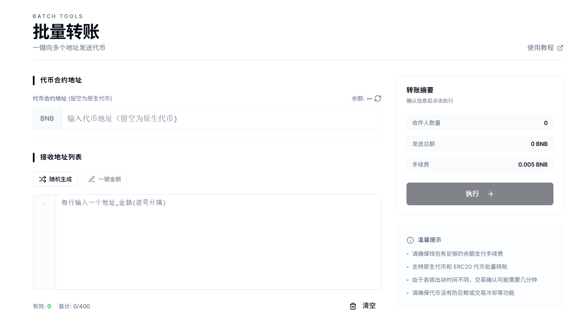
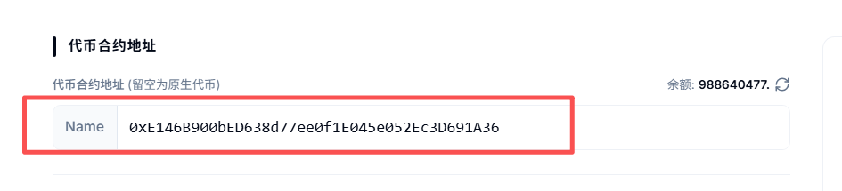
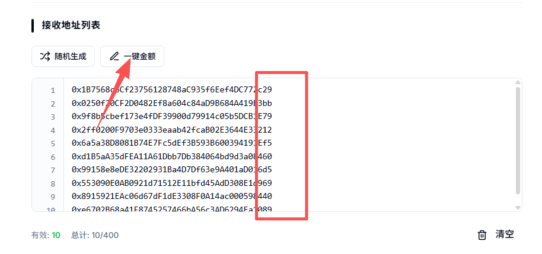
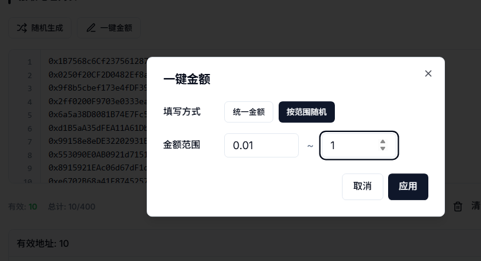
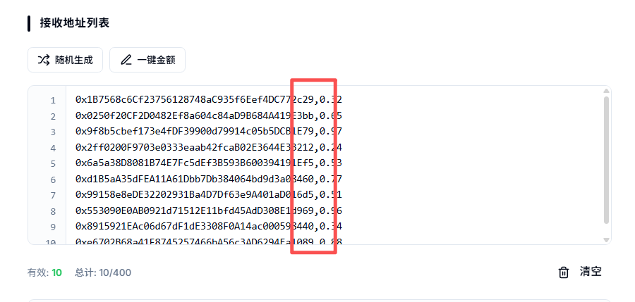
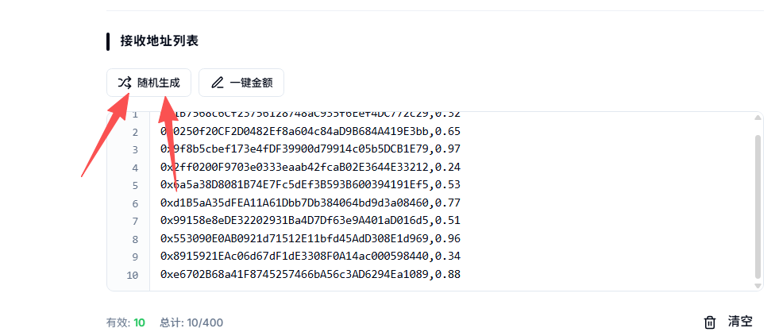
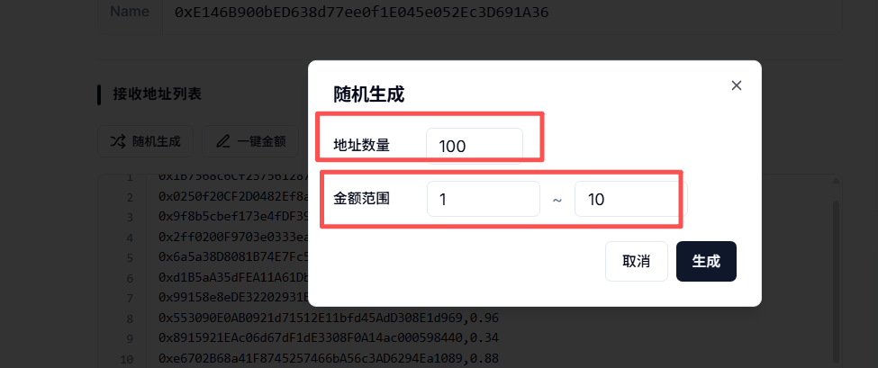
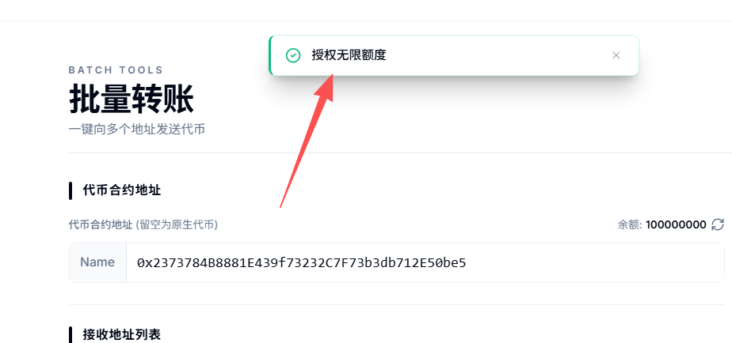
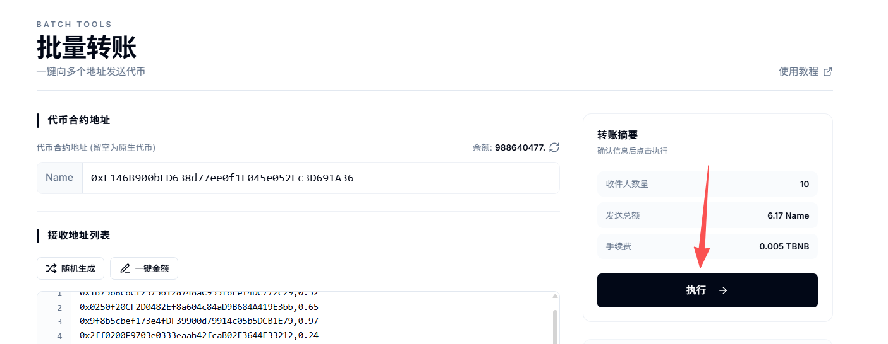

# 代币批量转账/空投教程

### **什么是批量转账/空投工具？**

就是我们理解的1对多转账工具，一次性将代币转给数百个地址。其主要用途有三个：

* **加代币持仓地址：**&#x5982;果想让代币的持仓数量从1增加到1000，正常情况下需要手动转账999次，至少得搞2个小时。而通过批量转账，3秒钟就能搞定，非常省事。
* **增加钱包内余额：**&#x53EF;以快速将BNB、ETH或者USDT分发给自己的其他钱包。如果你现在管理几百个钱包地址用来撸毛，那么通过PandaTool的批量空投工具，就能快速给每个钱包转账金额来操作。
* **发放代币奖励：**&#x9879;目方给符合条件的地址批量发放代币奖励，通过空投工具比一次次转账更加方便。

总得来说，批量空投工具的目的在于解放双手，帮助用户快速批量得进行代币分发。

<figure><figcaption></figcaption></figure>

### **如何使用批量空投工具？**

按照以下流程实现代币的批量空投

1.打开工具并链接钱包

2.输入代币合约地址

3.输入收款钱包地址和数量

4.确认授权

5.点击转账

接下来，PandaTool将给大家详细阐述这一教程

#### **1、打开批量工具并连接钱包**

首先，我们需要通过网址打开批量空投工具：[https://www.pandatool.org/zh-CN/batchtools/multisend](https://www.pandatool.org/zh-CN/batchtools/multisend)

<figure><figcaption></figcaption></figure>

或者在左边菜单栏，也能找到这个工具

<figure><figcaption></figcaption></figure>

打开之后，右上角要选择链并连接钱包。要在哪条链转账，就选择哪条

<figure><figcaption></figcaption></figure>

连接钱包成功后，我们进入下一步

#### **2、输入代币**

接下来，我们需要输入代币合约地址。

<figure><figcaption></figcaption></figure>

如果您要转账BNB/ETH等原生代币，直接留空，默认就是。如果你要转账自己的土狗币或者USDT等，就需要填入相对应的代币地址

<figure><figcaption></figcaption></figure>

#### **3、填入接收钱包地址**

接下来，就是填写要接受代币的钱包地址了。地址和数量以英文逗号隔开，每行一组，为保证转账效果，一次最好不要输入超过**400个地址**

<figure><figcaption></figcaption></figure>

如上图可以看到，我输入了地址，但是没有输入数量，可以通过**一键金额**的方式，将数量直接填入、支持统一金额以及按照金额范围随机填写，非常方便

<figure><figcaption></figcaption></figure>

完成的效果就是如下图所示。一定要注意，地址要和金额用**英文逗号**隔开

<figure><figcaption></figcaption></figure>

如果您没有具体的收款地址怎么办呢？还有一个随机地址的功能

<figure><figcaption></figcaption></figure>

您可以随机生成地址数以及每个地址应该收到的数量金额范围，这种主要是增加代币持仓量的，非常适合土狗币大范围空投

<figure><figcaption></figcaption></figure>

#### **4、代币授权**

接下来，你能看到你要转账的所有地址以及详细信息。如果你的代币没有授权，就需要点击授权。

<figure><figcaption></figcaption></figure>

授权方式有两种：第一种，就是授权此次转账的额度。假设您这次转账6.17枚代币，就授权这么多。等到下次转账的时候，再授权。第二种就是授权无限额度，这样下次转账就无需授权了。

两种方式都没问题，可以自由选择。授权完成后，会进行提示

<figure><figcaption></figcaption></figure>

#### **5、执行批量转账**

确认撰写信息没有问题之后，就点击执行按钮，会弹出钱包，确认后即可完成

<figure><figcaption></figcaption></figure>

执行成功后，日志会有相应的记录和哈希

<figure><figcaption></figcaption></figure>

### 批量转账或空投工具注意事项 

1.、收款地址和数量必须用英文逗号分隔

2、推荐使用电脑端操作，更加方便快捷，手机不太方便

3、如往交易所地址进行转账，请务必确认交易所是否支持合约转账，否则你的转账将无法到账

4、为保证转账顺利，一次转账的地址数请勿超过400个

5、支持大部分EVM公链，包括BSC、ETH、Base、Arb等等

如果您有任何关于批量转账相关的的问题，可以在电报群联系志愿者解答：[https://t.me/pandatool](https://t.me/pandatool)
