# 代币批量空投V2教程

### **什么是批量空投工具？**

就是我们理解的1对多转账工具，一次性将代币转给数百个地址。其主要用途有三个：

* **加代币持仓地址：**&#x5982;果想让代币的持仓数量从1增加到1000，正常情况下需要手动转账999次，至少得搞2个小时。而通过批量转账，3秒钟就能搞定，非常省事。
* **增加钱包内余额：**&#x53EF;以快速将BNB、ETH或者USDT分发给自己的其他钱包。如果你现在管理几百个钱包地址用来撸毛，那么通过PandaTool的批量空投工具，就能快速给每个钱包转账金额来操作。
* **发放代币奖励：**&#x9879;目方给符合条件的地址批量发放代币奖励，通过空投工具比一次次转账更加方便。

总得来说，批量空投工具的目的在于解放双手，帮助用户快速批量得进行代币分发。

### **如何使用批量空投工具？**

按照以下流程实现代币的批量空投

1.打开工具并链接钱包

2.输入代币合约地址

3.输入收款钱包地址和数量

4.确认授权

5.点击转账

接下来，PandaTool将给大家详细阐述这一教程

#### **1、打开批量工具并连接钱包**

首先，我们需要通过网址打开批量空投工具：[https://classic.pandatool.org/#/multisendV2?lang=zh-CN](https://classic.pandatool.org/#/multisendV2?lang=zh-CN)

<figure>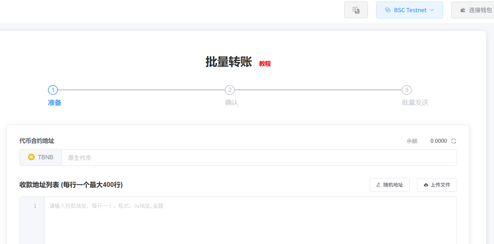<figcaption></figcaption></figure>

或者在左边菜单栏，也能找到这个工具

<figure>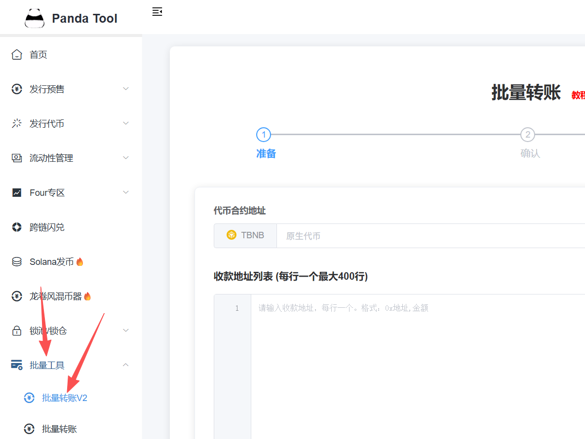<figcaption></figcaption></figure>

打开之后，右上角要选择链并连接钱包。要在哪条链转账，就选择哪条

<figure>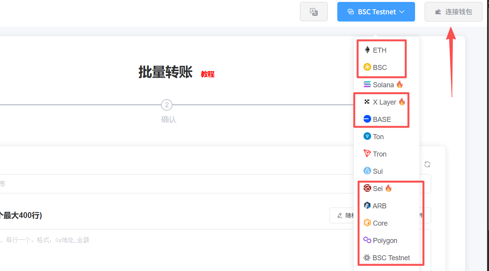<figcaption></figcaption></figure>

#### **2、输入代币地址**

钱包连接之后，就需要输入要转账的代币合约地址。如果是转原生代币，例如BNB、ETH等，则不需要输入。

<figure>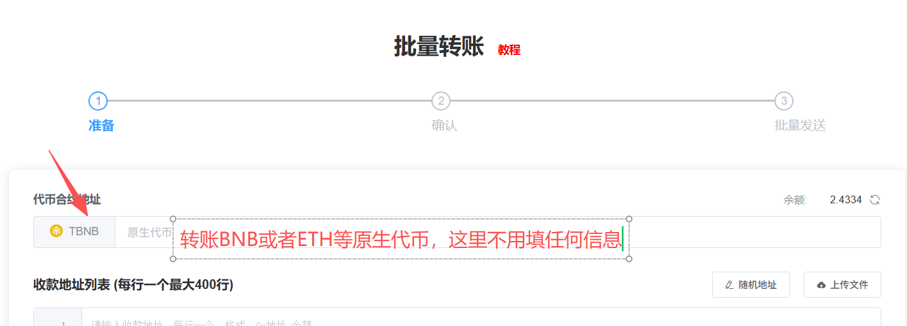<figcaption></figcaption></figure>

如果是转账USDT、土狗币这些，就需要填入合约地址。填入地址后，等待几秒钟，就会提示您查询代币成功

<figure>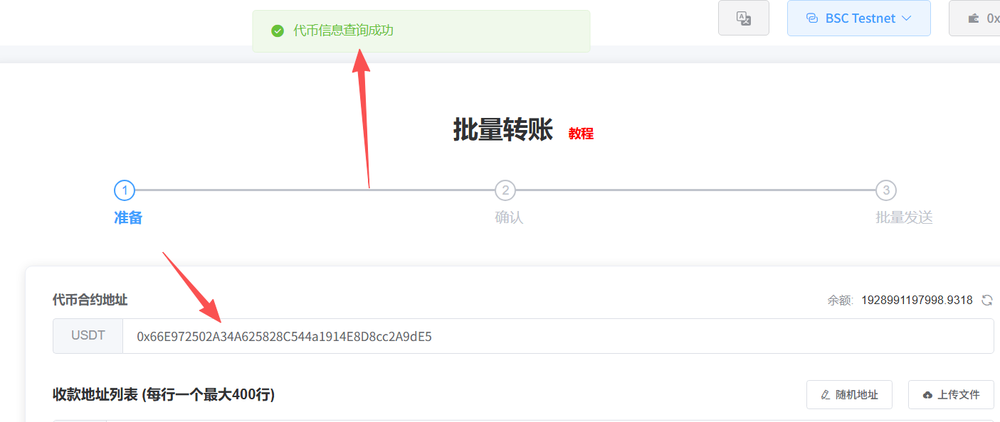<figcaption></figcaption></figure>

#### **3、填入接收钱包地址**

接下来，就是填写要接受代币的钱包地址了。地址和数量以英文逗号隔开，每行一组，为保证转账效果，一次最好不要输入超过**400个地址**

<figure>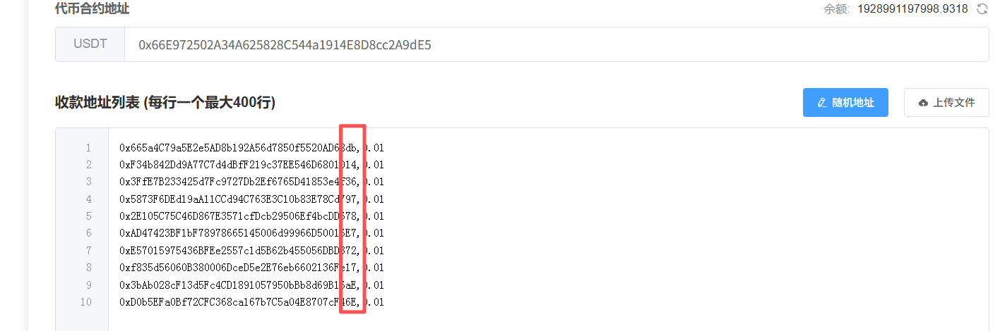<figcaption></figcaption></figure>

此外，这里还有两个功能

**随机地址：**&#x6307;的是由系统随机生成地址用于转账，无需项目方自己输入，比较方便。但这些地址无人认领，一旦转过去，就拿不回来了，仅适合纯粹用于刷数量的项目

<figure>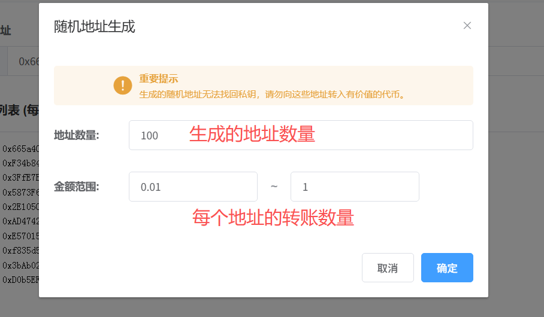<figcaption></figcaption></figure>

**上传文件：**&#x9664;了自动生成地址外，也可以自己上传地址文件，这样也比一行行输入来的方便。上传之前，可以先下载好`例子文件`，然后打开文件输入即可

<figure>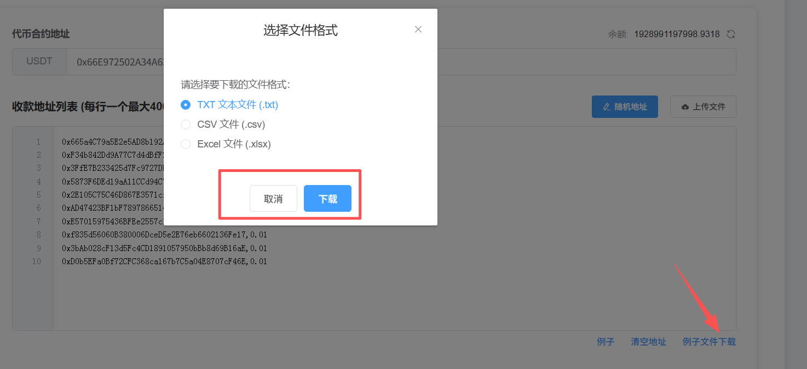<figcaption></figcaption></figure>

确定好地址之后，我们点击下一步

<figure>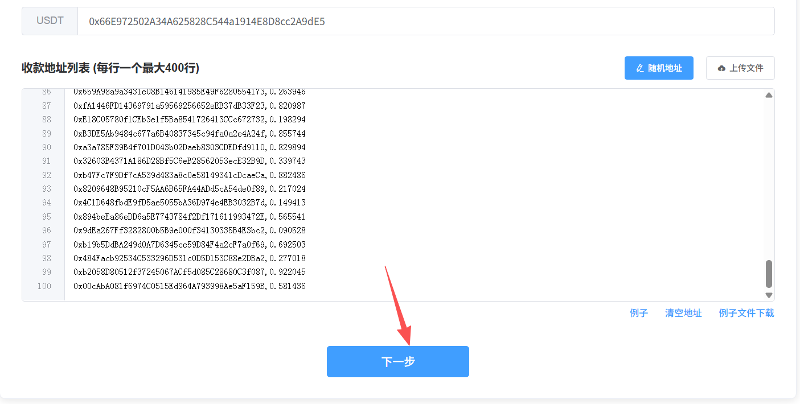<figcaption></figcaption></figure>


如何获得热门代币的持币数据？如果你想将代币空投给USDT、Doge这种热门代币的持有者，可以通过我们的快照工具获取这些代币的持仓地址，然后再空投即可。

代币快照数据：[https://www.pandatool.org/zh-CN/tool/snapshot](https://www.pandatool.org/zh-CN/tool/snapshot)


#### **4、代币授权**

接下来，你能看到你要转账的所有地址以及详细信息。如果你的代币没有授权，就需要点击授权。如果已经授权，就会提示您授权额度充足

<figure>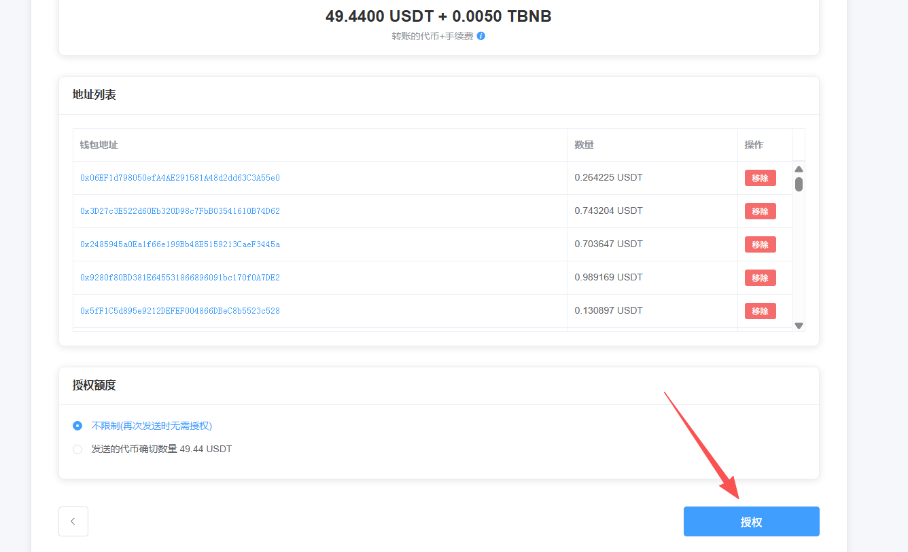<figcaption></figcaption></figure>

**我们再确认一下转账信息，没有问题的话，点击下一步**

<figure>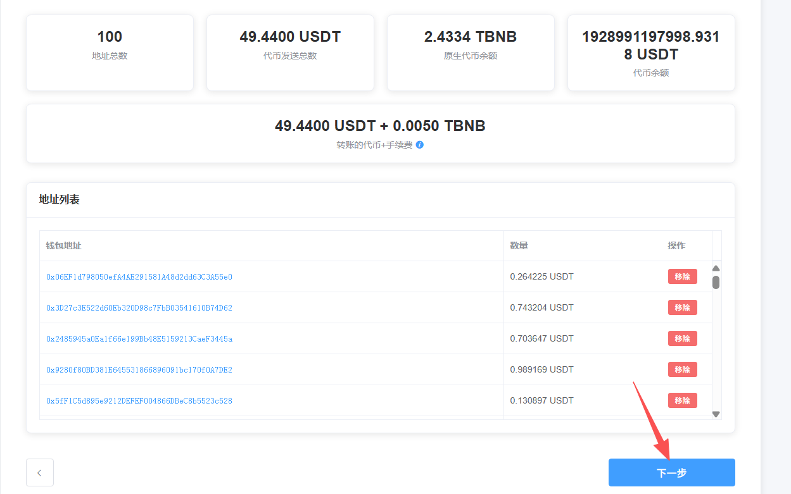<figcaption></figcaption></figure>

#### **5、批量转账**

接下来点击批量转账按钮，会弹出钱包确认，点击确认后即可完成

<figure>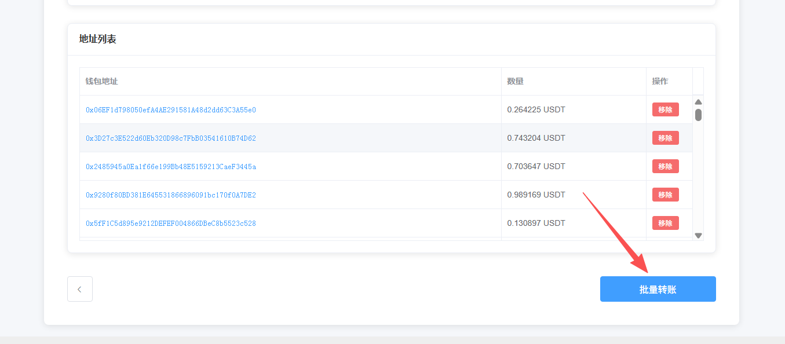<figcaption></figcaption></figure>

<figure>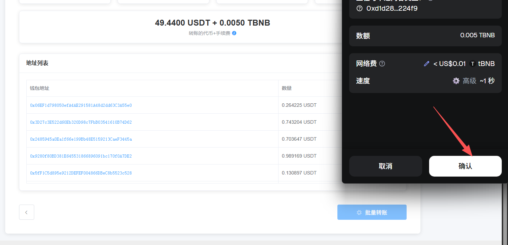<figcaption></figcaption></figure>

等待几秒钟后，就能看到提示说已经**批量发送成功**

<figure>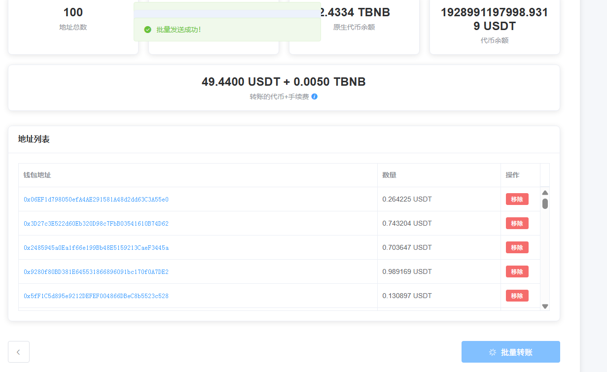<figcaption></figcaption></figure>

然后我们回到工具首页，也能查询到自己的转账记录

<figure>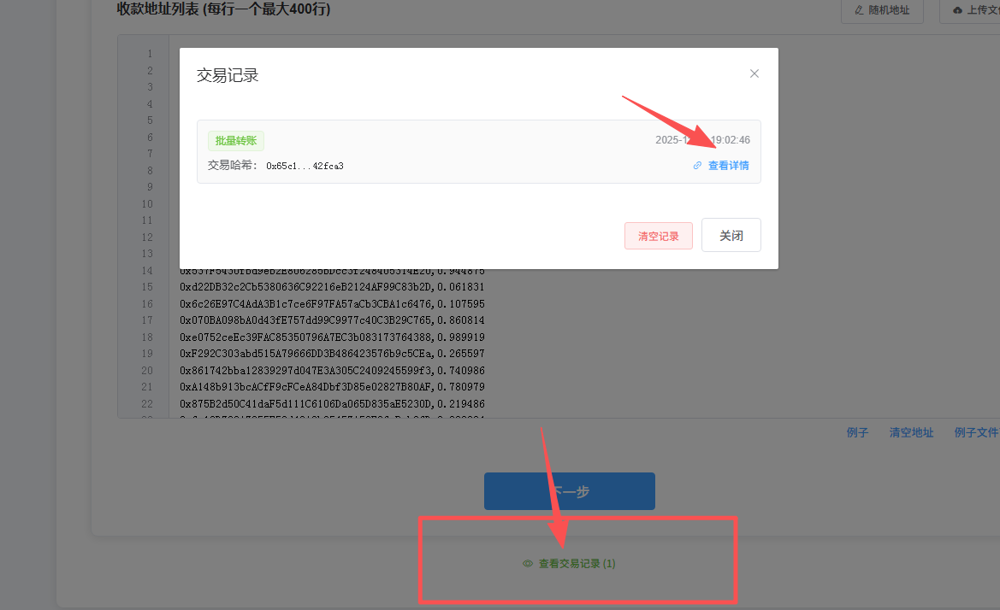<figcaption></figcaption></figure>

### 批量空投工具注意事项 

1.、收款地址和数量必须用英文逗号分隔

2、推荐使用电脑端操作，更加方便快捷，手机不太方便

3、如往交易所地址进行转账，请务必确认交易所是否支持合约转账，否则你的转账将无法到账

4、为保证转账顺利，一次转账的地址数请勿超过400个

5、支持大部分EVM公链，包括ETH、Base、Arb等等

如果您有任何关于批量空投相关的的问题，可以在电报群联系志愿者解答：[https://t.me/pandatool](https://t.me/pandatool)
