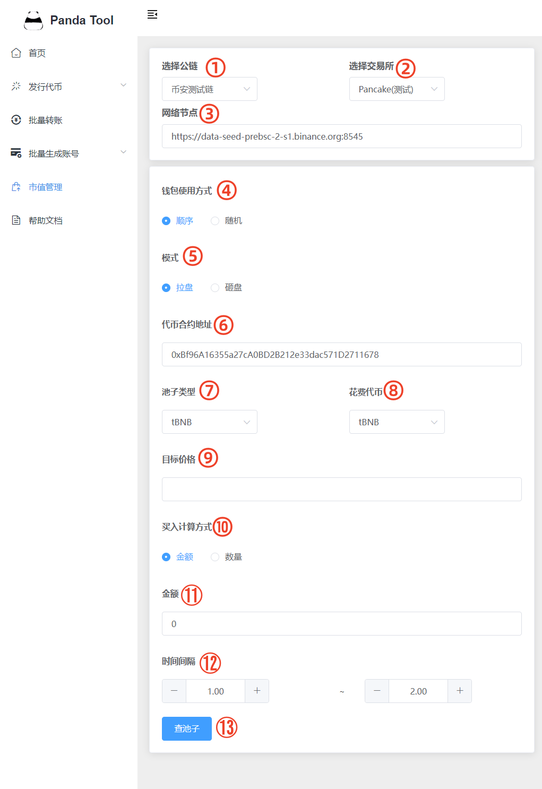
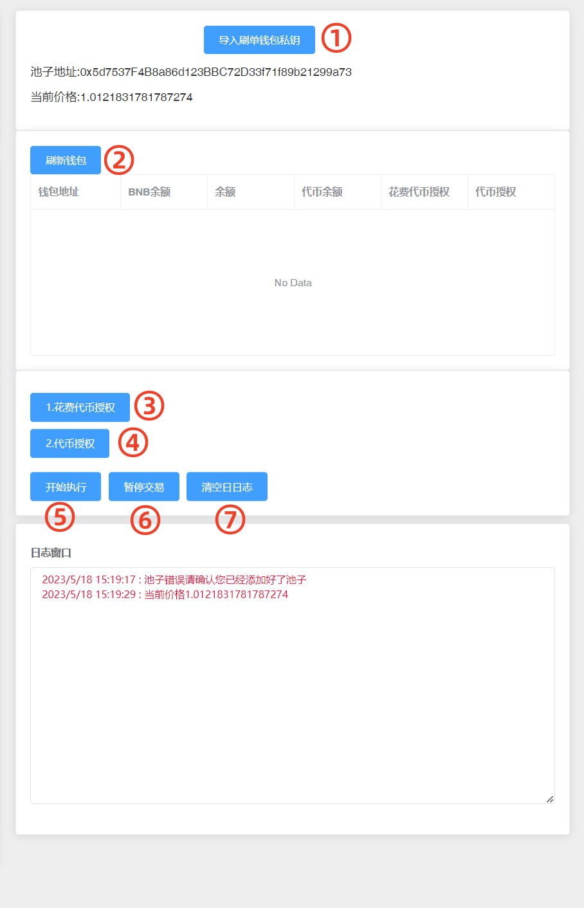
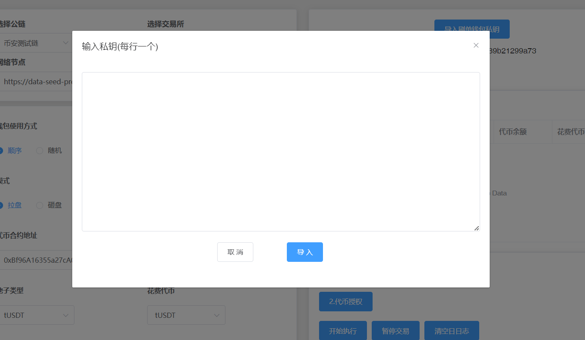
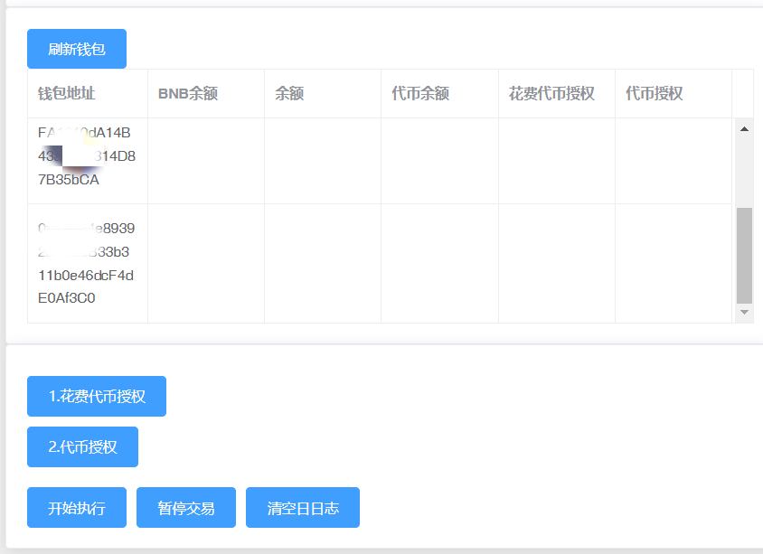
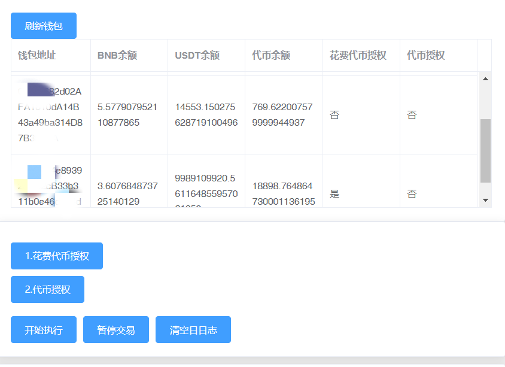

# 市值管理机器人

市值管理机器人使用视频教程



市值机器人支持以下链及Swap

* ETH、Arb、Base：Uniswap V2
* BSC：PancakeSwap V2
* Core：IceCreamswap、LFGswap、Archerswap

根据以下步骤，您可以在可支持的任意一条链上，进行代币市值管理。现在，我们以BSC测试链为例：

## 一、准备阶段

<figure><figcaption></figcaption></figure>

### 1、选择公链

目前PandaTool市值管理机器人支持的公链有：

* BSC链（BNB Chain）
* BSC测试链（BNB Chain Test）
* Core链

### 2、选择交易所

基于公链选择的不同，会支持不同的去中心化交易所。BSC链和BSC测试链均支持PancakeSwap V2，Core链支持ShadowSwap

### 3、网络节点

也就是我们通常说的RPC节点。平台会默认给出一个优质节点，如果觉得速度过慢或者有卡顿，也可以自行更换其他节点

### 4、钱包使用方式

当你导入多个钱包之后，可选择使用哪种方式进行买入/卖出操作。

* 顺序：按照钱包的导入顺序依次买入或者卖出
* 随机：无固定顺序，随机选择钱包买进卖出

### 5、模式

选择不同模式进行市值管理

* 拉盘：多个钱包多次买入某种代币，稳步提升代币价格
* 砸盘：多个钱包多次卖出某种代币，稳步降低代币价格

### 6、合约地址

输入你要管理市值的代币的合约地址

### 7、池子类型

指的是你使用何种`交易对`做的池子，例如BSC链，可支持以下几种交易对：

* BNB池子：交易对形式→BNB/代币（或者是：wBNB/代币）
* USDT池子：交易对形式→USDT/代币
* BUSD池子：交易对形式→BUSD/代币

### 8、花费代币

拉盘模式下，需选择某种代币作为你的交易货币，可选择BNB、USDT等等。注意，不管使用任何币去交易，钱包里都要有一定数额的BNB充当Gas费

### 9、目标价格

* 拉盘模式下，指的是你要将某种代币拉升至什么价位
* 砸盘模式下，指的是你要将某种代币砸至什么价位

### 10、计算方法

钱包在交易时，可按照不同的计算方法进行交易

* **金额：**每个钱包每次按照一定金额买入/卖出某种代币
* **数量：**每个钱包每次按照一定数额买入/卖出某种代币

### 11、金额/数量

如果第10步选择的是金额，这里就直接输入交易金额。（例如第8步选择的`花费代币`是USDT，那么数字1就代表1U。若花费代币是BNB，数字1就代表1个BNB）

如果第10步选择的是数量，这里就直接输入代币数量

### 12、时间间隔

所有钱包的交易大概多久循环一次，时间单位是秒

### 13、查池子

在所有准备工作和选择都完成后，点击查询池子，可获得当前代币在Swap的池子现状以及代币价格。若无法出现价格，或者池子信息显示错误，则表明前面的信息输入有误，需立即排查解决。

## 二、实操阶段

在查询池子之后，可以看到代币的资金池地址和价格，接下来开始实操：

<figure><figcaption></figcaption></figure>

### 1、导入刷单钱包私钥

将你要批量买入/卖出的钱包私钥导入进来，每行一个

<figure><figcaption></figcaption></figure>

### 2、刷新钱包

在钱包导入之后，只能看到钱包的地址。此时需要刷新一下钱包，查询到钱包的余额以及授权情况。

钱包刷新之前的情况如下：

<figure><figcaption></figcaption></figure>

钱包刷新之后的情况如下：

<figure><figcaption></figcaption></figure>

### 3、花费代币授权

花费代币通常指的是USDT、BNB等通用性代币，以用来买入拉盘。如果你用BNB作为“花费代币”进行拉盘，则无需授权。如果是USDT，就需要授权USDT。

### 4、代币授权

该代币指的是你需要进行市值管理的合约代币，只有完成授权后，才能批量卖出砸盘

### 5、开始执行

所有钱包开始执行买入/卖出操作

### 6、暂停交易

所有钱包暂停交易

### 7、清除日志

将相关的操作记录清空

## 三、疑问解答

**1、平台会拿到你的私钥吗？**

* 绝对不可能，你的私钥不会存储在平台上，所有操作都是基于前端执行的，请放心使用。如果你比较担心，可以使用新的钱包操作

**2、市值管理系统收费吗？**

* 按照时间收费，1天0.1BNB，一个月1BNB，永久3BNB

**3、最多可以导入多少钱包？**

* 为了确保操作的稳定性和流畅性，一次性导入的钱包数量最好低于100个

**4、批量买入/卖出的钱包，会被识别为夹子或者机器人吗？**

* 不会，夹子以及机器人利用的是抢跑区块的原理，很容易判断。而市值管理系统的所有买卖都是正常的交易，不会被识别为机器人

**5、交易失败是什么原因？**

* 要么是钱包的RPC节点有问题，需要更好RPC节点，建议通过“chainlist.org”找到合适的节点。要么是网络问题，可以换个网络再试下

如有不明白或者不清楚的地方，请加入官方电报群：[https://t.me/PandaTool](https://t.me/PandaTool)
